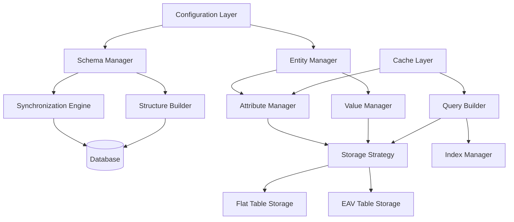
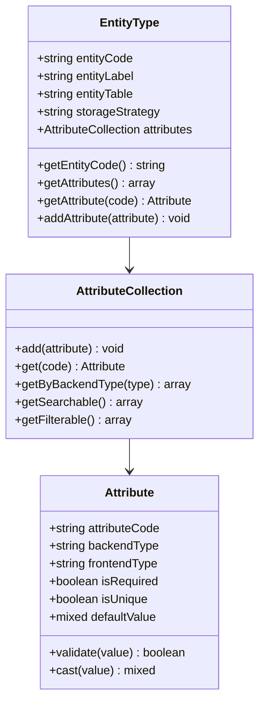
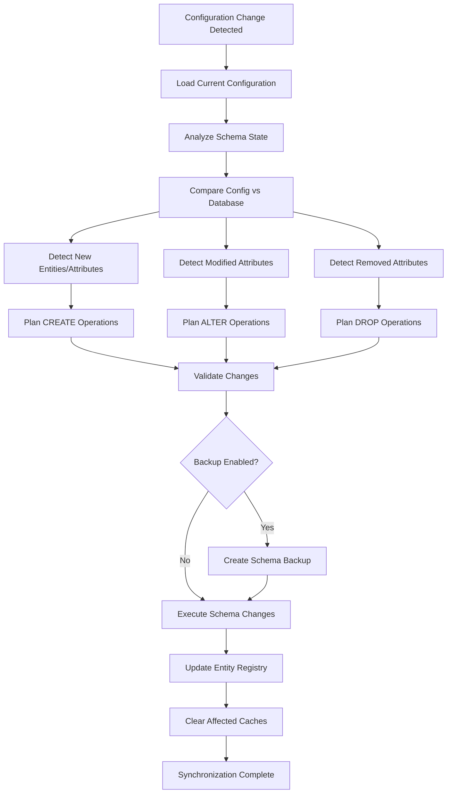
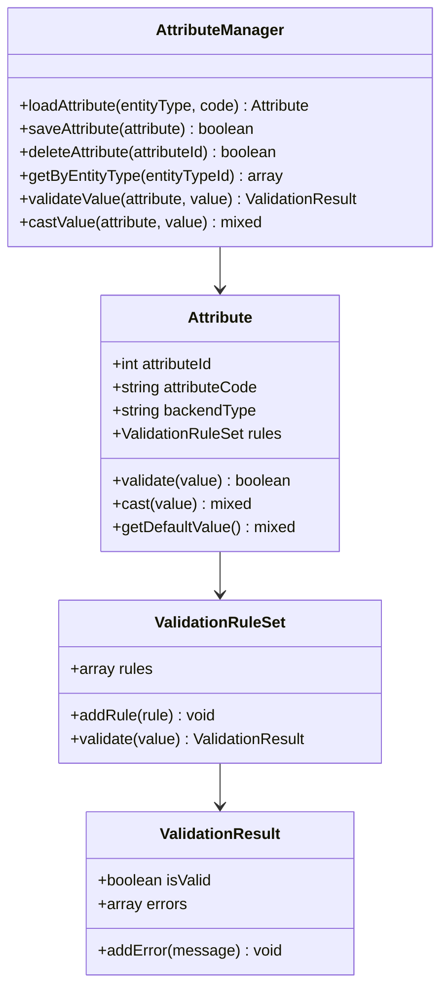
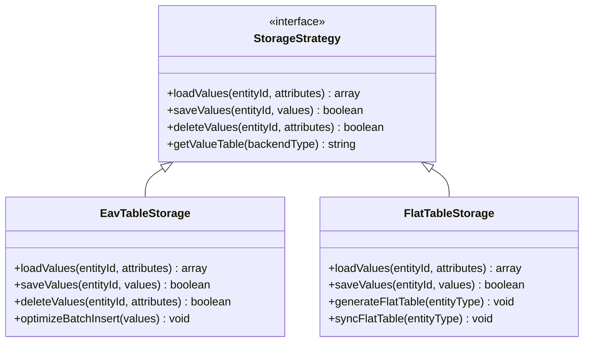
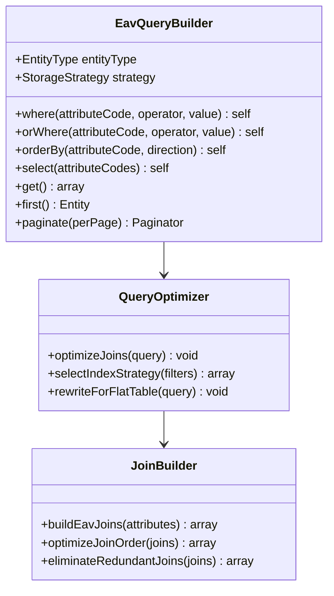
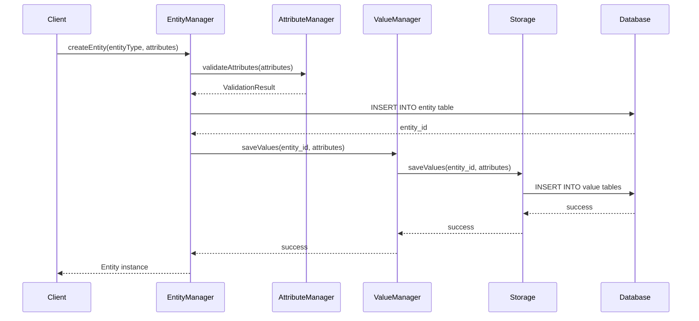
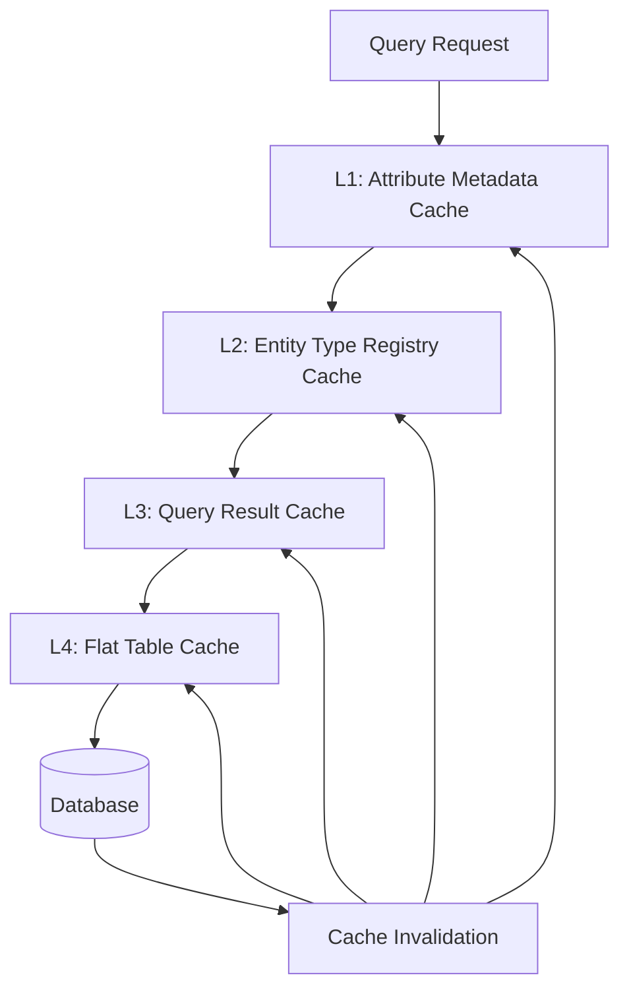
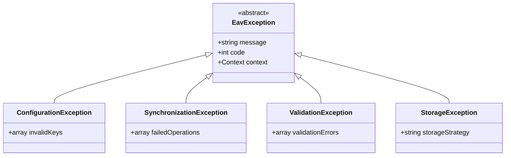

# EAV Library Design Document

## Overview

The EAV (Entity-Attribute-Value) library provides a flexible, high-performance data modeling pattern that enables dynamic attribute management for entities without schema modifications. Inspired by systems like Magento, this library supports runtime attribute definitions, automatic schema synchronization, and comprehensive query capabilities while maintaining excellent performance through intelligent indexing and caching strategies.

The library is designed to be fully configurable through PHP array-based configuration files, eliminating the need for complex setup procedures. It automatically manages database schema creation and synchronization, detecting configuration changes and applying necessary structural updates.

### Core Value Proposition

- **Dynamic Schema Management**: Define and modify entity attributes without database migrations
- **Automatic Synchronization**: Detects configuration changes and synchronizes database structure automatically
- **High Performance**: Optimized query strategies with intelligent indexing and caching
- **Configuration-Driven**: Simple PHP array configuration for all aspects of the system
- **Type Safety**: Strong type system with validation and casting capabilities
- **Extensibility**: Plugin architecture for custom attribute types and storage backends

### Repository Type

Backend Framework Library (Core Component)

## Architecture Overview

The EAV library follows a layered architecture pattern with clear separation of concerns between configuration management, schema synchronization, data persistence, and query operations.



### Architecture Principles

1. **Configuration as Source of Truth**: All entity definitions, attribute configurations, and storage strategies originate from PHP configuration arrays
2. **Schema Synchronization**: The system maintains database schema alignment with configuration through differential analysis
3. **Storage Flexibility**: Multiple storage strategies (flat table vs EAV tables) based on attribute characteristics
4. **Query Optimization**: Intelligent query building with automatic join optimization and index utilization
5. **Event-Driven Updates**: Schema changes trigger synchronization events without manual intervention

## Configuration System

### Configuration Structure

The EAV library is configured through a hierarchical PHP array structure that defines entities, attributes, storage strategies, and synchronization behavior.

#### Entity Configuration Schema

| Configuration Key | Type | Description | Default |
|------------------|------|-------------|---------|
| entity_code | string | Unique identifier for the entity type | required |
| entity_label | string | Human-readable entity name | required |
| entity_table | string | Primary entity table name | {entity_code}_entity |
| storage_strategy | string | Storage approach: 'eav' or 'flat' | 'eav' |
| enable_cache | boolean | Enable query result caching | true |
| cache_ttl | integer | Cache time-to-live in seconds | 3600 |
| attributes | array | Attribute definitions | [] |

#### Attribute Configuration Schema

| Configuration Key | Type | Description | Default |
|------------------|------|-------------|---------|
| attribute_code | string | Unique attribute identifier | required |
| attribute_label | string | Human-readable attribute name | required |
| backend_type | string | Data storage type: varchar, int, decimal, datetime, text | required |
| frontend_type | string | Input type: text, select, multiselect, date, boolean | required |
| is_required | boolean | Attribute value required | false |
| is_unique | boolean | Enforce uniqueness constraint | false |
| is_searchable | boolean | Include in search indexes | false |
| is_filterable | boolean | Enable filtering on this attribute | false |
| is_comparable | boolean | Enable comparison operations | false |
| default_value | mixed | Default attribute value | null |
| validation_rules | array | Validation constraints | [] |
| source_model | string | Option source for select types | null |
| backend_model | string | Custom backend processing class | null |
| frontend_model | string | Custom frontend rendering class | null |

### Configuration File Format

Configuration files reside in a dedicated directory structure and follow naming conventions for automatic discovery.

**Directory Structure**:
```
app/Core/Eav/Config/
├── entities/
│   ├── product.php
│   ├── customer.php
│   └── category.php
└── global.php
```

**Entity Configuration Example Structure**:

The product entity configuration defines a flexible product data model with various attribute types including text fields, numeric values, selections, and timestamps. Each attribute specifies its backend storage type, frontend input type, validation requirements, and indexing strategy.

The customer entity configuration establishes customer profile structure with personal information fields, contact details, and relationship attributes. Attributes are configured with appropriate data types, uniqueness constraints, and search capabilities.

The category entity configuration creates hierarchical category structures with parent-child relationships, positioning data, and status management. It includes specialized attributes for tree traversal and category metadata.

### Global Configuration Options

| Configuration Key | Type | Description | Default |
|------------------|------|-------------|---------|
| table_prefix | string | Prefix for all EAV tables | 'eav_' |
| auto_sync | boolean | Enable automatic schema synchronization | true |
| sync_mode | string | Synchronization strategy: 'immediate', 'deferred', 'manual' | 'immediate' |
| backup_before_sync | boolean | Create backup before schema changes | true |
| max_index_length | integer | Maximum index key length in bytes | 767 |
| use_flat_tables | boolean | Enable flat table generation for performance | true |
| flat_table_threshold | integer | Minimum attributes for flat table consideration | 10 |

## Entity Type System

### Entity Type Definition

Entity types represent distinct data models within the EAV system. Each entity type has its own configuration, attribute set, and storage structure.



### Entity Type Registry

The Entity Type Registry maintains a runtime index of all configured entity types and provides efficient lookup mechanisms.

**Registry Responsibilities**:
- Load and parse entity configuration files
- Validate entity and attribute definitions
- Provide entity type lookup by code
- Cache entity type metadata for performance
- Trigger reload when configuration changes detected

## Schema Synchronization Engine

### Synchronization Strategy

The synchronization engine analyzes configuration changes and generates appropriate database structure modifications to align the schema with the current configuration state.



### Schema Analysis Process

The schema analyzer compares configuration definitions against actual database structure to identify discrepancies.

**Analysis Components**:

1. **Entity Table Inspector**: Examines entity base tables for existence and structure
2. **Attribute Table Inspector**: Analyzes EAV value tables for each backend type
3. **Index Inspector**: Verifies index presence and configuration
4. **Constraint Inspector**: Validates foreign keys and uniqueness constraints

**Comparison Operations**:

| Comparison Type | Detection Logic | Action Required |
|----------------|-----------------|-----------------|
| New Entity | Entity code in config but no table exists | Create entity table and EAV structure |
| New Attribute | Attribute code in config but not in attribute table | Add attribute definition and value column |
| Modified Type | Backend type changed in configuration | Create new column, migrate data, drop old column |
| Modified Constraint | Uniqueness or required flag changed | Add or remove constraints and indexes |
| Removed Attribute | Attribute in database but not in config | Mark as deleted or remove based on strategy |
| Index Change | Searchable/filterable flag changed | Add or drop indexes accordingly |

### Structure Builder

The Structure Builder translates entity and attribute configurations into database schema definitions using the existing Blueprint system.

#### Entity Table Structure

Each entity has a primary entity table that stores the entity identifier and common metadata.

**Entity Table Schema Pattern**:

| Column Name | Type | Constraints | Purpose |
|-------------|------|-------------|---------|
| entity_id | INT | PRIMARY KEY, AUTO_INCREMENT | Unique entity identifier |
| entity_type_id | INT | NOT NULL, FOREIGN KEY | Reference to entity type |
| attribute_set_id | INT | NULL, FOREIGN KEY | Optional attribute set grouping |
| created_at | TIMESTAMP | DEFAULT CURRENT_TIMESTAMP | Creation timestamp |
| updated_at | TIMESTAMP | DEFAULT CURRENT_TIMESTAMP ON UPDATE | Last modification timestamp |

#### Attribute Metadata Table

The attribute metadata table stores attribute definitions and configuration.

**Attribute Metadata Schema**:

| Column Name | Type | Constraints | Purpose |
|-------------|------|-------------|---------|
| attribute_id | INT | PRIMARY KEY, AUTO_INCREMENT | Unique attribute identifier |
| entity_type_id | INT | NOT NULL, FOREIGN KEY | Associated entity type |
| attribute_code | VARCHAR(255) | UNIQUE (with entity_type_id) | Attribute code identifier |
| backend_type | VARCHAR(32) | NOT NULL | Storage data type |
| frontend_type | VARCHAR(32) | NOT NULL | Input control type |
| is_required | TINYINT(1) | DEFAULT 0 | Required flag |
| is_unique | TINYINT(1) | DEFAULT 0 | Uniqueness constraint flag |
| is_searchable | TINYINT(1) | DEFAULT 0 | Search index flag |
| is_filterable | TINYINT(1) | DEFAULT 0 | Filter index flag |
| default_value | TEXT | NULL | Default value serialized |
| validation_rules | TEXT | NULL | Validation rules serialized |
| sort_order | INT | DEFAULT 0 | Display ordering |

#### Value Tables by Backend Type

Separate value tables for each backend type optimize storage and query performance.

**Value Table Pattern** (repeated for each backend type):

| Column Name | Type | Constraints | Purpose |
|-------------|------|-------------|---------|
| value_id | INT | PRIMARY KEY, AUTO_INCREMENT | Unique value record identifier |
| entity_type_id | INT | NOT NULL, FOREIGN KEY | Entity type reference |
| attribute_id | INT | NOT NULL, FOREIGN KEY | Attribute definition reference |
| entity_id | INT | NOT NULL, FOREIGN KEY | Entity instance reference |
| value | {TYPE} | NULL | Actual attribute value |

**Backend Type Mappings**:

| Backend Type | MySQL Column Type | Value Table Suffix |
|--------------|-------------------|-------------------|
| varchar | VARCHAR(255) | _varchar |
| int | INT | _int |
| decimal | DECIMAL(12,4) | _decimal |
| datetime | DATETIME | _datetime |
| text | TEXT | _text |

**Index Strategy per Value Table**:

- Primary key on value_id
- Unique composite index on (entity_type_id, attribute_id, entity_id) for single-value attributes
- Index on entity_id for join optimization
- Index on value for filterable attributes
- Composite index on (attribute_id, value) for searchable attributes

### Migration Generation

The synchronization engine generates migration operations compatible with the existing Migration and Blueprint infrastructure.

**Migration Operation Types**:

1. **Create Entity Structure**: Generates entity table, attribute metadata entries, and value tables
2. **Add Attribute**: Inserts attribute metadata and creates value storage capacity
3. **Modify Attribute Type**: Handles data migration between backend types
4. **Add Index**: Creates performance indexes based on attribute flags
5. **Remove Attribute**: Soft-delete or hard-delete based on configuration

## Data Management Layer

### Attribute Manager

The Attribute Manager handles attribute metadata operations, validation, and type casting.



### Value Manager

The Value Manager orchestrates attribute value persistence and retrieval across different storage strategies.

**Value Manager Responsibilities**:

- Route value operations to appropriate storage strategy
- Handle value normalization and casting
- Manage value versioning if enabled
- Coordinate batch value operations for performance
- Trigger value change events

### Storage Strategy Pattern

The library supports multiple storage strategies optimized for different use cases.



#### EAV Table Storage

The EAV table storage strategy uses separate value tables per backend type, optimized for flexibility and attribute sparsity.

**Characteristics**:
- Best for entities with many optional attributes
- Efficient storage for sparse data (many null values)
- Flexible schema evolution
- Higher query complexity for multi-attribute filters

**Value Load Strategy**:

For loading entity values, the system performs targeted queries against each relevant value table based on the requested attributes. The queries join the entity table with the appropriate value tables, filtering by entity_id and attribute_id. Results are aggregated and transformed into a unified attribute array.

**Value Save Strategy**:

When saving values, the system categorizes values by backend type and performs batch INSERT or UPDATE operations. It uses REPLACE INTO or INSERT ON DUPLICATE KEY UPDATE for efficient upsert behavior. Transaction boundaries ensure atomicity across multiple value tables.

#### Flat Table Storage

Flat table storage creates denormalized tables with columns for each attribute, optimized for read-heavy workloads.

**Characteristics**:
- Best for entities with consistent attribute usage
- Excellent read performance for multi-attribute queries
- Higher storage overhead
- Requires table regeneration when attributes change

**Flat Table Generation**:

The flat table generator creates a single table with columns for all attributes of an entity type. Column names derive from attribute codes, and column types map from backend types. Indexes are created for searchable and filterable attributes. A synchronization process keeps the flat table aligned with EAV data.

**Synchronization Trigger Events**:

- Attribute added to entity type
- Attribute removed from entity type
- Attribute backend type changed
- Manual synchronization request
- Scheduled batch synchronization

## Query Builder Integration

### EAV Query Builder

The EAV Query Builder extends the existing QueryBuilder to handle EAV-specific query patterns transparently.



### Query Translation Strategy

The query builder translates attribute-based filter conditions into appropriate SQL constructs based on the storage strategy.

**EAV Storage Query Pattern**:

For EAV storage, each filter on an attribute requires a join to the corresponding value table. The join conditions include entity_type_id, attribute_id, and entity_id. Where clauses filter on the value column. The query optimizer determines optimal join order based on selectivity estimates.

**Flat Storage Query Pattern**:

For flat storage, filters translate directly to WHERE clauses on column names derived from attribute codes. This provides simple, efficient single-table queries with standard index utilization.

### Query Optimization Strategies

| Optimization Technique | Application | Benefit |
|-----------------------|-------------|---------|
| Join Reordering | Place most selective joins first | Reduces intermediate result sets |
| Index Selection | Choose indexes matching filter attributes | Minimizes table scans |
| Subquery Pushdown | Move conditions into subqueries | Early result filtering |
| Value Table Partitioning | Partition large value tables by entity_type_id | Improved scan performance |
| Materialized Aggregates | Pre-compute common attribute combinations | Faster complex queries |
| Query Result Caching | Cache frequent query patterns | Eliminates redundant execution |

## Entity Lifecycle Management

### Entity Operations

The Entity Manager provides a high-level interface for entity CRUD operations with automatic attribute handling.



### Entity Load Process

Loading an entity retrieves the entity record and lazily or eagerly loads attribute values based on configuration.

**Load Strategies**:

- **Eager Loading**: Loads all attributes in a single operation (default for flat storage)
- **Lazy Loading**: Loads attributes on first access (default for EAV storage)
- **Selective Loading**: Loads only specified attributes (performance optimization)

### Entity Save Process

Saving an entity persists changes to modified attributes while leaving unchanged attributes untouched.

**Save Strategy**:

The system tracks which attributes have been modified since entity load. During save, only dirty attributes are persisted. The value manager determines whether to INSERT new values or UPDATE existing ones based on value existence checks. Batch operations group multiple value changes for efficiency.

### Entity Delete Process

Entity deletion can be soft (marking as deleted) or hard (physical removal), with cascading to attribute values.

**Delete Modes**:

| Mode | Entity Table Behavior | Attribute Value Behavior | Use Case |
|------|----------------------|-------------------------|----------|
| Soft Delete | Set deleted_at timestamp | Retain values | Audit trail required |
| Hard Delete | DELETE record | CASCADE DELETE values | Data privacy compliance |
| Archive | Move to archive table | Move to archive values | Long-term retention |

## Index Management

### Index Strategy

Indexes are created based on attribute configuration flags and query pattern analysis.

**Index Types**:

1. **Primary Indexes**: On entity_id in all value tables
2. **Composite Unique Indexes**: For unique attributes on (entity_type_id, attribute_id, entity_id, value)
3. **Filter Indexes**: On value columns for filterable attributes
4. **Search Indexes**: Composite indexes on (attribute_id, value) for searchable attributes
5. **Foreign Key Indexes**: On entity_id, attribute_id for join performance

### Index Synchronization

When attribute flags change (is_searchable, is_filterable), the synchronization engine updates indexes accordingly.

**Index Update Process**:

The system detects flag changes during configuration analysis. For newly searchable or filterable attributes, it creates appropriate indexes using ALTER TABLE ADD INDEX statements. For attributes losing these flags, it drops unnecessary indexes to reduce overhead. Index operations are executed during low-traffic periods if scheduled synchronization is enabled.

## Caching Strategy

### Cache Layers

The EAV library implements multi-level caching for optimal performance.



### Cache Invalidation Strategy

Cache entries are invalidated based on data modification events and TTL expiration.

**Invalidation Triggers**:

| Event | Affected Cache Layer | Invalidation Scope |
|-------|---------------------|-------------------|
| Attribute Configuration Change | Attribute Metadata, Entity Type Registry | Entity type specific |
| Entity Value Update | Query Result Cache | Entity specific |
| Schema Synchronization | All layers | Global or entity type specific |
| TTL Expiration | All layers | Individual cache keys |
| Manual Flush | All layers | Configurable scope |

## Performance Optimization

### Batch Operations

The library supports batch operations for high-volume data processing.

**Batch Capabilities**:

- **Batch Entity Creation**: Create multiple entities in a single transaction
- **Batch Value Updates**: Update multiple attribute values across entities
- **Batch Attribute Loading**: Load values for multiple entities efficiently
- **Bulk Index Rebuilding**: Rebuild indexes for multiple attributes in parallel

### Query Performance Patterns

**Optimization Patterns**:

1. **Attribute Projection**: Request only needed attributes to minimize joins
2. **Index Hints**: Provide index hints for complex multi-attribute queries
3. **Denormalization**: Use flat tables for frequently queried attribute sets
4. **Partition Pruning**: Leverage entity_type_id partitioning in value tables
5. **Connection Pooling**: Reuse database connections for batch operations

### Monitoring and Profiling

The library provides hooks for performance monitoring and query analysis.

**Monitoring Metrics**:

- Query execution time per entity type
- Cache hit ratio per cache layer
- Schema synchronization duration
- Flat table rebuild time
- Index utilization statistics
- Batch operation throughput

## Extension Points

### Custom Attribute Types

Developers can register custom backend and frontend types for specialized attribute behaviors.

**Custom Backend Type Interface**:

A custom backend type must define data storage requirements, validation logic, and value casting behavior. It specifies the database column type, provides serialization and deserialization methods, and implements custom validation rules beyond standard constraints.

**Custom Frontend Type Interface**:

A custom frontend type defines rendering behavior, input validation, and user interaction patterns. It provides HTML generation methods, JavaScript widget integration, and client-side validation logic.

### Event Hooks

The library emits events at critical lifecycle points for extension and integration.

**Event Types**:

| Event Name | Trigger Point | Event Data | Use Case |
|-----------|---------------|------------|----------|
| entity.creating | Before entity INSERT | EntityType, attributes | Pre-save validation |
| entity.created | After entity INSERT | Entity instance | Post-creation actions |
| entity.updating | Before value UPDATE | Entity, changed attributes | Audit logging |
| entity.updated | After value UPDATE | Entity instance | Cache invalidation |
| entity.deleting | Before DELETE | Entity instance | Cascade operations |
| entity.deleted | After DELETE | Entity ID | Cleanup tasks |
| schema.synchronizing | Before sync execution | Change plan | Approval workflow |
| schema.synchronized | After sync completion | Applied changes | Notification |
| attribute.saving | Before attribute metadata save | Attribute definition | Validation |
| attribute.saved | After attribute metadata save | Attribute instance | Index update |

## Error Handling

### Exception Hierarchy

The library defines a specific exception hierarchy for precise error handling.



### Error Recovery Strategies

**Recovery Mechanisms**:

- **Configuration Validation**: Detect errors before synchronization begins
- **Transaction Rollback**: Rollback schema changes on failure
- **Backup Restoration**: Restore from backup if synchronization fails critically
- **Partial Sync Retry**: Retry failed operations individually
- **Manual Intervention Queue**: Flag issues requiring admin review

## Testing Strategy

### Unit Testing Approach

Unit tests cover individual components in isolation with mocked dependencies.

**Test Coverage Areas**:

- Configuration parser and validator
- Attribute metadata CRUD operations
- Value storage and retrieval per backend type
- Schema analyzer comparison logic
- Query builder attribute filter translation
- Validation rule execution
- Type casting behavior
- Cache invalidation logic

### Integration Testing Approach

Integration tests validate component interactions with actual database operations.

**Integration Test Scenarios**:

- Complete entity lifecycle (create, read, update, delete)
- Schema synchronization with configuration changes
- Multi-attribute query execution and result accuracy
- Flat table generation and synchronization
- Cache layer interaction and invalidation
- Batch operation performance and correctness
- Index utilization verification
- Transaction rollback behavior

### Performance Testing

Performance tests establish baseline metrics and detect regressions.

**Performance Test Cases**:

- Entity creation throughput (entities per second)
- Multi-attribute query latency (various attribute counts)
- Batch operation scaling (varying batch sizes)
- Schema synchronization duration (varying entity complexity)
- Cache effectiveness measurement (hit ratio under load)
- Concurrent operation handling (multiple simultaneous queries)
- Large dataset handling (millions of entities and values)
