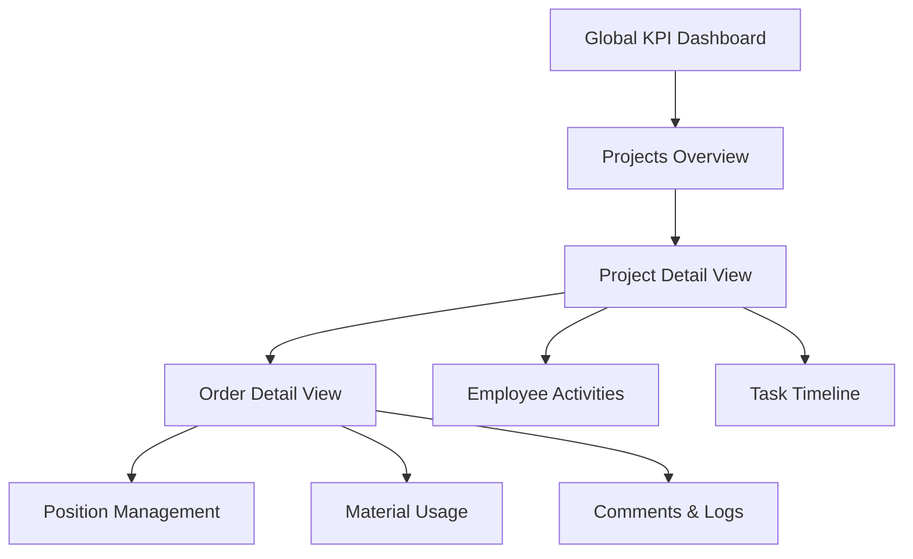
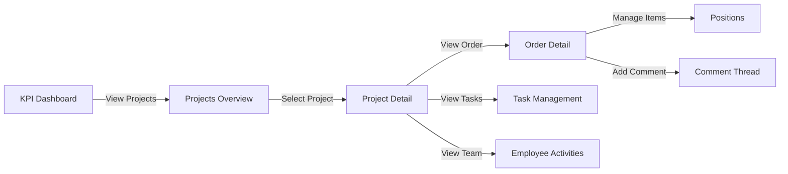
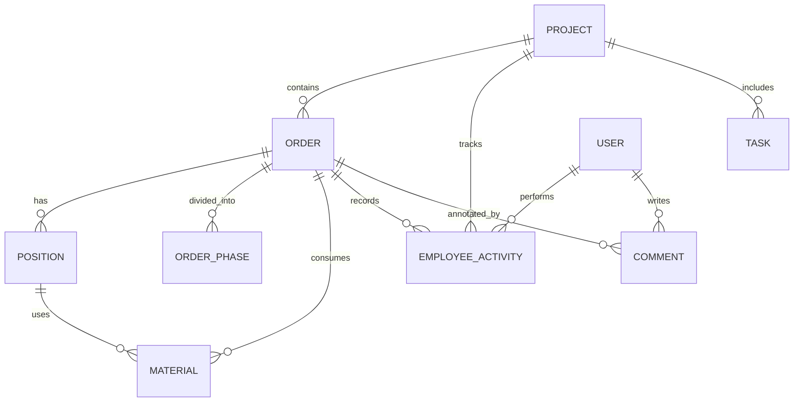

# Enterprise UI Views - Design Document

## 1. Overview

### 1.1 Purpose
Design a comprehensive set of business management views using the Enterprise UI Kit for project, order, and resource management. The system provides structured interfaces for tracking projects, managing orders with multiple positions, monitoring employee activities, and analyzing KPIs across the organization.

### 1.2 Scope
This design defines five primary view interfaces:
- Projects Overview Dashboard - Card-based project listing with aggregate statistics
- Project Detail View - Comprehensive project management interface
- Order Detail View - Phase-based order tracking with position management
- Position Management View - Item/product catalog within orders
- Global KPI Dashboard - Organization-wide analytics and metrics

### 1.3 Design Principles
- Functional-first approach leveraging Enterprise UI Kit components
- Clear information hierarchy with consistent navigation patterns
- Efficient data presentation using grids, cards, and metric displays
- Responsive layouts within enterprise sidebar-content structure
- Accessibility compliance (WCAG 2.1 Level AA)

## 2. System Architecture

### 2.1 Module Structure

The views are organized within a new module following the project's modular architecture:

**Module Name**: `Project` (located at `app/Project/`)

**Directory Structure**:
```
app/Project/
├── Controller/
│   ├── ProjectController.php
│   ├── OrderController.php
│   ├── PositionController.php
│   └── DashboardController.php
├── Model/
│   ├── Project.php
│   ├── Order.php
│   ├── Position.php
│   ├── OrderPhase.php
│   ├── Material.php
│   ├── EmployeeActivity.php
│   └── Comment.php
├── Service/
│   ├── ProjectService.php
│   ├── OrderService.php
│   ├── KPIService.php
│   └── StatisticsService.php
├── Module.php
└── config.php

app/views/project/
├── overview/
│   └── index.phtml
├── detail/
│   └── index.phtml
├── order/
│   ├── detail.phtml
│   └── positions.phtml
├── dashboard/
│   └── kpi.phtml
└── partials/
    ├── project-card.phtml
    ├── order-timeline.phtml
    ├── position-table.phtml
    └── activity-log.phtml
```

### 2.2 View Relationship Diagram



### 2.3 Navigation Flow



## 3. Data Models

### 3.1 Core Entity Definitions

| Entity | Purpose | Key Attributes |
|--------|---------|----------------|
| Project | Container for orders, tasks, and resources | id, name, code, start_date, end_date, status, budget, client_id |
| Order | Work orders within projects | id, project_id, order_number, title, total_value, status |
| Position | Individual items/products in orders | id, order_id, product_code, description, quantity, unit_price |
| OrderPhase | Time-bounded stages of order execution | id, order_id, name, start_date, end_date, status |
| Material | Resources consumed in order execution | id, order_id, material_type, quantity, cost, usage_date |
| EmployeeActivity | Time tracking and task assignments | id, project_id, order_id, employee_id, hours, activity_type, date |
| Comment | Collaboration notes and discussions | id, entity_type, entity_id, user_id, content, created_at |

### 3.2 Entity Relationships



### 3.3 Status Enumerations

**Project Status**:
- Planning
- Active
- On Hold
- Completed
- Cancelled

**Order Status**:
- Draft
- Confirmed
- In Progress
- Ready
- Delivered
- Closed

**Phase Status**:
- Pending
- Active
- Completed
- Delayed

## 4. View Specifications

### 4.1 Projects Overview View

**Purpose**: Display all projects as cards with key metrics and quick actions

**Layout Structure**:
- Enterprise header with global search and user menu
- Left sidebar navigation
- Main content area with toolbar and card grid
- No right sidebar

**Toolbar Components**:
- Breadcrumb: Home / Projects
- Filter dropdown (Status, Date Range, Client)
- Search input for project name/code
- "New Project" primary button

**Card Grid Layout**:
- Responsive grid: 3 columns on desktop, 2 on tablet, 1 on mobile
- Each card displays:

| Section | Content |
|---------|---------|
| Header | Project name, status badge, project code |
| Body | Client name, date range, progress indicator |
| Metrics Row | Orders count, Tasks completed/total, Budget utilization |
| Stats | Ready orders, Active orders, Pending tasks |
| Footer | Last updated timestamp, assigned team size |
| Actions | View Details button, Quick actions dropdown |

**Card Metric Display Format**:
```
[Project Name]                    [Status Badge]
Client: [Client Name]
Duration: [Start Date] - [End Date]

Orders: [Count]    Tasks: [X/Y]    Budget: [%]
Ready: [N]         Active: [N]     Pending: [N]

Updated: [Timestamp]               Team: [N] members
[View Details] [⋮]
```

**Visual Indicators**:
- Status badge color coding (success=Completed, warning=Active, info=Planning)
- Progress bars for budget and task completion
- Trend indicators for order completion rates

### 4.2 Project Detail View

**Purpose**: Comprehensive project management interface with all related information

**Layout Structure**:
- Header with project title and status
- Tab navigation for different sections
- Right sidebar for quick stats and recent activity

**Tab Sections**:

| Tab | Content |
|-----|---------|
| Overview | Project summary, timeline, key metrics |
| Orders | Data grid of all orders with status, value, dates |
| Employees | Team member list with roles, hours logged, tasks assigned |
| Tasks | Task management grid with assignments and deadlines |
| Timeline | Gantt-style visualization of phases and milestones |
| Logs | Audit trail of all project changes |

**Overview Tab Content**:

**Project Header Card**:
- Project name, code, client
- Status badge, priority indicator
- Date range with visual timeline
- Budget summary (allocated, spent, remaining)

**Metrics Row**:
```
Total Orders: [N]     Ready: [N]      In Progress: [N]
Total Tasks: [N]      Completed: [%]  Overdue: [N]
Team Size: [N]        Hours Logged: [N]
Budget: [Currency]    Spent: [%]      Remaining: [Currency]
```

**Orders Data Grid**:

| Column | Type | Sortable | Description |
|--------|------|----------|-------------|
| Order # | Text | Yes | Order number/code |
| Title | Text | Yes | Order description |
| Status | Badge | Yes | Current status |
| Positions | Number | Yes | Item count |
| Value | Currency | Yes | Total order value |
| Start Date | Date | Yes | Order start |
| End Date | Date | Yes | Order deadline |
| Progress | Progress Bar | No | Completion percentage |
| Actions | Buttons | No | View, Edit icons |

**Employees Tab Grid**:

| Column | Content |
|--------|---------|
| Name | Employee full name |
| Role | Position/title in project |
| Assigned Orders | Count of orders |
| Tasks | Assigned/completed count |
| Hours Logged | Total time tracked |
| Last Activity | Timestamp |
| Actions | View details, Message |

**Timeline Visualization**:
- Horizontal timeline showing project duration
- Phase bars with start/end dates
- Milestone markers
- Current date indicator
- Task dependencies (if applicable)

**Right Sidebar Content**:
- Recent activity feed (last 10 actions)
- Quick stats summary
- Upcoming deadlines widget
- Team members avatars

### 4.3 Order Detail View

**Purpose**: Manage order execution with phases, positions, materials, and activities

**Layout Structure**:
- Order header with key information
- Phase timeline visualization
- Tab navigation for detailed sections
- Activity stream on right sidebar

**Order Header Card**:
```
Order #[Number] - [Title]                    [Status Badge]
Project: [Project Name]
Duration: [Start Date] - [End Date]
Total Value: [Currency]                      Positions: [N]
```

**Phase Timeline**:
- Horizontal timeline with date markers
- Each phase displayed as colored segment
- Phase information on hover/click:
  - Phase name
  - Date range with limitations
  - Status indicator
  - Completion percentage
- Visual indication of current phase
- Delayed phases highlighted in warning color

**Tab Sections**:

| Tab | Purpose |
|-----|---------|
| Positions | List of items/products in order |
| Materials | Resources consumed during execution |
| Activities | Employee work logs and time entries |
| Comments | Collaboration and notes thread |
| Documents | Attached files and references |
| History | Change log and audit trail |

**Positions Tab - Data Grid**:

| Column | Type | Description |
|--------|------|-------------|
| Position # | Number | Line item number |
| Product Code | Text | SKU or internal code |
| Description | Text | Item description |
| Quantity | Number | Ordered quantity |
| Unit | Text | Measurement unit |
| Unit Price | Currency | Price per unit |
| Total | Currency | Calculated total |
| Status | Badge | Production/delivery status |
| Materials Used | Link | Associated materials |
| Actions | Buttons | Edit, Delete, View details |

**Grid Features**:
- Row selection for bulk actions
- Inline editing for quantity and price
- Expandable rows to show material breakdown
- Export to CSV/PDF
- Print-friendly view

**Materials Tab - Data Grid**:

| Column | Content |
|--------|---------|
| Material Type | Category/name |
| Specification | Details/grade |
| Quantity Used | Amount consumed |
| Unit | Measurement |
| Cost | Per unit cost |
| Total Cost | Calculated |
| Position | Associated position # |
| Usage Date | When consumed |
| Supplier | Source |

**Activities Tab - Timeline View**:
- Chronological list of employee activities
- Each entry shows:
  - Employee name and avatar
  - Activity type (Planning, Execution, Quality Check, etc.)
  - Associated position or phase
  - Hours logged
  - Date and time
  - Notes/description

**Comments Section**:
- Threaded comment display
- Each comment shows:
  - User avatar and name
  - Timestamp
  - Comment text
  - Attachments (if any)
  - Reply button
- New comment input at top
- Mention functionality (@username)
- Markdown support for formatting

**Right Sidebar - Activity Stream**:
- Real-time activity feed
- Filters by type (comments, status changes, updates)
- Timestamp-based grouping
- Compact format for quick scanning

### 4.4 Position Management View

**Purpose**: Detailed management of individual items/products within orders

**Access**: Triggered from Order Detail View positions grid

**View Mode**: Modal or dedicated page based on context

**Position Detail Card**:
```
Position #[Number] in Order #[Order Number]

Product Code: [Code]
Description: [Full Description]
Quantity: [N] [Unit]
Unit Price: [Currency]
Total Value: [Currency]

Status: [Badge]
Assigned To: [Employee]
Target Date: [Date]
```

**Related Information Tabs**:

| Tab | Content |
|-----|---------|
| Specifications | Technical details, drawings, measurements |
| Materials | Bill of materials with quantities |
| Production | Manufacturing steps, quality checkpoints |
| History | Status changes, modifications log |

**Materials Breakdown Table**:

| Material | Specification | Required Qty | Used Qty | Remaining | Cost |
|----------|---------------|--------------|----------|-----------|------|
| Raw material name | Details | Calculated | Actual | Difference | Total |

**Action Buttons**:
- Update Status
- Adjust Quantity
- Add Material
- Upload Drawing
- Add Note
- Print Specification

### 4.5 Global KPI Dashboard

**Purpose**: Organization-wide analytics across all projects and orders

**Layout Structure**:
- Full-width metrics row at top
- Two-column layout for charts and data grids
- Filterable by date range, department, project status

**Top Metrics Row** (4 metric cards):

| Metric | Display |
|--------|---------|
| Active Projects | Count with trend indicator (vs last period) |
| Total Orders | Count with breakdown by status |
| Revenue | Currency value with monthly trend |
| Resource Utilization | Percentage with capacity indicator |

**Metric Card Format**:
```
[Label]
[Large Value]
[Trend Icon] [Percentage Change] from last [period]
[Mini sparkline chart]
```

**KPI Categories**:

**Project Performance**:
- Projects by status (pie chart)
- Project completion rate (percentage)
- Average project duration (days)
- Budget variance (actual vs planned)

**Order Metrics**:
- Orders by status (stacked bar chart)
- Order completion rate (line chart over time)
- Average order value (currency)
- On-time delivery rate (percentage)

**Resource Analytics**:
- Employee utilization (bar chart by person)
- Hours logged by project (breakdown)
- Material consumption trends (line chart)
- Cost per project (horizontal bar chart)

**Financial KPIs**:
- Total revenue (current period)
- Revenue by project (table)
- Cost breakdown (pie chart)
- Profit margin (percentage with trend)

**Data Grid - Projects Summary**:

| Project | Status | Orders | Tasks % | Budget % | Revenue | Team | Last Updated |
|---------|--------|--------|---------|----------|---------|------|--------------|
| Name | Badge | Count | Progress | Progress | Value | Size | Date |

**Grid Features**:
- Sortable columns
- Filterable by status, date, client
- Drill-down to project detail on row click
- Export functionality

**Chart Components**:
- Line charts for trends over time
- Bar charts for comparisons
- Pie charts for distribution
- Sparklines for compact trend visualization

**Filter Panel**:
- Date range selector (preset ranges + custom)
- Project status multi-select
- Client filter
- Department filter
- Reset filters button

**Refresh Controls**:
- Auto-refresh toggle (every 5 minutes)
- Manual refresh button
- Last updated timestamp display

## 5. Component Mapping to Enterprise UI Kit

### 5.1 Core Components Usage

| View Element | Enterprise UI Component | CSS Class |
|--------------|-------------------------|-----------|
| Layout Container | Enterprise Layout | `.enterprise-layout` |
| Header Bar | Enterprise Header | `.enterprise-header` |
| Sidebar | Enterprise Sidebar | `.enterprise-sidebar` |
| Main Content | Enterprise Content | `.enterprise-content` |
| Toolbar | Enterprise Toolbar | `.enterprise-toolbar` |
| Card | Enterprise Card | `.enterprise-card` |
| Data Grid | Enterprise Grid | `.enterprise-grid` |
| Metric Card | Enterprise Metric Card | `.enterprise-metric-card` |
| Status Badge | Enterprise Badge | `.enterprise-badge` |
| Button | Enterprise Button | `.enterprise-button` |
| Form Input | Enterprise Input | `.enterprise-input` |
| Modal | Enterprise Modal | `.enterprise-modal` |
| Alert | Enterprise Alert | `.enterprise-alert` |
| Tabs | Enterprise Tabs | `.enterprise-tabs` |
| Breadcrumb | Enterprise Breadcrumb | `.enterprise-breadcrumb` |

### 5.2 Custom Component Extensions

**Project Card Component**:
- Base: `.enterprise-card`
- Extension: `.project-card` (custom styling for metrics layout)
- Structure: Header + Body + Metrics Grid + Footer

**Phase Timeline Component**:
- Custom component: `.phase-timeline`
- Horizontal scrollable container
- Phase segments with date markers
- Built on Enterprise color variables

**Activity Stream Component**:
- Base: Vertical list structure
- Custom: `.activity-stream-item`
- User avatar + timestamp + action description
- Color coding by activity type

**Material Usage Table**:
- Base: `.enterprise-grid__table`
- Custom calculations for totals row
- Inline editing capabilities
- Nested row expansion

## 6. Data Flow Architecture

### 6.1 Controller Responsibilities

**ProjectController**:
- indexAction: Fetch all projects with statistics, render overview grid
- detailAction: Load single project with related orders, tasks, employees
- createAction: Handle new project form submission
- updateAction: Process project modifications
- deleteAction: Archive or remove project

**OrderController**:
- detailAction: Load order with phases, positions, materials, activities
- createAction: Create new order within project
- updateAction: Modify order details
- updatePhaseAction: Change phase status or dates
- addCommentAction: Post comment to order thread

**PositionController**:
- detailAction: Display position with materials and specifications
- createAction: Add position to order
- updateAction: Modify quantity, price, or status
- deleteAction: Remove position from order
- updateMaterialAction: Adjust material usage

**DashboardController**:
- kpiAction: Aggregate statistics across all projects and orders
- filterAction: Apply date range and status filters to metrics
- exportAction: Generate report based on current view

### 6.2 Service Layer Architecture

**ProjectService**:
- getProjectWithStatistics(projectId): Retrieve project data with calculated metrics
- calculateProjectMetrics(projectId): Compute orders count, task completion, budget usage
- getProjectTimeline(projectId): Build timeline data structure for visualization
- listProjectsByFilter(filters): Apply search and filter criteria

**OrderService**:
- getOrderDetail(orderId): Load complete order information
- getPhaseTimeline(orderId): Build phase visualization data
- calculateOrderProgress(orderId): Compute completion percentage
- getMaterialUsage(orderId): Aggregate material consumption by position
- getEmployeeActivities(orderId): Retrieve time logs and work entries

**KPIService**:
- getGlobalMetrics(dateRange, filters): Calculate organization-wide KPIs
- getProjectPerformance(dateRange): Analyze project completion rates
- getOrderMetrics(dateRange): Aggregate order statistics
- getResourceUtilization(dateRange): Calculate employee and material usage

**StatisticsService**:
- calculateTrend(metric, currentPeriod, previousPeriod): Compute percentage change
- aggregateByStatus(entities): Group and count by status field
- generateChartData(metric, groupBy, dateRange): Format data for chart rendering
- exportToCSV(dataSet, columns): Convert grid data to CSV format

### 6.3 Data Retrieval Patterns

**Projects Overview** data flow:
1. Controller receives request with optional filters
2. Service applies filters and retrieves projects with eager-loaded relationships
3. For each project, calculate statistics (orders count, task completion, etc.)
4. Build card data structures with formatted values
5. Pass to view template with pagination metadata

**Project Detail** data flow:
1. Controller receives project ID
2. Service loads project with relationships: orders, tasks, employees, activities
3. Calculate aggregated metrics for each category
4. Build tab-specific data structures
5. Format dates, currencies, percentages
6. Pass organized data to view with active tab indicator

**Order Detail** data flow:
1. Controller receives order ID
2. Service loads order with phases, positions, materials, activities, comments
3. Calculate phase timeline positions based on dates
4. Aggregate material costs by position
5. Sort activities chronologically
6. Thread comments by parent-child relationship
7. Pass structured data to tabbed view template

**KPI Dashboard** data flow:
1. Controller receives date range and filter parameters
2. Service queries across all projects and orders
3. Perform aggregations (counts, sums, averages)
4. Calculate trends by comparing with previous period
5. Format chart data arrays (labels, values, colors)
6. Build metric cards with trend indicators
7. Pass dashboard data to view with chart configurations

## 7. View Template Structure

### 7.1 Layout Inheritance

**Base Layout** (`app/views/layout/enterprise.phtml`):
- Enterprise UI Kit asset includes
- Header with navigation
- Sidebar with module menu
- Content placeholder
- Footer
- Toast notification container

**View Templates** extend base layout and define:
- Page title
- Breadcrumb navigation
- Toolbar actions
- Main content sections
- Modals and overlays

### 7.2 Partial Templates

**Purpose**: Reusable view fragments for consistency

| Partial | Purpose | Location |
|---------|---------|----------|
| project-card.phtml | Project card display | Used in overview grid |
| order-row.phtml | Order table row | Used in project detail orders tab |
| metric-card.phtml | KPI metric display | Used in dashboards |
| phase-timeline.phtml | Order phase visualization | Used in order detail |
| position-table-row.phtml | Position grid row | Used in positions tab |
| activity-item.phtml | Activity log entry | Used in activity streams |
| comment-thread.phtml | Comment display | Used in order comments |

### 7.3 Template Data Binding

**Projects Overview** (`app/views/project/overview/index.phtml`):

Variables passed from controller:
- `$projects`: Array of project objects with statistics
- `$filters`: Current filter values
- `$pagination`: Pagination metadata
- `$totalStats`: Global counts and totals

**Project Detail** (`app/views/project/detail/index.phtml`):

Variables passed:
- `$project`: Project object with relationships
- `$metrics`: Calculated project metrics
- `$orders`: Array of order objects
- `$employees`: Array of employee assignments
- `$tasks`: Array of task objects
- `$timeline`: Timeline data structure
- `$recentActivity`: Last 10 activities
- `$activeTab`: Current tab identifier

**Order Detail** (`app/views/project/order/detail.phtml`):

Variables passed:
- `$order`: Order object with relationships
- `$phases`: Array of phase objects with dates
- `$positions`: Array of position objects
- `$materials`: Aggregated material data
- `$activities`: Employee activity logs
- `$comments`: Threaded comment structure
- `$activeTab`: Current tab identifier

**KPI Dashboard** (`app/views/project/dashboard/kpi.phtml`):

Variables passed:
- `$topMetrics`: Array of 4 main KPI cards
- `$projectStats`: Project performance data
- `$orderStats`: Order metrics
- `$resourceStats`: Resource utilization
- `$chartData`: Formatted chart datasets
- `$projectsGrid`: Projects summary data
- `$filters`: Active filter values
- `$dateRange`: Selected date range

## 8. User Interactions

### 8.1 Navigation Patterns

**Primary Navigation**:
- Sidebar menu items for each main view
- Active state indication
- Collapse/expand sidebar functionality

**Contextual Navigation**:
- Breadcrumbs showing current location hierarchy
- Back buttons where appropriate
- Drill-down from cards and grid rows

**Tab Navigation**:
- Keyboard support (arrow keys, tab key)
- URL fragment updates for deep linking
- Memory of last active tab per view

### 8.2 Data Grid Interactions

**Standard Grid Features**:
- Column sorting (click header, toggle asc/desc)
- Row selection (checkbox, click row)
- Multi-select with shift+click
- Pagination controls
- Page size selector

**Advanced Features**:
- Inline editing (click cell, edit, save/cancel)
- Row expansion (show nested details)
- Quick filters (dropdown per column)
- Search/filter toolbar
- Export selected rows

**Keyboard Shortcuts**:
- Arrow keys: Navigate cells
- Enter: Activate/edit row
- Space: Toggle selection
- Ctrl+A: Select all
- Esc: Cancel edit/close modal

### 8.3 Form Interactions

**Form Validation**:
- Real-time validation on blur
- Error message display below field
- Success state indication
- Required field markers
- Submit button state management

**Modal Forms**:
- Open with animation
- Focus first input automatically
- Esc to cancel
- Click backdrop to close (optional)
- Prevent body scroll when open

**Inline Editing**:
- Click field to activate
- Show input with current value
- Save icon + Cancel icon
- Enter to save, Esc to cancel
- Visual feedback on save

### 8.4 Filter and Search

**Filter Panel**:
- Multi-select dropdowns
- Date range picker
- Clear individual filters
- Reset all filters
- Apply button triggers reload

**Search Box**:
- Debounced input (300ms delay)
- Search across multiple fields
- Clear button (X icon)
- Enter key triggers search
- Visual loading indicator

**Search Results**:
- Highlight matching terms
- Show result count
- "No results" state with suggestions
- Maintain filters during search

## 9. State Management

### 9.1 View State Persistence

**Local Storage Keys**:
- `enterprise-ui-projects-filter`: Saved filter preferences
- `enterprise-ui-grid-sort`: Last sort column and direction
- `enterprise-ui-grid-pagesize`: Selected page size
- `enterprise-ui-sidebar-collapsed`: Sidebar state
- `enterprise-ui-active-tab`: Last active tab per view

**Session Management**:
- Current project context stored in session
- Breadcrumb trail maintained
- Last viewed items for quick access
- Filter state per user session

### 9.2 Real-time Updates

**Polling Strategy**:
- KPI dashboard auto-refreshes every 5 minutes
- Activity streams poll every 30 seconds
- Manual refresh button available
- Last update timestamp displayed

**Optimistic UI Updates**:
- Immediate feedback on form submission
- Revert on server error
- Show loading indicators during save
- Toast notifications for success/failure

## 10. Responsive Behavior

### 10.1 Breakpoint Strategy

| Breakpoint | Width | Layout Changes |
|------------|-------|----------------|
| Desktop | ≥1280px | Full sidebar, 3-column cards, expanded grids |
| Tablet | 768-1279px | Collapsed sidebar, 2-column cards, scrollable grids |
| Mobile | <768px | Hidden sidebar (toggle), 1-column cards, stacked layout |

### 10.2 Mobile Optimizations

**Projects Overview**:
- Single column card layout
- Simplified card content (hide less critical metrics)
- Touch-friendly action buttons
- Swipe gestures for card actions

**Data Grids**:
- Horizontal scroll for tables
- Column visibility controls (hide optional columns)
- Card view option for small screens
- Simplified pagination controls

**Forms**:
- Full-width inputs
- Larger touch targets (min 44px)
- Native mobile date/time pickers
- Bottom sheet modals instead of centered

## 11. Accessibility Considerations

### 11.1 WCAG 2.1 Level AA Compliance

**Color Contrast**:
- Text meets 4.5:1 minimum ratio
- Status badges use both color and text
- Focus indicators visible on all interactive elements
- No color-only information conveyance

**Keyboard Navigation**:
- All functionality accessible via keyboard
- Logical tab order
- Skip links for main content
- Focus trap in modals
- Esc key closes overlays

**Screen Reader Support**:
- Semantic HTML structure (header, nav, main, aside)
- ARIA labels on icon buttons
- ARIA live regions for dynamic content
- Form field labels properly associated
- Table headers with scope attributes

**Focus Management**:
- Visible focus indicators (2px outline)
- Focus returns to trigger after modal close
- Tab trapping in modals
- Skip to main content link

### 11.2 Assistive Technology Features

**ARIA Attributes**:
- `role="main"` on content area
- `role="navigation"` on sidebar
- `aria-label` on icon-only buttons
- `aria-expanded` on collapsible sections
- `aria-selected` on tabs
- `aria-sort` on sortable columns

**Text Alternatives**:
- Alt text for all informative images
- Title attributes for icon buttons
- Visual indicators accompanied by text
- Descriptive link text (no "click here")

## 12. Performance Considerations

### 12.1 Data Loading Strategy

**Pagination**:
- Default page size: 25 items
- Options: 10, 25, 50, 100
- Server-side pagination for large datasets
- Total count displayed

**Lazy Loading**:
- Tab content loaded on activation
- Images lazy-loaded below fold
- Infinite scroll for activity streams (optional)
- Defer non-critical data

**Caching**:
- Cache project list for 5 minutes
- Cache KPI calculations for 15 minutes
- Invalidate on data modification
- Use ETags for conditional requests

### 12.2 Rendering Optimization

**View Rendering**:
- Minimize template complexity
- Partial caching for repeated components
- Avoid n+1 queries (eager load relationships)
- Use database indexes on frequently filtered columns

**Client-side Performance**:
- Debounce search inputs (300ms)
- Throttle scroll handlers (250ms)
- Minimize DOM manipulation
- Use CSS transitions over JavaScript

### 12.3 Asset Management

**CSS/JS Loading**:
- Concatenate and minify assets
- Use Enterprise UI Kit CDN for base libraries
- Critical CSS inlined
- Defer non-critical JavaScript

**Image Optimization**:
- Serve responsive images
- Use appropriate formats (WebP with fallback)
- Compress images
- Implement lazy loading

## 13. Error Handling

### 13.1 Error States

**Empty States**:
- No projects found: Friendly message with "Create Project" CTA
- No orders in project: Suggestion to add first order
- No search results: "No results found" with filter reset option
- Grid with no data: Placeholder text with relevant action

**Error Messages**:
- Form validation errors: Inline below fields
- Server errors: Toast notification with retry option
- Network errors: Alert banner with offline indicator
- Permission errors: Modal with explanation

### 13.2 User Feedback

**Loading Indicators**:
- Skeleton screens for initial page load
- Spinner for data fetching
- Progress bar for long operations
- Disabled state on buttons during submission

**Success Confirmations**:
- Toast notification for successful actions
- Inline success message for form submissions
- Visual update of affected data
- Auto-dismiss after 5 seconds

**Validation Feedback**:
- Real-time validation on blur
- Error state styling (red border)
- Success state styling (green border)
- Helper text for format requirements

## 14. Security Considerations

### 14.1 Access Control

**View-Level Permissions**:
- Projects overview: Requires authenticated user
- Project detail: User must have project access
- Order management: Requires order edit permission
- KPI dashboard: Restricted to managers and above

**Data Filtering**:
- Users see only assigned projects (unless admin)
- Order data filtered by project access
- Employee activities filtered by visibility rules
- Comments respect entity permissions

### 14.2 Data Protection

**Input Sanitization**:
- Escape all user-generated content in views
- Use parameterized queries in models
- Validate all form inputs server-side
- CSRF token validation on forms

**Output Encoding**:
- HTML entity encoding for text display
- JSON encoding for data attributes
- URL encoding for links
- Prevent XSS through proper escaping

## 15. Testing Strategy

### 15.1 View Testing

**Template Rendering**:
- Verify correct data binding
- Test conditional rendering
- Validate loop iterations
- Check partial inclusion

**Component Integration**:
- Test Enterprise UI Kit component usage
- Verify CSS class application
- Test responsive breakpoints
- Validate accessibility attributes

### 15.2 Interaction Testing

**User Flows**:
- Navigate from overview to detail views
- Filter and search functionality
- Form submission and validation
- Grid sorting and pagination

**Error Scenarios**:
- Test empty states
- Validate error message display
- Test permission-denied views
- Verify network error handling

### 15.3 Browser Compatibility

**Target Browsers**:
- Chrome 90+
- Edge 90+
- Firefox 88+
- Safari 14+

**Testing Checklist**:
- Layout rendering consistency
- JavaScript functionality
- CSS animations and transitions
- Form input behavior
