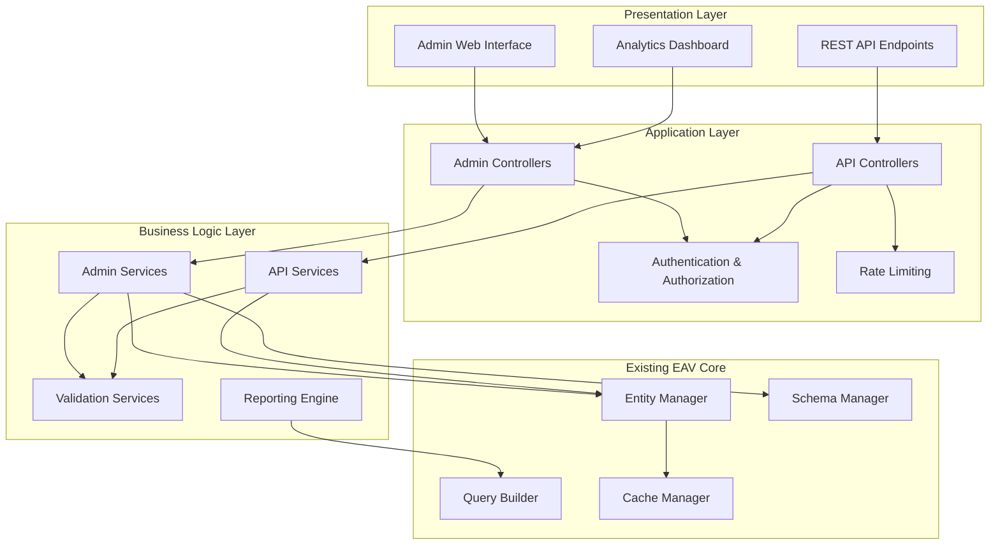
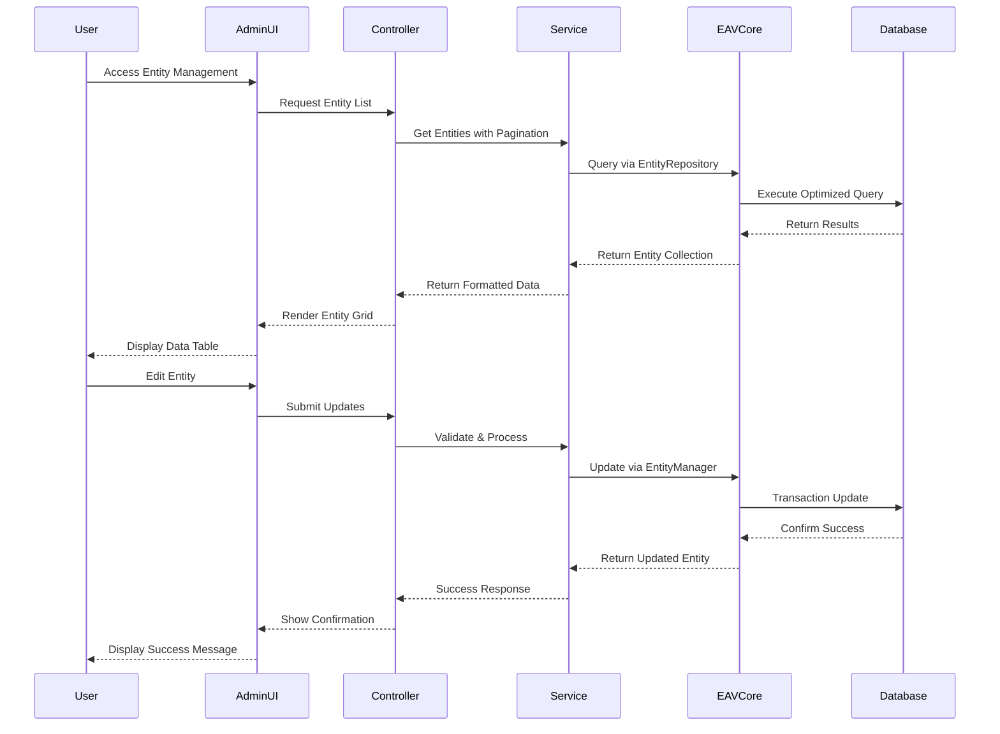
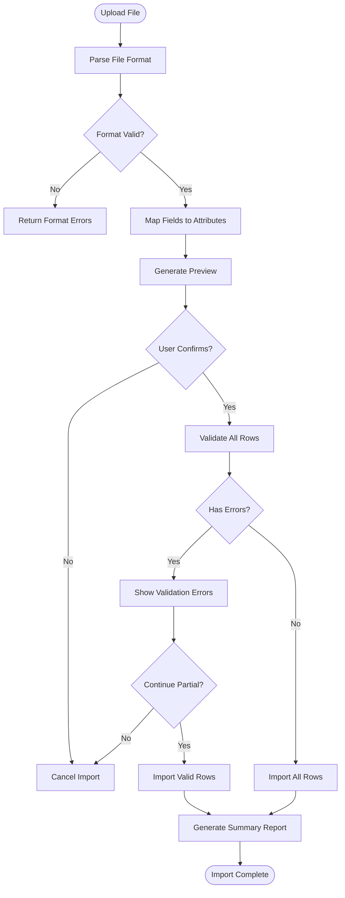
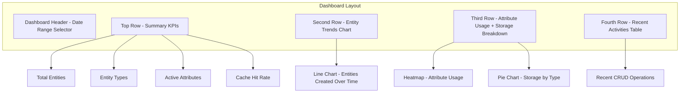
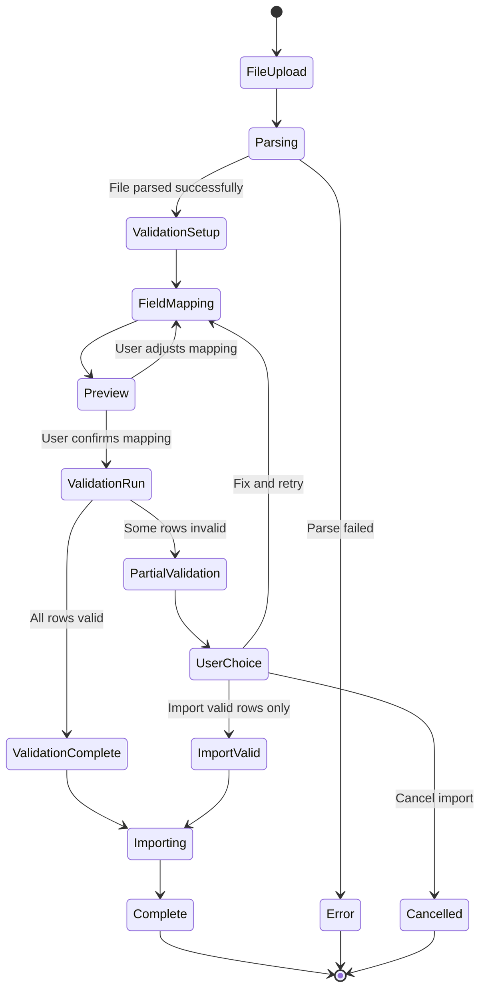
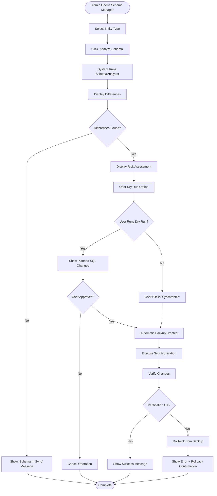
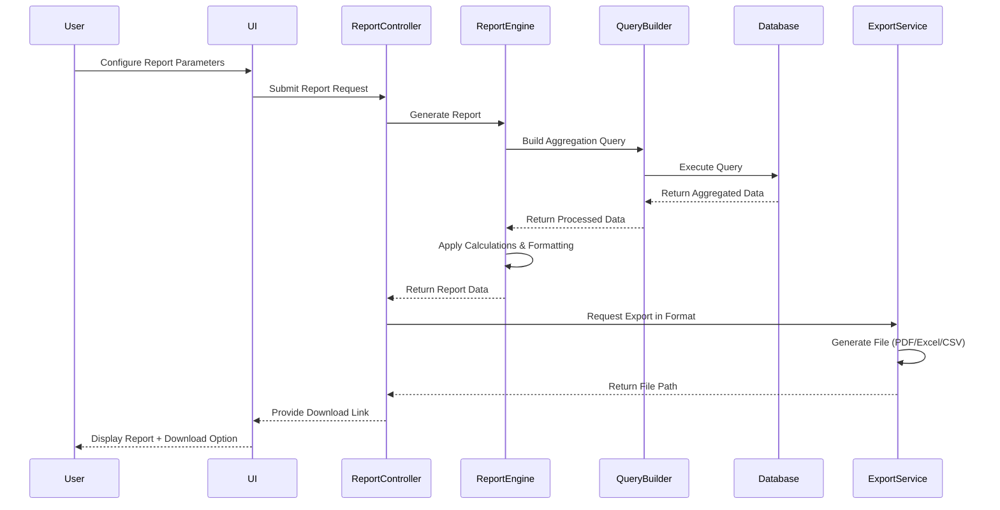

# EAV Phase 6: Advanced API & Administration Interface

## Overview

Phase 6 represents the final enhancement to the EAV system, focusing on enterprise-grade administrative capabilities, RESTful API endpoints, and advanced management features. This phase transforms the EAV system into a complete, production-ready platform with comprehensive web-based administration and external integration capabilities.

**Strategic Value:**
- Provides intuitive web interface for non-technical users to manage EAV entities
- Enables external system integration through standardized REST API
- Delivers enterprise-grade monitoring, reporting, and analytics capabilities
- Completes the EAV ecosystem with self-service administration

**Target Users:**
- System administrators managing entity types and attributes
- Business users performing data entry and management
- External developers integrating with the EAV system
- DevOps teams monitoring system health and performance

## Architecture

### High-Level System Design



### Component Interaction Flow



## Core Components

### 1. Admin Web Interface

#### 1.1 Entity Type Management Panel

**Purpose:** Visual interface for managing entity type definitions

**Capabilities:**
- Create, read, update, delete entity types
- Configure storage strategies and table mappings
- View entity type statistics and usage metrics
- Import/export entity type configurations

**Data Presentation:**
- Grid view with sortable columns (Name, Code, Entity Count, Status, Last Modified)
- Quick filters (Active, Inactive, All)
- Search by name or code
- Bulk operations (Activate, Deactivate, Export)

**Forms:**
- Entity Type Editor with validation feedback
- Attribute assignment interface
- Storage strategy selector with recommendations

#### 1.2 Attribute Management Panel

**Purpose:** Comprehensive attribute definition and configuration interface

**Capabilities:**
- Define new attributes with full property control
- Modify existing attribute properties (within safety constraints)
- Configure validation rules visually
- Manage attribute options for select-type attributes
- Reorder attributes for display priority

**Data Presentation:**
- Grouped by entity type
- Inline editing for non-critical properties
- Visual indicators for required, unique, searchable attributes
- Attribute usage statistics

**Validation Rules Builder:**
- Visual rule composition (No code required)
- Common rule templates (Email, Phone, URL, Range, Pattern)
- Custom rule definition interface
- Real-time validation preview

#### 1.3 Entity Data Management Grid

**Purpose:** Spreadsheet-like interface for managing entity instances

**Capabilities:**
- Grid view of entity instances with dynamic columns
- Inline editing capabilities
- Advanced filtering and sorting
- Bulk operations (Update, Delete, Export)
- Quick actions (Clone, Archive, Activate)

**Features:**
- Column visibility toggles
- Custom view presets (save filter combinations)
- Export to CSV, Excel, JSON
- Import from CSV with validation
- Mass update wizard

**Grid Configuration:**
| Feature | Capability | Value |
|---------|------------|-------|
| Pagination | Server-side with configurable page size | 25, 50, 100, 200 |
| Sorting | Multi-column sort with priority | Up to 3 columns |
| Filtering | Per-column filters with operators | Equals, Contains, Range, Between |
| Selection | Checkbox selection with select-all | Individual or bulk |
| Actions | Contextual actions per row | Edit, Clone, Delete, View History |

#### 1.4 Analytics Dashboard

**Purpose:** Visual insights into EAV system usage and performance

**Widgets:**
- Entity count by type (pie chart)
- Entity creation trends (line chart over time)
- Most active entity types (bar chart)
- Attribute usage heatmap
- Storage consumption breakdown
- Query performance metrics
- Cache hit rate visualization

**Reporting Capabilities:**
- Date range selection
- Entity type filtering
- Export to PDF or Excel
- Scheduled email reports

### 2. RESTful API Layer

#### 2.1 Entity Type API Endpoints

**Base Path:** `/api/v1/eav/entity-types`

| Method | Endpoint | Purpose | Request Schema | Response Schema |
|--------|----------|---------|----------------|-----------------|
| GET | `/` | List all entity types | Query params: page, limit, search, status | Paginated list of entity types |
| GET | `/{code}` | Get specific entity type | Path param: code | Single entity type details |
| POST | `/` | Create new entity type | JSON body with entity type definition | Created entity type with ID |
| PUT | `/{code}` | Update entity type | JSON body with updates | Updated entity type |
| DELETE | `/{code}` | Delete entity type | Path param: code | Success confirmation |
| GET | `/{code}/attributes` | Get attributes for type | Path param: code | List of attributes |
| GET | `/{code}/stats` | Get usage statistics | Path param: code | Statistics object |

**Example Request - Create Entity Type:**
```
POST /api/v1/eav/entity-types
Content-Type: application/json

{
  "code": "customer",
  "label": "Customer",
  "entity_table": "eav_entity_customer",
  "storage_strategy": "eav",
  "description": "Customer entity type",
  "is_active": true
}
```

**Example Response:**
```
{
  "success": true,
  "data": {
    "id": 5,
    "code": "customer",
    "label": "Customer",
    "entity_table": "eav_entity_customer",
    "storage_strategy": "eav",
    "is_active": true,
    "created_at": "2025-01-20T10:30:00Z",
    "updated_at": "2025-01-20T10:30:00Z"
  },
  "message": "Entity type created successfully"
}
```

#### 2.2 Attribute API Endpoints

**Base Path:** `/api/v1/eav/attributes`

| Method | Endpoint | Purpose | Authentication Required |
|--------|----------|---------|------------------------|
| GET | `/` | List all attributes | Yes |
| GET | `/{id}` | Get specific attribute | Yes |
| POST | `/` | Create new attribute | Yes (Admin role) |
| PUT | `/{id}` | Update attribute | Yes (Admin role) |
| DELETE | `/{id}` | Delete attribute | Yes (Admin role) |
| POST | `/{id}/options` | Add attribute option | Yes (Admin role) |
| GET | `/by-entity-type/{code}` | Get attributes by entity type | Yes |

**Validation Rules Schema:**
```
{
  "attribute_code": "email",
  "validation_rules": [
    {
      "rule": "email",
      "message": "Must be a valid email address"
    },
    {
      "rule": "required",
      "message": "Email is required"
    },
    {
      "rule": "unique",
      "message": "Email already exists"
    }
  ]
}
```

#### 2.3 Entity Data API Endpoints

**Base Path:** `/api/v1/eav/entities`

| Method | Endpoint | Purpose | Query Parameters |
|--------|----------|---------|------------------|
| GET | `/{entity_type}` | List entities of type | page, limit, filters, sort, search |
| GET | `/{entity_type}/{id}` | Get single entity | include (comma-separated attribute codes) |
| POST | `/{entity_type}` | Create entity | N/A |
| PUT | `/{entity_type}/{id}` | Update entity | N/A |
| PATCH | `/{entity_type}/{id}` | Partial update | N/A |
| DELETE | `/{entity_type}/{id}` | Delete entity | soft (boolean) |
| POST | `/{entity_type}/bulk` | Bulk create entities | N/A |
| PUT | `/{entity_type}/bulk` | Bulk update entities | N/A |
| POST | `/{entity_type}/search` | Advanced search | N/A |

**Advanced Search Request Example:**
```
POST /api/v1/eav/entities/product/search
Content-Type: application/json

{
  "filters": [
    {
      "attribute": "price",
      "operator": "between",
      "value": [10, 100]
    },
    {
      "attribute": "category",
      "operator": "in",
      "value": ["Electronics", "Gadgets"]
    },
    {
      "attribute": "name",
      "operator": "like",
      "value": "%phone%"
    }
  ],
  "sort": [
    {
      "attribute": "price",
      "direction": "asc"
    }
  ],
  "pagination": {
    "page": 1,
    "limit": 50
  },
  "include_attributes": ["name", "price", "sku", "category"]
}
```

**Search Response Schema:**
```
{
  "success": true,
  "data": [
    {
      "id": 123,
      "entity_type": "product",
      "attributes": {
        "name": "Smartphone X",
        "price": 599.99,
        "sku": "PHONE-001",
        "category": "Electronics"
      },
      "created_at": "2025-01-15T08:00:00Z",
      "updated_at": "2025-01-18T14:30:00Z"
    }
  ],
  "meta": {
    "total": 145,
    "page": 1,
    "limit": 50,
    "total_pages": 3
  }
}
```

#### 2.4 Schema Management API

**Base Path:** `/api/v1/eav/schema`

| Method | Endpoint | Purpose | Admin Only |
|--------|----------|---------|------------|
| POST | `/analyze` | Analyze schema differences | Yes |
| POST | `/sync` | Synchronize schema | Yes |
| POST | `/backup/create` | Create schema backup | Yes |
| GET | `/backup/list` | List available backups | Yes |
| POST | `/backup/restore` | Restore from backup | Yes |
| GET | `/migrations/list` | List migration history | Yes |
| POST | `/migrations/generate` | Generate migration | Yes |

### 3. Advanced Services

#### 3.1 Entity Import/Export Service

**Purpose:** Bulk data operations with validation and error handling

**Import Capabilities:**
- CSV file upload with mapping interface
- JSON bulk import
- Excel file support
- Field mapping to attributes
- Validation before commit
- Error reporting with line numbers
- Partial import on validation errors

**Import Workflow:**


**Export Capabilities:**
- Export filtered entity sets
- Custom column selection
- Multiple format support (CSV, Excel, JSON, XML)
- Template-based exports
- Scheduled exports
- Email delivery of exports

**Export Configuration Schema:**
```
{
  "entity_type": "product",
  "format": "csv",
  "filters": {
    "price": {"operator": ">", "value": 50},
    "status": {"operator": "=", "value": "active"}
  },
  "columns": ["sku", "name", "price", "category"],
  "options": {
    "include_headers": true,
    "delimiter": ",",
    "encoding": "UTF-8"
  }
}
```

#### 3.2 Entity Versioning Service

**Purpose:** Track changes to entity data over time for audit and rollback

**Capabilities:**
- Automatic version creation on updates
- Version comparison (diff view)
- Rollback to previous version
- Version annotations (user notes)
- Configurable retention policy

**Version Storage Schema:**

| Field | Type | Description |
|-------|------|-------------|
| version_id | Integer | Auto-increment version identifier |
| entity_id | Integer | Reference to entity |
| entity_type_id | Integer | Entity type reference |
| version_number | Integer | Sequential version number per entity |
| attribute_snapshots | JSON | Complete attribute state at version |
| changed_attributes | Array | List of attributes modified in this version |
| user_id | Integer | User who made the change |
| change_description | Text | Optional description of changes |
| created_at | Datetime | Version creation timestamp |

**Version Comparison Output:**
```
{
  "entity_id": 123,
  "from_version": 5,
  "to_version": 6,
  "changes": [
    {
      "attribute": "price",
      "old_value": 599.99,
      "new_value": 549.99,
      "change_type": "modified"
    },
    {
      "attribute": "discount_percent",
      "old_value": null,
      "new_value": 10,
      "change_type": "added"
    }
  ],
  "changed_by": "admin_user",
  "changed_at": "2025-01-20T15:45:00Z"
}
```

#### 3.3 Audit Logging Service

**Purpose:** Comprehensive tracking of all system operations for compliance and security

**Logged Events:**
- Entity type creation, modification, deletion
- Attribute definition changes
- Entity data CRUD operations
- Schema synchronization operations
- User authentication events
- API access logs
- Permission changes

**Audit Log Entry Schema:**

| Field | Type | Description | Indexed |
|-------|------|-------------|---------|
| log_id | BigInt | Unique log entry identifier | Yes |
| event_type | String | Type of event (entity.create, attribute.update, etc.) | Yes |
| entity_type | String | Affected entity type | Yes |
| entity_id | Integer | Affected entity ID (if applicable) | Yes |
| user_id | Integer | User performing action | Yes |
| ip_address | String | Request IP address | No |
| user_agent | String | Browser/client information | No |
| request_data | JSON | Request payload (sanitized) | No |
| response_status | Integer | HTTP status code | Yes |
| execution_time | Integer | Operation duration (ms) | No |
| created_at | Datetime | Event timestamp | Yes |

**Query Capabilities:**
- Filter by event type, user, date range, entity type
- Full-text search in request data
- Aggregation reporting (events per user, per day, etc.)
- Export audit trails for compliance

#### 3.4 Reporting Engine

**Purpose:** Generate business intelligence reports from EAV data

**Report Types:**

**Summary Reports:**
- Entity counts by type
- Attribute usage statistics
- Data completeness metrics (percentage of required fields filled)
- Growth trends over time

**Analytical Reports:**
- Cross-entity type correlation analysis
- Attribute value distribution charts
- Data quality scorecards
- Performance bottleneck identification

**Custom Reports:**
- User-defined query builder interface
- Save report templates
- Schedule recurring reports
- Multi-format export (PDF, Excel, HTML)

**Report Definition Schema:**
```
{
  "report_name": "Monthly Product Performance",
  "entity_type": "product",
  "aggregations": [
    {
      "field": "sales_count",
      "function": "sum",
      "alias": "total_sales"
    },
    {
      "field": "price",
      "function": "avg",
      "alias": "avg_price"
    }
  ],
  "group_by": ["category"],
  "filters": {
    "created_at": {
      "operator": "between",
      "value": ["2025-01-01", "2025-01-31"]
    }
  },
  "sort": {
    "field": "total_sales",
    "direction": "desc"
  },
  "limit": 100
}
```

### 4. Security & Access Control

#### 4.1 Authentication Mechanisms

**Supported Methods:**
- Session-based authentication (for web UI)
- API token authentication (for REST API)
- OAuth 2.0 integration (optional for enterprise SSO)

**API Token Management:**
- Generate tokens with expiration dates
- Assign scopes/permissions to tokens
- Revoke tokens immediately
- Token usage audit trail

#### 4.2 Authorization Model

**Role-Based Access Control (RBAC):**

| Role | Entity Type Permissions | Attribute Permissions | Entity Data Permissions | Schema Permissions |
|------|------------------------|----------------------|------------------------|-------------------|
| Super Admin | Full CRUD | Full CRUD | Full CRUD on all types | Full access |
| Admin | Create, Read, Update | Create, Read, Update | Full CRUD on assigned types | Read, Sync |
| Data Manager | Read | Read | CRUD on assigned types | Read only |
| User | Read | Read | Read on public types | None |
| API Client | As configured | As configured | As configured | None |

**Permission Granularity:**
- Per entity type access control
- Per attribute visibility control
- Row-level security (filter entities by ownership)
- Field-level security (mask sensitive attributes)

**Entity Type Access Configuration:**
```
{
  "role": "data_manager",
  "entity_type": "customer",
  "permissions": {
    "create": true,
    "read": true,
    "update": true,
    "delete": false,
    "export": true,
    "bulk_operations": false
  },
  "row_filter": {
    "attribute": "assigned_to",
    "operator": "=",
    "value": "{current_user_id}"
  },
  "hidden_attributes": ["ssn", "credit_card"]
}
```

#### 4.3 Rate Limiting Strategy

**API Endpoint Rate Limits:**

| Endpoint Category | Limit (per minute) | Burst Allowance | Throttle Strategy |
|-------------------|-------------------|-----------------|-------------------|
| Read Operations (GET) | 300 | 50 | Sliding window |
| Write Operations (POST/PUT) | 100 | 20 | Token bucket |
| Bulk Operations | 10 | 2 | Fixed window |
| Schema Operations | 5 | 1 | Fixed window |
| Export Operations | 20 | 5 | Token bucket |

**Rate Limit Headers:**
```
X-RateLimit-Limit: 100
X-RateLimit-Remaining: 87
X-RateLimit-Reset: 1642680000
```

**Exceeded Response:**
```
HTTP 429 Too Many Requests
{
  "error": "Rate limit exceeded",
  "message": "You have exceeded 100 requests per minute",
  "retry_after": 45
}
```

### 5. User Interface Components

#### 5.1 Component Library

**Grid Component:**
- Server-side pagination and sorting
- Column resizing and reordering
- Inline editing with validation
- Row selection and bulk actions
- Export functionality
- Responsive design for mobile

**Form Builder Component:**
- Dynamic form generation from attribute definitions
- Client-side validation with real-time feedback
- Multi-step form wizard support
- Conditional field visibility
- Auto-save draft capability
- Field dependency handling

**Chart Components:**
- Line charts for trends
- Bar charts for comparisons
- Pie/donut charts for distributions
- Heatmaps for correlations
- Sparklines for inline metrics
- Interactive tooltips and drill-downs

**Filter Builder Component:**
- Visual filter composition
- Attribute-aware operator suggestions
- Type-appropriate input controls
- Save filter presets
- Clear all filters option
- Active filters display

#### 5.2 Page Layouts

**Entity Type Management Page:**

| Section | Content | Actions |
|---------|---------|---------|
| Header | Page title, breadcrumb, primary action (Create Entity Type) | Create, Import, Export All |
| Filters | Search box, status filter, storage strategy filter | Apply, Clear |
| Grid | Entity types table with columns: Name, Code, Entities Count, Status, Actions | Sort, Select, Context Menu |
| Footer | Pagination controls, records per page selector | Navigate pages |

**Entity Data Management Page:**

| Section | Content | Actions |
|---------|---------|---------|
| Header | Entity type selector, view switcher (Grid/Card), primary actions | Create, Import, Bulk Update |
| Filters | Advanced filter builder, saved filters dropdown | Apply, Save Filter, Clear |
| Grid/Cards | Entity instances display | Edit, Clone, Delete, Export Selection |
| Side Panel | Entity detail view, quick edit form | Save, Cancel, View History |
| Footer | Pagination, selection summary, bulk action toolbar | Execute Bulk Actions |

**Analytics Dashboard Page:**



## Data Models

### Admin-Specific Tables

**eav_entity_versions Table:**
```
Column Name          | Type       | Constraints
---------------------|------------|---------------------------
version_id           | BIGINT     | PRIMARY KEY, AUTO_INCREMENT
entity_id            | INT        | NOT NULL, FOREIGN KEY
entity_type_id       | INT        | NOT NULL, FOREIGN KEY
version_number       | INT        | NOT NULL
attribute_snapshots  | JSON       | NOT NULL
changed_attributes   | JSON       | NULL
user_id              | INT        | FOREIGN KEY
change_description   | TEXT       | NULL
created_at           | DATETIME   | NOT NULL DEFAULT CURRENT_TIMESTAMP

Indexes:
- entity_id, version_number (UNIQUE)
- entity_type_id
- user_id
- created_at
```

**eav_audit_log Table:**
```
Column Name       | Type       | Constraints
------------------|------------|---------------------------
log_id            | BIGINT     | PRIMARY KEY, AUTO_INCREMENT
event_type        | VARCHAR(100) | NOT NULL
entity_type       | VARCHAR(50)  | NULL
entity_id         | INT        | NULL
user_id           | INT        | NULL, FOREIGN KEY
ip_address        | VARCHAR(45)  | NULL
user_agent        | VARCHAR(255) | NULL
request_data      | JSON       | NULL
response_status   | SMALLINT   | NULL
execution_time    | INT        | NULL (milliseconds)
created_at        | DATETIME   | NOT NULL, INDEXED

Indexes:
- event_type
- entity_type, entity_id
- user_id
- created_at
- response_status
```

**eav_api_tokens Table:**
```
Column Name    | Type       | Constraints
---------------|------------|---------------------------
token_id       | INT        | PRIMARY KEY, AUTO_INCREMENT
user_id        | INT        | NOT NULL, FOREIGN KEY
token_hash     | VARCHAR(255) | NOT NULL, UNIQUE
token_name     | VARCHAR(100) | NOT NULL
scopes         | JSON       | NOT NULL
expires_at     | DATETIME   | NULL
last_used_at   | DATETIME   | NULL
created_at     | DATETIME   | NOT NULL
is_active      | TINYINT    | NOT NULL DEFAULT 1

Indexes:
- user_id
- token_hash
- expires_at
- is_active
```

**eav_import_jobs Table:**
```
Column Name       | Type       | Constraints
------------------|------------|---------------------------
job_id            | INT        | PRIMARY KEY, AUTO_INCREMENT
entity_type_id    | INT        | NOT NULL, FOREIGN KEY
user_id           | INT        | NOT NULL, FOREIGN KEY
file_name         | VARCHAR(255) | NOT NULL
file_path         | VARCHAR(500) | NOT NULL
status            | ENUM       | 'pending', 'processing', 'completed', 'failed'
total_rows        | INT        | NOT NULL DEFAULT 0
processed_rows    | INT        | NOT NULL DEFAULT 0
successful_rows   | INT        | NOT NULL DEFAULT 0
failed_rows       | INT        | NOT NULL DEFAULT 0
error_details     | JSON       | NULL
started_at        | DATETIME   | NULL
completed_at      | DATETIME   | NULL
created_at        | DATETIME   | NOT NULL

Indexes:
- entity_type_id
- user_id
- status
- created_at
```

**eav_reports Table:**
```
Column Name       | Type       | Constraints
------------------|------------|---------------------------
report_id         | INT        | PRIMARY KEY, AUTO_INCREMENT
report_name       | VARCHAR(200) | NOT NULL
report_type       | VARCHAR(50)  | NOT NULL
entity_type_id    | INT        | NULL, FOREIGN KEY
configuration     | JSON       | NOT NULL
created_by        | INT        | NOT NULL, FOREIGN KEY
is_scheduled      | TINYINT    | NOT NULL DEFAULT 0
schedule_config   | JSON       | NULL
last_run_at       | DATETIME   | NULL
created_at        | DATETIME   | NOT NULL
updated_at        | DATETIME   | NOT NULL

Indexes:
- entity_type_id
- created_by
- is_scheduled
```

## API Response Formats

### Standard Success Response

```json
{
  "success": true,
  "data": {
    // Response payload specific to endpoint
  },
  "meta": {
    // Pagination, filtering, or other metadata
  },
  "message": "Operation completed successfully"
}
```

### Standard Error Response

```json
{
  "success": false,
  "error": {
    "code": "VALIDATION_ERROR",
    "message": "Validation failed for one or more fields",
    "details": [
      {
        "field": "email",
        "message": "Email is required"
      },
      {
        "field": "price",
        "message": "Price must be greater than 0"
      }
    ]
  }
}
```

### Error Code Registry

| Error Code | HTTP Status | Meaning | Use Case |
|------------|-------------|---------|----------|
| VALIDATION_ERROR | 400 | Request data validation failed | Invalid field values |
| AUTHENTICATION_REQUIRED | 401 | User not authenticated | Missing or invalid token |
| PERMISSION_DENIED | 403 | User lacks required permissions | Insufficient role/permissions |
| RESOURCE_NOT_FOUND | 404 | Requested resource doesn't exist | Invalid entity ID or type code |
| CONFLICT | 409 | Resource state conflict | Duplicate unique attribute value |
| RATE_LIMIT_EXCEEDED | 429 | Too many requests | API rate limit reached |
| SERVER_ERROR | 500 | Internal server error | Unexpected system error |
| DATABASE_ERROR | 503 | Database unavailable or error | DB connection issues |

## Workflows

### Entity Import Workflow



### Schema Synchronization via UI



### Report Generation Workflow



## Integration Points

### Integration with Existing EAV Core

**Entity Manager Integration:**
- Admin services utilize EntityManager for all CRUD operations
- No direct database access bypasses EntityManager
- Events fired by EntityManager are logged by AuditLoggingService
- Version snapshots created via EntityManager update hooks

**Schema Manager Integration:**
- Admin UI provides visual wrapper for CLI schema commands
- SchemaAnalyzer, SchemaComparator, SyncEngine used directly
- Backup/restore operations delegated to BackupManager
- Migration generation exposed through UI with preview

**Query Builder Integration:**
- Advanced search API translates to EavQueryBuilder calls
- Reporting engine builds complex queries via QueryFactory
- Filter conditions validated against attribute definitions
- Join optimization applied automatically

**Cache Manager Integration:**
- Admin operations trigger appropriate cache invalidations
- Bulk operations batch cache invalidation calls
- Dashboard metrics utilize cached entity counts when available
- API responses include cache headers

### External System Integration

**Webhook Support:**
- Configure webhooks for entity lifecycle events
- POST JSON payload to external URLs on create/update/delete
- Retry logic with exponential backoff
- Webhook execution audit trail

**Data Synchronization:**
- Pull data from external APIs into EAV entities (scheduled jobs)
- Push EAV entity changes to external systems
- Field mapping configuration interface
- Conflict resolution strategies (newest wins, manual resolution)

**Authentication Integration:**
- LDAP/Active Directory integration for user authentication
- OAuth 2.0 for third-party app access
- SAML 2.0 for enterprise SSO
- API key management for service accounts

## Performance Considerations

### Response Time Targets

| Operation Type | Target Response Time | Optimization Strategy |
|----------------|---------------------|----------------------|
| Entity List (paginated) | < 500ms | Database indexing, query caching |
| Entity Detail View | < 200ms | Entity-level caching |
| Entity Create/Update | < 300ms | Batch attribute value inserts |
| Bulk Operations (100 entities) | < 5s | Transaction batching, async processing |
| Schema Analysis | < 2s | Result caching (5 min TTL) |
| Report Generation (simple) | < 3s | Query optimization, materialized views |
| Report Generation (complex) | < 30s | Background job processing |
| File Export (1000 rows) | < 10s | Streaming output, chunked processing |

### Scalability Strategies

**Horizontal Scaling:**
- Stateless API design allows load balancer distribution
- Session storage in Redis or database (not in-memory)
- File uploads stored in shared storage (S3, NFS)
- Background job queue (RabbitMQ, Redis Queue)

**Caching Layers:**
- Browser caching for static admin UI assets
- CDN for public-facing resources
- Application-level caching via Redis
- Database query result caching
- HTTP response caching with ETags

**Database Optimization:**
- Read replicas for reporting queries
- Connection pooling to reduce overhead
- Prepared statement caching
- Partitioning for large value tables (by entity type or date)
- Archive old audit logs to separate tables

### Monitoring & Metrics

**Key Performance Indicators:**
- API endpoint response times (p50, p95, p99)
- Error rates by endpoint
- Cache hit/miss ratios
- Database query execution times
- Background job processing times
- Concurrent user sessions
- API requests per minute

**Health Check Endpoints:**
- `/api/health` - Overall system health
- `/api/health/database` - Database connectivity
- `/api/health/cache` - Cache service status
- `/api/health/storage` - File storage accessibility

## Testing Strategy

### Unit Testing

**Components to Test:**
- Admin controllers (mock services)
- API controllers (mock authentication, services)
- AdminService business logic
- APIService request/response transformations
- ValidationService rule execution
- ReportEngine query building and aggregation
- Import/Export services data processing

**Test Coverage Target:** 80% code coverage for business logic

### Integration Testing

**Test Scenarios:**
- Complete entity CRUD workflow via API
- Import CSV file with validation errors
- Generate and execute report
- Schema sync with backup and restore
- Bulk update operations
- Authentication and authorization enforcement
- Rate limiting behavior

### End-to-End Testing

**User Journeys:**
- Admin creates new entity type, adds attributes, creates entities via UI
- User logs in, filters entities, edits entity, saves changes
- API client authenticates, performs search, retrieves results
- Data manager imports CSV, reviews errors, imports valid rows
- Admin analyzes schema, runs sync, verifies changes

### Performance Testing

**Load Test Scenarios:**
- 100 concurrent API requests for entity listing
- Bulk create 1000 entities simultaneously
- 50 concurrent report generations
- File import of 10,000 rows

**Target Metrics:**
- Average response time under load
- Maximum throughput (requests per second)
- Error rate under stress conditions
- Resource utilization (CPU, memory, database connections)

## Deployment Considerations

### Database Migrations

**New Tables Required:**
- eav_entity_versions
- eav_audit_log
- eav_api_tokens
- eav_import_jobs
- eav_export_jobs
- eav_reports
- eav_webhooks
- eav_user_permissions

**Migration Sequence:**
1. Create admin tables (versions, audit log, tokens)
2. Create import/export job tracking tables
3. Create reporting configuration table
4. Create webhook configuration table
5. Create user permissions table
6. Add indexes for performance
7. Seed default admin user and permissions

### Configuration Requirements

**Admin Module Configuration:**
```
'eav_admin' => [
    'ui' => [
        'items_per_page' => 25,
        'max_export_rows' => 10000,
        'enable_inline_edit' => true,
        'auto_save_draft' => true
    ],
    'api' => [
        'rate_limit_enabled' => true,
        'rate_limit_per_minute' => 100,
        'token_expiry_days' => 30,
        'cors_enabled' => true,
        'allowed_origins' => ['https://app.example.com']
    ],
    'versioning' => [
        'enabled' => true,
        'retention_days' => 365,
        'auto_cleanup' => true
    ],
    'audit' => [
        'enabled' => true,
        'log_read_operations' => false,
        'retention_days' => 730
    ],
    'import' => [
        'max_file_size_mb' => 50,
        'allowed_formats' => ['csv', 'xlsx', 'json'],
        'batch_size' => 500
    ]
]
```

### Security Hardening

**Recommendations:**
- HTTPS only for all admin and API endpoints
- CSRF protection for web UI forms
- SQL injection prevention via parameterized queries
- XSS protection via output escaping
- Content Security Policy headers
- Secure token storage (hashed in database)
- Password complexity requirements
- Account lockout after failed login attempts
- IP whitelisting for admin access (optional)
- Two-factor authentication support (optional)

### Rollback Plan

**If Issues Arise Post-Deployment:**
1. Disable Phase 6 routes via configuration flag
2. Revert database migrations (drop new tables)
3. Restore configuration files to previous version
4. Clear application cache
5. Monitor error logs for residual issues
6. Existing EAV core functionality remains unaffected (Phase 6 is additive only)

## Documentation Deliverables

### Technical Documentation

1. **API Reference Documentation**
   - Complete endpoint catalog with request/response examples
   - Authentication guide
   - Error code reference
   - Rate limiting documentation
   - Versioning policy

2. **Admin UI User Guide**
   - Entity type management walkthrough
   - Attribute configuration guide
   - Entity data management tutorial
   - Import/export procedures
   - Report generation instructions

3. **Integration Guide**
   - External system integration patterns
   - Webhook configuration
   - Authentication setup (OAuth, LDAP, SAML)
   - Sample client code (PHP, JavaScript, Python)

4. **Developer Guide**
   - Component architecture
   - Extending admin functionality
   - Custom validation rules
   - Custom report types
   - Testing guidelines

### Operational Documentation

1. **Deployment Guide**
   - Prerequisites and dependencies
   - Step-by-step installation
   - Configuration options reference
   - Database migration execution
   - Post-deployment verification

2. **Security Hardening Guide**
   - Recommended security configurations
   - SSL/TLS setup
   - Firewall rules
   - Access control best practices

3. **Monitoring & Troubleshooting**
   - Key metrics to monitor
   - Common error scenarios and solutions
   - Performance tuning guide
   - Log file locations and formats

4. **Backup & Recovery**
   - Backup strategies for admin data
   - Recovery procedures
   - Disaster recovery plan
