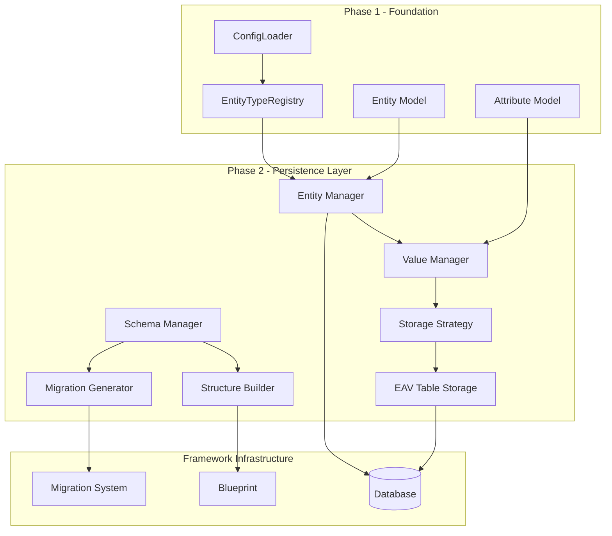
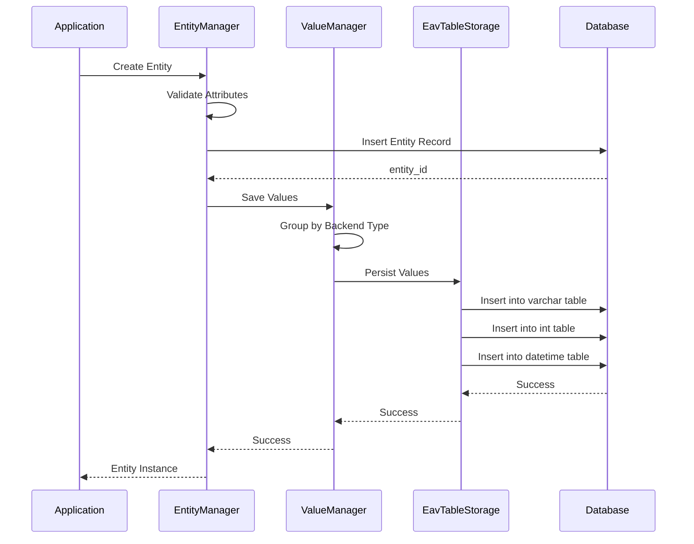
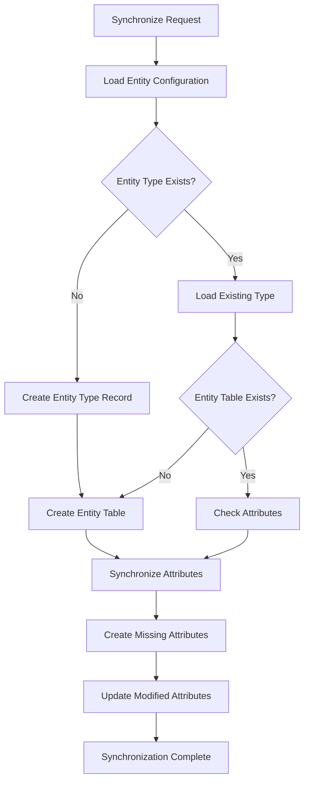
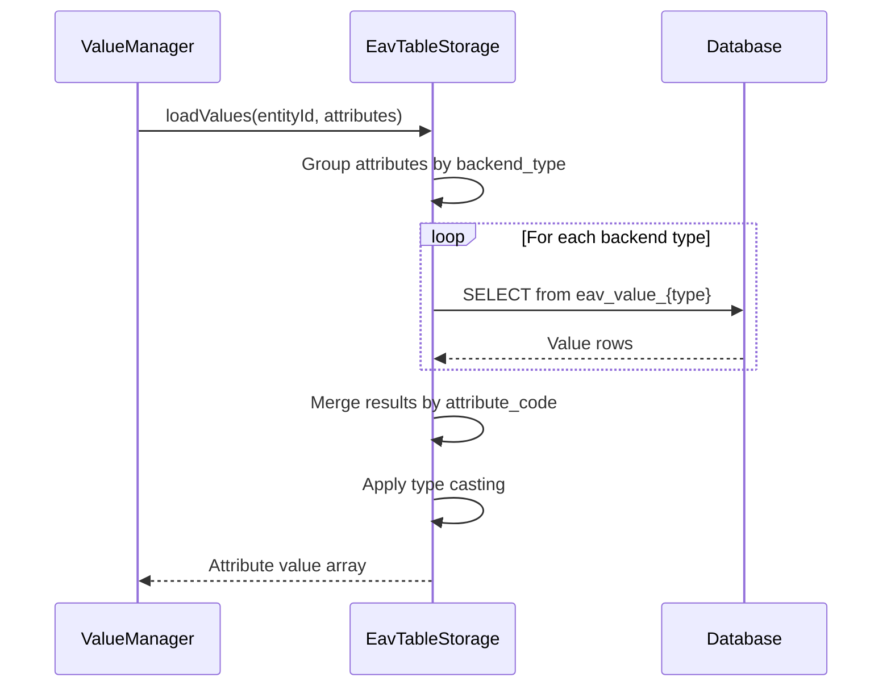
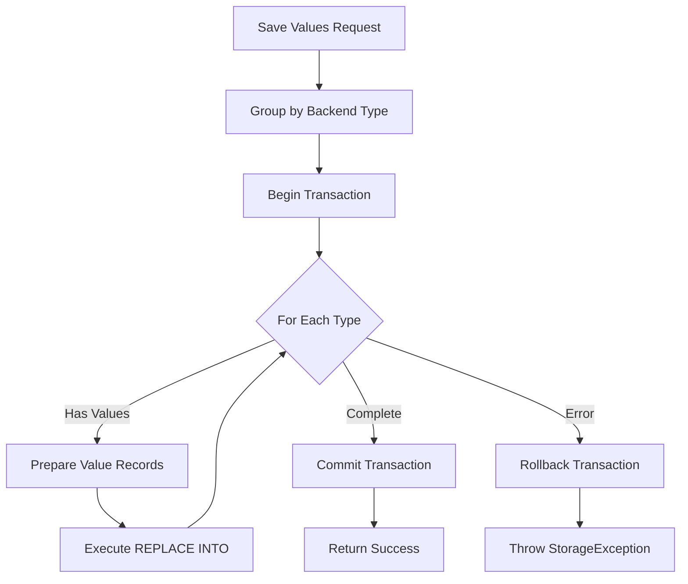
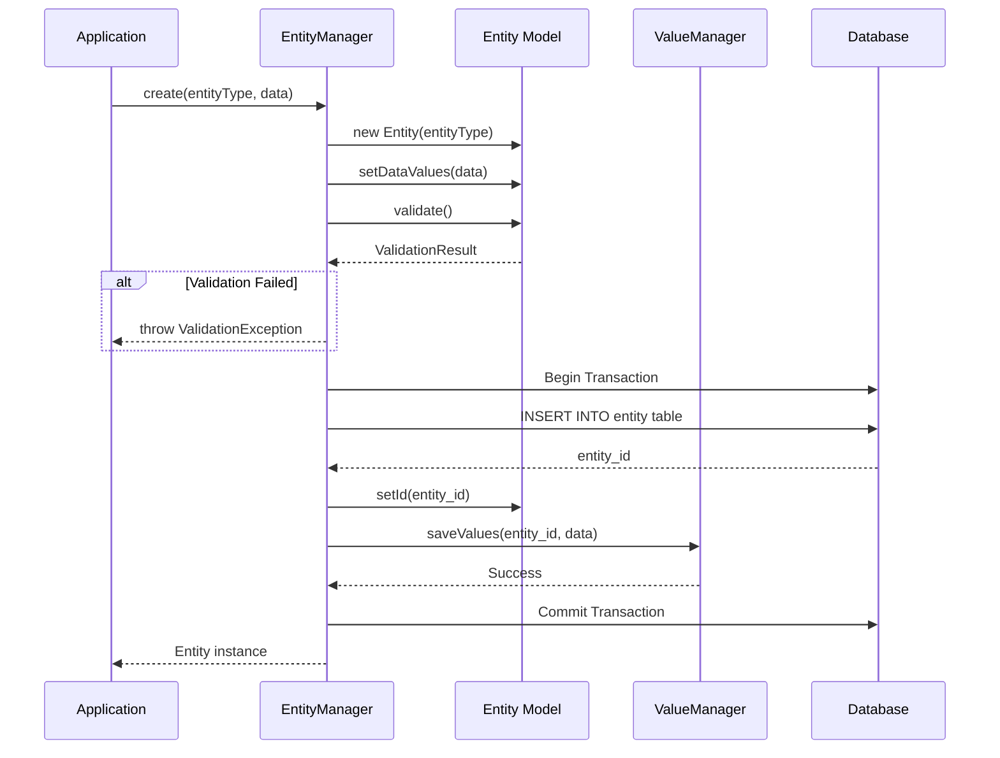
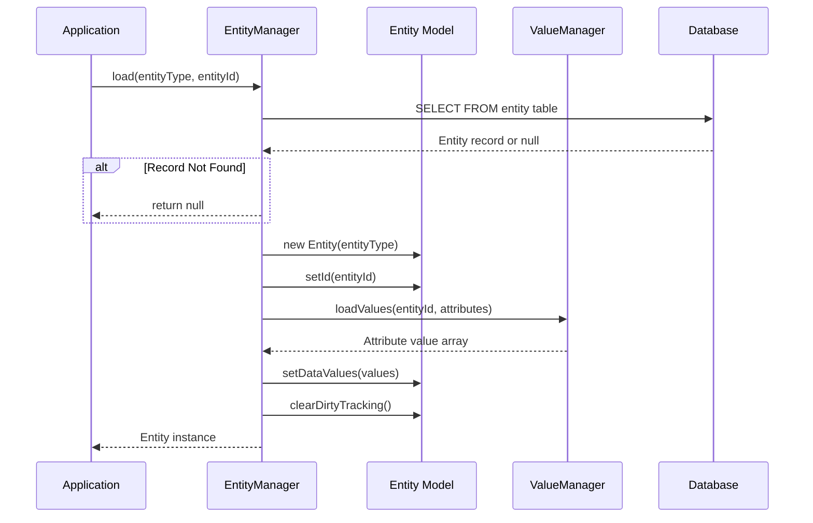
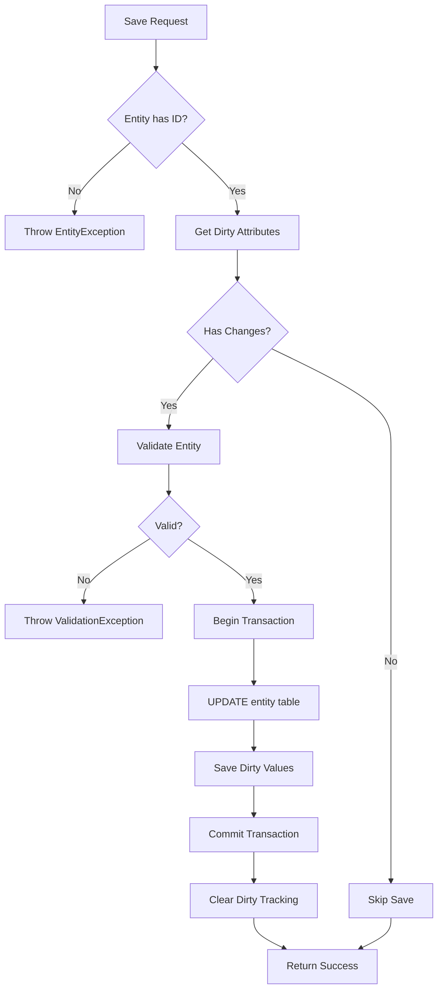
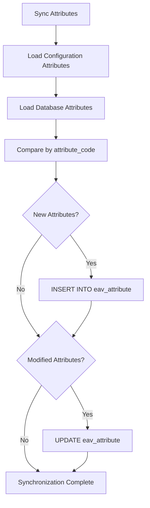
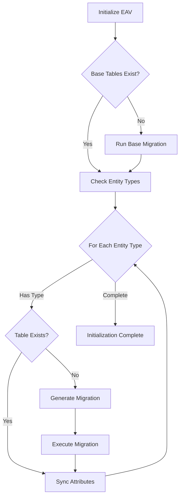

# EAV Library Phase 2: Data Persistence Layer - Design Document

## 1. Overview

### 1.1 Purpose

This design document defines the implementation strategy for Phase 2 of the EAV (Entity-Attribute-Value) library, focusing on data persistence capabilities. Phase 2 builds upon the Phase 1 foundation (configuration system, entity models, and validation) to enable full database CRUD operations for dynamic entities and their attribute values.

### 1.2 Scope

Phase 2 delivers the following core capabilities:

- **Database Schema Management**: Automated creation and synchronization of EAV database structures
- **Value Persistence**: Storage and retrieval of attribute values across multiple backend types
- **Entity Manager**: Complete entity lifecycle management (create, read, update, delete)
- **Storage Strategies**: Implementation of EAV table storage pattern
- **Data Access Layer**: Integration with existing Database and QueryBuilder infrastructure

### 1.3 Phase 1 Foundation

Phase 1 established the following components that Phase 2 will leverage:

| Component | Status | Purpose |
|-----------|--------|---------|
| Entity Model | ✅ Complete | Represents entity instances with dirty tracking |
| Attribute Model | ✅ Complete | Defines attribute metadata and validation |
| EntityType Model | ✅ Complete | Entity type definitions with attribute collections |
| ConfigLoader | ✅ Complete | Loads entity configurations from files |
| EntityTypeRegistry | ✅ Complete | Runtime index of entity types |
| Exception Hierarchy | ✅ Complete | Comprehensive error handling |

### 1.4 Design Principles

- **Leverage Existing Infrastructure**: Utilize the project's Database, Migration, and Blueprint systems
- **Configuration-Driven**: All schema structures derive from configuration files
- **Performance-Oriented**: Optimize for common read patterns while maintaining flexibility
- **Transaction Safety**: Ensure atomicity for multi-table operations
- **Incremental Enhancement**: Build features incrementally with immediate usability

## 2. Architecture Overview

### 2.1 Component Relationship Diagram



### 2.2 Data Flow Architecture



### 2.3 Directory Structure

```
app/Core/Eav/
├── Config/                          [Phase 1 - Existing]
├── Exception/                       [Phase 1 - Existing]
├── Model/                          [Phase 1 - Existing]
├── Provider/                       [Phase 1 - Existing]
├── Schema/                         [Phase 2 - NEW]
│   ├── SchemaManager.php
│   ├── StructureBuilder.php
│   ├── MigrationGenerator.php
│   └── TableDefinition.php
├── Storage/                        [Phase 2 - NEW]
│   ├── StorageStrategyInterface.php
│   ├── EavTableStorage.php
│   └── ValueTransformer.php
├── Manager/                        [Phase 2 - NEW]
│   ├── EntityManager.php
│   ├── ValueManager.php
│   └── AttributeMetadataManager.php
└── Repository/                     [Phase 2 - NEW]
    ├── EntityRepository.php
    └── AttributeRepository.php
```

## 3. Database Schema Design

### 3.1 Schema Overview

The EAV database schema consists of three primary table categories:

1. **Entity Tables**: Store entity instances (one per entity type)
2. **Attribute Metadata Table**: Stores attribute definitions (shared across all entity types)
3. **Value Tables**: Store attribute values (one per backend type, shared across entity types)

### 3.2 Entity Table Structure

Each entity type has a dedicated entity table following this pattern:

**Table Name Pattern**: `eav_entity_{entity_code}`

| Column Name | Data Type | Constraints | Purpose |
|-------------|-----------|-------------|---------|
| entity_id | INT UNSIGNED | PRIMARY KEY AUTO_INCREMENT | Unique entity identifier |
| entity_type_id | INT UNSIGNED | NOT NULL | Reference to entity type |
| created_at | TIMESTAMP | DEFAULT CURRENT_TIMESTAMP | Entity creation time |
| updated_at | TIMESTAMP | DEFAULT CURRENT_TIMESTAMP ON UPDATE CURRENT_TIMESTAMP | Last modification time |

**Indexes**:
- PRIMARY KEY on entity_id
- INDEX on entity_type_id for filtering by type

### 3.3 Attribute Metadata Table

**Table Name**: `eav_attribute`

| Column Name | Data Type | Constraints | Purpose |
|-------------|-----------|-------------|---------|
| attribute_id | INT UNSIGNED | PRIMARY KEY AUTO_INCREMENT | Unique attribute identifier |
| entity_type_id | INT UNSIGNED | NOT NULL | Entity type association |
| attribute_code | VARCHAR(255) | NOT NULL | Attribute code identifier |
| attribute_label | VARCHAR(255) | NOT NULL | Human-readable label |
| backend_type | VARCHAR(32) | NOT NULL | Storage type: varchar, int, decimal, datetime, text |
| frontend_type | VARCHAR(32) | NOT NULL | Input type: text, select, multiselect, date, boolean |
| is_required | TINYINT(1) | DEFAULT 0 | Required validation flag |
| is_unique | TINYINT(1) | DEFAULT 0 | Uniqueness constraint flag |
| is_searchable | TINYINT(1) | DEFAULT 0 | Search index flag |
| is_filterable | TINYINT(1) | DEFAULT 0 | Filter capability flag |
| default_value | TEXT | NULL | Serialized default value |
| validation_rules | TEXT | NULL | JSON-encoded validation rules |
| sort_order | INT | DEFAULT 0 | Display/processing order |
| created_at | TIMESTAMP | DEFAULT CURRENT_TIMESTAMP | Creation timestamp |
| updated_at | TIMESTAMP | DEFAULT CURRENT_TIMESTAMP ON UPDATE CURRENT_TIMESTAMP | Modification timestamp |

**Indexes**:
- PRIMARY KEY on attribute_id
- UNIQUE KEY on (entity_type_id, attribute_code)
- INDEX on entity_type_id for type-based queries

### 3.4 Value Tables by Backend Type

Separate value tables for each backend type optimize storage and query performance.

#### VARCHAR Value Table

**Table Name**: `eav_value_varchar`

| Column Name | Data Type | Constraints | Purpose |
|-------------|-----------|-------------|---------|
| value_id | INT UNSIGNED | PRIMARY KEY AUTO_INCREMENT | Unique value record |
| entity_type_id | INT UNSIGNED | NOT NULL | Entity type reference |
| attribute_id | INT UNSIGNED | NOT NULL | Attribute definition reference |
| entity_id | INT UNSIGNED | NOT NULL | Entity instance reference |
| value | VARCHAR(255) | NULL | Attribute value |

**Indexes**:
- PRIMARY KEY on value_id
- UNIQUE KEY on (entity_type_id, attribute_id, entity_id)
- INDEX on entity_id for entity-based lookups
- INDEX on (attribute_id, value) for searchable attributes

#### INT Value Table

**Table Name**: `eav_value_int`

Structure mirrors VARCHAR table with value column as INT type.

#### DECIMAL Value Table

**Table Name**: `eav_value_decimal`

Structure mirrors VARCHAR table with value column as DECIMAL(12,4) type.

#### DATETIME Value Table

**Table Name**: `eav_value_datetime`

Structure mirrors VARCHAR table with value column as DATETIME type.

#### TEXT Value Table

**Table Name**: `eav_value_text`

Structure mirrors VARCHAR table with value column as TEXT type. Does not include value index due to TEXT column limitations.

### 3.5 Entity Type Reference Table

**Table Name**: `eav_entity_type`

| Column Name | Data Type | Constraints | Purpose |
|-------------|-----------|-------------|---------|
| entity_type_id | INT UNSIGNED | PRIMARY KEY AUTO_INCREMENT | Unique type identifier |
| entity_code | VARCHAR(255) | UNIQUE NOT NULL | Type code (product, customer, etc.) |
| entity_label | VARCHAR(255) | NOT NULL | Human-readable name |
| entity_table | VARCHAR(255) | NOT NULL | Entity table name |
| storage_strategy | VARCHAR(32) | DEFAULT 'eav' | Storage approach |
| created_at | TIMESTAMP | DEFAULT CURRENT_TIMESTAMP | Creation time |
| updated_at | TIMESTAMP | DEFAULT CURRENT_TIMESTAMP ON UPDATE CURRENT_TIMESTAMP | Modification time |

**Indexes**:
- PRIMARY KEY on entity_type_id
- UNIQUE KEY on entity_code

## 4. Schema Management System

### 4.1 SchemaManager Component

The SchemaManager orchestrates database schema creation and synchronization based on entity configurations.

**Responsibilities**:
- Detect when schema synchronization is needed
- Coordinate structure building and migration generation
- Execute schema changes within transactions
- Track schema version state
- Provide rollback capabilities

**Key Operations**:

| Method | Parameters | Returns | Purpose |
|--------|-----------|---------|---------|
| initialize() | - | bool | Create initial EAV schema structure |
| synchronize() | EntityType $type | bool | Sync entity type schema with configuration |
| synchronizeAll() | - | bool | Sync all entity types |
| needsSynchronization() | EntityType $type | bool | Check if sync required |
| getSchemaVersion() | - | string | Get current schema version |

**Synchronization Flow**:



### 4.2 StructureBuilder Component

The StructureBuilder translates entity configurations into database table definitions using the Blueprint system.

**Responsibilities**:
- Generate entity table definitions
- Create attribute metadata insertions
- Define value table structures
- Configure indexes and constraints

**Table Generation Methods**:

| Method | Parameters | Returns | Purpose |
|--------|-----------|---------|---------|
| buildEntityTable() | EntityType $type | Blueprint | Generate entity table definition |
| buildEntityTypeTable() | - | Blueprint | Generate entity type reference table |
| buildAttributeTable() | - | Blueprint | Generate attribute metadata table |
| buildValueTable() | string $backendType | Blueprint | Generate value table for type |
| buildIndexes() | EntityType $type, array $attributes | array | Generate index definitions |

**Blueprint Usage Pattern**:

The StructureBuilder creates Blueprint instances for each table structure. For entity tables, it defines the standard columns (entity_id, entity_type_id, timestamps) with appropriate data types and constraints. For value tables, it generates the five-column structure with proper foreign key relationships and performance indexes.

### 4.3 MigrationGenerator Component

The MigrationGenerator creates executable migration files for schema changes.

**Responsibilities**:
- Generate migration class files
- Create up() method with table creation logic
- Create down() method with rollback logic
- Name migrations with timestamps and descriptions

**Migration Template Structure**:

Each generated migration follows the existing framework pattern with a class extending Migration, implementing up() and down() methods. The up() method contains Blueprint-based table creation or modification logic. The down() method defines the reverse operations for rollback.

**Migration Naming Convention**: `{timestamp}_create_eav_{entity_code}_structure.php`

## 5. Storage Strategy Implementation

### 5.1 StorageStrategyInterface

Defines the contract for all storage implementations.

**Interface Methods**:

| Method | Parameters | Returns | Purpose |
|--------|-----------|---------|---------|
| loadValues() | int $entityId, array $attributes | array | Load attribute values for entity |
| saveValues() | int $entityId, array $values | bool | Persist attribute values |
| deleteValues() | int $entityId, array $attributeCodes | bool | Remove specific values |
| deleteAllValues() | int $entityId | bool | Remove all entity values |
| loadMultiple() | array $entityIds, array $attributes | array | Load values for multiple entities |
| getValueTable() | string $backendType | string | Get table name for backend type |

### 5.2 EavTableStorage Implementation

Implements the traditional EAV storage pattern using separate value tables per backend type.

**Storage Strategy**:
- Group attributes by backend type for efficient querying
- Use separate INSERT/UPDATE operations per value table
- Leverage REPLACE INTO or INSERT ON DUPLICATE KEY UPDATE for upsert behavior
- Execute within transactions for atomicity

**Value Loading Process**:



**Query Pattern for Value Loading**:

For each backend type with requested attributes, execute a SELECT query joining the value table filtered by entity_id and attribute_id IN (list). The results are merged into a single associative array keyed by attribute_code with properly cast values.

**Value Saving Process**:



**Upsert Strategy**:

Use REPLACE INTO statement with columns (entity_type_id, attribute_id, entity_id, value) to automatically handle both INSERT and UPDATE scenarios. This simplifies the logic and reduces round trips to the database.

### 5.3 ValueTransformer Component

Handles value transformation between application format and database format.

**Responsibilities**:
- Convert PHP values to database-compatible formats
- Transform database results back to PHP types
- Handle serialization for complex types
- Apply default values when appropriate

**Transformation Mappings**:

| Backend Type | PHP Type | Database Format | Transform Logic |
|--------------|----------|-----------------|-----------------|
| varchar | string | VARCHAR(255) | Direct cast to string |
| int | integer | INT | Cast to integer, handle null |
| decimal | float/string | DECIMAL(12,4) | Format to 4 decimal places |
| datetime | DateTimeInterface | DATETIME string | Format as 'Y-m-d H:i:s' |
| text | string | TEXT | Direct storage, no length limit |

## 6. Entity Management Layer

### 6.1 EntityManager Component

The EntityManager provides high-level CRUD operations for entities with automatic attribute handling.

**Responsibilities**:
- Create new entities with attribute values
- Load entities with their attribute values
- Update entity attribute values
- Delete entities and associated values
- Validate entities before persistence
- Manage entity lifecycle events

**Core Operations**:

| Method | Parameters | Returns | Purpose |
|--------|-----------|---------|---------|
| create() | EntityType $type, array $data | Entity | Create new entity instance |
| load() | EntityType $type, int $id | Entity or null | Load entity by ID |
| save() | Entity $entity | bool | Persist entity changes |
| delete() | Entity $entity | bool | Remove entity and values |
| loadMultiple() | EntityType $type, array $ids | array | Load multiple entities |
| findBy() | EntityType $type, array $criteria | array | Find entities matching criteria |

### 6.2 Entity Creation Flow



**Creation Process Steps**:

1. Instantiate Entity model with EntityType
2. Populate entity data via setDataValues()
3. Execute validation against attribute rules
4. Begin database transaction
5. Insert record into entity table
6. Capture generated entity_id
7. Delegate value persistence to ValueManager
8. Commit transaction on success
9. Return populated Entity instance

### 6.3 Entity Loading Flow



**Loading Process Steps**:

1. Query entity table for record by entity_id
2. Return null if entity not found
3. Create Entity model instance
4. Set entity_id on model
5. Request value loading from ValueManager
6. Populate entity with loaded values
7. Clear dirty tracking (freshly loaded state)
8. Return Entity instance

### 6.4 Entity Update Flow



**Update Optimization**:

The system only persists attributes marked as dirty (modified since load). The Entity model's dirty tracking maintains a list of changed attributes. The ValueManager receives only these dirty values, minimizing database operations.

### 6.5 Entity Deletion Strategy

**Deletion Options**:

| Strategy | Entity Table | Value Tables | Use Case |
|----------|--------------|--------------|----------|
| Hard Delete | DELETE record | CASCADE or explicit DELETE | Complete data removal |
| Soft Delete | UPDATE deleted_at | Retain values | Audit trail preservation |

**Hard Delete Process**:

Execute DELETE FROM entity table WHERE entity_id = ? followed by deletion from all value tables where entity_id matches. Use transaction to ensure atomicity.

**Soft Delete Process**:

Add deleted_at column to entity table. UPDATE entity table SET deleted_at = NOW() WHERE entity_id = ?. Retain all value table records. Modify load queries to exclude deleted entities.

### 6.6 ValueManager Component

The ValueManager coordinates attribute value persistence across different backend type tables.

**Responsibilities**:
- Route value operations to appropriate storage strategy
- Group values by backend type for batch operations
- Transform values between PHP and database formats
- Validate value data types match attribute definitions
- Handle null values and defaults

**Core Methods**:

| Method | Parameters | Returns | Purpose |
|--------|-----------|---------|---------|
| loadValues() | int $entityId, AttributeCollection $attributes | array | Load all attribute values |
| saveValues() | int $entityId, EntityType $type, array $values | bool | Save value changes |
| deleteValues() | int $entityId, array $attributeCodes | bool | Delete specific values |
| loadValue() | int $entityId, Attribute $attribute | mixed | Load single attribute value |
| saveValue() | int $entityId, Attribute $attribute, mixed $value | bool | Save single value |

**Value Grouping Logic**:

When saving or loading values, the ValueManager groups attributes by their backend_type property. This enables batch operations per value table, reducing the number of database queries. For example, all varchar attributes are processed in one query, all int attributes in another.

## 7. Attribute Metadata Management

### 7.1 AttributeMetadataManager Component

Manages attribute definitions in the database, ensuring synchronization with configuration files.

**Responsibilities**:
- Insert attribute metadata from configuration
- Update existing attribute definitions
- Retrieve attribute metadata by entity type
- Map attribute codes to attribute IDs
- Cache attribute metadata for performance

**Core Operations**:

| Method | Parameters | Returns | Purpose |
|--------|-----------|---------|---------|
| syncAttributes() | EntityType $type | bool | Synchronize attributes with database |
| getAttributeId() | string $entityTypeCode, string $attributeCode | int | Get database ID for attribute |
| loadAttributes() | int $entityTypeId | array | Load all attributes for type |
| createAttribute() | EntityType $type, Attribute $attribute | int | Insert new attribute metadata |
| updateAttribute() | int $attributeId, Attribute $attribute | bool | Update attribute definition |

**Synchronization Strategy**:

Compare configured attributes against database records. Insert new attributes, update modified attributes (checking label, flags, validation rules), and optionally mark removed attributes as inactive.

### 7.2 Attribute Synchronization Flow



**Modification Detection**:

Compare attribute_label, backend_type, frontend_type, is_required, is_unique, is_searchable, is_filterable, default_value, and validation_rules fields. If any differ, update the database record.

## 8. Repository Pattern

### 8.1 EntityRepository

Provides query-oriented access to entities with filtering and pagination capabilities.

**Responsibilities**:
- Find entities by attribute values
- Support complex query conditions
- Provide pagination support
- Optimize query execution
- Cache frequently accessed entities

**Query Methods**:

| Method | Parameters | Returns | Purpose |
|--------|-----------|---------|---------|
| findById() | int $id | Entity or null | Find single entity by ID |
| findByAttribute() | string $code, mixed $value | array | Find by attribute value |
| findAll() | array $options | array | Find all entities with options |
| count() | array $criteria | int | Count entities matching criteria |
| paginate() | array $criteria, int $perPage, int $page | array | Paginated entity results |

**Basic Query Pattern**:

For simple attribute filters, query the appropriate value table joined with the entity table. Apply WHERE conditions on the value column and return matching entity_id values. Load full entities using EntityManager.

### 8.2 AttributeRepository

Manages attribute metadata queries and lookups.

**Responsibilities**:
- Query attribute definitions
- Cache attribute metadata
- Provide fast attribute_code to attribute_id mapping
- Filter attributes by flags (searchable, filterable, etc.)

**Lookup Methods**:

| Method | Parameters | Returns | Purpose |
|--------|-----------|---------|---------|
| findByCode() | string $entityTypeCode, string $attributeCode | Attribute or null | Find attribute by code |
| findById() | int $attributeId | Attribute or null | Find attribute by ID |
| findByEntityType() | string $entityTypeCode | array | Get all attributes for type |
| findSearchable() | string $entityTypeCode | array | Get searchable attributes |
| findFilterable() | string $entityTypeCode | array | Get filterable attributes |

## 9. Migration Strategy

### 9.1 Initial Schema Migration

Create a single migration file that establishes the complete EAV infrastructure.

**Migration Name**: `2025_01_15_000000_create_eav_base_structure.php`

**Migration Contents**:

The up() method creates the following tables in order:
1. eav_entity_type (entity type registry)
2. eav_attribute (attribute metadata)
3. eav_value_varchar (varchar values)
4. eav_value_int (integer values)
5. eav_value_decimal (decimal values)
6. eav_value_datetime (datetime values)
7. eav_value_text (text values)

The down() method drops all tables in reverse order.

### 9.2 Entity Type Migrations

Each entity type generates its own migration when first synchronized.

**Migration Name Pattern**: `{timestamp}_create_eav_entity_{entity_code}.php`

**Migration Structure**:

The up() method creates the entity table and inserts metadata records:
1. INSERT INTO eav_entity_type
2. Create entity table using Blueprint
3. INSERT INTO eav_attribute for each configured attribute

The down() method reverses the process:
1. DROP entity table
2. DELETE FROM eav_attribute WHERE entity_type_id = ?
3. DELETE FROM eav_entity_type WHERE entity_code = ?

### 9.3 Migration Execution Flow



## 10. Integration with Framework

### 10.1 Database Component Integration

The EAV system leverages the existing Database service for all SQL operations.

**Integration Points**:

- Use Database::table() for query building
- Utilize Database::insert(), update(), delete() for DML operations
- Employ Database::beginTransaction(), commit(), rollback() for transactions
- Leverage existing PDO configuration and connection pooling

### 10.2 Migration System Integration

EAV migrations follow the standard Migration class pattern.

**Integration Approach**:

- Extend the existing Migration base class
- Use Blueprint for table definitions
- Register migrations in the standard migrations directory
- Execute via existing migration CLI or migrate.php script

### 10.3 Service Provider Integration

Register all Phase 2 components in the EavServiceProvider.

**Service Registrations**:

| Service Name | Class | Singleton | Dependencies |
|--------------|-------|-----------|--------------|
| eav.schema_manager | SchemaManager | Yes | Database, StructureBuilder |
| eav.structure_builder | StructureBuilder | Yes | - |
| eav.entity_manager | EntityManager | Yes | Database, ValueManager, Registry |
| eav.value_manager | ValueManager | Yes | EavTableStorage, AttributeMetadataManager |
| eav.storage.eav | EavTableStorage | Yes | Database, ValueTransformer |
| eav.attribute_metadata_manager | AttributeMetadataManager | Yes | Database |
| eav.entity_repository | EntityRepository | No | EntityManager |
| eav.attribute_repository | AttributeRepository | Yes | Database |

### 10.4 Dependency Injection Usage

Components receive dependencies through constructor injection.

**Dependency Resolution**:

The EntityManager constructor accepts Database, ValueManager, and EntityTypeRegistry as parameters. The DI container automatically resolves and injects these dependencies when the service is requested.

## 11. Error Handling Strategy

### 11.1 Exception Usage

Phase 2 utilizes the existing exception hierarchy from Phase 1.

**Exception Mapping**:

| Scenario | Exception Type | Context Information |
|----------|---------------|---------------------|
| Entity not found | EntityException | Entity type, entity ID |
| Attribute metadata missing | ConfigurationException | Entity type, attribute code |
| Value persistence failure | StorageException | Entity ID, backend type, SQL error |
| Invalid value type | ValidationException | Attribute code, expected type, actual value |
| Transaction failure | StorageException | Operation type, affected tables |
| Schema sync error | SynchronizationException | Entity type, sync operation |

### 11.2 Transaction Rollback

All multi-table operations execute within database transactions.

**Rollback Triggers**:
- Validation failure before persistence
- Database constraint violation
- Storage exception during value save
- Any uncaught exception during entity lifecycle operations

**Rollback Process**:

Catch exceptions within try-catch blocks surrounding transaction-wrapped operations. On exception, call Database::rollback(), log error context, and re-throw the exception with additional context.

## 12. Testing Strategy

### 12.1 Unit Testing

**Test Coverage Areas**:

- SchemaManager: Table structure generation logic
- StructureBuilder: Blueprint creation for each table type
- EntityManager: CRUD operation logic with mocked database
- ValueManager: Value grouping and transformation
- EavTableStorage: Query construction and result processing
- ValueTransformer: Type transformation for all backend types
- AttributeMetadataManager: Metadata synchronization logic

### 12.2 Integration Testing

**Integration Test Scenarios**:

- Complete entity lifecycle: create, load, update, delete
- Multi-entity loading with attribute filtering
- Attribute metadata synchronization from configuration
- Schema initialization and entity type migration
- Transaction rollback on validation failure
- Concurrent entity updates

### 12.3 Data Integrity Testing

**Validation Tests**:

- Unique attribute constraint enforcement
- Required attribute validation
- Type casting accuracy for all backend types
- Default value application
- Null value handling
- Orphaned value prevention

## 13. Performance Considerations

### 13.1 Query Optimization

**Optimization Techniques**:

| Technique | Application | Benefit |
|-----------|-------------|---------|
| Batch Value Loading | Load multiple entities simultaneously | Reduce query count from N to 1 per backend type |
| Attribute Projection | Load only needed attributes | Minimize joins to value tables |
| Index Utilization | Filter on indexed attribute values | Accelerate WHERE clause evaluation |
| Connection Pooling | Reuse database connections | Eliminate connection overhead |
| Prepared Statement Caching | Reuse query plans | Reduce parse time for repeated queries |

### 13.2 Caching Strategy

**Cacheable Data**:

- Entity type metadata (rarely changes)
- Attribute definitions (rarely changes)
- Attribute code to ID mappings (static after sync)
- Frequently accessed entity instances
- Query results for common filters

**Cache Implementation**:

Leverage framework's existing cache mechanisms if available. Store metadata in array caches within long-lived service instances (registered as singletons).

### 13.3 Batch Operations

**Batch Capabilities**:

- Create multiple entities in single transaction
- Load multiple entities with shared attribute projection
- Update multiple entity values efficiently
- Delete multiple entities with cascade

**Batch Loading Pattern**:

Accept array of entity IDs. Execute single query per backend type joining all requested entity IDs. Group results by entity_id and construct multiple Entity instances from single result set.
