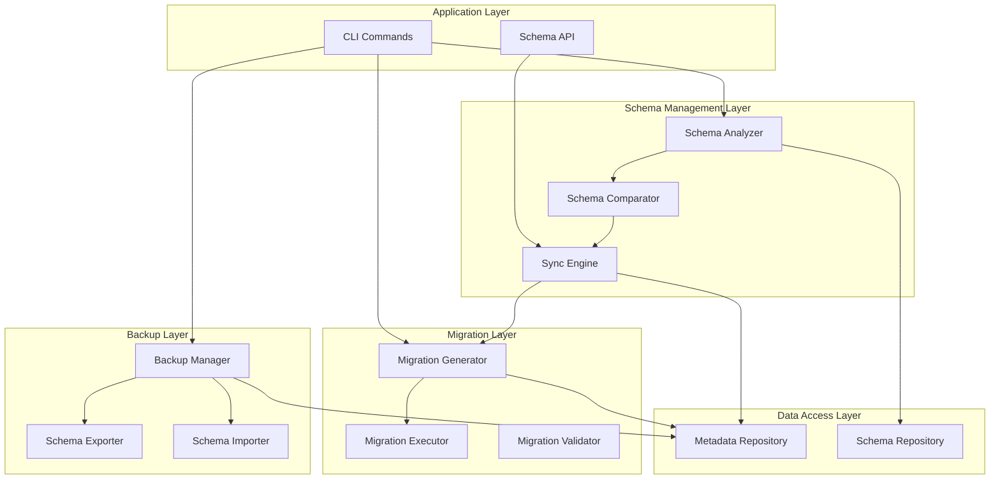
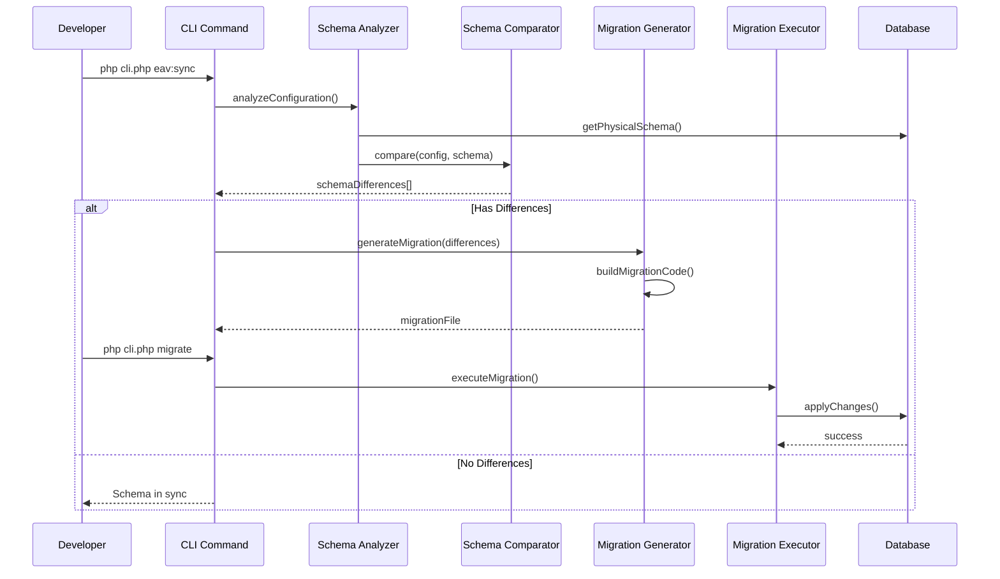
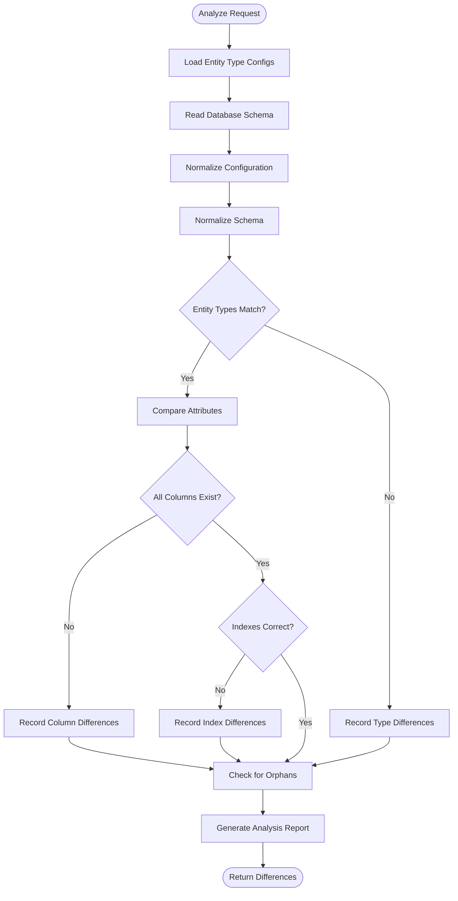
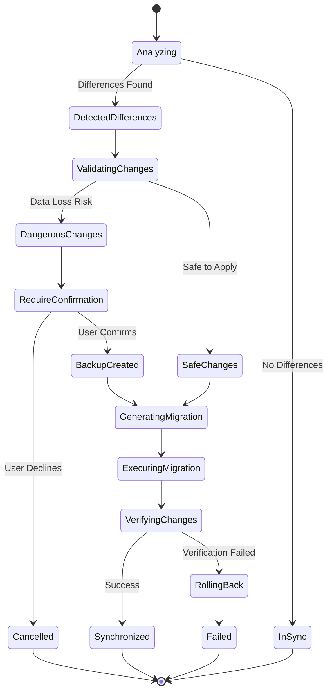
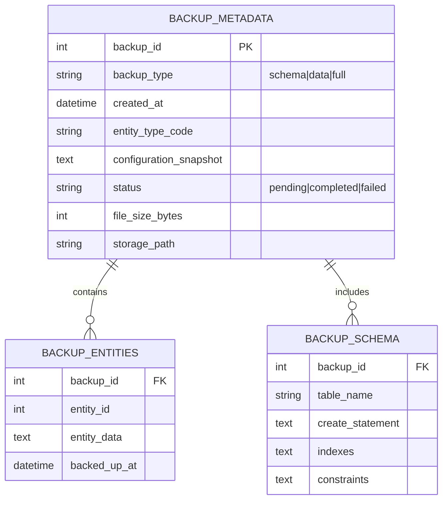
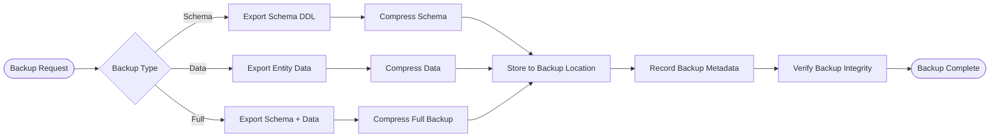

# EAV Phase 5: Schema Management & Synchronization

## Overview

Phase 5 enhances the EAV library with intelligent schema management capabilities, enabling automated synchronization between attribute configurations and database schema, dynamic migration generation, and robust backup/restore functionality. This phase bridges the gap between configuration-driven entity definitions and physical database structures.

### Strategic Goals

- **Automated Schema Synchronization**: Keep database schema in sync with entity type configurations
- **Zero-Downtime Migrations**: Generate safe, reversible migrations for schema changes
- **Data Integrity**: Ensure data preservation during schema evolution
- **Developer Productivity**: Eliminate manual migration writing for EAV changes
- **Operational Safety**: Provide backup/restore capabilities for schema and data

### Value Proposition

Phase 5 transforms EAV from a flexible data modeling system into a self-managing schema platform that:
- Detects configuration drift automatically
- Generates migrations on-demand
- Preserves data during structural changes
- Enables safe rollback of schema changes
- Reduces deployment risks

---

## Technology Stack & Dependencies

### Core Framework Integration
- **Database Layer**: Existing Model system and Migration framework
- **Configuration System**: Entity type configurations from Phase 1-3
- **Event System**: Schema change notifications
- **DI Container**: Service registration and lifecycle management

### PHP Requirements
- PHP 8.0+
- PDO with MySQL support
- JSON extension for metadata storage

### External Dependencies
- None (fully self-contained within framework)

---

## Architecture

### System Layers



### Component Interaction Flow



---

## Core Components

### 1. Schema Analyzer

Introspects current database schema and entity type configurations to identify structural discrepancies.

#### Responsibilities
- Read physical database schema (tables, columns, indexes, constraints)
- Parse entity type configurations (attributes, backend types, validation)
- Build normalized schema representation
- Detect missing tables, columns, or indexes
- Identify orphaned database structures

#### Schema Analysis Process



#### Output Structure

| Field | Type | Description |
|-------|------|-------------|
| entity_type_code | string | Entity type identifier |
| difference_type | enum | missing_table, missing_column, missing_index, type_mismatch, orphaned_column |
| severity | enum | critical, warning, info |
| recommended_action | string | Human-readable action description |
| metadata | object | Contextual data for migration generation |

---

### 2. Schema Comparator

Performs deep comparison between expected and actual schema states.

#### Comparison Dimensions

| Dimension | What is Compared | Impact |
|-----------|-----------------|--------|
| Tables | Entity type tables existence | Critical - blocks all operations |
| Columns | Attribute to column mapping | Critical - data loss risk |
| Data Types | Backend type alignment | High - data integrity risk |
| Nullability | Required attribute vs NULL constraint | Medium - validation impact |
| Indexes | Searchable/filterable flags vs indexes | Low - performance impact |
| Defaults | Default values in config vs DB | Low - consistency impact |

#### Comparison Algorithm

The comparator uses a three-phase approach:

**Phase 1: Structural Comparison**
- Verify all entity type tables exist
- Check attribute columns in value tables
- Validate column data types match backend types

**Phase 2: Constraint Comparison**
- Compare nullability constraints
- Validate unique constraints
- Check foreign key integrity

**Phase 3: Optimization Comparison**
- Verify indexes for searchable attributes
- Check composite indexes for filtering
- Validate index types (BTREE, FULLTEXT)

#### Diff Classification

Differences are classified by action required:

| Action Type | Description | Examples |
|-------------|-------------|----------|
| ADD | New structure needed | New attribute, new entity type, new index |
| MODIFY | Existing structure change | Data type change, nullability change |
| DROP | Structure removal | Removed attribute, dropped entity type |
| RECREATE | Complex change requiring rebuild | Column type incompatibility |

---

### 3. Synchronization Engine

Orchestrates schema updates to align database with configuration.

#### Synchronization Strategies

**Strategy 1: Additive Sync** (Default, Safe)
- Only add new structures
- Never remove existing columns
- Preserve all data
- Suitable for: Production environments

**Strategy 2: Full Sync** (Comprehensive, Risky)
- Add new structures
- Modify existing structures
- Remove orphaned structures
- Suitable for: Development environments with backups

**Strategy 3: Dry Run** (Analysis Only)
- Generate migration code
- Display planned changes
- No database modifications
- Suitable for: Pre-deployment validation

#### Sync Process



#### Safety Mechanisms

| Mechanism | Purpose | When Applied |
|-----------|---------|--------------|
| Pre-sync Validation | Detect destructive operations | Always |
| Automatic Backup | Create restore point | Before risky operations |
| Transaction Wrapping | Enable rollback | All DDL operations |
| Post-sync Verification | Confirm changes applied correctly | Always |
| Conflict Detection | Identify concurrent modifications | Multi-developer environments |

---

### 4. Migration Generator

Automatically generates migration files from schema differences.

#### Migration Template Structure

Generated migrations follow this structure:

```
Migration File: YYYY_MM_DD_HHMMSS_sync_eav_schema_{entity_type_code}.php

Components:
1. Migration metadata (entity type, attributes affected)
2. up() method: Apply changes
3. down() method: Rollback changes
4. Data migration logic (if needed)
5. Validation checks
```

#### Generation Strategies by Change Type

| Change Type | Up Logic | Down Logic | Data Migration |
|-------------|----------|------------|----------------|
| Add Attribute | Add column to value table | Drop column | None |
| Remove Attribute | Drop column | Restore column with defaults | Backup values to archive table |
| Modify Type | Create temp column, migrate data, swap | Reverse swap | Type casting with validation |
| Add Index | CREATE INDEX | DROP INDEX | None |
| Add Entity Type | Create all value tables | Drop all tables | None |

#### Code Generation Templates

The generator uses template-based code generation with placeholders:

| Template | Purpose | Placeholders |
|----------|---------|-------------|
| AddColumnTemplate | New attribute columns | {table}, {column}, {type}, {nullable}, {default} |
| ModifyColumnTemplate | Type/constraint changes | {table}, {column}, {old_type}, {new_type} |
| AddIndexTemplate | Performance indexes | {table}, {columns}, {index_name}, {type} |
| CreateTableTemplate | New entity types | {table}, {columns}, {indexes}, {foreign_keys} |

#### Smart Data Migration

For complex schema changes requiring data transformation:

**Type Change Migration Logic**
- Detect source and target types
- Validate convertibility
- Generate casting expressions
- Add validation checks
- Provide rollback data preservation

**Example: varchar → int Migration**
```
Validation: Check all values are numeric
Migration: CAST(value AS UNSIGNED)
Rollback: Store original values in backup table
```

---

### 5. Migration Validator

Ensures generated migrations are safe and correct before execution.

#### Validation Checks

| Validation Type | Checks Performed | Risk Level |
|-----------------|------------------|------------|
| Syntax Validation | PHP syntax correctness | High |
| Schema Validation | Table/column existence | High |
| Data Compatibility | Type conversion safety | Critical |
| Performance Impact | Large table alterations | Medium |
| Reversibility | down() method completeness | Medium |
| Dependency Order | Foreign key constraints | High |

#### Risk Assessment

Migrations are assigned risk scores:

| Risk Level | Score Range | Auto-approve | Requires Backup |
|------------|-------------|--------------|-----------------|
| Safe | 0-20 | Yes | No |
| Low Risk | 21-40 | Yes | No |
| Medium Risk | 41-70 | No | Yes |
| High Risk | 71-90 | No | Yes + Manual Review |
| Dangerous | 91-100 | No | Yes + Explicit Confirmation |

**Risk Factors:**
- Data loss potential: +30 points
- Large table (>100K rows): +20 points
- Type incompatibility: +40 points
- Foreign key changes: +15 points
- Production environment: +10 points

---

### 6. Backup Manager

Manages schema and data backups for safe rollback capabilities.

#### Backup Types

**Type 1: Schema-Only Backup**
- Entity type definitions
- Attribute configurations
- Index structures
- Foreign key relationships
- Storage size: ~10KB per entity type
- Restore time: <1 second

**Type 2: Schema + Data Backup**
- Full schema backup
- All entity values across value tables
- Metadata and cache tables
- Storage size: Variable (depends on data volume)
- Restore time: Proportional to data size

**Type 3: Incremental Backup**
- Changes since last backup
- Delta of attribute values
- Modified entity records only
- Storage size: Minimal
- Restore time: Fast

#### Backup Storage Structure



#### Backup Process



#### Restore Strategies

| Strategy | Use Case | Data Loss Risk | Downtime |
|----------|----------|----------------|----------|
| Schema Rollback | Undo attribute changes | None | Seconds |
| Point-in-Time | Restore to specific backup | Data after backup lost | Minutes |
| Selective Restore | Restore specific entity types | Minimal | Seconds |
| Full Restore | Disaster recovery | All data after backup | Minutes to hours |

---

## Data Models

### Schema Metadata Storage

| Table | Purpose | Key Columns |
|-------|---------|-------------|
| eav_schema_versions | Track applied schema changes | version, applied_at, entity_type_code |
| eav_schema_migrations | Migration execution history | migration_name, status, executed_at |
| eav_schema_backups | Backup registry | backup_id, backup_type, storage_path |
| eav_schema_conflicts | Track concurrent modification conflicts | entity_type_code, detected_at, resolved |

### Configuration Snapshot Model

Captures point-in-time entity type configuration:

| Field | Type | Purpose |
|-------|------|---------|
| snapshot_id | UUID | Unique identifier |
| entity_type_code | string | Entity type reference |
| configuration_json | JSON | Full attribute definitions |
| schema_hash | string | MD5 hash for change detection |
| created_at | datetime | Snapshot timestamp |
| creator | string | User/process that created snapshot |

---

## API Reference

### SchemaAnalyzer

#### analyze(string $entityTypeCode): SchemaAnalysisReport
Analyzes schema for specific entity type.

**Parameters:**
- entityTypeCode: Entity type to analyze

**Returns:**
- SchemaAnalysisReport with differences array

#### analyzeAll(): array
Analyzes all registered entity types.

**Returns:**
- Array of SchemaAnalysisReport objects

#### detectOrphans(): array
Identifies database structures without configuration.

**Returns:**
- Array of orphaned table/column definitions

---

### SchemaComparator

#### compare(EntityTypeConfig $expected, DatabaseSchema $actual): DifferenceSet
Compares expected vs actual schema.

**Parameters:**
- expected: Configuration-driven schema definition
- actual: Current database schema

**Returns:**
- DifferenceSet with classified changes

#### calculateRiskScore(DifferenceSet $differences): int
Assesses risk level of applying changes.

**Parameters:**
- differences: Set of schema differences

**Returns:**
- Risk score (0-100)

---

### SynchronizationEngine

#### sync(string $entityTypeCode, SyncOptions $options): SyncResult
Synchronizes schema for entity type.

**Parameters:**
- entityTypeCode: Entity type to synchronize
- options: Sync strategy, dry run flag, auto-backup flag

**Returns:**
- SyncResult with applied changes and status

#### syncAll(SyncOptions $options): array
Synchronizes all entity types.

**Returns:**
- Array of SyncResult objects

---

### MigrationGenerator

#### generate(DifferenceSet $differences, GeneratorOptions $options): Migration
Generates migration from differences.

**Parameters:**
- differences: Schema differences to migrate
- options: Template preferences, naming conventions

**Returns:**
- Migration object with up/down methods

#### preview(DifferenceSet $differences): string
Previews generated migration code without creating file.

**Returns:**
- Generated migration code as string

---

### BackupManager

#### createBackup(string $entityTypeCode, BackupType $type): Backup
Creates backup for entity type.

**Parameters:**
- entityTypeCode: Entity type to backup
- type: SCHEMA_ONLY, DATA_ONLY, or FULL

**Returns:**
- Backup object with metadata

#### restore(int $backupId, RestoreOptions $options): RestoreResult
Restores from backup.

**Parameters:**
- backupId: Backup to restore
- options: Target entity type, selective restore flags

**Returns:**
- RestoreResult with restoration status

#### listBackups(string $entityTypeCode): array
Lists available backups.

**Returns:**
- Array of Backup objects

---

## CLI Commands

### eav:schema:analyze

Analyzes schema differences between configuration and database.

**Usage:**
```
php cli.php eav:schema:analyze [entity-type]
```

**Options:**
- --all: Analyze all entity types
- --verbose: Show detailed differences
- --json: Output as JSON

**Output:**
- Table of differences with severity levels
- Recommended actions
- Risk assessment

---

### eav:schema:sync

Synchronizes database schema with configuration.

**Usage:**
```
php cli.php eav:schema:sync [entity-type]
```

**Options:**
- --dry-run: Preview changes without applying
- --strategy=[additive|full]: Sync strategy
- --no-backup: Skip automatic backup
- --force: Skip confirmation prompts

**Output:**
- Sync progress
- Applied changes
- Verification results

---

### eav:migration:generate

Generates migration file from schema differences.

**Usage:**
```
php cli.php eav:migration:generate [entity-type]
```

**Options:**
- --name=[custom-name]: Custom migration name
- --preview: Display code without creating file

**Output:**
- Generated migration file path
- Migration summary

---

### eav:backup:create

Creates schema/data backup.

**Usage:**
```
php cli.php eav:backup:create [entity-type]
```

**Options:**
- --type=[schema|data|full]: Backup type
- --compress: Compress backup file

**Output:**
- Backup ID
- Storage location
- File size

---

### eav:backup:restore

Restores from backup.

**Usage:**
```
php cli.php eav:backup:restore [backup-id]
```

**Options:**
- --verify-only: Validate backup without restoring
- --target=[entity-type]: Selective restore

**Output:**
- Restore progress
- Verification status

---

## Configuration

### Schema Management Settings

| Setting | Default | Description |
|---------|---------|-------------|
| schema.auto_sync | false | Automatically sync on config changes |
| schema.backup_before_sync | true | Create backup before risky operations |
| schema.default_strategy | additive | Default synchronization strategy |
| schema.max_backup_retention | 30 days | Backup retention period |
| schema.backup_storage_path | storage/eav/backups | Backup file location |
| schema.allow_destructive_migrations | false | Permit data-loss migrations |
| schema.migration_path | migrations/ | Generated migration storage |

---

## Testing Strategy

### Unit Testing

**Components to Test:**
- SchemaAnalyzer: Configuration parsing, schema introspection
- SchemaComparator: Difference detection, risk scoring
- MigrationGenerator: Code generation, template rendering
- BackupManager: Backup creation, restoration logic

**Test Coverage Targets:**
- Core logic: 90%+
- Error handling: 85%+
- Edge cases: 80%+

### Integration Testing

**Test Scenarios:**
1. End-to-end schema synchronization
2. Migration generation and execution
3. Backup and restore workflows
4. Concurrent modification handling
5. Large dataset operations

### Acceptance Testing

**Criteria:**
- Schema sync completes without errors
- Generated migrations execute successfully
- Backups can be restored accurately
- No data loss during migrations
- Performance within acceptable thresholds

---

## Performance Optimization

### Analysis Performance

| Optimization | Technique | Impact |
|--------------|-----------|--------|
| Schema Caching | Cache database schema for 5 minutes | 10x faster repeated analysis |
| Incremental Analysis | Only analyze changed entity types | 5x faster in large systems |
| Parallel Processing | Analyze multiple entity types concurrently | 3x faster for analyzeAll() |

### Migration Execution Performance

| Operation | Optimization | Expected Performance |
|-----------|--------------|---------------------|
| Add Column | Use ALTER TABLE ADD | <1 second per table |
| Add Index | Use CREATE INDEX CONCURRENTLY (if supported) | Non-blocking |
| Type Change | Use temporary column strategy | Minimizes lock time |
| Large Table Migration | Batch processing with progress tracking | Predictable duration |

### Backup Performance

| Backup Type | Size (10K entities) | Creation Time | Restore Time |
|-------------|---------------------|---------------|--------------|
| Schema Only | ~50 KB | <1 second | <1 second |
| Data Only | ~5 MB | ~5 seconds | ~10 seconds |
| Full Backup | ~5 MB | ~6 seconds | ~11 seconds |
| Compressed | ~1 MB | ~8 seconds | ~12 seconds |

---

## Best Practices

### Schema Change Workflow

1. **Modify Configuration**
   - Update entity type configuration files
   - Test changes in development environment

2. **Analyze Differences**
   - Run `eav:schema:analyze` to preview impact
   - Review risk assessment

3. **Generate Migration**
   - Use `eav:migration:generate` to create migration
   - Review generated code for correctness

4. **Test Migration**
   - Apply migration in staging environment
   - Verify data integrity
   - Test rollback capability

5. **Deploy to Production**
   - Create backup before deployment
   - Apply migration during maintenance window
   - Verify synchronization

### Backup Strategy

- **Daily Backups**: Schema-only backups for all entity types
- **Pre-deployment Backups**: Full backup before migrations
- **Weekly Backups**: Full data backups for disaster recovery
- **Retention Policy**: 7 daily + 4 weekly + 3 monthly backups

### Risk Mitigation

- Always use `--dry-run` first
- Never disable automatic backups in production
- Test migrations in staging before production
- Schedule risky migrations during low-traffic periods
- Have rollback plan ready before starting

---

## Troubleshooting

### Common Issues

| Issue | Symptom | Solution |
|-------|---------|----------|
| Schema Drift | Analyze shows many differences | Review recent config changes, sync incrementally |
| Migration Failure | Migration execution errors | Check database permissions, review generated SQL |
| Backup Corruption | Restore fails validation | Use previous backup, check storage integrity |
| Performance Degradation | Slow analysis/sync | Clear schema cache, check database load |
| Orphaned Structures | Unexpected tables/columns | Review manual schema changes, clean or document |

### Diagnostic Commands

```
# Check schema health
php cli.php eav:schema:analyze --all --verbose

# Verify backup integrity
php cli.php eav:backup:restore [backup-id] --verify-only

# Clear schema cache
php cli.php eav:cache:clear --schema

# View migration history
php cli.php eav:migration:status
```
