# Enhanced Form Generation System Design

## Overview

This design document outlines a comprehensive replacement for the current form generation system, addressing architectural limitations and introducing modern form handling capabilities. The new system emphasizes component composition, type safety, validation pipeline integration, and extensible field architecture while maintaining developer ergonomics.

**Key Design Principles:**
- Component-based architecture with field factories
- Declarative form definition with fluent interface
- Built-in validation pipeline integration
- Enhanced security features including CSRF and XSS protection
- Template-agnostic rendering system
- Event-driven form lifecycle management

## Technology Stack & Dependencies

| Component | Technology | Purpose |
|-----------|------------|---------|
| Core Framework | PHP 8.1+ | Modern PHP features and type declarations |
| Template Engine | .phtml files | Consistent with existing view system |
| Validation | Integrated pipeline | Centralized validation logic |
| Security | CSRF tokens, input sanitization | Protection against common attacks |
| Event System | Core Events | Form lifecycle management |
| Dependency Injection | Core DI Container | Service resolution and configuration |

## Architecture

### Component Hierarchy

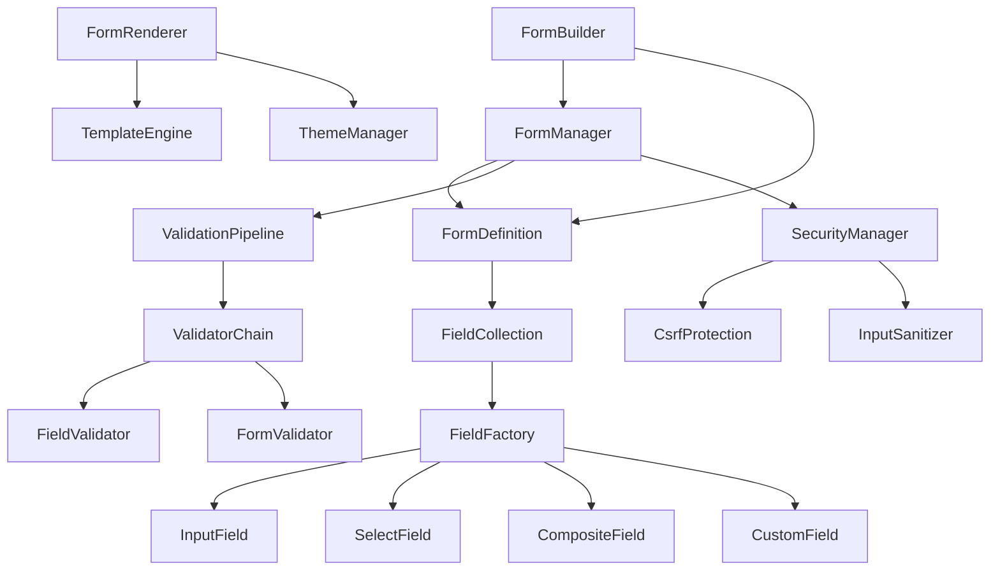

### Core Components Architecture

| Component | Responsibility | Key Features |
|-----------|---------------|--------------|
| FormManager | Orchestrates form lifecycle | Creation, validation, submission handling |
| FormDefinition | Declarative form structure | Field definitions, constraints, metadata |
| FieldFactory | Creates field instances | Type-specific field creation with validation |
| ValidationPipeline | Processes validation rules | Chained validators, error aggregation |
| SecurityManager | Handles security concerns | CSRF protection, input sanitization |
| FormRenderer | Generates HTML output | Theme support, template customization |
| FormBuilder | Provides fluent interface | Developer-friendly form construction |

### Field Type System

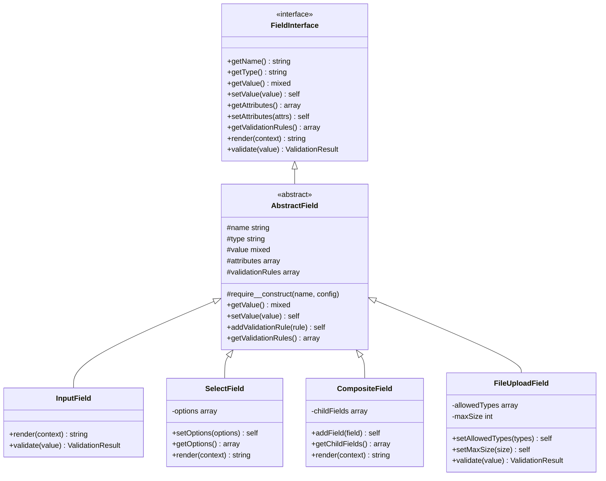

## Form Definition & Configuration

### Declarative Form Structure

The new system uses a declarative approach for form definition through configuration arrays or dedicated form classes:

| Configuration Element | Purpose | Example Values |
|----------------------|---------|----------------|
| fields | Field definitions | Text, email, select, composite |
| validation | Validation rules | Required, email, custom validators |
| security | Security settings | CSRF enabled, sanitization rules |
| rendering | Display configuration | Template, theme, layout options |
| behavior | Form behavior | Submit handling, AJAX support |

### Field Configuration Schema

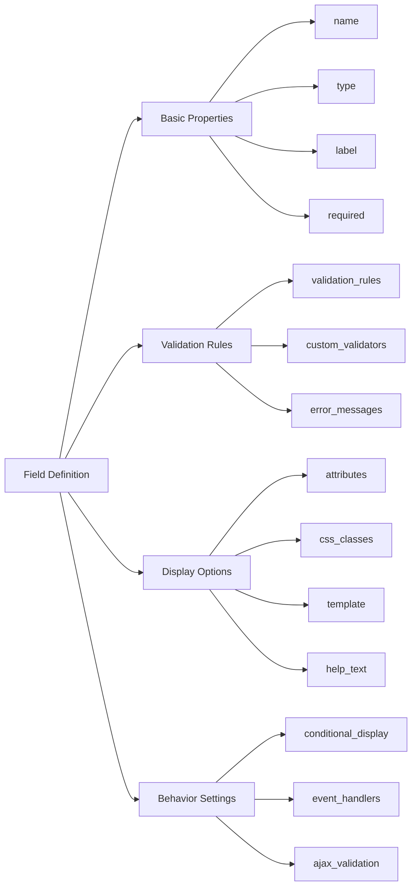

## Validation Pipeline Integration

### Validation Architecture

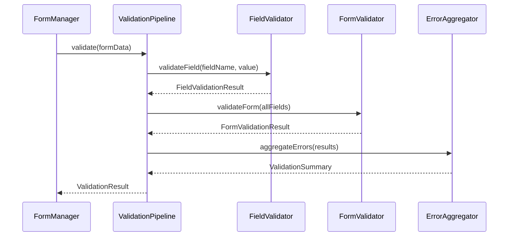

### Validation Rules System

| Rule Type | Purpose | Configuration |
|-----------|---------|---------------|
| Field Rules | Individual field validation | Required, format, length, range |
| Cross-Field Rules | Multi-field validation | Field comparisons, conditional rules |
| Custom Rules | Business logic validation | Custom validator functions |
| Async Rules | External validation | Database uniqueness, API calls |

## Security Framework

### Security Measures

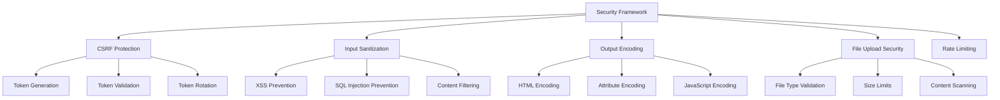

### Security Configuration

| Security Feature | Implementation | Configuration Options |
|------------------|----------------|----------------------|
| CSRF Protection | Token-based validation | Auto-rotation, custom field names |
| Input Sanitization | Multi-layer filtering | Whitelist/blacklist, custom filters |
| File Upload Security | Type and content validation | Allowed types, size limits, scanning |
| Rate Limiting | Request throttling | Per-form, per-user limits |

## Form Rendering System

### Template Architecture

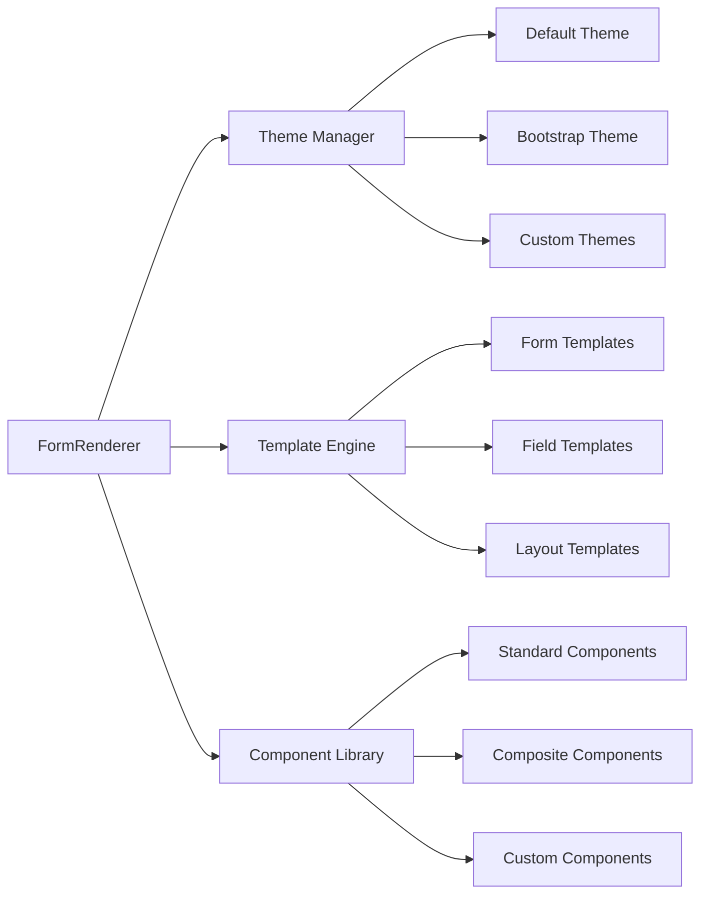

### Rendering Pipeline

| Stage | Purpose | Output |
|-------|---------|--------|
| Structure Generation | Create form DOM structure | Hierarchical form elements |
| Theme Application | Apply visual styling | CSS classes, inline styles |
| Template Processing | Process template variables | Rendered HTML fragments |
| Assembly | Combine all components | Final HTML output |

## Event-Driven Form Lifecycle

### Form Events

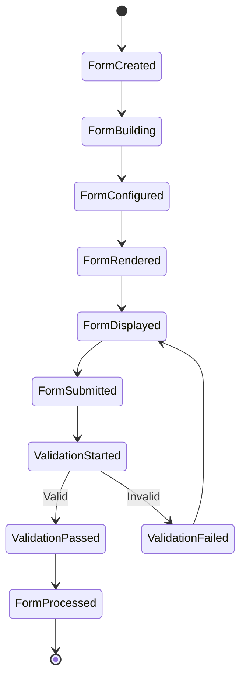

### Event Handlers

| Event | Trigger Point | Use Cases |
|-------|---------------|-----------|
| FormCreated | Form instantiation | Initialize dependencies, set defaults |
| FieldAdded | Field registration | Validate configuration, set up relationships |
| ValidationStarted | Before validation | Pre-processing, logging |
| ValidationCompleted | After validation | Error handling, success callbacks |
| FormSubmitted | Form submission | Data processing, persistence |

## Advanced Field Types

### Composite Field Architecture

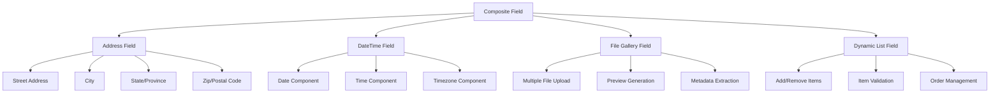

### Field Type Capabilities

| Field Type | Input Handling | Validation | Special Features |
|------------|----------------|------------|------------------|
| Input Fields | Single value | Format, length, pattern | Masking, auto-complete |
| Select Fields | Option selection | Choice validation | Dynamic options, search |
| Composite Fields | Multiple values | Sub-field validation | Custom rendering, grouping |
| File Fields | File upload | Type, size, content | Preview, progress, batch |
| Dynamic Fields | Variable structure | Dynamic rules | Add/remove, reordering |

## Integration Points

### Controller Integration

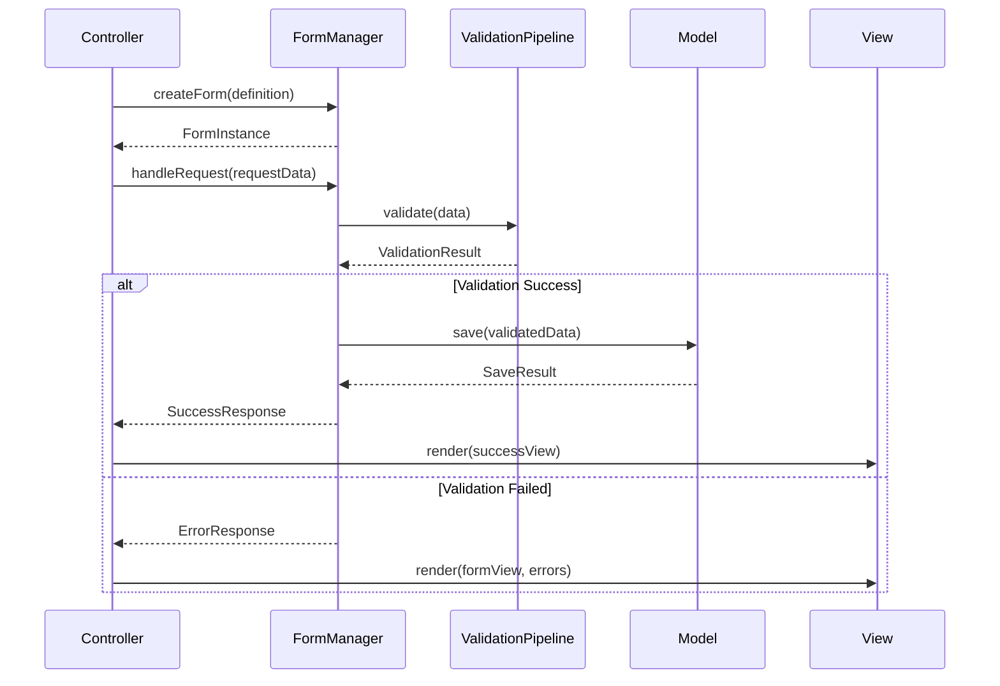

### Database Integration

| Integration Aspect | Implementation | Benefits |
|-------------------|----------------|----------|
| Model Binding | Automatic field mapping | Reduced boilerplate code |
| Validation Rules | Database constraints sync | Consistent validation |
| Dynamic Options | Query-based select options | Real-time data |
| Change Tracking | Field-level change detection | Optimized updates |

## Performance Considerations

### Optimization Strategies

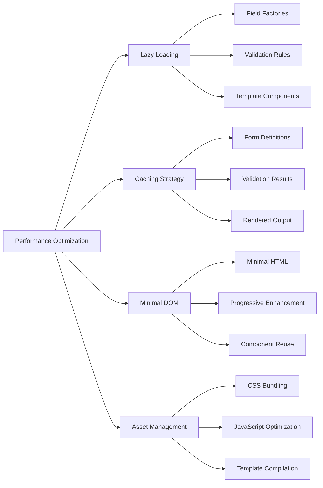

### Performance Metrics

| Metric | Target | Optimization Approach |
|--------|--------|----------------------|
| Form Creation Time | < 50ms | Factory pattern, lazy initialization |
| Validation Speed | < 100ms | Optimized validators, early exit |
| Rendering Time | < 200ms | Template caching, minimal DOM |
| Memory Usage | < 10MB | Object pooling, weak references |

## Migration Strategy

### Migration Phases

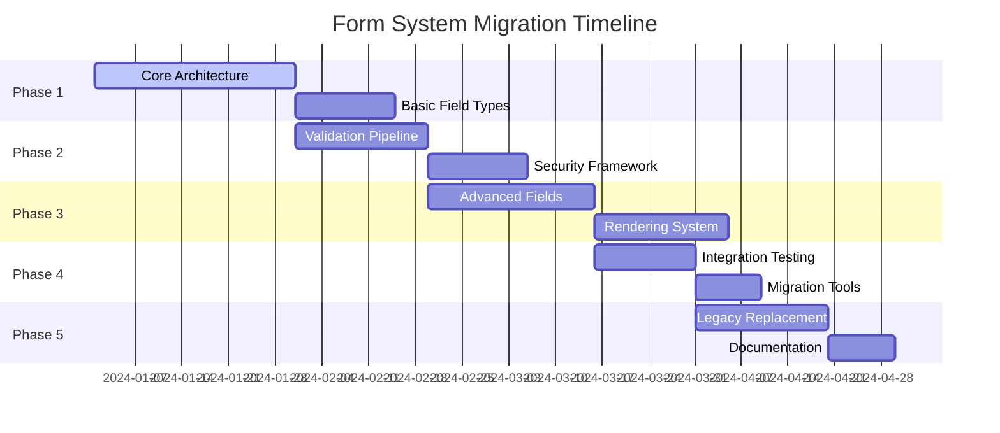

### Backward Compatibility

| Compatibility Layer | Purpose | Implementation |
|--------------------|---------|----------------|
| Legacy Form Adapter | Support existing forms | Wrapper around new system |
| Migration Helper | Automated conversion | Code analysis and transformation |
| Deprecation Warnings | Gradual transition | Runtime notifications |
| Documentation Bridge | Developer guidance | Migration examples and patterns |

## Testing Strategy

### Testing Architecture

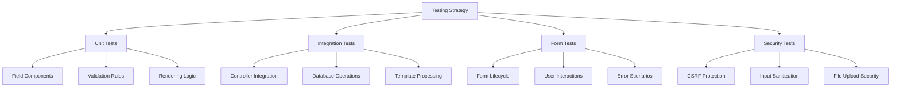

### Test Coverage Targets

| Component | Coverage Target | Test Types |
|-----------|----------------|------------|
| Core Classes | 95% | Unit, integration |
| Field Types | 90% | Unit, rendering |
| Validation | 98% | Unit, edge cases |
| Security | 100% | Security, penetration |
| Integration | 85% | End-to-end, workflow |