# SVG Calendar Library Design

## Overview

The SVG Calendar Library is an enterprise-grade, high-performance visualization library that generates responsive calendar views using SVG rendering. Located in `app/Core/Calendar`, it provides comprehensive date-based visualization capabilities for rendering day, week, multi-week, month, year, and custom period views with interactive features including date selection, range selection, and customizable task/event bar overlays.

### Core Value Proposition

- **Performance-Oriented**: SVG-based rendering ensures crisp visuals at any screen resolution with minimal DOM manipulation
- **Flexibility**: Support for multiple view types with extensible architecture for custom views
- **Simplicity**: Fluent API design pattern enabling intuitive configuration and usage
- **Enterprise-Ready**: Modular design following SOLID principles with comprehensive error handling
- **Framework Integration**: Native integration with the project's Dependency Injection container and service provider pattern

### Design Principles

1. **Declarative Configuration**: Calendar instances configured through fluent builder pattern
2. **Separation of Concerns**: Distinct responsibilities for rendering, event handling, data management, and styling
3. **Extensibility**: Plugin-based architecture for custom renderers and behaviors
4. **Immutability**: Calendar configuration objects are immutable once built
5. **Type Safety**: Strong typing throughout the library with comprehensive validation

## Technology Stack & Dependencies

| Component | Technology | Purpose |
|-----------|-----------|---------|
| Rendering Engine | SVG (Scalable Vector Graphics) | Primary visual output format |
| Fallback Option | HTML Canvas API | Optional fallback for complex visualizations |
| Client-Side Events | JavaScript Event Delegation | Interactive features (clicks, range selection) |
| Server-Side Logic | PHP 8.1+ | Calendar generation, data processing |
| Dependency Injection | Core\Di\Container | Service registration and resolution |
| Date/Time Handling | PHP DateTimeImmutable | Date calculations and manipulations |
| Output Format | SVG XML string | Delivered as HTML-embeddable markup |

## Architecture

### Component Hierarchy


### Directory Structure

```
app/Core/Calendar/
├── CalendarFactory.php           # Entry point for calendar creation
├── CalendarBuilder.php            # Fluent builder for configuration
├── Calendar.php                   # Immutable calendar instance
├── CalendarConfig.php             # Configuration value object
├── Renderers/
│   ├── ViewRendererInterface.php
│   ├── AbstractViewRenderer.php
│   ├── DayViewRenderer.php
│   ├── WeekViewRenderer.php
│   ├── MultiWeekRenderer.php
│   ├── MonthViewRenderer.php
│   ├── YearViewRenderer.php
│   └── CustomViewRenderer.php
├── DataProviders/
│   ├── DataProviderInterface.php
│   ├── ArrayDataProvider.php
│   ├── DatabaseDataProvider.php
│   └── CallbackDataProvider.php
├── Models/
│   ├── DateRange.php
│   ├── CalendarData.php
│   ├── Bar.php
│   ├── Dimensions.php
│   └── Week.php
├── Styling/
│   ├── StyleManager.php
│   ├── Theme.php
│   ├── ThemeInterface.php
│   ├── Themes/
│   │   ├── DefaultTheme.php
│   │   ├── DarkTheme.php
│   │   └── MinimalTheme.php
│   └── ColorScheme.php
├── Events/
│   ├── EventHandler.php
│   ├── InteractionConfig.php
│   └── ScriptGenerator.php
├── Svg/
│   ├── SvgDocument.php
│   ├── SvgElement.php
│   └── SvgBuilder.php
├── Utilities/
│   ├── DateCalculator.php
│   ├── PositionCalculator.php
│   └── DimensionCalculator.php
├── Exceptions/
│   ├── CalendarException.php
│   ├── InvalidConfigException.php
│   └── RenderException.php
└── CalendarServiceProvider.php
```

### Core Components

#### 1. CalendarFactory

Entry point for creating calendar instances with static convenience methods.

**Responsibilities:**
- Provide static factory methods for quick calendar creation
- Initialize CalendarBuilder with sensible defaults
- Register default renderers and data providers
- Validate configuration before instantiation

**Key Methods:**

| Method | Parameters | Returns | Purpose |
|--------|-----------|---------|---------|
| create() | string $name, array $config | CalendarBuilder | Create new builder instance |
| day() | DateTimeInterface $date, array $config | CalendarBuilder | Quick day view creation |
| week() | DateTimeInterface $date, array $config | CalendarBuilder | Quick week view creation |
| month() | DateTimeInterface $date, array $config | CalendarBuilder | Quick month view creation |
| year() | int $year, array $config | CalendarBuilder | Quick year view creation |
| custom() | DateTimeInterface $start, DateTimeInterface $end | CalendarBuilder | Custom period view |

#### 2. CalendarBuilder

Fluent interface for configuring calendar instances before rendering.

**Configuration Properties:**

| Property | Type | Default | Description |
|----------|------|---------|-------------|
| name | string | required | Unique identifier for calendar instance |
| viewType | string | 'month' | View type: day, week, multi-week, month, year, custom |
| startDate | DateTimeInterface | today | Starting date for the view |
| endDate | DateTimeInterface | calculated | Ending date (auto-calculated for standard views) |
| locale | string | 'en_US' | Locale for date formatting |
| firstDayOfWeek | int | 0 | First day of week (0=Sunday, 1=Monday) |
| weekNumbers | bool | false | Show week numbers in applicable views |
| selectable | bool | true | Enable date selection |
| rangeSelection | bool | false | Enable date range selection |
| clickable | bool | true | Enable click events on dates |
| renderFormat | string | 'svg' | Output format: svg or canvas |

**Fluent Methods:**

| Method | Parameters | Returns | Description |
|--------|-----------|---------|-------------|
| setView() | string $type | self | Set view type |
| setDateRange() | DateTimeInterface $start, DateTimeInterface $end | self | Define custom date range |
| withLocale() | string $locale | self | Set locale |
| enableWeekNumbers() | bool $enable | self | Toggle week number display |
| enableSelection() | bool $enable | self | Toggle date selection |
| enableRangeSelection() | bool $enable | self | Toggle range selection |
| withTheme() | ThemeInterface $theme | self | Apply theme |
| withDataProvider() | DataProviderInterface $provider | self | Set data provider |
| addBar() | Bar $bar | self | Add task/event bar overlay |
| onDateClick() | string $handler | self | Set date click handler |
| onRangeSelect() | string $handler | self | Set range selection handler |
| build() | - | Calendar | Build immutable Calendar instance |

#### 3. Calendar

Immutable calendar instance representing a configured calendar ready for rendering.

**Responsibilities:**
- Store immutable configuration
- Coordinate rendering process
- Manage bar/event overlays
- Generate SVG output
- Provide client-side event binding metadata

**Key Methods:**

| Method | Parameters | Returns | Description |
|--------|-----------|---------|-------------|
| render() | - | string | Generate SVG output |
| toSvg() | - | string | Force SVG output |
| getConfig() | - | CalendarConfig | Get configuration object |
| getBars() | - | Bar[] | Get all bar overlays |
| getDateRange() | - | DateRange | Get active date range |
| getClientScript() | - | string | Generate JavaScript for interactivity |
| getName() | - | string | Get calendar unique name |

#### 4. ViewRenderer (Abstract)

Abstract base class defining rendering contract for all view types.

**Rendering Strategy:**


**Abstract Methods:**

| Method | Returns | Purpose |
|--------|---------|---------|
| render() | string | Generate complete SVG output |
| calculateDimensions() | Dimensions | Calculate view-specific dimensions |
| renderHeader() | string | Render header section |
| renderBody() | string | Render main calendar grid |
| renderBars() | string | Render bar overlays |

**Specialized Renderers:**

| Renderer | Output Elements | Grid Structure | Special Features |
|----------|----------------|----------------|------------------|
| DayViewRenderer | Hour grid, time slots, single day | 1 column × 24 hours | Hourly increments, time axis |
| WeekViewRenderer | 7 day columns, time slots | 7 columns × 24 hours | Daily columns, weekend highlighting |
| MultiWeekRenderer | Multiple week rows, week numbers | 7 columns × N weeks | Week number column, clickable weeks |
| MonthViewRenderer | Week rows, day cells | 7 columns × 4-6 weeks | Adjacent month dates, week numbers |
| YearViewRenderer | 12 mini-month grids | 3×4 or 4×3 grid | Clickable months, compact layout |

#### 5. DataProvider Interface

Contract for providing calendar data (events, tasks, bars).

**Interface Definition:**

| Method | Parameters | Returns | Description |
|--------|-----------|---------|-------------|
| getDataForRange() | DateRange $range | CalendarData | Fetch data for date range |
| getBarsForRange() | DateRange $range | Bar[] | Get bars for date range |
| hasDataForDate() | DateTimeInterface $date | bool | Check if date has data |

**Built-in Implementations:**

- **ArrayDataProvider**: Simple in-memory array-based provider for static data
- **DatabaseDataProvider**: Fetch data from database models with caching
- **CallbackDataProvider**: Custom callback function for dynamic data

#### 6. Bar

Represents a task, event, or visual bar overlay on the calendar.

**Properties:**

| Property | Type | Required | Description |
|----------|------|----------|-------------|
| id | string | yes | Unique identifier |
| title | string | yes | Display text |
| startDate | DateTimeInterface | yes | Start date/time |
| endDate | DateTimeInterface | yes | End date/time |
| color | string | no | Hex color code |
| backgroundColor | string | no | Background color |
| url | string | no | Click target URL |
| clickHandler | string | no | JavaScript function name |
| metadata | array | no | Additional custom data |
| zIndex | int | no | Stacking order (default: auto) |

**Bar Positioning Logic:**


#### 7. Theme & StyleManager

Manages visual appearance and styling throughout the calendar.

**Theme Properties:**

| Property | Type | Default | Description |
|----------|------|---------|-------------|
| primaryColor | string | '#007bff' | Primary brand color |
| backgroundColor | string | '#ffffff' | Calendar background |
| borderColor | string | '#dddddd' | Grid border color |
| textColor | string | '#333333' | Default text color |
| headerBackground | string | '#f8f9fa' | Header background |
| todayColor | string | '#e3f2fd' | Today highlight color |
| selectedColor | string | '#bbdefb' | Selected date color |
| weekendColor | string | '#f5f5f5' | Weekend background |
| fontSize | int | 14 | Base font size (px) |
| fontFamily | string | 'system-ui, sans-serif' | Font stack |

**Predefined Themes:**

- **DefaultTheme**: Clean, professional blue-based design
- **DarkTheme**: Dark mode with high contrast
- **MinimalTheme**: Minimal borders and subtle colors
- **ColorfulTheme**: Vibrant colors for visual emphasis

#### 8. EventHandler

Generates client-side JavaScript for interactive features.

**Interaction Types:**

| Interaction | Trigger | JavaScript Event | Server Action |
|-------------|---------|-----------------|---------------|
| Date Click | Click on date cell | calendar_{name}.onDateClick(date) | Optional URL navigation |
| Range Selection | Click start + click end | calendar_{name}.onRangeSelect(start, end) | Populate form fields |
| Bar Click | Click on bar element | calendar_{name}.onBarClick(barId, data) | Modal or navigation |
| Week Click | Click on week number | calendar_{name}.onWeekClick(weekNum, year) | Switch to week view |
| Navigation | Click prev/next | calendar_{name}.navigate(direction) | AJAX or page reload |

**Event Binding Pattern:**


## View Type Specifications

### Day View

**Purpose**: Display a single day with hourly time slots for detailed scheduling.

**Layout Structure:**
- Header: Day name, full date
- Time axis: Hourly labels on left side
- Body: Single column with time slot rows
- Bars: Positioned vertically based on start/end times

**Configuration Options:**

| Option | Type | Default | Description |
|--------|------|---------|-------------|
| startHour | int | 0 | First hour to display (0-23) |
| endHour | int | 24 | Last hour to display (1-24) |
| hourHeight | int | 60 | Height per hour in pixels |
| showMinutes | bool | false | Show minute subdivisions |
| minuteInterval | int | 30 | Minute subdivision interval |
| timeFormat | string | '24h' | Time format: 24h or 12h |

**Dimensions:**
- Width: Responsive (100% container width) or fixed
- Height: (endHour - startHour) × hourHeight + headerHeight + margins

### Week View

**Purpose**: Display 7 consecutive days with time slots for weekly planning.

**Layout Structure:**
- Header: 7 day columns with day names and dates
- Time axis: Hourly labels on left side
- Body: 7 columns with synchronized time slots
- Bars: Span across day columns based on start/end dates

**Configuration Options:**

| Option | Type | Default | Description |
|--------|------|---------|-------------|
| startHour | int | 6 | First hour to display |
| endHour | int | 22 | Last hour to display |
| hourHeight | int | 40 | Height per hour in pixels |
| highlightWeekend | bool | true | Different background for Sat/Sun |
| highlightToday | bool | true | Highlight current day column |

**Dimensions:**
- Width: 100% divided into 7 equal columns + time axis
- Height: (endHour - startHour) × hourHeight + headerHeight

### Multi-Week Linear View

**Purpose**: Display 3+ weeks in linear format with week numbers for planning sprints or periods.

**Layout Structure:**
- Header: Day name labels across 7 columns
- Week number column: Clickable week numbers on left
- Body: Multiple week rows, each containing 7 day cells
- Bars: Positioned across day cells with multi-row spanning

**Configuration Options:**

| Option | Type | Default | Description |
|--------|------|---------|-------------|
| weekCount | int | 3 | Number of weeks to display |
| weekNumberClick | bool | true | Enable week number clicking |
| showWeekends | bool | true | Include Sat/Sun columns |
| condensed | bool | false | Compact vertical spacing |
| cellHeight | int | 80 | Minimum height per day cell |

**Dimensions:**
- Width: 100% (7 columns + week number column)
- Height: weekCount × cellHeight + headerHeight

### Month View

**Purpose**: Display entire month in traditional calendar grid layout.

**Layout Structure:**
- Header: Month name and year
- Day headers: Day name abbreviations (S M T W T F S)
- Week number column: Optional left column
- Body: 4-6 week rows containing day cells
- Adjacent dates: Grayed-out dates from previous/next month

**Configuration Options:**

| Option | Type | Default | Description |
|--------|------|---------|-------------|
| showAdjacentMonths | bool | true | Show dates from adjacent months |
| weekNumbers | bool | false | Show week numbers in left column |
| fixedWeekCount | bool | false | Always show 6 week rows |
| minCellHeight | int | 80 | Minimum height per day cell |
| highlightToday | bool | true | Highlight current date |

**Dimensions:**
- Width: 100% (7 columns + optional week number column)
- Height: weekCount × minCellHeight + headerHeight (4-6 weeks)

### Year View

**Purpose**: Display all 12 months in a grid for annual overview.

**Layout Structure:**
- Header: Year label with navigation
- Body: Grid of 12 mini-month calendars (typically 3×4 or 4×3)
- Each mini-month: Condensed month view with minimal details
- Navigation: Click on month to navigate to detailed month view

**Configuration Options:**

| Option | Type | Default | Description |
|--------|------|---------|-------------|
| columns | int | 4 | Number of columns in grid |
| showMiniWeekNumbers | bool | false | Week numbers in mini-months |
| clickableMonths | bool | true | Enable month clicking |
| showMonthBars | bool | false | Show bar count in mini-months |

**Dimensions:**
- Width: 100% (responsive grid)
- Height: Auto-calculated based on grid layout

### Custom Period View

**Purpose**: Display arbitrary date ranges with automatic view selection.

**View Selection Logic:**

| Date Range Length | Auto-Selected View | Rationale |
|------------------|-------------------|-----------|
| 1 day | Day View | Detailed hourly breakdown |
| 2-7 days | Week View | Multi-day with time slots |
| 8-35 days | Multi-Week View | Multiple weeks in grid |
| 36-365 days | Month Grid | Multiple months displayed |
| 365+ days | Year View | Annual overview |

**Configuration Options:**

| Option | Type | Default | Description |
|--------|------|---------|-------------|
| autoDetectView | bool | true | Automatically select view type |
| forceViewType | string | null | Force specific view type |
| adaptiveLayout | bool | true | Adapt layout to date range |

## Bar Rendering & Positioning

### Bar Overlay Strategy

Bars are rendered as SVG `<rect>` elements positioned absolutely within the calendar grid using calculated coordinates.

**Positioning Calculation:**


### Multi-Day Bar Spanning

For bars that span multiple days:

**Month/Multi-Week Views:**
1. Calculate start day cell position
2. Calculate end day cell position
3. If same week row: Single bar across cells
4. If multiple week rows: Split into multiple segments per row
5. Each segment gets consistent styling and linked click events

**Week/Day Views:**
1. Bar starts at first day column
2. Bar width spans across multiple day columns
3. Height determined by time duration within day

### Bar Stacking

When multiple bars overlap on the same date/time:

**Stacking Strategy:**

| Property | Value | Behavior |
|----------|-------|----------|
| zIndex | auto | Stack by start time (earlier on bottom) |
| zIndex | specified | Stack by explicit zIndex value |
| overlap | allow | Bars overlap with transparency |
| overlap | stack | Bars stack vertically with offset |

## Client-Side Interactivity

### Generated JavaScript Structure

The calendar generates self-contained JavaScript for each instance:

**Script Components:**

1. **Namespace Object**: `window.calendar_{name}` containing all instance methods
2. **Event Listeners**: Attached using event delegation on calendar container
3. **Callback Handlers**: Configurable callbacks for user interactions
4. **State Management**: Selected dates, active range, hover states
5. **Utility Methods**: Date formatting, range validation, visual feedback

### Event Handler Configuration

**Date Click Handler:**

When user clicks a date cell, the handler receives:
- Clicked date (ISO format string)
- Day of week
- Is weekend boolean
- Has events boolean
- Calendar instance reference

**Range Selection Handler:**

When user completes range selection, the handler receives:
- Start date (ISO format)
- End date (ISO format)
- Duration in days
- Overlapping bars array
- Calendar instance reference

### Form Integration

The calendar can automatically populate form fields with selected dates:

**Form Field Binding:**

| Calendar Mode | Form Field Type | Value Format |
|--------------|----------------|--------------|
| Single date selection | Hidden or text input | YYYY-MM-DD |
| Range selection | Two inputs (start/end) | YYYY-MM-DD for each |
| Multi-date selection | Hidden field with JSON | JSON array of dates |

## Usage Examples

### Example 1: Basic Month Calendar

**PHP Controller Code:**

```php
use Core\Calendar\CalendarFactory;
use Core\Calendar\Themes\DefaultTheme;

// In your controller action method
public function indexAction()
{
    // Create a simple month calendar for current month
    $calendar = CalendarFactory::month(new DateTime())
        ->withTheme(new DefaultTheme())
        ->enableSelection(true)
        ->build();
    
    // Pass to view
    $this->view->calendarSvg = $calendar->render();
    $this->view->calendarScript = $calendar->getClientScript();
}
```

**View Template (.phtml):**

```php
<div class="container mt-4">
    <h2>Monthly Calendar</h2>
    
    <!-- Render the SVG calendar -->
    <div id="calendar-container">
        <?= $this->calendarSvg ?>
    </div>
    
    <!-- Include client-side interactivity -->
    <script>
        <?= $this->calendarScript ?>
    </script>
</div>
```

**Generated SVG Output (simplified):**

```xml
<svg xmlns="http://www.w3.org/2000/svg" 
     width="800" height="600" 
     viewBox="0 0 800 600"
     class="calendar-svg calendar-month-view">
    
    <!-- Header -->
    <rect x="0" y="0" width="800" height="60" fill="#f8f9fa"/>
    <text x="400" y="35" text-anchor="middle" 
          font-size="24" font-weight="bold" fill="#333">January 2025</text>
    
    <!-- Day headers (Sun-Sat) -->
    <g class="day-headers" transform="translate(0, 60)">
        <rect x="0" y="0" width="800" height="40" fill="#f8f9fa"/>
        <text x="57" y="25" text-anchor="middle" font-size="14" fill="#666">Sun</text>
        <text x="171" y="25" text-anchor="middle" font-size="14" fill="#666">Mon</text>
        <text x="285" y="25" text-anchor="middle" font-size="14" fill="#666">Tue</text>
        <text x="400" y="25" text-anchor="middle" font-size="14" fill="#666">Wed</text>
        <text x="514" y="25" text-anchor="middle" font-size="14" fill="#666">Thu</text>
        <text x="628" y="25" text-anchor="middle" font-size="14" fill="#666">Fri</text>
        <text x="742" y="25" text-anchor="middle" font-size="14" fill="#666">Sat</text>
    </g>
    
    <!-- Calendar grid -->
    <g class="calendar-grid" transform="translate(0, 100)">
        <!-- Week 1 -->
        <g class="week-row" data-week="1">
            <!-- Day cells with borders -->
            <rect x="0" y="0" width="114" height="80" fill="#fff" stroke="#ddd"/>
            <rect x="114" y="0" width="114" height="80" fill="#fff" stroke="#ddd"/>
            <!-- ... more day cells ... -->
            
            <!-- Date numbers -->
            <text x="10" y="20" font-size="16" fill="#333">1</text>
            <text x="124" y="20" font-size="16" fill="#333">2</text>
            <!-- ... more dates ... -->
            
            <!-- Today highlight (example: Jan 15) -->
            <rect x="114" y="0" width="114" height="80" 
                  fill="#e3f2fd" stroke="#007bff" stroke-width="2" 
                  class="today-cell" data-date="2025-01-15"/>
        </g>
        <!-- ... more week rows ... -->
    </g>
    
    <!-- Interactive click areas -->
    <g class="click-areas">
        <rect x="0" y="100" width="114" height="80" 
              fill="transparent" 
              class="date-cell-clickable" 
              data-date="2025-01-01" 
              style="cursor: pointer;"/>
        <!-- ... more click areas ... -->
    </g>
</svg>
```

### Example 2: Week Calendar with Task Bars

**PHP Controller Code:**

```php
use Core\Calendar\CalendarFactory;
use Core\Calendar\Models\Bar;
use Core\Calendar\DataProviders\ArrayDataProvider;

public function weekViewAction()
{
    // Define tasks/events
    $tasks = [
        new Bar([
            'id' => 'task-1',
            'title' => 'Team Meeting',
            'startDate' => new DateTime('2025-01-15 09:00'),
            'endDate' => new DateTime('2025-01-15 10:30'),
            'color' => '#ffffff',
            'backgroundColor' => '#007bff',
            'url' => '/tasks/view/1'
        ]),
        new Bar([
            'id' => 'task-2',
            'title' => 'Project Deadline',
            'startDate' => new DateTime('2025-01-17 14:00'),
            'endDate' => new DateTime('2025-01-17 18:00'),
            'color' => '#ffffff',
            'backgroundColor' => '#dc3545',
            'clickHandler' => 'showTaskDetails'
        ]),
        new Bar([
            'id' => 'task-3',
            'title' => 'Client Call',
            'startDate' => new DateTime('2025-01-16 11:00'),
            'endDate' => new DateTime('2025-01-16 12:00'),
            'color' => '#ffffff',
            'backgroundColor' => '#28a745'
        ])
    ];
    
    // Create data provider
    $dataProvider = new ArrayDataProvider($tasks);
    
    // Build week calendar
    $calendar = CalendarFactory::week(new DateTime('2025-01-15'))
        ->withDataProvider($dataProvider)
        ->enableSelection(false)
        ->onBarClick('handleBarClick')
        ->build();
    
    $this->view->calendarSvg = $calendar->render();
    $this->view->calendarScript = $calendar->getClientScript();
}
```

**Generated SVG with Task Bars:**

```xml
<svg xmlns="http://www.w3.org/2000/svg" 
     width="1000" height="800" 
     viewBox="0 0 1000 800">
    
    <!-- Header with week info -->
    <rect x="0" y="0" width="1000" height="50" fill="#f8f9fa"/>
    <text x="500" y="30" text-anchor="middle" font-size="20" fill="#333">
        Week 3, 2025 (Jan 13 - Jan 19)
    </text>
    
    <!-- Day column headers -->
    <g class="day-headers" transform="translate(60, 50)">
        <rect x="0" y="0" width="134" height="50" fill="#f8f9fa" stroke="#ddd"/>
        <text x="67" y="20" text-anchor="middle" font-size="14" fill="#666">Monday</text>
        <text x="67" y="38" text-anchor="middle" font-size="12" fill="#999">Jan 13</text>
        
        <rect x="134" y="0" width="134" height="50" fill="#f8f9fa" stroke="#ddd"/>
        <text x="201" y="20" text-anchor="middle" font-size="14" fill="#666">Tuesday</text>
        <text x="201" y="38" text-anchor="middle" font-size="12" fill="#999">Jan 14</text>
        
        <!-- Today column highlighted -->
        <rect x="268" y="0" width="134" height="50" fill="#e3f2fd" stroke="#007bff"/>
        <text x="335" y="20" text-anchor="middle" font-size="14" fill="#1976d2">Wednesday</text>
        <text x="335" y="38" text-anchor="middle" font-size="12" fill="#1976d2">Jan 15</text>
        
        <!-- ... Thursday, Friday, Saturday, Sunday ... -->
    </g>
    
    <!-- Time axis (left side) -->
    <g class="time-axis" transform="translate(0, 100)">
        <text x="50" y="30" text-anchor="end" font-size="11" fill="#666">6 AM</text>
        <text x="50" y="70" text-anchor="end" font-size="11" fill="#666">7 AM</text>
        <text x="50" y="110" text-anchor="end" font-size="11" fill="#666">8 AM</text>
        <text x="50" y="150" text-anchor="end" font-size="11" fill="#666">9 AM</text>
        <!-- ... more time labels ... -->
    </g>
    
    <!-- Time grid (horizontal lines) -->
    <g class="time-grid" transform="translate(60, 100)">
        <line x1="0" y1="0" x2="938" y2="0" stroke="#f0f0f0"/>
        <line x1="0" y1="40" x2="938" y2="40" stroke="#f0f0f0"/>
        <line x1="0" y1="80" x2="938" y2="80" stroke="#f0f0f0"/>
        <!-- ... more grid lines ... -->
    </g>
    
    <!-- Day columns (vertical lines) -->
    <g class="day-columns" transform="translate(60, 100)">
        <line x1="134" y1="0" x2="134" y2="640" stroke="#e0e0e0"/>
        <line x1="268" y1="0" x2="268" y2="640" stroke="#e0e0e0"/>
        <!-- ... more column separators ... -->
    </g>
    
    <!-- Task Bars Overlay -->
    <g class="task-bars" transform="translate(60, 100)">
        <!-- Task 1: Team Meeting (Wed 9:00-10:30) -->
        <g class="task-bar" data-bar-id="task-1">
            <rect x="272" y="120" width="126" height="60" 
                  rx="4" ry="4"
                  fill="#007bff" 
                  stroke="#0056b3" stroke-width="1"
                  style="cursor: pointer;"
                  class="bar-clickable"/>
            <text x="278" y="145" font-size="12" fill="#ffffff" font-weight="500">
                Team Meeting
            </text>
            <text x="278" y="162" font-size="10" fill="#e3f2fd">
                9:00 - 10:30
            </text>
        </g>
        
        <!-- Task 2: Project Deadline (Fri 14:00-18:00) -->
        <g class="task-bar" data-bar-id="task-2">
            <rect x="540" y="320" width="126" height="160" 
                  rx="4" ry="4"
                  fill="#dc3545" 
                  stroke="#bd2130" stroke-width="1"
                  style="cursor: pointer;"
                  class="bar-clickable"/>
            <text x="546" y="345" font-size="12" fill="#ffffff" font-weight="500">
                Project Deadline
            </text>
            <text x="546" y="362" font-size="10" fill="#f8d7da">
                2:00 - 6:00 PM
            </text>
        </g>
        
        <!-- Task 3: Client Call (Thu 11:00-12:00) -->
        <g class="task-bar" data-bar-id="task-3">
            <rect x="406" y="200" width="126" height="40" 
                  rx="4" ry="4"
                  fill="#28a745" 
                  stroke="#1e7e34" stroke-width="1"
                  style="cursor: pointer;"
                  class="bar-clickable"/>
            <text x="412" y="225" font-size="12" fill="#ffffff" font-weight="500">
                Client Call
            </text>
        </g>
    </g>
</svg>
```

**Generated JavaScript for Interactivity:**

```javascript
(function() {
    // Namespace for this calendar instance
    window.calendar_week_view = {
        // Configuration
        config: {
            name: 'week_view',
            viewType: 'week',
            selectable: false,
            rangeSelection: false
        },
        
        // State
        state: {
            selectedDate: null,
            hoveredBar: null
        },
        
        // Event handlers
        onBarClick: function(barId, barData) {
            if (typeof handleBarClick === 'function') {
                handleBarClick(barId, barData);
            } else if (barData.url) {
                window.location.href = barData.url;
            }
        },
        
        // Initialize
        init: function() {
            const svg = document.querySelector('.calendar-svg');
            if (!svg) return;
            
            // Attach click handlers to bars
            svg.querySelectorAll('.bar-clickable').forEach(bar => {
                bar.addEventListener('click', (e) => {
                    const barId = e.currentTarget.closest('.task-bar').dataset.barId;
                    const barData = this.getBarData(barId);
                    this.onBarClick(barId, barData);
                });
                
                // Hover effects
                bar.addEventListener('mouseenter', (e) => {
                    e.currentTarget.style.opacity = '0.9';
                    e.currentTarget.style.filter = 'brightness(1.1)';
                });
                
                bar.addEventListener('mouseleave', (e) => {
                    e.currentTarget.style.opacity = '1';
                    e.currentTarget.style.filter = 'none';
                });
            });
        },
        
        // Get bar data by ID
        getBarData: function(barId) {
            const bars = {
                'task-1': {
                    id: 'task-1',
                    title: 'Team Meeting',
                    startDate: '2025-01-15T09:00:00',
                    endDate: '2025-01-15T10:30:00',
                    url: '/tasks/view/1'
                },
                'task-2': {
                    id: 'task-2',
                    title: 'Project Deadline',
                    startDate: '2025-01-17T14:00:00',
                    endDate: '2025-01-17T18:00:00'
                },
                'task-3': {
                    id: 'task-3',
                    title: 'Client Call',
                    startDate: '2025-01-16T11:00:00',
                    endDate: '2025-01-16T12:00:00'
                }
            };
            return bars[barId] || null;
        }
    };
    
    // Auto-initialize on DOM ready
    if (document.readyState === 'loading') {
        document.addEventListener('DOMContentLoaded', () => {
            window.calendar_week_view.init();
        });
    } else {
        window.calendar_week_view.init();
    }
})();
```

### Example 3: Interactive Date Range Picker

**PHP Controller Code:**

```php
use Core\Calendar\CalendarFactory;
use Core\Calendar\Events\InteractionConfig;

public function datePickerAction()
{
    $calendar = CalendarFactory::month(new DateTime())
        ->enableRangeSelection(true)
        ->onRangeSelect('updateDateRangeFields')
        ->withTheme(new MinimalTheme())
        ->build();
    
    $this->view->calendarSvg = $calendar->render();
    $this->view->calendarScript = $calendar->getClientScript();
}
```

**View Template with Form Integration:**

```php
<div class="row">
    <div class="col-md-8">
        <h3>Select Date Range</h3>
        <div id="date-picker-calendar">
            <?= $this->calendarSvg ?>
        </div>
    </div>
    
    <div class="col-md-4">
        <form method="POST" action="/bookings/create">
            <div class="mb-3">
                <label for="start_date" class="form-label">Start Date</label>
                <input type="text" class="form-control" 
                       id="start_date" name="start_date" 
                       readonly placeholder="Click to select">
            </div>
            
            <div class="mb-3">
                <label for="end_date" class="form-label">End Date</label>
                <input type="text" class="form-control" 
                       id="end_date" name="end_date" 
                       readonly placeholder="Click to select">
            </div>
            
            <div class="mb-3">
                <label class="form-label">Duration</label>
                <p class="form-control-plaintext" id="duration_display">-</p>
            </div>
            
            <button type="submit" class="btn btn-primary" disabled id="submit_btn">
                Book Dates
            </button>
        </form>
    </div>
</div>

<script>
    <?= $this->calendarScript ?>
    
    // Custom callback for range selection
    function updateDateRangeFields(startDate, endDate, duration) {
        document.getElementById('start_date').value = startDate;
        document.getElementById('end_date').value = endDate;
        document.getElementById('duration_display').textContent = duration + ' days';
        document.getElementById('submit_btn').disabled = false;
    }
</script>
```

### Example 4: Multi-Week View with Week Numbers

**PHP Controller Code:**

```php
public function sprintPlanningAction()
{
    // Show 3 weeks for sprint planning
    $calendar = CalendarFactory::create('sprint_calendar')
        ->setView('multi-week')
        ->setDateRange(
            new DateTime('2025-01-13'), // Sprint start (Monday)
            new DateTime('2025-02-02')  // Sprint end (3 weeks)
        )
        ->enableWeekNumbers(true)
        ->withLocale('en_US')
        ->build();
    
    $this->view->calendarSvg = $calendar->render();
}
```

**Generated SVG Output:**

```xml
<svg xmlns="http://www.w3.org/2000/svg" 
     width="900" height="400" 
     viewBox="0 0 900 400">
    
    <!-- Header -->
    <rect x="0" y="0" width="900" height="50" fill="#f8f9fa"/>
    <text x="450" y="30" text-anchor="middle" font-size="18" fill="#333">
        Sprint Planning: Jan 13 - Feb 2, 2025
    </text>
    
    <!-- Day headers with week number column -->
    <g class="headers" transform="translate(0, 50)">
        <!-- Week number column header -->
        <rect x="0" y="0" width="50" height="40" fill="#e9ecef" stroke="#ddd"/>
        <text x="25" y="25" text-anchor="middle" font-size="11" fill="#666">Wk</text>
        
        <!-- Day columns -->
        <rect x="50" y="0" width="121" height="40" fill="#f8f9fa" stroke="#ddd"/>
        <text x="110" y="25" text-anchor="middle" font-size="12" fill="#666">Mon</text>
        
        <rect x="171" y="0" width="121" height="40" fill="#f8f9fa" stroke="#ddd"/>
        <text x="231" y="25" text-anchor="middle" font-size="12" fill="#666">Tue</text>
        
        <!-- ... Wed, Thu, Fri, Sat, Sun ... -->
    </g>
    
    <!-- Week rows -->
    <g class="week-rows" transform="translate(0, 90)">
        <!-- Week 1: Week 3 of 2025 -->
        <g class="week-row" data-week="3" data-year="2025">
            <!-- Week number (clickable) -->
            <rect x="0" y="0" width="50" height="90" 
                  fill="#f1f3f4" stroke="#ddd" 
                  class="week-number-clickable"
                  style="cursor: pointer;"/>
            <text x="25" y="50" text-anchor="middle" 
                  font-size="18" font-weight="bold" fill="#007bff">3</text>
            
            <!-- Day cells -->
            <rect x="50" y="0" width="121" height="90" fill="#fff" stroke="#ddd"/>
            <text x="60" y="20" font-size="14" fill="#333">13</text>
            
            <rect x="171" y="0" width="121" height="90" fill="#fff" stroke="#ddd"/>
            <text x="181" y="20" font-size="14" fill="#333">14</text>
            
            <!-- ... more days ... -->
        </g>
        
        <!-- Week 2: Week 4 of 2025 -->
        <g class="week-row" data-week="4" data-year="2025" transform="translate(0, 90)">
            <rect x="0" y="0" width="50" height="90" 
                  fill="#f1f3f4" stroke="#ddd" 
                  class="week-number-clickable"
                  style="cursor: pointer;"/>
            <text x="25" y="50" text-anchor="middle" 
                  font-size="18" font-weight="bold" fill="#007bff">4</text>
            
            <!-- Day cells for week 4 ... -->
        </g>
        
        <!-- Week 3: Week 5 of 2025 -->
        <g class="week-row" data-week="5" data-year="2025" transform="translate(0, 180)">
            <rect x="0" y="0" width="50" height="90" 
                  fill="#f1f3f4" stroke="#ddd" 
                  class="week-number-clickable"
                  style="cursor: pointer;"/>
            <text x="25" y="50" text-anchor="middle" 
                  font-size="18" font-weight="bold" fill="#007bff">5</text>
            
            <!-- Day cells for week 5 ... -->
        </g>
    </g>
</svg>
```

### Example 5: Year View with Navigation

**PHP Controller Code:**

```php
public function yearOverviewAction()
{
    $year = $this->request->getQuery('year', date('Y'));
    
    $calendar = CalendarFactory::year($year)
        ->enableClickableMonths(true)
        ->onMonthClick('navigateToMonth')
        ->build();
    
    $this->view->year = $year;
    $this->view->calendarSvg = $calendar->render();
    $this->view->calendarScript = $calendar->getClientScript();
}
```

**Generated SVG Output:**

```xml
<svg xmlns="http://www.w3.org/2000/svg" 
     width="1200" height="900" 
     viewBox="0 0 1200 900">
    
    <!-- Header -->
    <rect x="0" y="0" width="1200" height="60" fill="#f8f9fa"/>
    
    <!-- Navigation arrows -->
    <g class="nav-prev" style="cursor: pointer;" data-action="prev-year">
        <circle cx="40" cy="30" r="20" fill="#007bff"/>
        <text x="40" y="38" text-anchor="middle" font-size="20" fill="#fff">‹</text>
    </g>
    
    <text x="600" y="40" text-anchor="middle" font-size="28" 
          font-weight="bold" fill="#333">2025</text>
    
    <g class="nav-next" style="cursor: pointer;" data-action="next-year">
        <circle cx="1160" cy="30" r="20" fill="#007bff"/>
        <text x="1160" y="38" text-anchor="middle" font-size="20" fill="#fff">›</text>
    </g>
    
    <!-- 12 month grid (4 columns × 3 rows) -->
    <g class="month-grid" transform="translate(20, 80)">
        <!-- January (top-left) -->
        <g class="month-card clickable-month" 
           data-month="1" data-year="2025"
           style="cursor: pointer;">
            <rect x="0" y="0" width="280" height="260" 
                  fill="#fff" stroke="#ddd" rx="8" ry="8"/>
            
            <!-- Month name -->
            <text x="140" y="30" text-anchor="middle" 
                  font-size="16" font-weight="bold" fill="#333">January</text>
            
            <!-- Mini calendar grid -->
            <g class="mini-calendar" transform="translate(20, 50)">
                <!-- Day headers -->
                <text x="17" y="15" font-size="10" fill="#999">S</text>
                <text x="51" y="15" font-size="10" fill="#999">M</text>
                <text x="85" y="15" font-size="10" fill="#999">T</text>
                <text x="119" y="15" font-size="10" fill="#999">W</text>
                <text x="153" y="15" font-size="10" fill="#999">T</text>
                <text x="187" y="15" font-size="10" fill="#999">F</text>
                <text x="221" y="15" font-size="10" fill="#999">S</text>
                
                <!-- Date grid (simplified) -->
                <text x="17" y="40" font-size="11" fill="#999">29</text>
                <text x="51" y="40" font-size="11" fill="#999">30</text>
                <text x="85" y="40" font-size="11" fill="#999">31</text>
                <text x="119" y="40" font-size="11" fill="#333">1</text>
                <text x="153" y="40" font-size="11" fill="#333">2</text>
                <!-- ... more dates ... -->
                
                <!-- Today indicator (Jan 15) -->
                <circle cx="119" cy="90" r="12" fill="#007bff"/>
                <text x="119" y="95" text-anchor="middle" 
                      font-size="11" fill="#fff">15</text>
            </g>
            
            <!-- Event count indicator -->
            <rect x="20" y="220" width="240" height="25" 
                  fill="#e3f2fd" rx="4" ry="4"/>
            <text x="140" y="237" text-anchor="middle" 
                  font-size="12" fill="#1976d2">8 events</text>
        </g>
        
        <!-- February (top-second) -->
        <g class="month-card clickable-month" 
           data-month="2" data-year="2025"
           transform="translate(300, 0)"
           style="cursor: pointer;">
            <rect x="0" y="0" width="280" height="260" 
                  fill="#fff" stroke="#ddd" rx="8" ry="8"/>
            <text x="140" y="30" text-anchor="middle" 
                  font-size="16" font-weight="bold" fill="#333">February</text>
            <!-- ... mini calendar ... -->
        </g>
        
        <!-- Continue for March, April, May, June... -->
        <!-- Row 2: July, August, September, October -->
        <!-- Row 3: November, December -->
    </g>
</svg>
```

## Visual Rendering Examples

### Month View Layout Visualization

```mermaid
graph TB
    subgraph MonthCalendar["Month Calendar - January 2025"]
        Header["┌─────────────────────────────────────┐<br/>│         January 2025          │<br/>└─────────────────────────────────────┘"]
        DayHeaders["┌───┬───┬───┬───┬───┬───┬───┐<br/>│ S │ M │ T │ W │ T │ F │ S │<br/>└───┴───┴───┴───┴───┴───┴───┘"]
        Week1["┌───┬───┬───┬───┬───┬───┬───┐<br/>│29 │30 │31 │ 1 │ 2 │ 3 │ 4 │<br/>└───┴───┴───┴───┴───┴───┴───┘"]
        Week2["┌───┬───┬───┬───┬───┬───┬───┐<br/>│ 5 │ 6 │ 7 │ 8 │ 9 │10 │11 │<br/>└───┴───┴───┴───┴───┴───┴───┘"]
        Week3["┌───┬───┬───┬───┬───┬───┬───┐<br/>│12 │13 │14 │🔵│16 │17 │18 │<br/>│   │   │   │15 │   │   │   │<br/>└───┴───┴───┴───┴───┴───┴───┘"]
        Week4["┌───┬───┬───┬───┬───┬───┬───┐<br/>│19 │20 │21 │22 │23 │24 │25 │<br/>└───┴───┴───┴───┴───┴───┴───┘"]
        Week5["┌───┬───┬───┬───┬───┬───┬───┐<br/>│26 │27 │28 │29 │30 │31 │ 1 │<br/>└───┴───┴───┴───┴───┴───┴───┘"]
    end
    
    Header --> DayHeaders
    DayHeaders --> Week1
    Week1 --> Week2
    Week2 --> Week3
    Week3 --> Week4
    Week4 --> Week5
    
    style Week3 fill:#e3f2fd
    style Header fill:#f8f9fa
    style DayHeaders fill:#f8f9fa
```



### Week View with Task Bars Visualization

```mermaid
graph TB
    subgraph WeekView["Week View - Jan 13-19, 2025"]
        Header["┌──────────────────────────────────────────────────┐<br/>│  Week 3, 2025 (Jan 13 - Jan 19)                  │<br/>└──────────────────────────────────────────────────┘"]
        Days["┌────┬────┬────┬────┬────┬────┬────┐<br/>│Mon │Tue │Wed │Thu │Fri │Sat │Sun │<br/>│ 13 │ 14 │ 15 │ 16 │ 17 │ 18 │ 19 │<br/>└────┴────┴────┴────┴────┴────┴────┘"]
        Time6["6 AM  ├────┼────┼────┼────┼────┼────┼────┤"]
        Time7["7 AM  ├────┼────┼────┼────┼────┼────┼────┤"]
        Time8["8 AM  ├────┼────┼────┼────┼────┼────┼────┤"]
        Time9["9 AM  ├────┼────┼🔷─┼────┼────┼────┼────┤<br/>     │    │    │TMG│    │    │    │    │"]
        Time10["10 AM ├────┼────┼🔷─┼────┼────┼────┼────┤<br/>     │    │    │   │    │    │    │    │"]
        Time11["11 AM ├────┼────┼────┼🟢─┼────┼────┼────┤<br/>     │    │    │   │CC │    │    │    │"]
        Time12["12 PM ├────┼────┼────┼────┼────┼────┼────┤"]
        Time2["2 PM  ├────┼────┼────┼────┼🔴─┼────┼────┤<br/>     │    │    │   │    │PD │    │    │"]
        Time3["3 PM  ├────┼────┼────┼────┼🔴─┼────┼────┤<br/>     │    │    │   │    │PD │    │    │"]
        Legend["Legend: 🔷 Team Meeting | 🟢 Client Call | 🔴 Project Deadline"]
    end
    
    Header --> Days
    Days --> Time6
    Time6 --> Time7
    Time7 --> Time8
    Time8 --> Time9
    Time9 --> Time10
    Time10 --> Time11
    Time11 --> Time12
    Time12 --> Time2
    Time2 --> Time3
    Time3 --> Legend
    
    style Header fill:#f8f9fa
    style Days fill:#e3f2fd
    style Time9 fill:#cfe2ff
    style Time10 fill:#cfe2ff
    style Time11 fill:#d1e7dd
    style Time2 fill:#f8d7da
    style Time3 fill:#f8d7da
```



### Multi-Week View with Week Numbers Visualization

```mermaid
graph TB
    subgraph MultiWeek["3-Week Sprint View"]
        Header["┌──────────────────────────────────────────────────┐<br/>│  Sprint Planning: Jan 13 - Feb 2, 2025           │<br/>└──────────────────────────────────────────────────┘"]
        DayHeader["┌──┬────┬────┬────┬────┬────┬────┬────┐<br/>│Wk│Mon │Tue │Wed │Thu │Fri │Sat │Sun │<br/>└──┴────┴────┴────┴────┴────┴────┴────┘"]
        Week1["│3 │ 13 │ 14 │ 15 │ 16 │ 17 │ 18 │ 19 │"]
        Week2["│4 │ 20 │ 21 │ 22 │ 23 │ 24 │ 25 │ 26 │"]
        Week3["│5 │ 27 │ 28 │ 29 │ 30 │ 31 │  1 │  2 │"]
        ClickNote["Note: Week numbers are clickable"]
    end
    
    Header --> DayHeader
    DayHeader --> Week1
    Week1 --> Week2
    Week2 --> Week3
    Week3 --> ClickNote
    
    style Header fill:#f8f9fa
    style DayHeader fill:#f8f9fa
    style Week1 fill:#fff
    style Week2 fill:#fff
    style Week3 fill:#fff
```



### Year View Grid Visualization

```mermaid
graph TB
    subgraph YearView["Year Overview - 2025"]
        Header["┌──────────────────────────────────────┐<br/>│         ‹    2025    ›               │<br/>└──────────────────────────────────────┘"]
        Row1["┌────────┬────────┬────────┬────────┐<br/>│  Jan   │  Feb   │  Mar   │  Apr   │<br/>│ [cal]  │ [cal]  │ [cal]  │ [cal]  │<br/>│8 events│5 events│12 event│6 events│<br/>└────────┴────────┴────────┴────────┘"]
        Row2["┌────────┬────────┬────────┬────────┐<br/>│  May   │  Jun   │  Jul   │  Aug   │<br/>│ [cal]  │ [cal]  │ [cal]  │ [cal]  │<br/>│4 events│7 events│3 events│9 events│<br/>└────────┴────────┴────────┴────────┘"]
        Row3["┌────────┬────────┬────────┬────────┐<br/>│  Sep   │  Oct   │  Nov   │  Dec   │<br/>│ [cal]  │ [cal]  │ [cal]  │ [cal]  │<br/>│11 event│8 events│5 events│14 event│<br/>└────────┴────────┴────────┴────────┘"]
        Note["All months are clickable to drill down"]
    end
    
    Header --> Row1
    Row1 --> Row2
    Row2 --> Row3
    Row3 --> Note
    
    style Header fill:#f8f9fa
    style Row1 fill:#fff
    style Row2 fill:#fff
    style Row3 fill:#fff
```



## SVG Element Structure Reference

### Core SVG Elements Used

| Element | Purpose | Attributes | Example |
|---------|---------|------------|----------|
| `<svg>` | Root container | xmlns, width, height, viewBox, class | Top-level calendar container |
| `<rect>` | Rectangular shapes | x, y, width, height, fill, stroke, rx, ry | Day cells, headers, bars |
| `<text>` | Text labels | x, y, font-size, fill, text-anchor, font-weight | Dates, labels, titles |
| `<line>` | Separator lines | x1, y1, x2, y2, stroke, stroke-width | Grid lines, borders |
| `<g>` | Grouping element | class, transform, data-* | Logical grouping of elements |
| `<circle>` | Circular shapes | cx, cy, r, fill, stroke | Navigation buttons, indicators |
| `<path>` | Complex shapes | d, fill, stroke | Custom icons, arrows |

### SVG Coordinate System

**Origin**: Top-left corner (0, 0)

**Positive Direction**:
- X-axis: Left to right →
- Y-axis: Top to bottom ↓

**ViewBox Format**: `viewBox="minX minY width height"`

**Example Calculation for Month View**:

```
Total Width: 800px
Day Cell Width: 800 / 7 = 114.28px ≈ 114px

Total Height: 600px
Header Height: 60px
Day Header Height: 40px
Remaining for weeks: 600 - 60 - 40 = 500px
Weeks to display: 5
Week Row Height: 500 / 5 = 100px

Day Cell Position Calculation:
- Sunday (column 0): x = 0 * 114 = 0
- Monday (column 1): x = 1 * 114 = 114
- Tuesday (column 2): x = 2 * 114 = 228
- etc.

Week Row Position Calculation:
- Week 1: y = 100 (header 60 + day headers 40)
- Week 2: y = 200
- Week 3: y = 300
- etc.
```

### Bar Positioning Formula

**For Day/Week Views (Time-based):**

```
Bar Y Position = headerHeight + ((startHour - displayStartHour) * hourHeight)
Bar Height = (durationInHours * hourHeight)
Bar X Position = dayColumnX + margin
Bar Width = dayColumnWidth - (2 * margin)
```

**Example:**
```
Task: 9:00 AM - 10:30 AM (1.5 hours)
Header Height: 100px
Display Start: 6 AM
Hour Height: 40px
Day Column X: 268 (Wednesday)
Day Column Width: 134px
Margin: 4px

Y = 100 + ((9 - 6) * 40) = 100 + 120 = 220px
Height = 1.5 * 40 = 60px
X = 268 + 4 = 272px
Width = 134 - 8 = 126px

Result: <rect x="272" y="220" width="126" height="60" />
```

**For Month/Multi-Week Views (Date-based):**

```
Bar Y Position = weekRowY + rowOffset
Bar X Position = dayColumnX
Bar Width = (spanDays * cellWidth) - (2 * margin)
Bar Height = barHeight (fixed, e.g., 24px)
```

**Example:**
```
Task: Jan 15-17 (3 days, starting Wednesday)
Week Row Y: 300px
Row Offset: 30px (below date number)
Cell Width: 114px
Start Day Column: 3 (Wednesday)
Margin: 4px

Y = 300 + 30 = 330px
X = 3 * 114 + 4 = 346px
Width = (3 * 114) - 8 = 334px
Height = 24px

Result: <rect x="346" y="330" width="334" height="24" />
```

### Responsive SVG Attributes

**Fixed Aspect Ratio (Recommended):**

```xml
<svg xmlns="http://www.w3.org/2000/svg"
     width="100%" 
     height="auto" 
     viewBox="0 0 800 600"
     preserveAspectRatio="xMidYMid meet">
```

**Responsive with Max Dimensions:**

```xml
<svg xmlns="http://www.w3.org/2000/svg"
     style="max-width: 1200px; width: 100%; height: auto;"
     viewBox="0 0 1200 900"
     preserveAspectRatio="xMidYMid meet">
```

### CSS Classes Applied to SVG Elements

| Class Name | Applied To | Purpose |
|------------|-----------|----------|
| calendar-svg | `<svg>` root | Main calendar container |
| calendar-month-view | `<svg>` | Identifies view type |
| calendar-week-view | `<svg>` | Identifies view type |
| day-headers | `<g>` | Day name header group |
| calendar-grid | `<g>` | Main grid container |
| week-row | `<g>` | Individual week row |
| today-cell | `<rect>` | Highlight today's date |
| date-cell-clickable | `<rect>` | Clickable date area |
| task-bar | `<g>` | Task/event bar group |
| bar-clickable | `<rect>` | Clickable bar element |
| week-number-clickable | `<rect>` | Clickable week number |
| clickable-month | `<g>` | Clickable month in year view |

### Data Attributes for Interactivity

| Attribute | Value Format | Purpose | Example |
|-----------|-------------|---------|----------|
| data-date | YYYY-MM-DD | Date identifier | data-date="2025-01-15" |
| data-week | Number | Week number | data-week="3" |
| data-year | YYYY | Year | data-year="2025" |
| data-month | 1-12 | Month number | data-month="1" |
| data-bar-id | String | Bar unique ID | data-bar-id="task-1" |
| data-action | String | Action identifier | data-action="prev-year" |

## Complete Markup Example: Day View

**Full SVG Structure for a Day View:**

```xml
<?xml version="1.0" encoding="UTF-8"?>
<svg xmlns="http://www.w3.org/2000/svg" 
     xmlns:xlink="http://www.w3.org/1999/xlink"
     width="100%" 
     height="auto" 
     viewBox="0 0 600 800"
     preserveAspectRatio="xMidYMid meet"
     class="calendar-svg calendar-day-view"
     id="calendar-day-2025-01-15">
    
    <!-- Definitions for reusable elements -->
    <defs>
        <!-- Gradient for header -->
        <linearGradient id="header-gradient" x1="0%" y1="0%" x2="0%" y2="100%">
            <stop offset="0%" style="stop-color:#f8f9fa;stop-opacity:1" />
            <stop offset="100%" style="stop-color:#e9ecef;stop-opacity:1" />
        </linearGradient>
        
        <!-- Shadow filter for bars -->
        <filter id="bar-shadow" x="-50%" y="-50%" width="200%" height="200%">
            <feGaussianBlur in="SourceAlpha" stdDeviation="2"/>
            <feOffset dx="0" dy="2" result="offsetblur"/>
            <feComponentTransfer>
                <feFuncA type="linear" slope="0.3"/>
            </feComponentTransfer>
            <feMerge>
                <feMergeNode/>
                <feMergeNode in="SourceGraphic"/>
            </feMerge>
        </filter>
    </defs>
    
    <!-- Background -->
    <rect x="0" y="0" width="600" height="800" fill="#ffffff"/>
    
    <!-- Header Section -->
    <g class="calendar-header">
        <rect x="0" y="0" width="600" height="60" fill="url(#header-gradient)"/>
        <text x="300" y="25" 
              text-anchor="middle" 
              font-family="system-ui, sans-serif" 
              font-size="18" 
              font-weight="600" 
              fill="#333333">
            Wednesday
        </text>
        <text x="300" y="48" 
              text-anchor="middle" 
              font-family="system-ui, sans-serif" 
              font-size="14" 
              fill="#666666">
            January 15, 2025
        </text>
    </g>
    
    <!-- Time Grid -->
    <g class="time-grid" transform="translate(0, 60)">
        <!-- Time axis labels -->
        <g class="time-labels">
            <text x="50" y="30" text-anchor="end" font-size="11" fill="#999">6 AM</text>
            <text x="50" y="70" text-anchor="end" font-size="11" fill="#999">7 AM</text>
            <text x="50" y="110" text-anchor="end" font-size="11" fill="#999">8 AM</text>
            <text x="50" y="150" text-anchor="end" font-size="11" fill="#999">9 AM</text>
            <text x="50" y="190" text-anchor="end" font-size="11" fill="#999">10 AM</text>
            <text x="50" y="230" text-anchor="end" font-size="11" fill="#999">11 AM</text>
            <text x="50" y="270" text-anchor="end" font-size="11" fill="#999">12 PM</text>
            <text x="50" y="310" text-anchor="end" font-size="11" fill="#999">1 PM</text>
            <text x="50" y="350" text-anchor="end" font-size="11" fill="#999">2 PM</text>
            <text x="50" y="390" text-anchor="end" font-size="11" fill="#999">3 PM</text>
            <text x="50" y="430" text-anchor="end" font-size="11" fill="#999">4 PM</text>
            <text x="50" y="470" text-anchor="end" font-size="11" fill="#999">5 PM</text>
            <text x="50" y="510" text-anchor="end" font-size="11" fill="#999">6 PM</text>
        </g>
        
        <!-- Horizontal grid lines -->
        <g class="grid-lines">
            <line x1="60" y1="0" x2="600" y2="0" stroke="#e0e0e0" stroke-width="1"/>
            <line x1="60" y1="40" x2="600" y2="40" stroke="#f0f0f0" stroke-width="1"/>
            <line x1="60" y1="80" x2="600" y2="80" stroke="#f0f0f0" stroke-width="1"/>
            <line x1="60" y1="120" x2="600" y2="120" stroke="#f0f0f0" stroke-width="1"/>
            <line x1="60" y1="160" x2="600" y2="160" stroke="#f0f0f0" stroke-width="1"/>
            <line x1="60" y1="200" x2="600" y2="200" stroke="#f0f0f0" stroke-width="1"/>
            <line x1="60" y1="240" x2="600" y2="240" stroke="#f0f0f0" stroke-width="1"/>
            <line x1="60" y1="280" x2="600" y2="280" stroke="#f0f0f0" stroke-width="1"/>
            <line x1="60" y1="320" x2="600" y2="320" stroke="#f0f0f0" stroke-width="1"/>
            <line x1="60" y1="360" x2="600" y2="360" stroke="#f0f0f0" stroke-width="1"/>
            <line x1="60" y1="400" x2="600" y2="400" stroke="#f0f0f0" stroke-width="1"/>
            <line x1="60" y1="440" x2="600" y2="440" stroke="#f0f0f0" stroke-width="1"/>
            <line x1="60" y1="480" x2="600" y2="480" stroke="#f0f0f0" stroke-width="1"/>
            <line x1="60" y1="520" x2="600" y2="520" stroke="#f0f0f0" stroke-width="1"/>
        </g>
        
        <!-- Current time indicator (example: 10:30 AM) -->
        <g class="current-time-indicator">
            <line x1="60" y1="180" x2="600" y2="180" 
                  stroke="#dc3545" stroke-width="2" stroke-dasharray="5,5"/>
            <circle cx="60" cy="180" r="4" fill="#dc3545"/>
            <text x="65" y="176" font-size="10" fill="#dc3545" font-weight="bold">10:30 AM</text>
        </g>
    </g>
    
    <!-- Task Bars Layer -->
    <g class="task-bars" transform="translate(60, 60)">
        <!-- Task 1: Team Meeting 9:00-10:30 -->
        <g class="task-bar" data-bar-id="task-1">
            <rect x="10" y="120" width="520" height="60" 
                  rx="4" ry="4"
                  fill="#007bff" 
                  stroke="#0056b3" 
                  stroke-width="1"
                  filter="url(#bar-shadow)"
                  style="cursor: pointer;"
                  class="bar-clickable">
                <title>Team Meeting - 9:00 AM to 10:30 AM</title>
            </rect>
            <text x="20" y="145" 
                  font-family="system-ui, sans-serif"
                  font-size="14" 
                  font-weight="600" 
                  fill="#ffffff">
                Team Meeting
            </text>
            <text x="20" y="164" 
                  font-family="system-ui, sans-serif"
                  font-size="11" 
                  fill="#e3f2fd">
                9:00 AM - 10:30 AM
            </text>
        </g>
        
        <!-- Task 2: Lunch Break 12:00-1:00 -->
        <g class="task-bar" data-bar-id="task-2">
            <rect x="10" y="240" width="520" height="40" 
                  rx="4" ry="4"
                  fill="#6c757d" 
                  stroke="#5a6268" 
                  stroke-width="1"
                  filter="url(#bar-shadow)"
                  style="cursor: pointer;"
                  class="bar-clickable">
                <title>Lunch Break - 12:00 PM to 1:00 PM</title>
            </rect>
            <text x="20" y="265" 
                  font-family="system-ui, sans-serif"
                  font-size="13" 
                  font-weight="500" 
                  fill="#ffffff">
                Lunch Break
            </text>
        </g>
        
        <!-- Task 3: Code Review 2:00-4:00 -->
        <g class="task-bar" data-bar-id="task-3">
            <rect x="10" y="320" width="520" height="80" 
                  rx="4" ry="4"
                  fill="#28a745" 
                  stroke="#1e7e34" 
                  stroke-width="1"
                  filter="url(#bar-shadow)"
                  style="cursor: pointer;"
                  class="bar-clickable">
                <title>Code Review - 2:00 PM to 4:00 PM</title>
            </rect>
            <text x="20" y="350" 
                  font-family="system-ui, sans-serif"
                  font-size="14" 
                  font-weight="600" 
                  fill="#ffffff">
                Code Review Session
            </text>
            <text x="20" y="369" 
                  font-family="system-ui, sans-serif"
                  font-size="11" 
                  fill="#d1e7dd">
                2:00 PM - 4:00 PM
            </text>
            <text x="20" y="385" 
                  font-family="system-ui, sans-serif"
                  font-size="10" 
                  fill="#d1e7dd">
                📍 Conference Room A
            </text>
        </g>
    </g>
</svg>
```

**CSS Styling (optional external stylesheet):**

```css
.calendar-svg {
    display: block;
    margin: 0 auto;
    border: 1px solid #dee2e6;
    border-radius: 8px;
    box-shadow: 0 2px 8px rgba(0,0,0,0.1);
}

.calendar-svg .bar-clickable:hover {
    opacity: 0.9;
    filter: brightness(1.1);
}

.calendar-svg .week-number-clickable:hover {
    fill: #007bff;
}

.calendar-svg .clickable-month:hover {
    transform: translateY(-2px);
}

.calendar-svg text {
    user-select: none;
    -webkit-user-select: none;
}
```

## Integration Examples

### Example 6: Database-Backed Calendar

**Model (Task.php):**

```php
use Core\Database\Model;

class Task extends Model
{
    protected string $table = 'tasks';
    
    public function getTasksForPeriod(DateTime $start, DateTime $end): array
    {
        return $this->where('start_date', '>=', $start->format('Y-m-d'))
                    ->where('end_date', '<=', $end->format('Y-m-d'))
                    ->get();
    }
}
```

**Custom Data Provider (TaskDataProvider.php):**

```php
use Core\Calendar\DataProviders\DataProviderInterface;
use Core\Calendar\Models\Bar;
use Core\Calendar\Models\DateRange;
use Core\Calendar\Models\CalendarData;

class TaskDataProvider implements DataProviderInterface
{
    private Task $taskModel;
    
    public function __construct(Task $taskModel)
    {
        $this->taskModel = $taskModel;
    }
    
    public function getDataForRange(DateRange $range): CalendarData
    {
        $tasks = $this->taskModel->getTasksForPeriod(
            $range->getStartDate(),
            $range->getEndDate()
        );
        
        $bars = array_map(function($task) {
            return new Bar([
                'id' => 'task-' . $task->id,
                'title' => $task->title,
                'startDate' => new DateTime($task->start_date),
                'endDate' => new DateTime($task->end_date),
                'backgroundColor' => $this->getColorByStatus($task->status),
                'url' => '/tasks/view/' . $task->id,
                'metadata' => [
                    'status' => $task->status,
                    'priority' => $task->priority,
                    'assigned_to' => $task->assigned_to
                ]
            ]);
        }, $tasks);
        
        return new CalendarData($bars);
    }
    
    public function getBarsForRange(DateRange $range): array
    {
        return $this->getDataForRange($range)->getBars();
    }
    
    public function hasDataForDate(DateTimeInterface $date): bool
    {
        return $this->taskModel->where('start_date', '<=', $date->format('Y-m-d'))
                              ->where('end_date', '>=', $date->format('Y-m-d'))
                              ->count() > 0;
    }
    
    private function getColorByStatus(string $status): string
    {
        return match($status) {
            'pending' => '#ffc107',
            'in_progress' => '#007bff',
            'completed' => '#28a745',
            'cancelled' => '#6c757d',
            default => '#17a2b8'
        };
    }
}
```

**Controller Integration:**

```php
use Core\Calendar\CalendarFactory;

public function dashboardAction()
{
    // Inject Task model via DI
    $taskModel = $this->di->get('task.model');
    
    // Create data provider
    $dataProvider = new TaskDataProvider($taskModel);
    
    // Build calendar
    $calendar = CalendarFactory::week(new DateTime())
        ->withDataProvider($dataProvider)
        ->onBarClick('showTaskDetails')
        ->build();
    
    $this->view->calendarSvg = $calendar->render();
    $this->view->calendarScript = $calendar->getClientScript();
}
```

### Example 7: AJAX-Powered Calendar Navigation

**Controller with JSON Response:**

```php
public function ajaxCalendarAction()
{
    $view = $this->request->getQuery('view', 'month');
    $date = $this->request->getQuery('date', date('Y-m-d'));
    
    $dateObj = new DateTime($date);
    
    $calendar = match($view) {
        'day' => CalendarFactory::day($dateObj),
        'week' => CalendarFactory::week($dateObj),
        'month' => CalendarFactory::month($dateObj),
        'year' => CalendarFactory::year($dateObj->format('Y')),
        default => CalendarFactory::month($dateObj)
    }->enableSelection(true)
      ->build();
    
    // Return JSON response
    return $this->response->setJsonContent([
        'success' => true,
        'svg' => $calendar->render(),
        'script' => $calendar->getClientScript(),
        'meta' => [
            'view' => $view,
            'date' => $date,
            'range' => [
                'start' => $calendar->getDateRange()->getStartDate()->format('Y-m-d'),
                'end' => $calendar->getDateRange()->getEndDate()->format('Y-m-d')
            ]
        ]
    ]);
}
```

**Client-Side JavaScript:**

```javascript
class CalendarNavigator {
    constructor(containerId) {
        this.container = document.getElementById(containerId);
        this.currentView = 'month';
        this.currentDate = new Date();
        this.init();
    }
    
    init() {
        this.attachNavigationHandlers();
        this.loadCalendar();
    }
    
    async loadCalendar() {
        const params = new URLSearchParams({
            view: this.currentView,
            date: this.formatDate(this.currentDate)
        });
        
        try {
            const response = await fetch('/calendar/ajax?' + params);
            const data = await response.json();
            
            if (data.success) {
                this.container.innerHTML = data.svg;
                eval(data.script); // Execute calendar script
                this.updateMetadata(data.meta);
            }
        } catch (error) {
            console.error('Failed to load calendar:', error);
        }
    }
    
    navigate(direction) {
        const amount = this.currentView === 'day' ? 1 : 
                      this.currentView === 'week' ? 7 : 
                      this.currentView === 'month' ? 30 : 365;
        
        if (direction === 'prev') {
            this.currentDate.setDate(this.currentDate.getDate() - amount);
        } else {
            this.currentDate.setDate(this.currentDate.getDate() + amount);
        }
        
        this.loadCalendar();
    }
    
    switchView(viewType) {
        this.currentView = viewType;
        this.loadCalendar();
    }
    
    formatDate(date) {
        return date.toISOString().split('T')[0];
    }
    
    attachNavigationHandlers() {
        document.querySelectorAll('[data-calendar-nav]').forEach(btn => {
            btn.addEventListener('click', (e) => {
                const action = e.target.dataset.calendarNav;
                if (action === 'prev' || action === 'next') {
                    this.navigate(action);
                }
            });
        });
        
        document.querySelectorAll('[data-calendar-view]').forEach(btn => {
            btn.addEventListener('click', (e) => {
                const view = e.target.dataset.calendarView;
                this.switchView(view);
            });
        });
    }
    
    updateMetadata(meta) {
        // Update UI with metadata (breadcrumbs, date range, etc.)
        console.log('Calendar metadata:', meta);
    }
}

// Initialize
const calendarNav = new CalendarNavigator('calendar-container');
```

## Service Provider Integration

### CalendarServiceProvider

Registers calendar services with the DI container:

**Registered Services:**

| Service Name | Class | Singleton | Purpose |
|-------------|-------|-----------|---------|  
| calendar.factory | CalendarFactory | yes | Main entry point |
| calendar.theme.default | DefaultTheme | yes | Default theme instance |
| calendar.theme.dark | DarkTheme | yes | Dark theme instance |
| calendar.theme.minimal | MinimalTheme | yes | Minimal theme instance |

**Registration Strategy:**

The provider registers the factory as a singleton and pre-loads default themes for reuse across the application.

### Bootstrap Integration

Add to bootstrap.php service provider array to enable calendar services throughout the application.

## Extension Points

### Custom View Renderers

Create custom view renderers by extending AbstractViewRenderer:

**Steps:**
1. Extend AbstractViewRenderer class
2. Implement abstract render() method
3. Implement calculateDimensions() method
4. Implement header, body, and bar rendering methods
5. Register renderer with CalendarFactory

### Custom Themes

Create custom themes by implementing ThemeInterface:

**Required Methods:**
- getPrimaryColor()
- getBackgroundColor()
- getBorderColor()
- getTextColor()
- getHeaderBackground()
- getTodayColor()
- getSelectedColor()
- getWeekendColor()
- getFontSize()
- getFontFamily()

### Custom Data Providers

Implement DataProviderInterface for custom data sources:

**Implementation Requirements:**
- getDataForRange(): Fetch data for date range
- getBarsForRange(): Return Bar objects
- hasDataForDate(): Check data existence

## Performance Considerations

### Optimization Strategies

| Strategy | Technique | Benefit |
|----------|-----------|---------|  
| Lazy Rendering | Only render visible date range | Reduces DOM size |
| SVG Optimization | Reuse defs, minimize attributes | Smaller file size |
| Data Caching | Cache data provider results | Fewer database queries |
| Incremental Updates | Update only changed sections | Faster re-rendering |

### Scalability Guidelines

**Recommended Limits:**

| View Type | Max Date Range | Max Bars per View | Reason |
|-----------|---------------|-------------------|--------|
| Day View | 1 day | 50 bars | Visual clarity |
| Week View | 7 days | 100 bars | Performance |
| Month View | 1 month | 200 bars | Rendering speed |
| Year View | 1 year | Aggregated | Overview only |

## Security Considerations

### Input Validation

All user inputs are validated before processing:

**Validation Rules:**

| Input | Validation | Sanitization |
|-------|-----------|--------------|  
| Date parameters | Valid date format, reasonable range | Parse to DateTimeImmutable |
| View type | Whitelist of allowed values | Enum validation |
| Configuration | Type checking, range limits | Cast to expected types |
| Bar data | Required fields present, valid dates | Escape HTML in titles |

### XSS Prevention

All user-provided content in bars (titles, metadata) is escaped before rendering in SVG output.

### CSRF Protection

When calendar interactions trigger form submissions, standard CSRF token validation applies through the framework's security layer.

## Error Handling

### Exception Hierarchy


### Error Recovery

**Graceful Degradation:**

1. **Invalid Configuration**: Fall back to sensible defaults with warning log
2. **Rendering Failure**: Return error message SVG instead of exception
3. **Data Provider Failure**: Render empty calendar with error indicator
4. **Theme Missing**: Fall back to DefaultTheme

## Testing Strategy

### Unit Testing

Target components for unit tests:

- **DateCalculator**: Date range calculations, week numbers
- **PositionCalculator**: Bar positioning algorithms
- **DimensionCalculator**: Layout dimension calculations
- **Bar**: Property validation, date overlap detection
- **Theme classes**: Property getters, validation

### Integration Testing

Integration test scenarios:

- **End-to-end rendering**: Builder → Calendar → Renderer → SVG output
- **Data provider integration**: Fetch and render bars from provider
- **Theme application**: Apply theme and verify SVG styling
- **Multi-view switching**: Navigate between view types

### Visual Regression Testing

Recommended approach:
- Generate reference SVGs for each view type
- Compare rendered output against references
- Flag visual differences for manual review

### CalendarServiceProvider

Registers calendar services with the DI container:

**Registered Services:**

| Service Name | Class | Singleton | Purpose |
|-------------|-------|-----------|---------|
| calendar.factory | CalendarFactory | yes | Main entry point |
| calendar.theme.default | DefaultTheme | yes | Default theme instance |
| calendar.theme.dark | DarkTheme | yes | Dark theme instance |
| calendar.theme.minimal | MinimalTheme | yes | Minimal theme instance |

**Registration Strategy:**

The provider registers the factory as a singleton and pre-loads default themes for reuse across the application.

### Bootstrap Integration

Add to bootstrap.php service provider array to enable calendar services throughout the application.

## Extension Points

### Custom View Renderers

Create custom view renderers by extending AbstractViewRenderer:

**Steps:**
1. Extend AbstractViewRenderer class
2. Implement abstract render() method
3. Implement calculateDimensions() method
4. Implement header, body, and bar rendering methods
5. Register renderer with CalendarFactory

### Custom Themes

Create custom themes by implementing ThemeInterface:

**Required Methods:**
- getPrimaryColor()
- getBackgroundColor()
- getBorderColor()
- getTextColor()
- getHeaderBackground()
- getTodayColor()
- getSelectedColor()
- getWeekendColor()
- getFontSize()
- getFontFamily()

### Custom Data Providers

Implement DataProviderInterface for custom data sources:

**Implementation Requirements:**
- getDataForRange(): Fetch data for date range
- getBarsForRange(): Return Bar objects
- hasDataForDate(): Check data existence

## Performance Considerations

### Optimization Strategies

| Strategy | Technique | Benefit |
|----------|-----------|---------|
| Lazy Rendering | Only render visible date range | Reduces DOM size |
| SVG Optimization | Reuse defs, minimize attributes | Smaller file size |
| Data Caching | Cache data provider results | Fewer database queries |
| Incremental Updates | Update only changed sections | Faster re-rendering |

### Scalability Guidelines

**Recommended Limits:**

| View Type | Max Date Range | Max Bars per View | Reason |
|-----------|---------------|-------------------|--------|
| Day View | 1 day | 50 bars | Visual clarity |
| Week View | 7 days | 100 bars | Performance |
| Month View | 1 month | 200 bars | Rendering speed |
| Year View | 1 year | Aggregated | Overview only |

## Security Considerations

### Input Validation

All user inputs are validated before processing:

**Validation Rules:**

| Input | Validation | Sanitization |
|-------|-----------|--------------|
| Date parameters | Valid date format, reasonable range | Parse to DateTimeImmutable |
| View type | Whitelist of allowed values | Enum validation |
| Configuration | Type checking, range limits | Cast to expected types |
| Bar data | Required fields present, valid dates | Escape HTML in titles |

### XSS Prevention

All user-provided content in bars (titles, metadata) is escaped before rendering in SVG output.

### CSRF Protection

When calendar interactions trigger form submissions, standard CSRF token validation applies through the framework's security layer.

## Error Handling

### Exception Hierarchy


### Error Recovery

**Graceful Degradation:**

1. **Invalid Configuration**: Fall back to sensible defaults with warning log
2. **Rendering Failure**: Return error message SVG instead of exception
3. **Data Provider Failure**: Render empty calendar with error indicator
4. **Theme Missing**: Fall back to DefaultTheme

## Testing Strategy

### Unit Testing

Target components for unit tests:

- **DateCalculator**: Date range calculations, week numbers
- **PositionCalculator**: Bar positioning algorithms
- **DimensionCalculator**: Layout dimension calculations
- **Bar**: Property validation, date overlap detection
- **Theme classes**: Property getters, validation

### Integration Testing

Integration test scenarios:

- **End-to-end rendering**: Builder → Calendar → Renderer → SVG output
- **Data provider integration**: Fetch and render bars from provider
- **Theme application**: Apply theme and verify SVG styling
- **Multi-view switching**: Navigate between view types

### Visual Regression Testing

Recommended approach:
- Generate reference SVGs for each view type
- Compare rendered output against references
- Flag visual differences for manual review
