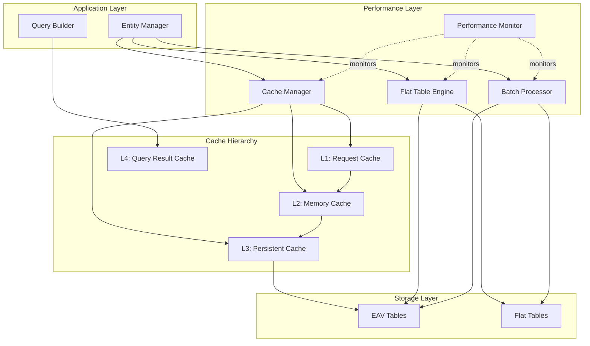
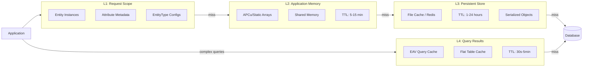
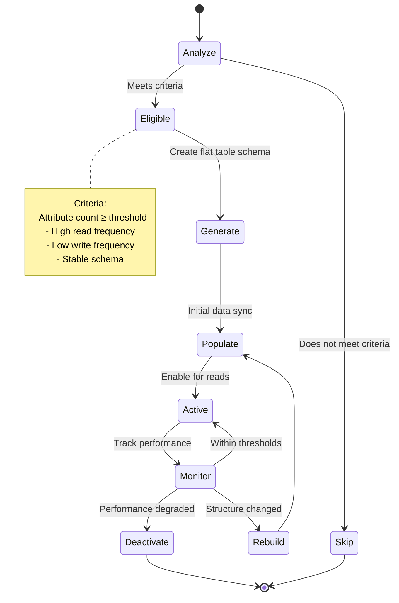
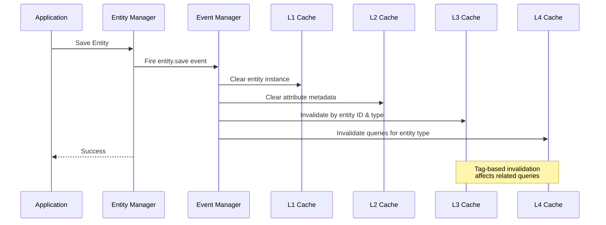
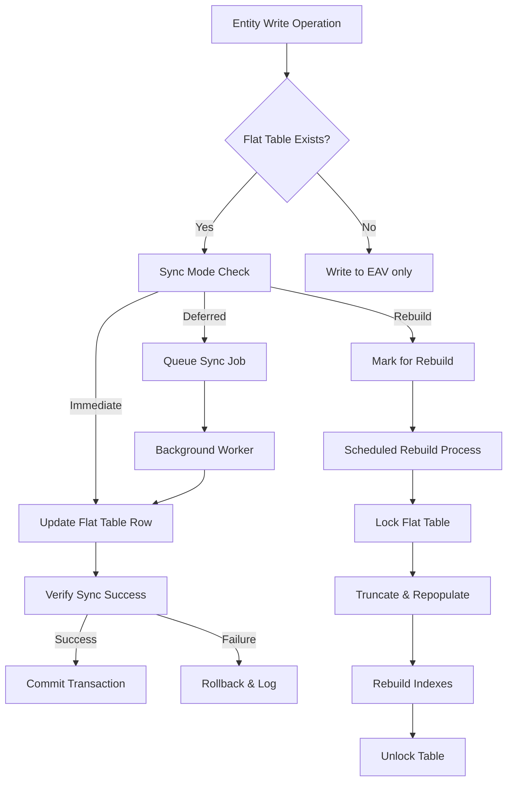
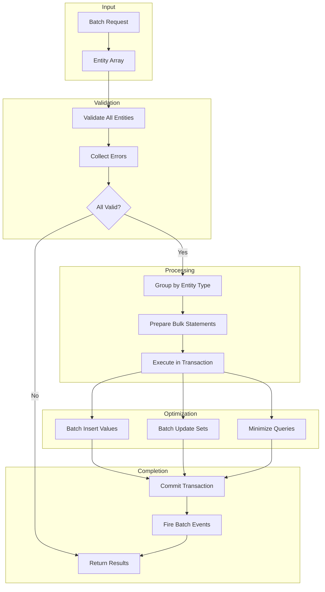
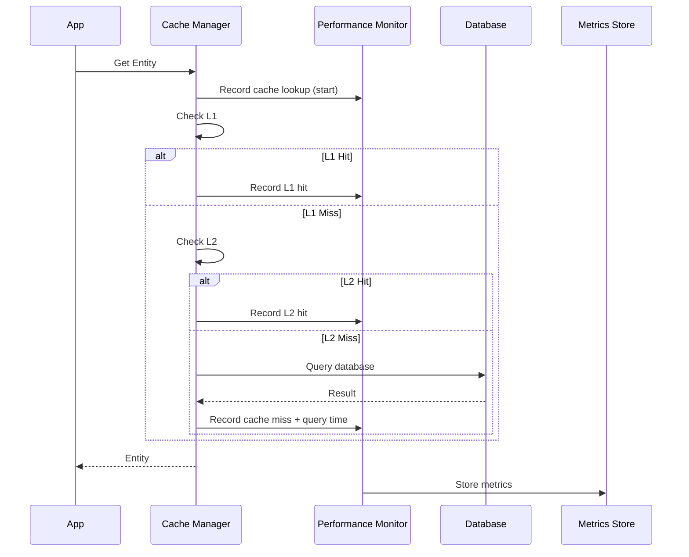
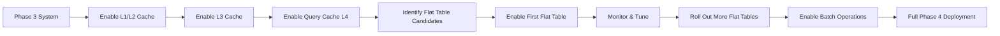

# EAV Library - Phase 4: Performance Enhancement Design

## Overview

Phase 4 focuses on performance optimization for the EAV (Entity-Attribute-Value) library through multi-level caching, flat table storage, query result caching, and batch operations. This phase transforms the EAV system from a functional implementation into a high-performance data management solution capable of handling large-scale enterprise workloads.

### Repository Context
- **Module Location**: `app/Core/Eav/`
- **Framework**: Custom PHP MVC with DI container
- **Prerequisites**: Phase 1 (Core Foundation - Completed), Phase 2 (Data Persistence), Phase 3 (Query Capabilities)

### Phase 4 Objectives
1. Implement multi-level caching strategy (L1-L4 cache layers)
2. Create flat table storage for high-read entities
3. Build query result caching with intelligent invalidation
4. Develop batch operations for bulk data processing
5. Optimize memory consumption and query execution time
6. Provide performance monitoring and profiling tools

## Architecture

### Performance Layer Components

The performance enhancement layer introduces four primary subsystems that work together to minimize database load and accelerate data retrieval.



### Cache Architecture Strategy

The multi-level caching strategy employs four distinct cache layers, each optimized for specific access patterns and data volatility.



### Flat Table Strategy

Flat tables denormalize EAV data into traditional columnar format for entities with stable attribute sets and high read frequencies.



## Cache Layer Design

### L1: Request-Scoped Cache

Request-scoped cache operates within a single HTTP request lifecycle, preventing redundant object instantiation and attribute lookups.

| Aspect | Specification |
|--------|---------------|
| **Scope** | Single HTTP request |
| **Lifetime** | Request duration only |
| **Implementation** | PHP instance properties |
| **Storage** | Entity instances, EntityType objects, loaded attributes |
| **Invalidation** | Automatic (request end) |
| **Memory Impact** | Minimal (< 1MB typical) |
| **Primary Benefit** | Eliminates duplicate object creation |

**Caching Strategy:**
- Entity Manager maintains identity map of loaded entities keyed by entity type and ID
- AttributeCollection caches filtered/sorted results within the collection instance
- EntityTypeRegistry caches loaded EntityType objects for request duration
- No serialization overhead (live objects in memory)

### L2: Application Memory Cache

Application-level memory cache persists across requests using PHP extensions or static variables.

| Aspect | Specification |
|--------|---------------|
| **Scope** | PHP process/worker |
| **Lifetime** | 5-15 minutes (configurable) |
| **Implementation** | APCu, static arrays, or shared memory |
| **Storage** | Attribute metadata, entity type definitions, configuration arrays |
| **Invalidation** | TTL-based + explicit on schema changes |
| **Memory Impact** | Low (5-20MB typical) |
| **Primary Benefit** | Avoids configuration file I/O and parsing |

**Caching Strategy:**
- Cache entity type configurations after first load
- Store attribute metadata indexed by entity type and attribute code
- Cache validation rule sets for rapid validation
- Use cache keys incorporating configuration file timestamps for auto-invalidation

### L3: Persistent Cache

Persistent cache survives PHP process restarts using external storage systems.

| Aspect | Specification |
|--------|---------------|
| **Scope** | Application-wide |
| **Lifetime** | 1-24 hours (configurable) |
| **Implementation** | File cache, Redis, Memcached |
| **Storage** | Serialized entity objects, denormalized entity data, aggregated results |
| **Invalidation** | Event-driven + TTL fallback |
| **Memory Impact** | External (configurable limits) |
| **Primary Benefit** | Reduces database queries dramatically |

**Caching Strategy:**
- Store frequently accessed entities by ID
- Cache entity collections from common queries
- Serialize using efficient formats (igbinary, msgpack if available)
- Tag-based invalidation for entity type changes
- Implement cache warming for critical entities

### L4: Query Result Cache

Specialized cache for complex EAV queries that involve multiple joins and aggregations.

| Aspect | Specification |
|--------|---------------|
| **Scope** | Application-wide |
| **Lifetime** | 30 seconds - 5 minutes (configurable) |
| **Implementation** | Redis with query signature hashing |
| **Storage** | Query result sets, aggregated data, filtered collections |
| **Invalidation** | Entity-type-based events + TTL |
| **Memory Impact** | Medium (50-200MB typical) |
| **Primary Benefit** | Accelerates complex filtering and search |

**Caching Strategy:**
- Generate cache key from query signature (entity type + filters + sorts + limits)
- Store result sets with metadata (total count, page info)
- Invalidate on any write operation to relevant entity type
- Shorter TTL for volatile data, longer for stable data
- Support partial invalidation by entity ID ranges

### Cache Invalidation Strategy

Event-driven cache invalidation ensures consistency across all cache layers.



**Invalidation Rules:**

| Event | L1 | L2 | L3 | L4 |
|-------|----|----|----|----|
| Entity created | Clear instance | No action | No action | Invalidate entity type queries |
| Entity updated | Clear instance | No action | Invalidate entity ID | Invalidate entity type queries |
| Entity deleted | Clear instance | No action | Invalidate entity ID | Invalidate entity type queries |
| Attribute added | Clear all | Clear metadata | Invalidate entity type | Invalidate all queries |
| Attribute modified | Clear all | Clear metadata | Invalidate entity type | Invalidate all queries |
| Schema sync | Clear all | Clear all | Clear all | Clear all |

## Flat Table Storage Design

### Flat Table Structure

Flat tables transform vertical EAV structure into horizontal columnar format for performance-critical entity types.

**EAV Storage Pattern:**
```
eav_entity: [entity_id, entity_type_id, created_at, updated_at]
eav_entity_varchar: [value_id, entity_id, attribute_id, value]
eav_entity_int: [value_id, entity_id, attribute_id, value]
eav_entity_decimal: [value_id, entity_id, attribute_id, value]
```

**Flat Table Pattern:**
```
eav_flat_product: [
    entity_id,
    name (varchar),
    sku (varchar),
    price (decimal),
    qty (int),
    status (int),
    created_at,
    updated_at,
    ... all attributes as columns
]
```

**Comparison:**

| Metric | EAV Tables | Flat Table |
|--------|-----------|------------|
| **Read Query** | 5+ table joins | Single table scan |
| **Write Query** | 1 entity + N value inserts | Single row insert/update |
| **Query Complexity** | High (multiple LEFT JOINs) | Low (simple SELECT) |
| **Storage Size** | Smaller (normalized) | Larger (denormalized) |
| **Index Efficiency** | Lower (multi-column) | Higher (single-column) |
| **Best Use Case** | Write-heavy, flexible schema | Read-heavy, stable schema |

### Flat Table Eligibility Criteria

Not all entity types benefit from flat table storage. The system evaluates eligibility based on configurable thresholds.

| Criterion | Threshold | Rationale |
|-----------|-----------|-----------|
| **Minimum Attributes** | ≥ 10 attributes | Sufficient complexity to benefit from denormalization |
| **Read/Write Ratio** | ≥ 5:1 | Read-heavy workloads amortize sync overhead |
| **Schema Stability** | < 1 change/month | Frequent schema changes require expensive rebuilds |
| **Entity Volume** | ≥ 1,000 records | Small datasets don't justify maintenance overhead |
| **Query Frequency** | ≥ 100 queries/hour | High access frequency justifies storage duplication |
| **Attribute Consistency** | ≥ 80% entities have all attributes | Sparse data wastes columnar storage |

**Configuration:**
```
'flat_tables' => [
    'enable' => true,
    'min_attributes' => 10,
    'read_write_ratio' => 5.0,
    'min_entity_count' => 1000,
    'min_query_frequency' => 100,
    'attribute_consistency_threshold' => 0.8,
    'auto_rebuild' => true,
    'rebuild_schedule' => 'daily',
]
```

### Flat Table Synchronization

Flat tables must stay synchronized with EAV source data through event-driven updates and periodic rebuilds.



**Synchronization Modes:**

| Mode | Description | Use Case | Performance Impact |
|------|-------------|----------|-------------------|
| **Immediate** | Update flat table in same transaction | Low-volume writes | Write latency +10-30ms |
| **Deferred** | Queue update for background processing | Medium-volume writes | Write latency +2-5ms (queue only) |
| **Rebuild** | Mark dirty, rebuild periodically | High-volume writes | Write latency +1ms (flag only) |

### Flat Table Query Routing

The storage engine automatically routes queries to flat tables when available and beneficial.

**Routing Decision Matrix:**

| Query Characteristics | Route to EAV | Route to Flat |
|-----------------------|--------------|---------------|
| Simple SELECT with few attributes | ✓ | ✓ (slightly faster) |
| SELECT with all/most attributes | ✗ | ✓ (much faster) |
| Complex WHERE with multiple attributes | ✗ | ✓ (indexed columns) |
| ORDER BY attribute values | ✗ | ✓ (columnar sorting) |
| Aggregations (COUNT, SUM, AVG) | ✗ | ✓ (no joins needed) |
| Write operations | ✓ (both if sync enabled) | ✓ (depends on mode) |
| Schema in transition | ✓ | ✗ (may be stale) |

**Query Routing Logic:**
```
1. Check if entity type has flat table enabled
2. Verify flat table is not marked dirty/rebuilding
3. Analyze query attributes requested
4. Calculate estimated query cost for both paths
5. Select path with lower estimated cost
6. Execute query and measure actual cost
7. Update routing statistics for future decisions
```

## Batch Operations Design

### Batch Processing Architecture

Batch operations minimize database round trips and transaction overhead by grouping multiple operations.



### Batch Operation Types

| Operation | Single Query Cost | Batch Query Cost (N items) | Efficiency Gain |
|-----------|-------------------|----------------------------|-----------------|
| **Insert** | 1 entity + N attributes = N+1 queries | 1 entity + N attributes = 2 queries (bulk) | ~N/2× faster |
| **Update** | 1 entity + N attributes = N+1 queries | 1 entity + N changed attrs = 2-3 queries | Variable, ~N/3× typical |
| **Delete** | 1 entity + cascade deletes = 2+ queries | 1 entity batch + 1 cascade = 2 queries | ~N× faster |
| **Load** | N queries (one per entity) | 1 query with IN clause | ~N× faster |
| **Attribute Update** | N queries (one per value) | 1 bulk UPDATE | ~N× faster |

### Batch Insert Strategy

Bulk insertion groups entity and attribute value inserts into multi-row statements.

**Process Flow:**
1. Validate all entities in batch (fail fast if any invalid)
2. Begin database transaction
3. Insert all entity records in single multi-row INSERT
4. Group attribute values by backend type (varchar, int, decimal, etc.)
5. Execute one multi-row INSERT per backend type
6. Update flat tables if applicable (single batch operation)
7. Fire batch creation event with all entity IDs
8. Commit transaction
9. Update L3/L4 caches with new entities

**Performance Characteristics:**
- Batch size: 100-1000 entities recommended
- Queries reduced from `N * (1 + avg_attributes)` to `1 + backend_type_count`
- Transaction overhead: single transaction vs N transactions
- Index updates: batched by database engine

### Batch Update Strategy

Bulk updates only modify changed attributes using dirty tracking from Entity model.

**Process Flow:**
1. Load entities into L1 cache
2. Application modifies entity attributes
3. Collect all dirty entities
4. Group dirty attributes by backend type
5. Build conditional multi-case UPDATE statements:
   ```
   UPDATE eav_entity_varchar SET value = CASE
       WHEN entity_id = 1 AND attribute_id = 5 THEN 'new value 1'
       WHEN entity_id = 2 AND attribute_id = 5 THEN 'new value 2'
       ...
   END
   WHERE (entity_id, attribute_id) IN ((1,5), (2,5), ...)
   ```
6. Execute one UPDATE per backend type
7. Update flat tables with changed rows
8. Invalidate L3/L4 cache for affected entities

**Optimization Techniques:**
- Only update changed attributes (dirty tracking)
- Batch by backend type to minimize query count
- Use CASE statements for multi-row updates
- Update flat tables incrementally, not full rebuild

### Batch Load Strategy

Batch loading retrieves multiple entities in a single query using IN clauses.

**Process Flow:**
1. Receive array of entity IDs to load
2. Check L1 cache for already-loaded entities
3. Check L3 cache for cached entities
4. Build query for remaining IDs:
   ```
   SELECT e.*, v_varchar.*, v_int.*, ...
   FROM eav_entity e
   LEFT JOIN eav_entity_varchar v_varchar ON e.entity_id = v_varchar.entity_id
   LEFT JOIN eav_entity_int v_int ON e.entity_id = v_int.entity_id
   WHERE e.entity_id IN (?, ?, ?, ...)
   ```
5. Execute single query with all IDs
6. Hydrate entity objects from result set
7. Store in L1 and L3 caches
8. Return entity collection

**Performance Characteristics:**
- Query count: 1 vs N individual queries
- Database round trips: 1 vs N
- Result set: larger single result vs N small results
- Network overhead: single TCP exchange vs N exchanges

### Batch Delete Strategy

Bulk deletion removes entities and cascades to attribute values efficiently.

**Process Flow:**
1. Validate all entity IDs exist and are deletable
2. Begin database transaction
3. Delete from flat table if exists: `DELETE FROM flat_table WHERE entity_id IN (...)`
4. Delete attribute values: `DELETE FROM eav_entity_varchar WHERE entity_id IN (...)`
5. Repeat for all backend types
6. Delete entity records: `DELETE FROM eav_entity WHERE entity_id IN (...)`
7. Fire batch deletion event
8. Invalidate all cache layers for deleted entity IDs
9. Commit transaction

**Cascade Handling:**
- Use database foreign keys with ON DELETE CASCADE when possible
- Otherwise, explicitly delete from each backend table
- Order: flat tables → attribute values → entity records

## Performance Monitoring

### Metrics Collection

The performance monitoring system tracks cache effectiveness, query performance, and system resource utilization.

**Key Performance Indicators:**

| Metric Category | Metrics | Target Threshold |
|----------------|---------|------------------|
| **Cache Hit Rates** | L1 hit rate, L2 hit rate, L3 hit rate, L4 hit rate | > 80% for L1/L2, > 60% for L3/L4 |
| **Query Performance** | Avg query time, 95th percentile, Query count reduction | < 50ms avg, < 200ms p95 |
| **Flat Table Efficiency** | Read routing %, Write sync latency, Rebuild frequency | > 90% reads via flat, < 30ms sync |
| **Batch Operations** | Avg batch size, Queries per operation, Success rate | > 50 entities/batch, < 5 queries/batch |
| **Memory Usage** | L2 cache size, L3 cache size, Peak request memory | < 20MB L2, configurable L3, < 50MB peak |
| **Database Load** | Total queries/request, Connection pool usage, Lock wait time | < 10 queries/request, < 70% pool |

### Monitoring Data Collection Points



### Performance Profiling

Performance profiling identifies bottlenecks in entity operations and suggests optimizations.

**Profiling Components:**

| Component | Purpose | Data Collected |
|-----------|---------|----------------|
| **Query Profiler** | Analyze slow queries | Query text, execution time, rows examined, result size |
| **Cache Profiler** | Identify cache inefficiencies | Hit/miss patterns, eviction frequency, memory pressure |
| **Batch Profiler** | Optimize batch sizes | Batch size distribution, time per entity, failure patterns |
| **Memory Profiler** | Track memory consumption | Peak memory, entity count, cache sizes, leak detection |

**Profiling Activation:**
- Enable via configuration flag
- Attach to specific entity types for focused analysis
- Sample mode: profile every Nth request to reduce overhead
- Development mode: always-on with detailed logging

## Configuration Schema

### Global Performance Configuration

Performance settings are defined in the module configuration file.

| Parameter | Type | Default | Description |
|-----------|------|---------|-------------|
| `enable_performance_layer` | boolean | true | Master switch for performance features |
| `cache.enable` | boolean | true | Enable/disable all caching |
| `cache.default_ttl` | integer | 3600 | Default cache TTL in seconds |
| `cache.l1_enable` | boolean | true | Request-scoped cache |
| `cache.l2_enable` | boolean | true | Application memory cache |
| `cache.l2_driver` | string | 'apcu' | L2 driver: apcu, static, none |
| `cache.l2_ttl` | integer | 900 | L2 TTL in seconds (15 min) |
| `cache.l3_enable` | boolean | true | Persistent cache |
| `cache.l3_driver` | string | 'file' | L3 driver: file, redis, memcached |
| `cache.l3_ttl` | integer | 3600 | L3 TTL in seconds (1 hour) |
| `cache.l4_enable` | boolean | true | Query result cache |
| `cache.l4_driver` | string | 'redis' | L4 driver (requires external storage) |
| `cache.l4_ttl` | integer | 300 | L4 TTL in seconds (5 min) |
| `flat_tables.enable` | boolean | true | Enable flat table storage |
| `flat_tables.min_attributes` | integer | 10 | Minimum attributes for flat table |
| `flat_tables.read_write_ratio` | float | 5.0 | Minimum read/write ratio |
| `flat_tables.sync_mode` | string | 'immediate' | immediate, deferred, rebuild |
| `flat_tables.auto_rebuild` | boolean | true | Automatic rebuild scheduling |
| `batch.max_size` | integer | 1000 | Maximum entities per batch |
| `batch.chunk_size` | integer | 100 | Query chunk size for batch ops |
| `monitoring.enable` | boolean | true | Enable performance monitoring |
| `monitoring.sample_rate` | float | 1.0 | Fraction of requests to monitor (0.0-1.0) |

### Entity-Specific Performance Configuration

Entity configurations can override global performance settings.

```
Entity Configuration Structure:
{
    entity_code: string,
    entity_label: string,
    
    performance: {
        cache_ttl: integer,           // Override default TTL
        enable_flat_table: boolean,    // Force enable/disable flat table
        flat_table_sync_mode: string,  // Override global sync mode
        cache_priority: string,        // high, normal, low
        query_cache_enable: boolean,   // Enable L4 for this entity
    },
    
    attributes: [...]
}
```

## Integration Points

### Integration with Existing Components

| Component | Integration Point | Purpose |
|-----------|-------------------|---------|
| **Entity Manager** | Wrap load/save operations with cache checks | Transparent caching |
| **Query Builder** | Inject query result cache layer | Cache complex queries |
| **Storage Strategy** | Add flat table storage strategy | Alternative storage path |
| **Event Manager** | Subscribe to entity events for cache invalidation | Maintain consistency |
| **Service Provider** | Register cache services in DI container | Dependency injection |

### Event System Integration

Performance layer listens to entity lifecycle events for cache invalidation.

**Event Subscriptions:**

| Event | Handler | Action |
|-------|---------|--------|
| `entity.before_save` | CacheInvalidator | Clear L1 entity instance |
| `entity.after_save` | CacheInvalidator | Invalidate L3/L4 for entity ID and type |
| `entity.after_delete` | CacheInvalidator | Remove from all cache layers |
| `entity_type.after_sync` | CacheInvalidator | Clear all caches for entity type |
| `attribute.after_create` | CacheInvalidator | Clear L2 metadata cache |
| `flat_table.after_rebuild` | FlatTableMonitor | Update routing statistics |

### Database Integration

Flat table schema generation integrates with existing migration system.

**Migration Generation:**
- Analyze entity type configuration
- Generate CREATE TABLE statement with all attributes as columns
- Add indexes for searchable/filterable attributes
- Create triggers for EAV→Flat synchronization (optional)
- Generate DROP TABLE migration for rollback

## Testing Strategy

### Performance Testing Scenarios

| Test Scenario | Objective | Success Criteria |
|---------------|-----------|------------------|
| **Cache Hit Rate** | Validate cache effectiveness | L1 > 80%, L2 > 70%, L3 > 60% hit rates |
| **Flat Table Read Speed** | Compare EAV vs flat queries | Flat table ≥ 3× faster for multi-attribute queries |
| **Batch Insert Performance** | Measure batch vs individual inserts | Batch ≥ 10× faster for 100+ entities |
| **Cache Invalidation Accuracy** | Ensure stale data never served | 0 stale reads after entity update |
| **Memory Consumption** | Validate cache memory limits | L2 < 20MB, request peak < 50MB |
| **Concurrent Load** | Test under concurrent requests | Performance maintained with 100+ concurrent users |

### Load Testing Approach

**Test Configuration:**
- Entity count: 100,000 entities
- Attributes per entity: 15 attributes
- Concurrent users: 100-500
- Query mix: 80% reads, 15% updates, 5% inserts
- Duration: 30 minutes sustained load

**Metrics to Capture:**
- Average response time
- 95th and 99th percentile response times
- Cache hit rates across all layers
- Database query count
- Memory usage over time
- Error rate

### Unit Testing Requirements

**Cache Layer Tests:**
- L1 cache stores and retrieves entities within request
- L2 cache persists across mock requests
- L3 cache serializes/deserializes entities correctly
- L4 cache generates correct query signatures
- Cache invalidation clears correct entries

**Flat Table Tests:**
- Eligibility criteria correctly identify candidates
- Flat table schema matches entity type attributes
- Synchronization keeps data consistent
- Query routing selects optimal path

**Batch Operation Tests:**
- Batch insert creates all entities
- Batch update modifies only dirty attributes
- Batch delete removes all entities and attributes
- Transaction rollback on partial failure

## Migration from Phase 3

### Gradual Adoption Path

Organizations can adopt Phase 4 performance features incrementally without disrupting existing functionality.



**Migration Steps:**

1. **Enable Request Cache (L1)**: Zero configuration, immediate benefit
2. **Enable Memory Cache (L2)**: Configure APCu or static cache, test
3. **Enable Persistent Cache (L3)**: Set up Redis/Memcached, configure TTLs
4. **Enable Query Cache (L4)**: Configure query result caching, monitor hit rates
5. **Analyze Entity Types**: Run flat table analyzer on production data
6. **Create First Flat Table**: Start with highest-value entity type
7. **Monitor Performance**: Validate improvements, tune configuration
8. **Expand Flat Tables**: Add more entity types based on analysis
9. **Enable Batch APIs**: Expose batch endpoints for bulk operations
10. **Performance Tuning**: Optimize cache TTLs, flat table sync modes

### Backward Compatibility

Phase 4 maintains full backward compatibility with Phase 2 and Phase 3 APIs.

**Compatibility Guarantees:**
- Existing Entity Manager API unchanged
- Query Builder interface remains identical
- Storage strategy selection automatic and transparent
- Configuration additions only (no breaking changes)
- Flat tables optional per entity type
- Cache layers can be individually disabled

**Fallback Behavior:**
- If flat table unavailable, query routes to EAV tables
- If cache backend fails, reads fall through to database
- Batch operations fall back to individual operations on error
- Performance monitoring degrades gracefully if disabled
