# EAV Phase 3: Advanced Entity Management & Query System

## Overview

Phase 3 of the EAV (Entity-Attribute-Value) implementation focuses on building advanced entity management capabilities, sophisticated query mechanisms, and performance optimization features. This phase transforms the EAV system from a data modeling framework into a complete, production-ready entity management solution with full CRUD operations, advanced querying, caching strategies, and batch processing capabilities.

**Prerequisites**: Phase 1 (Core Foundation) and Phase 2 (Schema & Storage) must be completed.

**Key Deliverables**:
- Complete EntityManager with lifecycle management
- EAV-aware QueryBuilder with join optimization
- Multi-level caching strategy
- Batch operations for performance
- Value indexing and search capabilities
- Event-driven architecture integration

---

## Architecture Overview

### System Components


### Data Flow Architecture


---

## Component Definitions

### 1. EntityManager

**Purpose**: Orchestrates complete entity lifecycle including creation, retrieval, update, deletion, validation, and persistence.

**Responsibilities**:
- Manage entity instances from creation to deletion
- Coordinate with cache, storage, and event systems
- Handle entity validation and state management
- Support lazy and eager loading strategies
- Manage relationships between entities
- Trigger lifecycle events

**Core Operations**:

| Operation | Description | Return Type |
|-----------|-------------|-------------|
| create | Create new entity instance | Entity |
| find | Find entity by ID with optional loading strategy | Entity or null |
| findBy | Find entities by criteria | EntityCollection |
| save | Persist entity changes to storage | boolean |
| delete | Remove entity from storage | boolean |
| refresh | Reload entity from storage | Entity |
| flush | Persist all pending changes in unit of work | boolean |
| clear | Clear entity cache and pending operations | void |

**Loading Strategies**:


**State Management**:


**Event Integration**:

| Event | Trigger Point | Purpose |
|-------|---------------|----------|
| beforeCreate | Before entity creation | Validation, default values |
| afterCreate | After entity saved | Logging, notifications |
| beforeUpdate | Before entity update | Audit trail, validation |
| afterUpdate | After entity updated | Cache invalidation, indexing |
| beforeDelete | Before entity deletion | Cascade checks, archiving |
| afterDelete | After entity deleted | Cleanup, notifications |
| beforeLoad | Before entity loaded | Access control |
| afterLoad | After entity loaded | Decoration, computation |

---

### 2. EntityRepository

**Purpose**: Provide domain-specific query methods and encapsulate entity retrieval logic.

**Responsibilities**:
- Expose finder methods for common queries
- Abstract query complexity from application layer
- Implement custom query logic per entity type
- Support filtering, sorting, and pagination
- Provide aggregation methods

**Repository Pattern Structure**:


**Standard Finder Methods**:

| Method Pattern | Parameters | Description |
|----------------|------------|-------------|
| findById | id, loadStrategy | Load single entity by primary key |
| findOneBy | criteria | Find first entity matching criteria |
| findBy | criteria, orderBy, limit, offset | Find entities with filtering |
| findAll | orderBy, limit, offset | Load all entities of type |
| count | criteria | Count entities matching criteria |
| exists | id or criteria | Check existence without loading |

---

### 3. EavQueryBuilder

**Purpose**: Extend base QueryBuilder to handle EAV-specific query patterns with optimized joins and attribute filtering.

**Key Features**:
- Automatic join generation for attribute values
- Intelligent join optimization based on backend types
- Attribute-based filtering and sorting
- Dynamic column selection
- Query result transformation

**Query Optimization Strategies**:


**Join Optimization Example**:

For a query requesting attributes: name (varchar), price (decimal), stock (int), description (text)

Traditional approach would create 4 joins. Optimized approach:


**Filter Translation**:

| User Filter | Translated SQL Pattern |
|-------------|------------------------|
| name = 'Product A' | JOIN eav_value_varchar ON attribute_code='name' AND value='Product A' |
| price > 100 | JOIN eav_value_decimal ON attribute_code='price' AND value > 100 |
| status IN [1,2] | JOIN eav_value_int ON attribute_code='status' AND value IN (1,2) |
| name LIKE '%test%' | JOIN eav_value_varchar ON attribute_code='name' AND value LIKE '%test%' |

**Attribute-based Query Methods**:

| Method | Description | Example Usage |
|--------|-------------|---------------|
| whereAttribute | Filter by attribute value | whereAttribute('price', '>', 100) |
| whereAttributeIn | Filter by attribute in values | whereAttributeIn('status', [1,2,3]) |
| whereAttributeNull | Filter by null attribute | whereAttributeNull('discount') |
| orderByAttribute | Sort by attribute value | orderByAttribute('created_at', 'DESC') |
| selectAttributes | Select specific attributes only | selectAttributes(['name', 'price']) |
| withAttributes | Eager load attributes | withAttributes(['*']) |

---

### 4. ValueRepository

**Purpose**: Handle low-level attribute value persistence operations across different backend type tables.

**Responsibilities**:
- Load attribute values from appropriate value tables
- Save values with proper type conversion
- Handle batch value operations
- Manage value indexing
- Track value changes for audit

**Value Loading Strategy**:


**Batch Operations**:

| Operation | Input | Output | Performance Benefit |
|-----------|-------|--------|--------------------|
| loadMultiple | Array of entity IDs | Multi-dimensional array | Single query per backend type |
| saveMultiple | Array of entities with values | Boolean | Batch INSERT/UPDATE |
| deleteMultiple | Array of entity IDs | Boolean | Single DELETE per type |
| updateAttribute | Attribute code, entity IDs, value | Boolean | Bulk UPDATE |

---

### 5. CacheManager

**Purpose**: Implement multi-level caching strategy to minimize database queries and improve response times.

**Cache Levels**:


**Cache Level Specifications**:

| Level | Scope | TTL | Storage | Invalidation |
|-------|-------|-----|---------|-------------|
| L1 - Request | Single request lifecycle | Request duration | Memory (array) | Automatic at request end |
| L2 - Entity | Entity instances | Configurable (default 1h) | Memory/Redis | Entity update/delete |
| L3 - Query Results | Query result sets | Short (5-15 min) | Redis/Memcached | Entity changes, manual |
| L4 - Metadata | Attribute definitions, entity types | Long (24h) | Redis/File | Schema sync, configuration change |

**Cache Key Patterns**:

| Pattern | Example | Purpose |
|---------|---------|----------|
| entity:{type}:{id} | entity:product:123 | Entity instance |
| query:{type}:{hash} | query:product:abc123 | Query result set |
| attr:{type}:{code} | attr:product:name | Attribute metadata |
| etype:{code} | etype:product | Entity type definition |
| values:{entity}:{id} | values:product:123 | Entity attribute values |

**Cache Invalidation Strategy**:


**Invalidation Rules**:

| Trigger | Invalidation Scope | Reason |
|---------|-------------------|--------|
| Entity Create | Entity cache, query cache for type | New entity affects queries |
| Entity Update | Entity cache, value cache, related query cache | Changed data |
| Entity Delete | Entity cache, value cache, query cache for type | Removed entity |
| Schema Change | All metadata cache | Structure changed |
| Batch Operation | Query cache for affected type | Multiple changes |

---

### 6. BatchManager

**Purpose**: Optimize performance for bulk operations by batching database queries and reducing roundtrips.

**Batch Operation Types**:


**Batch Strategies**:

| Strategy | Use Case | Batch Size | Performance Gain |
|----------|----------|------------|------------------|
| Chunked Processing | Large datasets | 500-1000 records | Prevents memory overflow |
| Grouped Inserts | Multiple entities | 100-500 inserts | Single transaction |
| Bulk Updates | Same attribute across entities | Unlimited | Single UPDATE statement |
| Parallel Processing | Independent operations | N/A | Multi-threaded execution |

**Batch Processing Flow**:


**Batch Methods**:

| Method | Input | Behavior | Transaction |
|--------|-------|----------|-------------|
| batchCreate | Array of entity data | Create multiple entities | Single |
| batchUpdate | Array of entities | Update multiple entities | Single |
| batchDelete | Array of entity IDs | Delete multiple entities | Single |
| batchUpdateAttribute | Criteria, attribute, value | Update attribute for matching entities | Single |

---

### 7. IndexManager

**Purpose**: Manage database indexes for frequently queried attributes to optimize search and filter performance.

**Index Types**:

| Index Type | Use Case | Structure | Performance Impact |
|------------|----------|-----------|--------------------|
| Attribute Value Index | Filter by specific attribute | (attribute_id, value) | High for filters |
| Entity Attribute Index | Load entity attributes | (entity_id, attribute_id) | High for loads |
| Composite Index | Multi-attribute queries | (attr1_id, attr2_id, value) | Medium for complex queries |
| Full-Text Index | Text search | Full-text on text values | High for search |

**Index Decision Matrix**:


**Index Synchronization Process**:

| Phase | Action | Timing |
|-------|--------|--------|
| Analysis | Identify required indexes from attribute flags | Schema sync |
| Comparison | Compare existing vs required indexes | On-demand |
| Creation | Create missing indexes | Schema sync or manual |
| Removal | Remove unused indexes | Manual only |
| Optimization | Analyze and rebuild indexes | Scheduled maintenance |

**Index Monitoring Metrics**:

| Metric | Description | Action Threshold |
|--------|-------------|------------------|
| Index Usage | How often index is used | < 100 queries/day → Consider removal |
| Index Size | Disk space consumed | > 1GB → Review necessity |
| Index Fragmentation | Physical fragmentation % | > 30% → Rebuild |
| Query Performance | Average query time with index | > 500ms → Optimize or add covering index |

---

## Data Model Enhancements

### Entity Collection

**Purpose**: Container for multiple entity instances with collection operations.

**Features**:
- Iteration and traversal
- Filtering and mapping
- Sorting and grouping
- Pagination support
- Lazy loading of collection items
- Collection-level operations

**Collection Operations**:

| Operation | Description | Return Type |
|-----------|-------------|-------------|
| filter | Filter entities by callback | EntityCollection |
| map | Transform entities | Array |
| first | Get first entity | Entity or null |
| last | Get last entity | Entity or null |
| count | Count entities | Integer |
| isEmpty | Check if empty | Boolean |
| toArray | Convert to array | Array |
| slice | Get subset | EntityCollection |
| chunk | Split into chunks | Array of EntityCollection |

### Query Result Set

**Purpose**: Represent query results with metadata and pagination information.

**Structure**:

| Property | Type | Description |
|----------|------|-------------|
| items | EntityCollection | Result entities |
| total | Integer | Total matching records |
| page | Integer | Current page number |
| perPage | Integer | Items per page |
| hasMore | Boolean | More pages available |
| metadata | Array | Query metadata |

---
## Advanced Query Capabilities

### Query Patterns

#### 1. Attribute Filtering

Filter entities based on attribute values with various operators:

| Filter Type | Usage Pattern | SQL Translation |
|-------------|---------------|----------------|
| Exact Match | whereAttribute('name', '=', 'value') | value = 'value' |
| Comparison | whereAttribute('price', '>', 100) | value > 100 |
| Range | whereAttributeBetween('price', 100, 200) | value BETWEEN 100 AND 200 |
| Pattern | whereAttributeLike('name', '%search%') | value LIKE '%search%' |
| Null Check | whereAttributeNull('discount') | value IS NULL |
| Set Match | whereAttributeIn('status', [1,2,3]) | value IN (1,2,3) |

#### 2. Multi-Attribute Queries

Combine multiple attribute filters:


#### 3. Aggregation Queries

Support for aggregate operations on attribute values:

| Aggregation | Description | Example |
|-------------|-------------|----------|
| COUNT | Count entities | count(whereAttribute('status', 1)) |
| SUM | Sum numeric attribute | sum('total_sales') |
| AVG | Average numeric attribute | avg('price') |
| MIN | Minimum value | min('price') |
| MAX | Maximum value | max('price') |
| GROUP BY | Group by attribute | groupByAttribute('category') |

#### 4. Relationship Queries

Query across entity relationships:


---

## Performance Optimization Features

### 1. Selective Attribute Loading

**Strategy**: Load only requested attributes instead of all entity attributes.

**Implementation**:


**Benefits**:
- Reduced JOIN operations
- Lower memory footprint
- Faster query execution
- Network bandwidth savings

### 2. Query Result Caching

**Cache Strategy**:

| Query Type | Cache Duration | Invalidation Trigger |
|------------|----------------|---------------------|
| Entity by ID | 1 hour | Entity update/delete |
| List queries | 15 minutes | Any entity of type changes |
| Filtered queries | 5 minutes | Matching entity changes |
| Aggregations | 30 minutes | Entity type changes |

**Cache Key Generation**:

Generate unique cache keys based on query parameters:


### 3. Eager Loading Optimization

**N+1 Query Problem Solution**:

Traditional approach (N+1 queries):
- 1 query to load entities
- N queries to load attributes for each entity

Optimized approach (2-6 queries):
- 1 query to load entities  
- 1 query per backend type to load all attributes for all entities

**Batch Loading Pattern**:


### 4. Index-Based Search

**Search Flow with Indexes**:

```mermaid
graph TD
    SEARCH[Search Request] --> ANALYZE[Analyze Search Terms]
    ANALYZE --> CHECK{Indexed Attribute?}
    
    CHECK -->|Yes| INDEX[Use Index]
    CHECK -->|No| FULL[Full Scan]
    
    INDEX --> QUICK[Quick Lookup]
    FULL --> SLOW[Slow Sequential Scan]
    
    QUICK --> FILTER[Apply Additional Filters]
    SLOW --> FILTER
    
    FILTER --> RESULT[Return Results]
```



---

## Event-Driven Architecture

### Entity Lifecycle Events


### Event Listeners Use Cases

| Event | Listener | Purpose |
|-------|----------|----------|
| beforeCreate | ValidationListener | Additional business validation |
| afterCreate | CacheInvalidationListener | Clear relevant caches |
| afterCreate | IndexingListener | Update search indexes |
| afterCreate | AuditListener | Log entity creation |
| beforeUpdate | ChangeTrackingListener | Track field changes |
| afterUpdate | CascadeUpdateListener | Update related entities |
| beforeDelete | ReferenceCheckListener | Prevent deletion if referenced |
| afterDelete | CleanupListener | Remove related data |

---

## Testing Strategy

### Unit Testing Focus

| Component | Test Coverage | Key Test Cases |
|-----------|---------------|----------------|
| EntityManager | 90%+ | Create, read, update, delete, caching, validation |
| EavQueryBuilder | 90%+ | Join generation, filter translation, optimization |
| ValueRepository | 85%+ | Load, save, batch operations, type handling |
| CacheManager | 80%+ | Multi-level caching, invalidation, key generation |
| BatchManager | 85%+ | Chunking, transactions, error handling |
| IndexManager | 75%+ | Index creation, synchronization, analysis |

### Integration Testing Scenarios

| Scenario | Description | Validates |
|----------|-------------|----------|
| Complete Entity Lifecycle | Create → Read → Update → Delete | All manager interactions |
| Bulk Operations | Create 1000 entities in batch | Batch processing, transactions |
| Complex Queries | Multi-attribute filtering with sorting | Query builder optimization |
| Cache Effectiveness | Measure cache hit rate | Caching strategy |
| Concurrent Modifications | Multiple updates to same entity | Locking, consistency |
| Schema Evolution | Add/remove attributes dynamically | Schema synchronization |

### Performance Testing Benchmarks

| Operation | Target Performance | Measurement |
|-----------|-------------------|-------------|
| Single entity load | < 10ms | Average response time |
| Batch load (100 entities) | < 100ms | Throughput |
| Attribute filter query | < 50ms | Query execution time |
| Entity creation | < 20ms | Write latency |
| Batch creation (100) | < 500ms | Bulk throughput |
| Cache hit ratio | > 80% | Cache effectiveness |
| Index lookup | < 5ms | Index efficiency |

---

## Migration & Deployment

### Phase 3 Deployment Sequence

```mermaid
graph TD
    START[Start Deployment] --> BACKUP[Backup Database]
    BACKUP --> SCHEMA[Run Schema Migrations]
    SCHEMA --> INDEX[Create Indexes]
    INDEX --> CACHE[Setup Cache Infrastructure]
    CACHE --> CONFIG[Update Configuration]
    CONFIG --> TEST[Run Integration Tests]
    TEST --> VERIFY{Tests Pass?}
    VERIFY -->|No| ROLLBACK[Rollback]
    VERIFY -->|Yes| WARMUP[Warm Up Caches]
    WARMUP --> MONITOR[Enable Monitoring]
    MONITOR --> COMPLETE[Deployment Complete]
    ROLLBACK --> RESTORE[Restore Backup]
    RESTORE --> END[Deployment Failed]
    COMPLETE --> END
```

### Configuration Updates

Phase 3 introduces new configuration parameters:

| Parameter | Description | Default Value |
|-----------|-------------|---------------|
| cache.enabled | Enable caching system | true |
| cache.driver | Cache driver (memory, redis, memcached) | redis |
| cache.ttl.entity | Entity instance TTL (seconds) | 3600 |
| cache.ttl.query | Query result TTL (seconds) | 900 |
| cache.ttl.metadata | Metadata TTL (seconds) | 86400 |
| batch.chunk_size | Batch operation chunk size | 500 |
| batch.parallel | Enable parallel processing | false |
| query.max_joins | Maximum joins per query | 10 |
| query.enable_optimization | Enable query optimization | true |
| index.auto_create | Auto-create indexes | true |
| index.maintenance_schedule | Index maintenance cron | daily at 2am |

---

## Monitoring & Observability

### Key Performance Indicators

| KPI | Description | Alert Threshold |
|-----|-------------|------------------|
| Query Response Time | Average time to execute queries | > 100ms |
| Cache Hit Rate | Percentage of cache hits | < 70% |
| Entity Load Time | Time to load single entity | > 20ms |
| Batch Processing Time | Time to process 100 entities | > 1s |
| Index Usage | Number of index scans vs table scans | < 50% index usage |
| Database Connections | Active connections to database | > 80% of pool |
| Memory Usage | Cache and entity manager memory | > 80% available |

### Logging Strategy

| Log Level | What to Log | Example |
|-----------|-------------|----------|
| DEBUG | Query details, cache hits/misses | "Cache miss for entity:product:123" |
| INFO | Entity operations, batch completions | "Batch created 500 products in 450ms" |
| WARNING | Performance degradation, cache issues | "Query took 150ms (threshold: 100ms)" |
| ERROR | Operation failures, validation errors | "Failed to save entity: validation error" |
| CRITICAL | System failures, data corruption | "Index corruption detected" |

### Monitoring Dashboard Metrics

```mermaid
graph TB
    subgraph "Performance Metrics"
        P1[Query Time]
        P2[Cache Hit Rate]
        P3[Entity Load Time]
    end
    
    subgraph "Resource Metrics"
        R1[Database Connections]
        R2[Memory Usage]
        R3[Cache Size]
    end
    
    subgraph "Business Metrics"
        B1[Entities Created]
        B2[Entities Updated]
        B3[Entities Deleted]
    end
    
    subgraph "Error Metrics"
        E1[Validation Errors]
        E2[Query Failures]
        E3[Cache Errors]
    end
```

---

## Security Considerations

### Access Control

| Layer | Security Mechanism | Implementation |
|-------|-------------------|----------------|
| Entity Manager | Permission checks before operations | Integrate with ACL system |
| Repository | Row-level security filters | Automatic WHERE clauses |
| Query Builder | Query sanitization | Parameter binding |
| Cache | Encrypted cache keys for sensitive data | Encryption layer |

### Data Protection

```mermaid
graph LR
    INPUT[User Input] --> VALIDATE[Input Validation]
    VALIDATE --> SANITIZE[Sanitization]
    SANITIZE --> PARAM[Parameter Binding]
    PARAM --> QUERY[Query Execution]
    QUERY --> ENCRYPT{Sensitive Data?}
    ENCRYPT -->|Yes| ENC[Encrypt]
    ENCRYPT -->|No| STORE[Store]
    ENC --> STORE
    STORE --> AUDIT[Audit Log]
```

### Audit Trail

Track all entity modifications:

| Event | Captured Data | Purpose |
|-------|--------------|----------|
| Entity Create | User, timestamp, entity data | Compliance |
| Entity Update | User, timestamp, old/new values | Change tracking |
| Entity Delete | User, timestamp, deleted data | Recovery |
| Batch Operation | User, timestamp, affected IDs | Accountability |

---

## Best Practices

### EntityManager Usage

**DO**:
- Use repository pattern for domain-specific queries
- Leverage caching for frequently accessed entities
- Use batch operations for bulk processing
- Specify loading strategy based on use case
- Clear entity manager periodically in long-running processes

**DON'T**:
- Load entire entity collections into memory
- Bypass EntityManager for direct database access
- Disable caching without performance analysis
- Ignore validation errors
- Mix entity states (managed/detached) carelessly

### Query Optimization

**DO**:
- Select only needed attributes
- Use indexes for filterable attributes
- Cache frequently executed queries
- Use batch loading for collections
- Profile slow queries

**DON'T**:
- Use LIKE '%value%' on non-indexed fields
- Join all value tables when not needed
- Ignore query execution plans
- Fetch all records without pagination
- Perform calculations in application when database can do it

### Caching Guidelines

**DO**:
- Cache immutable or rarely changing data longer
- Use specific cache keys for targeted invalidation
- Monitor cache hit rates
- Implement cache warming for critical data
- Set appropriate TTL based on data volatility

**DON'T**:
- Cache without invalidation strategy
- Use global cache flush frequently
- Cache data larger than memory limits
- Rely solely on cache without database fallback
- Cache user-specific data in shared cache

---

## Extension Points

### Custom Entity Repositories

Create domain-specific repositories by extending base repository:

**Repository Interface Pattern**:

| Component | Responsibility | Customization |
|-----------|---------------|---------------|
| BaseRepository | Common CRUD operations | Inherit |
| DomainRepository | Entity-specific queries | Implement custom finders |
| QueryBuilder | Query construction | Override for special cases |

### Custom Query Strategies

Implement alternative query strategies for specific scenarios:

```mermaid
graph TD
    QUERY[Query Request] --> STRATEGY{Query Strategy}
    
    STRATEGY -->|Default| EAV[EAV Table Strategy]
    STRATEGY -->|Flat| FLAT[Flat Table Strategy]
    STRATEGY -->|Hybrid| HYBRID[Hybrid Strategy]
    STRATEGY -->|Custom| CUSTOM[Custom Implementation]
    
    EAV --> EXECUTE[Execute]
    FLAT --> EXECUTE
    HYBRID --> EXECUTE
    CUSTOM --> EXECUTE
```

### Event Listener Registration

Extend functionality through event listeners:

| Extension Point | Event | Use Case |
|----------------|-------|----------|
| Validation | beforeCreate, beforeUpdate | Custom business rules |
| Enrichment | afterLoad | Computed fields |
| Notification | afterCreate, afterUpdate, afterDelete | User notifications |
| Integration | after* events | Sync with external systems |
| Auditing | all events | Compliance logging |

---

## Error Handling

### Exception Hierarchy

```mermaid
graph TD
    EAV[EavException] --> ENTITY[EntityException]
    EAV --> QUERY[QueryException]
    EAV --> CACHE[CacheException]
    EAV --> BATCH[BatchException]
    
    ENTITY --> NOTFOUND[EntityNotFoundException]
    ENTITY --> INVALID[InvalidEntityStateException]
    
    QUERY --> OPTIMIZATION[QueryOptimizationException]
    QUERY --> BUILD[QueryBuildException]
    
    CACHE --> CONN[CacheConnectionException]
    CACHE --> INVAL[InvalidationException]
    
    BATCH --> SIZE[BatchSizeException]
    BATCH --> TRANSACTION[BatchTransactionException]
```

### Error Recovery Strategies

| Error Type | Recovery Strategy | Fallback |
|------------|------------------|----------|
| Cache Miss | Load from database | N/A |
| Cache Connection Error | Bypass cache | Direct database access |
| Query Timeout | Retry with simpler query | Return partial results |
| Batch Failure | Retry failed chunk | Process individually |
| Validation Error | Return error to user | N/A |
| Deadlock | Retry transaction | Fail after N attempts |

---

## Documentation Requirements

Phase 3 deliverables must include:

| Document Type | Content | Audience |
|---------------|---------|----------|
| API Documentation | All public methods with examples | Developers |
| Architecture Guide | Component interactions, data flows | Architects |
| Performance Guide | Optimization techniques, benchmarks | DevOps |
| Migration Guide | Upgrade steps from Phase 2 | Operations |
| Best Practices | Usage patterns, anti-patterns | Developers |
| Troubleshooting | Common issues, solutions | Support |

---

## Success Criteria

Phase 3 is considered complete when:

### Functional Criteria
- ✓ EntityManager supports full CRUD operations
- ✓ Query builder handles complex multi-attribute queries
- ✓ Batch operations process 1000+ entities efficiently
- ✓ Caching system achieves >80% hit rate
- ✓ Repositories provide domain-specific query methods
- ✓ Event system integrated with entity lifecycle

### Performance Criteria  
- ✓ Single entity load: < 10ms average
- ✓ Batch load (100 entities): < 100ms
- ✓ Attribute filter query: < 50ms
- ✓ Cache hit rate: > 80%
- ✓ Batch creation (100): < 500ms

### Quality Criteria
- ✓ Unit test coverage: > 85%
- ✓ Integration tests: All critical paths covered
- ✓ Documentation: Complete API and architecture docs
- ✓ Performance benchmarks: All targets met
- ✓ Code review: Approved by senior developers

### Integration Criteria
- ✓ Compatible with existing framework components
- ✓ ACL integration working
- ✓ Event system integration complete
- ✓ DI container integration verified
- ✓ Migration path from Phase 2 documented and tested
