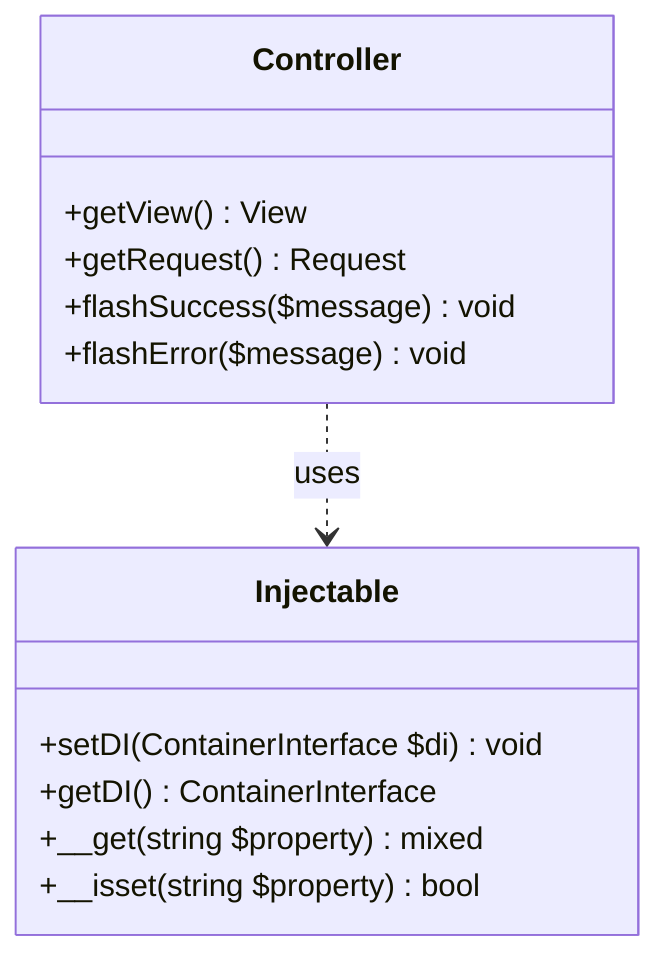
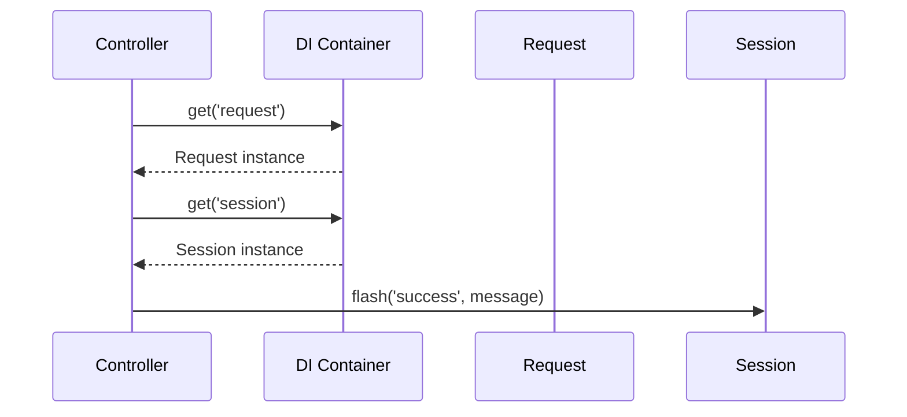
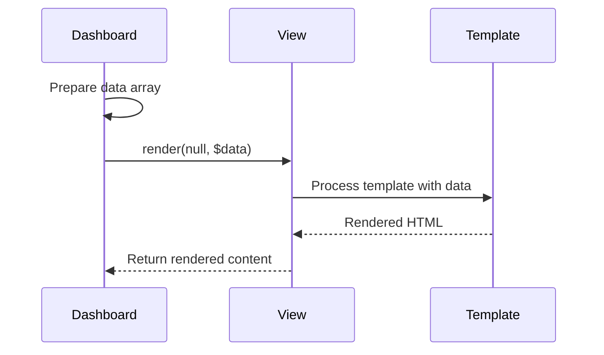
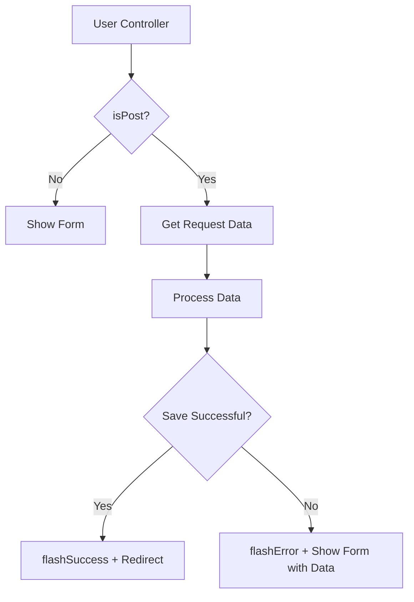

# Accessing Services via DI

<cite>
**Referenced Files in This Document**   
- [Injectable.php](file://app/Core/Di/Injectable.php)
- [Controller.php](file://app/Core/Mvc/Controller.php)
- [Dashboard.php](file://app/Module/Base/Controller/Dashboard.php)
- [User.php](file://app/Module/Admin/Controller/User.php)
- [Container.php](file://app/Core/Di/Container.php)
- [CrudController.php](file://app/Core/Mvc/CrudController.php)
- [UserService.php](file://app/Module/Admin/Services/UserService.php)
- [BaseService.php](file://app/Core/Services/BaseService.php)
</cite>

## Table of Contents
1. [Introduction](#introduction)
2. [The Injectable Trait](#the-injectable-trait)
3. [Built-in Service Shortcuts](#built-in-service-shortcuts)
4. [Accessing Any Registered Service](#accessing-any-registered-service)
5. [View Data Passing with Dashboard.php](#view-data-passing-with-dashboardphp)
6. [Form Handling with Request Data in User.php](#form-handling-with-request-data-in-userphp)
7. [Best Practices for Service Usage](#best-practices-for-service-usage)
8. [Testing Considerations](#testing-considerations)
9. [Common Issues and Solutions](#common-issues-and-solutions)
10. [Conclusion](#conclusion)

## Introduction
This document explains how controllers access framework services through the Dependency Injection (DI) container in the application architecture. It covers the Injectable trait, built-in service shortcuts, and methods for retrieving any registered service. The document uses Dashboard.php to illustrate view data passing and User.php for form handling with request data. Best practices, testing considerations, and common issues are also addressed.

**Section sources**
- [Controller.php](file://app/Core/Mvc/Controller.php#L9-L124)
- [Injectable.php](file://app/Core/Di/Injectable.php#L9-L47)

## The Injectable Trait
The Injectable trait enables classes to access the DI container through the getDI() method. When a class uses this trait, it can retrieve services from the container without needing to pass dependencies explicitly. The trait provides a setDI() method to inject the container and a getDI() method to retrieve it. If no container is set, getDI() falls back to the default container instance.



**Diagram sources**
- [Injectable.php](file://app/Core/Di/Injectable.php#L9-L47)
- [Controller.php](file://app/Core/Mvc/Controller.php#L9-L124)

**Section sources**
- [Injectable.php](file://app/Core/Di/Injectable.php#L9-L47)

## Built-in Service Shortcuts
Controllers provide convenient shortcut methods to access commonly used services without directly calling the DI container. These include getRequest() for HTTP request data, getView() for rendering views, and flashSuccess()/flashError() for session-based messaging. These methods abstract the DI container access, making controller code cleaner and more readable.



**Diagram sources**
- [Controller.php](file://app/Core/Mvc/Controller.php#L25-L37)
- [Controller.php](file://app/Core/Mvc/Controller.php#L65-L70)
- [Controller.php](file://app/Core/Mvc/Controller.php#L115-L122)

**Section sources**
- [Controller.php](file://app/Core/Mvc/Controller.php#L25-L70)
- [Controller.php](file://app/Core/Mvc/Controller.php#L115-L122)

## Accessing Any Registered Service
Any service registered in the DI container can be accessed using $this->getDI()->get('service_name'). This pattern allows controllers to retrieve database connections, event managers, custom services, or any other registered component. The container resolves dependencies automatically, supporting both class-based and closure-based service definitions.

```mermaid
flowchart TD
A[Controller] --> B[getDI()]
B --> C{Service Registered?}
C --> |Yes| D[Return Service Instance]
C --> |No| E[Throw NotFound Exception]
D --> F[Use Service in Controller]
```

**Diagram sources**
- [Container.php](file://app/Core/Di/Container.php#L60-L75)
- [Injectable.php](file://app/Core/Di/Injectable.php#L15-L25)

**Section sources**
- [Container.php](file://app/Core/Di/Container.php#L60-L75)
- [Injectable.php](file://app/Core/Di/Injectable.php#L15-L25)

## View Data Passing with Dashboard.php
The Dashboard.php controller demonstrates how to pass data to views using the render() method. It prepares navigation items, statistics, and user information, then passes them as an associative array to the view. The framework automatically handles rendering the appropriate template with the provided data.



**Diagram sources**
- [Dashboard.php](file://app/Module/Base/Controller/Dashboard.php#L10-L37)
- [Controller.php](file://app/Core/Mvc/Controller.php#L85-L105)

**Section sources**
- [Dashboard.php](file://app/Module/Base/Controller/Dashboard.php#L10-L37)

## Form Handling with Request Data in User.php
The User.php controller shows form handling using request data. It checks for POST requests with isPost(), retrieves form data via getRequest()->all(), and processes user creation and updates. The controller also demonstrates manual session flashing for success/error messages and form value retention on validation failure.



**Diagram sources**
- [User.php](file://app/Module/Admin/Controller/User.php#L15-L81)
- [Controller.php](file://app/Core/Mvc/Controller.php#L45-L55)

**Section sources**
- [User.php](file://app/Module/Admin/Controller/User.php#L15-L81)

## Best Practices for Service Usage
When using services through the DI container, avoid tight coupling by depending on interfaces rather than concrete implementations. Use the built-in shortcuts when available, and always check for service existence with has() before retrieval when optional. Register services with meaningful names and avoid direct container access in business logic classes when possible.

**Section sources**
- [Controller.php](file://app/Core/Mvc/Controller.php#L9-L124)
- [Injectable.php](file://app/Core/Di/Injectable.php#L9-L47)
- [Container.php](file://app/Core/Di/Container.php#L45-L55)

## Testing Considerations
For testing controllers that use DI services, mock the container and inject it using setDI(). This allows testing controller logic without requiring the actual services. Test both successful service retrieval and error cases (service not found). Verify that shortcut methods properly delegate to the container.

**Section sources**
- [Injectable.php](file://app/Core/Di/Injectable.php#L11-L13)
- [Controller.php](file://app/Core/Mvc/Controller.php#L9-L124)

## Common Issues and Solutions
Common issues include service not found exceptions (check registration and spelling), improper DI container usage (avoid global access), and circular dependencies. Ensure services are registered before use, use dependency injection in constructors when possible, and avoid storing container references in long-lived objects.

**Section sources**
- [Container.php](file://app/Core/Di/Container.php#L70-L75)
- [Injectable.php](file://app/Core/Di/Injectable.php#L30-L40)

## Conclusion
The DI container provides a powerful mechanism for accessing framework services in controllers. The Injectable trait enables getDI() access, while built-in shortcuts simplify common operations. Controllers can retrieve any registered service, pass data to views, and handle form submissions effectively. Following best practices ensures maintainable, testable code with proper separation of concerns.