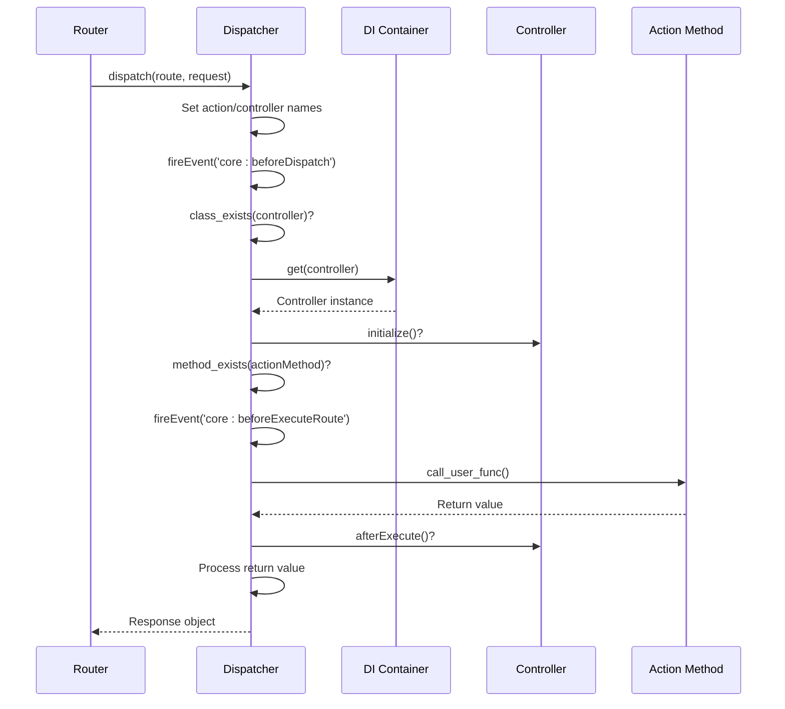
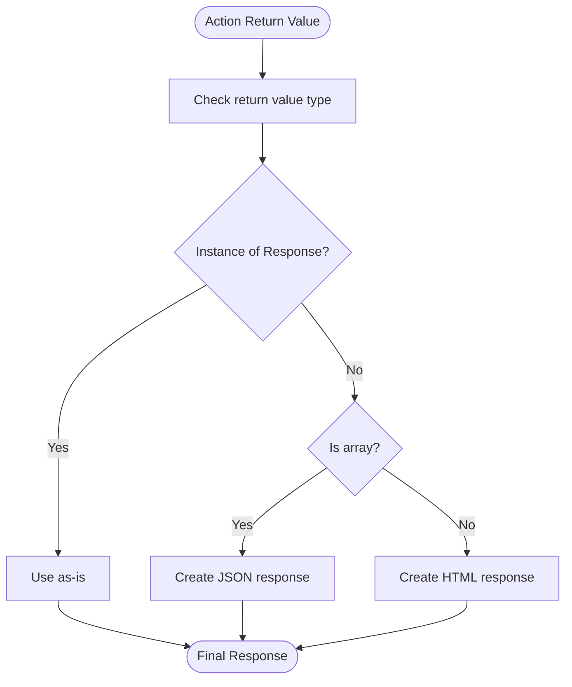
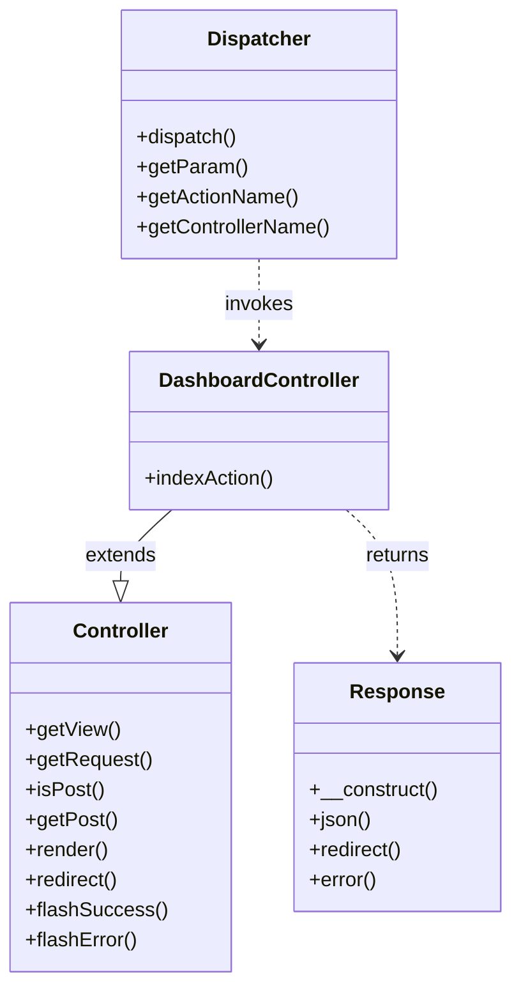

# Action Methods

<cite>
**Referenced Files in This Document**   
- [Dispatcher.php](file://app/Core/Mvc/Dispatcher.php)
- [Controller.php](file://app/Core/Mvc/Controller.php)
- [Dashboard.php](file://app/Module/Base/Controller/Dashboard.php)
- [Response.php](file://app/Core/Http/Response.php)
- [View.php](file://app/Core/Mvc/View.php)
- [Request.php](file://app/Core/Http/Request.php)
</cite>

## Table of Contents
1. [Introduction](#introduction)
2. [Action Method Dispatch Flow](#action-method-dispatch-flow)
3. [Action Naming and Method Resolution](#action-naming-and-method-resolution)
4. [Controller Lifecycle and Hooks](#controller-lifecycle-and-hooks)
5. [Return Value Handling](#return-value-handling)
6. [View Rendering and Data Preparation](#view-rendering-and-data-preparation)
7. [Parameter Access and HTTP Method Handling](#parameter-access-and-http-method-handling)
8. [Error Handling in Action Execution](#error-handling-in-action-execution)
9. [Example: Dashboard Controller](#example-dashboard-controller)
10. [Conclusion](#conclusion)

## Introduction
This document details the implementation and behavior of controller action methods within the MVC framework. It explains how the Dispatcher locates and invokes action methods using the 'Action' suffix convention, the complete dispatch flow from route resolution to response generation, and how different return types are interpreted. The document also covers best practices for action method implementation, parameter access, HTTP method handling, and error management.

**Section sources**
- [Dispatcher.php](file://app/Core/Mvc/Dispatcher.php#L10-L83)
- [Controller.php](file://app/Core/Mvc/Controller.php#L9-L124)

## Action Method Dispatch Flow
The dispatch process begins when a route is resolved by the Router and passed to the Dispatcher. The Dispatcher extracts the controller class name, action name, and parameters from the route array. It then performs the following sequence:

1. Validates that the controller class exists
2. Uses the DI container to instantiate the controller with dependency injection
3. Checks for and calls the optional `initialize()` method
4. Constructs the action method name by appending 'Action' to the action name
5. Verifies the action method exists on the controller
6. Fires the `core:beforeExecuteRoute` event
7. Executes the action method and captures its return value
8. Calls the optional `afterExecute()` method if defined
9. Processes the return value into an appropriate Response object

This flow ensures consistent controller initialization, execution, and response handling across all requests.

**Diagram sources**
- [Dispatcher.php](file://app/Core/Mvc/Dispatcher.php#L10-L83)

**Section sources**
- [Dispatcher.php](file://app/Core/Mvc/Dispatcher.php#L10-L83)

## Action Naming and Method Resolution
Action methods follow a strict naming convention where the method name consists of the action name followed by the 'Action' suffix. For example, a route with action 'index' will invoke the `indexAction` method on the controller.

The Dispatcher resolves action methods through the following process:
- Extracts the action name from the route array
- Appends 'Action' to form the method name (e.g., 'index' → 'indexAction')
- Uses `method_exists()` to verify the method is defined on the controller
- Throws an exception if the method does not exist

This convention provides a predictable and consistent way to map routes to controller methods while avoiding conflicts with other controller methods. The naming pattern also makes it easy to identify action methods within the codebase.

**Section sources**
- [Dispatcher.php](file://app/Core/Mvc/Dispatcher.php#L50-L55)

## Controller Lifecycle and Hooks
Controllers support lifecycle hooks that allow for pre- and post-execution logic. These hooks are automatically invoked by the Dispatcher during the dispatch process:

- `initialize()`: Called after controller instantiation but before action execution. Used for setting up controller state, initializing properties, or applying common configurations.
- `afterExecute()`: Called after the action method completes but before the response is processed. Useful for cleanup tasks, logging, or modifying response data.

These methods are optional and only called if they are defined on the controller. They provide a way to implement cross-cutting concerns without requiring inheritance or complex middleware.

The Dispatcher checks for the existence of these methods using `method_exists()` before calling them, ensuring no errors occur when they are not implemented.

**Section sources**
- [Dispatcher.php](file://app/Core/Mvc/Dispatcher.php#L40-L42)
- [Dispatcher.php](file://app/Core/Mvc/Dispatcher.php#L65-L67)

## Return Value Handling
The Dispatcher interprets action method return values according to a specific hierarchy:

1. **Response objects**: If the action returns a `Response` instance, it is passed directly to the output without modification.
2. **Arrays**: If the action returns an array, it is automatically converted to a JSON response using `Response::json()`.
3. **Strings or other values**: Any other return value is treated as HTML content and wrapped in a standard `Response` object.

This return value processing allows controllers to return data in the most natural format for their use case while ensuring consistent response handling. The framework handles the conversion to proper HTTP responses, reducing boilerplate code in action methods.

**Diagram sources**
- [Dispatcher.php](file://app/Core/Mvc/Dispatcher.php#L70-L83)

**Section sources**
- [Dispatcher.php](file://app/Core/Mvc/Dispatcher.php#L70-L83)
- [Response.php](file://app/Core/Http/Response.php#L30-L38)

## View Rendering and Data Preparation
The framework provides a `render()` helper method in the base `Controller` class to simplify view rendering. This method:
- Determines the appropriate template path based on controller and action names
- Merges provided data with view variables
- Renders the template and returns the resulting HTML string

The template path follows the convention: `module/[module]/[controller]/[action].phtml`. For example, the `indexAction` in `Dashboard` controller renders `module/base/dashboard/index.phtml`.

Controllers prepare data by creating an associative array of variables that are passed to the view. The view system supports layouts, partials, and sections, allowing for complex page composition while keeping controller logic focused on data preparation.

**Section sources**
- [Controller.php](file://app/Core/Mvc/Controller.php#L60-L80)
- [View.php](file://app/Core/Mvc/View.php#L20-L30)

## Parameter Access and HTTP Method Handling
Controllers access request parameters through the `Dispatcher::getParam()` method, which retrieves route parameters (e.g., `/user/{id}` where `{id}` is accessible via `getParam('id')`).

For HTTP request data, controllers use:
- `isPost()`: Checks if the current request uses the POST method
- `getPost()`: Retrieves data from POST parameters, with optional key and default value

These methods provide a clean abstraction over the underlying `Request` object, allowing controllers to handle form submissions and API requests without direct dependency on request superglobals.

The `Request` class also supports method spoofing via the `_method` parameter, enabling PUT, DELETE, and other HTTP methods from HTML forms.

**Section sources**
- [Controller.php](file://app/Core/Mvc/Controller.php#L40-L55)
- [Dispatcher.php](file://app/Core/Mvc/Dispatcher.php#L85-L90)
- [Request.php](file://app/Core/Http/Request.php#L50-L60)

## Error Handling in Action Execution
The framework implements comprehensive error handling during action execution:

- **Missing controller**: Throws an exception if the controller class does not exist
- **Missing action**: Throws an exception if the action method (with 'Action' suffix) is not found
- **Invalid responses**: Return value processing handles type mismatches gracefully
- **Exception propagation**: Uncaught exceptions bubble up to the application level

The `CrudController` base class demonstrates advanced error handling patterns, including:
- JSON error responses for API requests
- Flash messages for HTML requests
- Validation error handling
- Resource not found exceptions

Controllers should return appropriate `Response` objects for error conditions rather than throwing exceptions for expected error cases (e.g., validation failures).

**Section sources**
- [Dispatcher.php](file://app/Core/Mvc/Dispatcher.php#L35-L38)
- [Dispatcher.php](file://app/Core/Mvc/Dispatcher.php#L50-L55)
- [CrudController.php](file://app/Core/Mvc/CrudController.php#L13-L441)

## Example: Dashboard Controller
The `Dashboard` controller demonstrates a typical action implementation pattern. Its `indexAction` method:

1. Prepares navigation data as an array
2. Creates a data array containing page title, user information, and statistics
3. Returns the result of `render()` with the data array
4. The framework automatically converts the HTML string to a `Response` object

The action follows best practices by:
- Focusing on data preparation rather than output generation
- Using the `render()` helper for view rendering
- Returning data rather than echoing output
- Following the action naming convention

This approach keeps the controller logic clean and testable while leveraging the framework's response handling capabilities.

**Diagram sources**
- [Dashboard.php](file://app/Module/Base/Controller/Dashboard.php#L10-L37)
- [Controller.php](file://app/Core/Mvc/Controller.php#L9-L124)
- [Dispatcher.php](file://app/Core/Mvc/Dispatcher.php#L10-L83)
- [Response.php](file://app/Core/Http/Response.php#L10-L137)

**Section sources**
- [Dashboard.php](file://app/Module/Base/Controller/Dashboard.php#L10-L37)

## Conclusion
Controller action methods form the core of the MVC framework's request handling system. The Dispatcher's action resolution mechanism, combined with consistent return value processing and lifecycle hooks, provides a robust foundation for building web applications. By following the 'Action' suffix convention and leveraging the provided helper methods, developers can create maintainable controllers that focus on business logic rather than infrastructure concerns. The integration with DI, routing, and view systems creates a cohesive development experience that balances convention and flexibility.