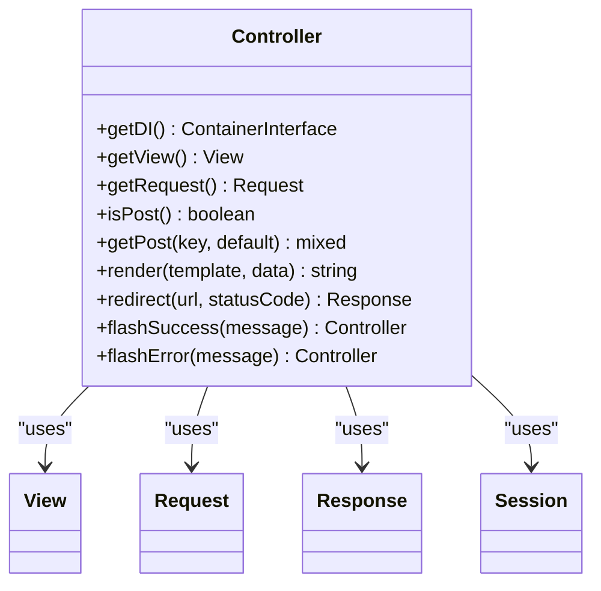
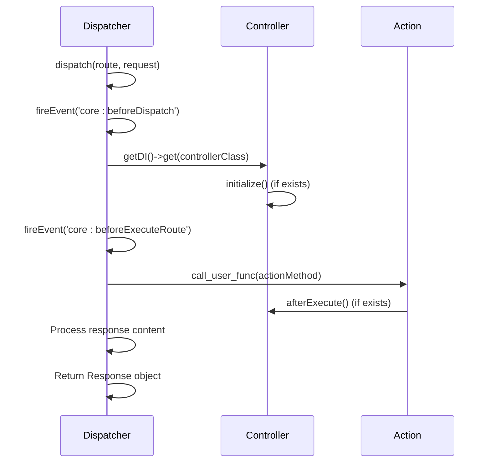
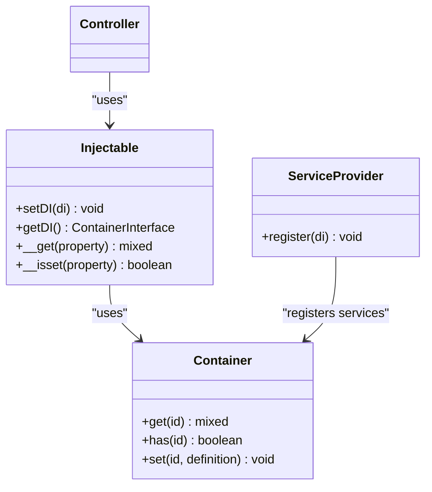
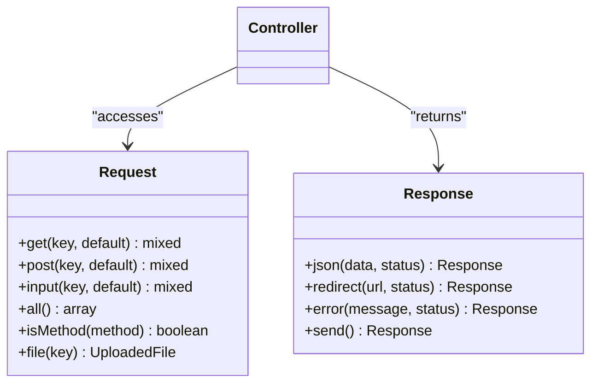
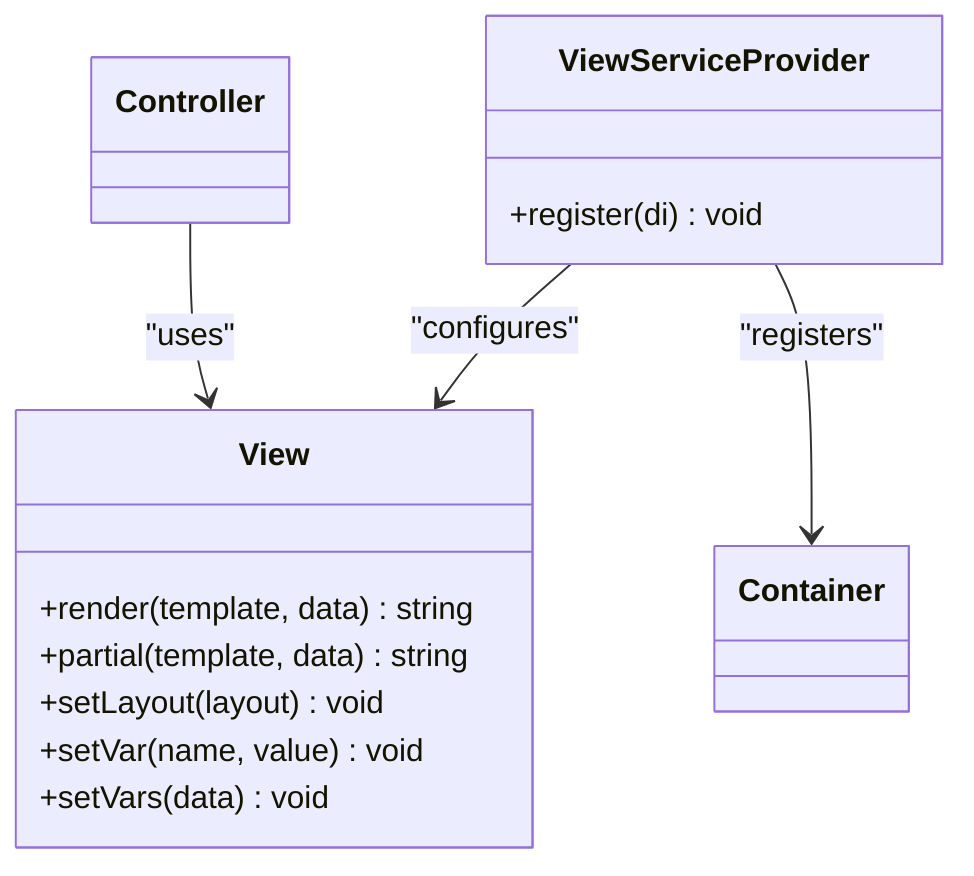
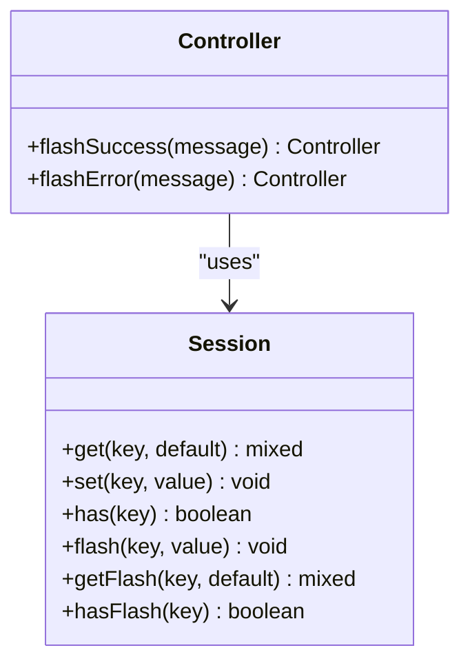
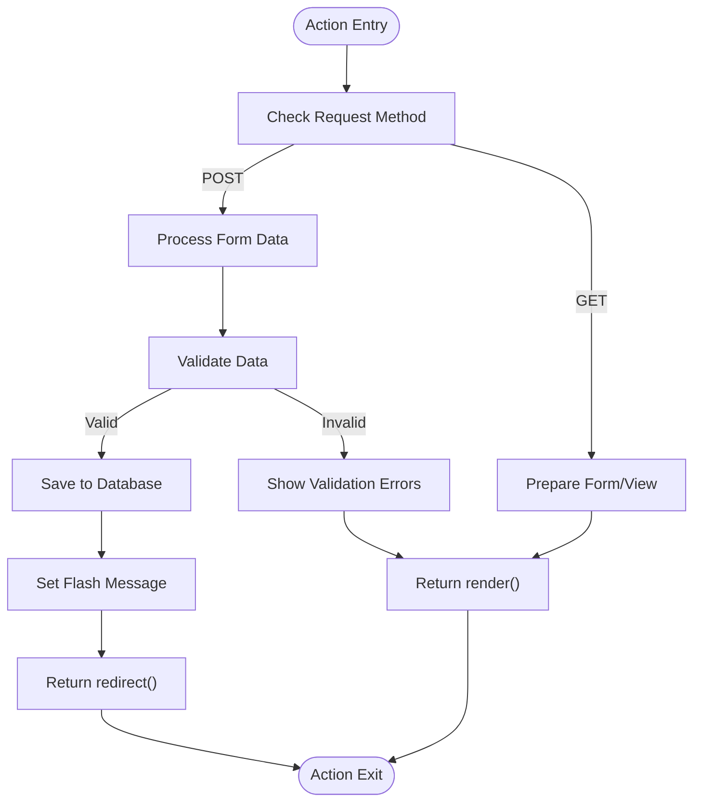

# Controllers

<cite>
**Referenced Files in This Document**   
- [Controller.php](file://app/Core/Mvc/Controller.php)
- [Dispatcher.php](file://app/Core/Mvc/Dispatcher.php)
- [Dashboard.php](file://app/Module/Base/Controller/Dashboard.php)
- [User.php](file://app/Module/Admin/Controller/User.php)
- [Injectable.php](file://app/Core/Di/Injectable.php)
- [View.php](file://app/Core/Mvc/View.php)
- [Request.php](file://app/Core/Http/Request.php)
- [Response.php](file://app/Core/Http/Response.php)
- [Session.php](file://app/Core/Session/Session.php)
- [ViewServiceProvider.php](file://app/Module/Provider/ViewServiceProvider.php)
- [SessionServiceProvider.php](file://app/Module/Provider/SessionServiceProvider.php)
</cite>

## Table of Contents
1. [Introduction](#introduction)
2. [Base Controller Responsibilities](#base-controller-responsibilities)
3. [Dispatcher and Controller Lifecycle](#dispatcher-and-controller-lifecycle)
4. [Accessing DI Services in Controllers](#accessing-di-services-in-controllers)
5. [Request and Response Handling](#request-and-response-handling)
6. [View and Template Management](#view-and-template-management)
7. [Session and Flash Messages](#session-and-flash-messages)
8. [Action Method Implementation](#action-method-implementation)
9. [Best Practices and Common Issues](#best-practices-and-common-issues)
10. [Conclusion](#conclusion)

## Introduction
This document provides a comprehensive overview of the controller implementation within the MVC framework. It details the responsibilities of the base `Controller` class, the role of the `Dispatcher` in routing and instantiation, and demonstrates practical usage through examples from `Dashboard.php` and `User.php`. The documentation covers lifecycle methods, dependency injection (DI) integration, and best practices for handling requests, responses, sessions, and views.

**Section sources**
- [Controller.php](file://app/Core/Mvc/Controller.php#L1-L124)
- [Dispatcher.php](file://app/Core/Mvc/Dispatcher.php#L1-L83)

## Base Controller Responsibilities
The `Controller` class serves as the foundational component in the MVC architecture, providing essential functionality for request handling, service access, and response generation. It leverages the `Injectable` trait to enable automatic dependency injection and service access.

Key responsibilities include:
- Accessing DI services via magic properties or explicit getters
- Handling HTTP requests through helper methods like `isPost()` and `getPost()`
- Managing view rendering via the `render()` method
- Facilitating redirection using the `redirect()` method
- Supporting flash messaging for user feedback

**Diagram sources**
- [Controller.php](file://app/Core/Mvc/Controller.php#L1-L124)
- [Injectable.php](file://app/Core/Di/Injectable.php#L1-L47)

**Section sources**
- [Controller.php](file://app/Core/Mvc/Controller.php#L1-L124)

## Dispatcher and Controller Lifecycle
The `Dispatcher` is responsible for instantiating controllers via the DI container and invoking the appropriate action methods based on the current route. It manages the entire request lifecycle from routing to response generation.

The controller lifecycle follows this sequence:
1. Route resolution and controller class identification
2. Controller instantiation via DI container
3. Execution of `initialize()` if defined
4. Action method invocation
5. Execution of `afterExecute()` if defined
6. Response processing and return

**Diagram sources**
- [Dispatcher.php](file://app/Core/Mvc/Dispatcher.php#L1-L83)

**Section sources**
- [Dispatcher.php](file://app/Core/Mvc/Dispatcher.php#L1-L83)

## Accessing DI Services in Controllers
Controllers access services through the Dependency Injection (DI) container, which is automatically injected via the `Injectable` trait. Services can be accessed in two ways:

1. **Magic property access**: Direct property access (e.g., `$this->request`, `$this->session`)
2. **Explicit getter methods**: Using `getDI()->get('serviceName')`

The DI container is configured through service providers such as `ViewServiceProvider` and `SessionServiceProvider`, which register services with the container during application bootstrap.

**Diagram sources**
- [Injectable.php](file://app/Core/Di/Injectable.php#L1-L47)
- [Container.php](file://app/Core/Di/Container.php#L1-L52)
- [ViewServiceProvider.php](file://app/Module/Provider/ViewServiceProvider.php#L1-L33)
- [SessionServiceProvider.php](file://app/Module/Provider/SessionServiceProvider.php#L1-L38)

**Section sources**
- [Injectable.php](file://app/Core/Di/Injectable.php#L1-L47)
- [ViewServiceProvider.php](file://app/Module/Provider/ViewServiceProvider.php#L1-L33)

## Request and Response Handling
Controllers interact with HTTP requests and responses through dedicated service objects. The `Request` object provides methods for accessing input data, while the `Response` class handles output generation and HTTP headers.

Key request handling methods:
- `getRequest()`: Returns the Request object
- `isPost()`: Checks if request method is POST
- `getPost()`: Retrieves POST data by key
- `input()`: Gets input from POST, JSON, or GET

Response handling is managed through:
- `render()`: Renders a view template with data
- `redirect()`: Creates a redirect response
- Returning arrays: Automatically converted to JSON responses
- Returning Response objects: Used directly as the response

**Diagram sources**
- [Request.php](file://app/Core/Http/Request.php#L1-L170)
- [Response.php](file://app/Core/Http/Response.php#L1-L137)
- [Controller.php](file://app/Core/Mvc/Controller.php#L1-L124)

**Section sources**
- [Request.php](file://app/Core/Http/Request.php#L1-L170)
- [Response.php](file://app/Core/Http/Response.php#L1-L137)

## View and Template Management
The framework's view system enables template rendering with data binding and layout support. Controllers access the view service through the DI container and use the `render()` method to generate HTML output.

Key features:
- Automatic template path resolution based on controller and action names
- Data passing to templates through the second parameter of `render()`
- Layout support with configurable layout templates
- Section-based content composition

The view service is registered by `ViewServiceProvider`, which configures the template path and layout settings from the application configuration.

**Diagram sources**
- [View.php](file://app/Core/Mvc/View.php#L1-L144)
- [ViewServiceProvider.php](file://app/Module/Provider/ViewServiceProvider.php#L1-L33)

**Section sources**
- [View.php](file://app/Core/Mvc/View.php#L1-L144)
- [Controller.php](file://app/Core/Mvc/Controller.php#L1-L124)

## Session and Flash Messages
Controllers manage user sessions and flash messages through the `Session` service. Flash messages provide temporary notifications that persist across a single request cycle.

Key session methods:
- `get()`, `set()`, `has()`: Standard session operations
- `flash()`: Sets a flash message for the next request
- `getFlash()`: Retrieves and clears a flash message
- `hasFlash()`: Checks if a flash message exists

The `flashSuccess()` and `flashError()` helper methods in the `Controller` class provide convenient shortcuts for setting flash messages with predefined types.

**Diagram sources**
- [Session.php](file://app/Core/Session/Session.php#L1-L158)
- [Controller.php](file://app/Core/Mvc/Controller.php#L1-L124)

**Section sources**
- [Session.php](file://app/Core/Session/Session.php#L1-L158)

## Action Method Implementation
Action methods in controllers follow a naming convention where the method name is suffixed with `Action` (e.g., `indexAction`). These methods are invoked by the dispatcher and should return content that will be converted to a response.

Examples from the codebase:

**Dashboard Controller** (`Dashboard.php`):
- `indexAction()`: Renders dashboard view with navigation and statistics data
- Demonstrates data preparation and view rendering

**User Controller** (`User.php`):
- `indexAction()`: Lists all users
- `createAction()`: Handles user creation form and POST processing
- `editAction()`: Manages user editing with form population
- `deleteAction()`: Processes user deletion with redirection

Best practices demonstrated:
- Returning rendered views for HTML responses
- Using `redirect()` for post-redirect-get pattern
- Setting flash messages for user feedback
- Accessing request data through controller helpers

**Diagram sources**
- [Dashboard.php](file://app/Module/Base/Controller/Dashboard.php#L1-L37)
- [User.php](file://app/Module/Admin/Controller/User.php#L1-L81)

**Section sources**
- [Dashboard.php](file://app/Module/Base/Controller/Dashboard.php#L1-L37)
- [User.php](file://app/Module/Admin/Controller/User.php#L1-L81)

## Best Practices and Common Issues
### Best Practices
1. **Action Naming**: Use descriptive names ending with `Action` (e.g., `createAction`, `editAction`)
2. **Parameter Handling**: Use `getParam()` from the dispatcher for route parameters
3. **Error Responses**: Return appropriate HTTP status codes and error messages
4. **Data Validation**: Validate input data before processing
5. **Flash Messages**: Use flash messages for user feedback after form submissions

### Common Issues and Solutions
1. **Method Not Found**: Ensure action methods end with `Action` suffix
2. **DI Service Access**: Verify service names match those registered in the container
3. **Response Termination**: Always return the response (redirect, render, or Response object)
4. **Template Paths**: Follow the module/controller/action directory structure
5. **Session Access**: Ensure session service is properly registered and started

**Section sources**
- [Controller.php](file://app/Core/Mvc/Controller.php#L1-L124)
- [Dispatcher.php](file://app/Core/Mvc/Dispatcher.php#L1-L83)
- [User.php](file://app/Module/Admin/Controller/User.php#L1-L81)

## Conclusion
The controller implementation in this MVC framework provides a robust foundation for handling HTTP requests and generating responses. By leveraging dependency injection, the system enables clean separation of concerns while maintaining flexibility and testability. The integration of lifecycle methods, service access, and response handling patterns creates a consistent and predictable development experience. Following the demonstrated best practices ensures maintainable and scalable controller code.