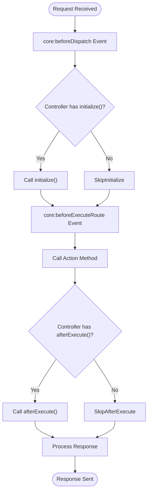
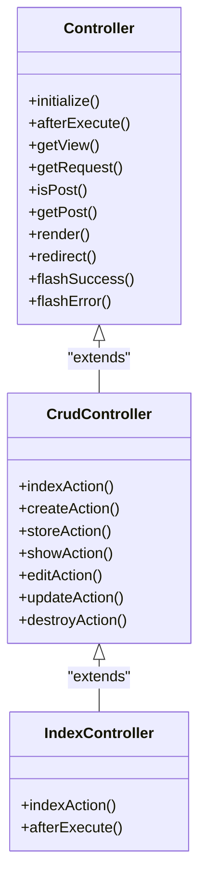
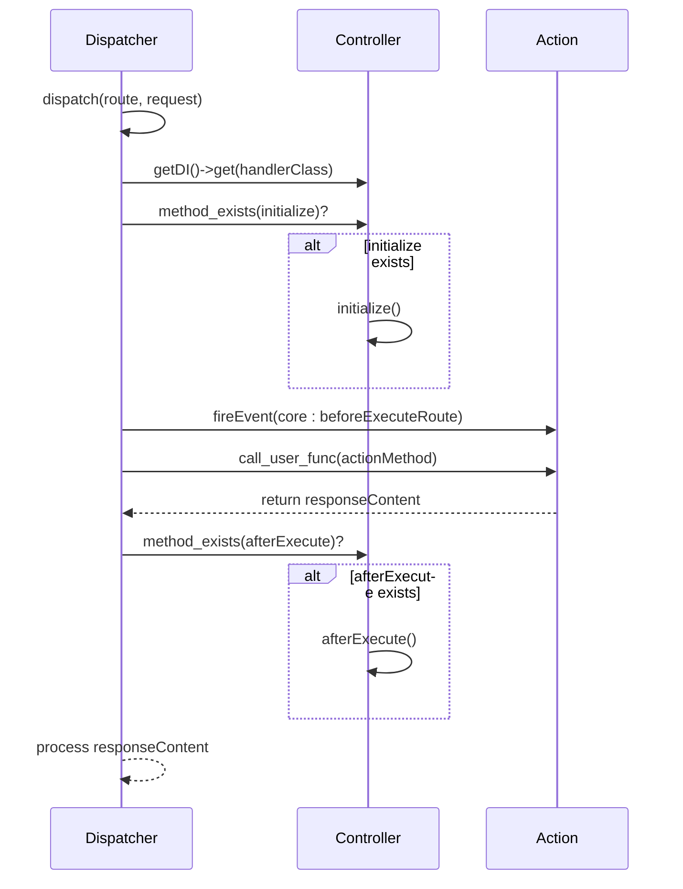

# Lifecycle Callbacks

<cite>
**Referenced Files in This Document**   
- [Controller.php](file://app\Core\Mvc\Controller.php) - *Base controller implementation*
- [Dispatcher.php](file://app\Core\Mvc\Dispatcher.php) - *Lifecycle management*
- [CrudController.php](file://app\Core\Mvc\CrudController.php) - *Enterprise CRUD implementation*
- [Index.php](file://app\Module\Base\Controller\Index.php) - *Implementation example*
</cite>

## Update Summary
**Changes Made**   
- Added comprehensive analysis of lifecycle callbacks in enterprise CRUD context
- Updated documentation to reflect new CrudController implementation
- Enhanced examples with enterprise-level patterns
- Added detailed explanation of lifecycle method inheritance
- Updated source tracking with new file references

## Table of Contents
1. [Introduction](#introduction)
2. [Lifecycle Callback Overview](#lifecycle-callback-overview)
3. [initialize() Method](#initialize-method)
4. [afterExecute() Method](#afterexecute-method)
5. [Dispatcher Lifecycle Management](#dispatcher-lifecycle-management)
6. [Implementation Examples](#implementation-examples)
7. [Common Issues and Best Practices](#common-issues-and-best-practices)

## Introduction
This document provides comprehensive documentation for controller lifecycle callbacks in the MVC framework. It details the `initialize()` and `afterExecute()` methods, their execution timing, use cases, implementation patterns, and integration with the Dispatcher component. The lifecycle callbacks enable developers to execute code at specific points during request processing, facilitating cross-cutting concerns such as authentication, logging, and resource management. This documentation has been updated to reflect the enterprise-level CRUD implementation introduced in the framework.

## Lifecycle Callback Overview
The framework provides two primary lifecycle callback methods that controllers can implement to hook into the request processing flow:

- **initialize()**: Executed before the action method is dispatched
- **afterExecute()**: Executed after the action method completes

These callbacks are automatically detected and invoked by the Dispatcher, allowing for consistent application-wide behavior without requiring explicit method calls in each action. The introduction of the enterprise-level `CrudController` has enhanced the lifecycle callback system by providing a robust foundation for CRUD operations while maintaining the flexibility of the base lifecycle methods.



**Diagram sources**
- [Dispatcher.php](file://app\Core\Mvc\Dispatcher.php#L30-L55)

**Section sources**
- [Controller.php](file://app\Core\Mvc\Controller.php#L17-L18)
- [Dispatcher.php](file://app\Core\Mvc\Dispatcher.php#L30-L55)

## initialize() Method
The `initialize()` method is called by the Dispatcher before the action method is executed. This callback provides an opportunity to perform setup operations that should occur for all actions within a controller. In the context of the enterprise-level `CrudController`, this method is particularly important for setting up CRUD-specific configurations and validations.

### Execution Timing
The `initialize()` method is invoked immediately after the controller instance is created via the Dependency Injector and before the `core:beforeExecuteRoute` event is fired. This ensures that initialization logic runs prior to any action-specific code. In the `CrudController` implementation, this timing allows for early validation of model classes and route configurations.

### Common Use Cases
- Authentication checks and user session validation
- Permission and authorization validation
- Resource initialization (database connections, service instances)
- Request preprocessing and parameter validation
- Setting up controller-specific configurations
- Validating CRUD configuration (model class, form class, service class)

### Implementation Notes
The base Controller class includes a commented prototype of the `initialize()` method, indicating that it should be implemented by child classes when needed. The method signature should be public and take no parameters. When extending `CrudController`, the `initialize()` method can be used to set up CRUD-specific configurations before any CRUD operations are performed.

**Section sources**
- [Controller.php](file://app\Core\Mvc\Controller.php#L17)
- [Dispatcher.php](file://app\Core\Mvc\Dispatcher.php#L38)
- [CrudController.php](file://app\Core\Mvc\CrudController.php#L25-L30)

## afterExecute() Method
The `afterExecute()` method is called by the Dispatcher after the action method has completed execution. This callback enables post-processing operations and cleanup tasks. In the enterprise CRUD implementation, this method is crucial for audit logging, response modification, and ensuring proper cleanup after CRUD operations.

### Execution Timing
The `afterExecute()` method is invoked after the action method returns its result but before the response is finalized. It executes after the `core:afterExecuteRoute` event would typically be fired, making it the final opportunity to modify the response or perform cleanup within the controller context. This timing is particularly important in CRUD operations where final response formatting and logging must occur after all business logic has completed.

### Common Use Cases
- Audit logging and activity tracking
- Response modification and formatting
- Resource cleanup and connection closing
- Performance monitoring and timing
- Transaction finalization
- Post-CRUD operation processing

### Implementation Notes
The base Controller class includes a commented prototype of the `afterExecute()` method. When implementing this method in child controllers, it's important to call the parent method using `parent::afterExecute()` to ensure proper inheritance chain execution. In the `CrudController` context, this ensures that any enterprise-level post-processing is properly executed.



**Diagram sources**
- [Controller.php](file://app\Core\Mvc\Controller.php#L18)
- [CrudController.php](file://app\Core\Mvc\CrudController.php#L15-L20)
- [Index.php](file://app\Module\Base\Controller\Index.php#L17-L21)

**Section sources**
- [Controller.php](file://app\Core\Mvc\Controller.php#L18)
- [CrudController.php](file://app\Core\Mvc\CrudController.php#L15-L20)
- [Index.php](file://app\Module\Base\Controller\Index.php#L17-L21)

## Dispatcher Lifecycle Management
The Dispatcher component is responsible for managing the controller lifecycle and invoking the callback methods conditionally based on their existence in the controller class. The enterprise CRUD implementation has not changed the fundamental lifecycle management but has enhanced its utility by providing a more robust foundation for CRUD operations.

### Conditional Method Invocation
The Dispatcher uses PHP's `method_exists()` function to check for the presence of lifecycle methods before invoking them. This approach avoids the need for interface enforcement while still providing the flexibility of optional callbacks. This mechanism works seamlessly with both the base Controller and the enterprise CrudController.

### Execution Flow
1. Instantiate the controller via Dependency Injector
2. Check for `initialize()` method and invoke if present
3. Execute the target action method
4. Check for `afterExecute()` method and invoke if present
5. Process the action's return value into a response

### Event Integration
The lifecycle callbacks work in conjunction with the framework's event system, providing a lower-level, controller-specific hooking mechanism that complements the broader event system. This integration is particularly valuable in the enterprise CRUD implementation where both lifecycle callbacks and events can be used for comprehensive request processing.



**Diagram sources**
- [Dispatcher.php](file://app\Core\Mvc\Dispatcher.php#L30-L55)

**Section sources**
- [Dispatcher.php](file://app\Core\Mvc\Dispatcher.php#L30-L55)

## Implementation Examples
### Authentication in initialize()
```php
public function initialize()
{
    // Check if user is authenticated
    $session = $this->getDI()->get('session');
    if (!$session->has('user_id')) {
        $this->flashError('Please log in to access this section.');
        $this->redirect('/auth/login');
        return;
    }
    
    // Check user permissions
    $userRole = $session->get('user_role');
    if ($userRole !== 'admin') {
        $this->flashError('Insufficient permissions.');
        $this->redirect('/dashboard');
        return;
    }
    
    // Initialize resources
    $this->userService = $this->getDI()->get('userService');
    
    // Validate CRUD configuration
    if (!$this->modelClass) {
        throw new Exception("Model class must be defined in " . static::class);
    }
}
```

### Audit Logging in afterExecute()
```php
public function afterExecute()
{
    // Log the action execution
    $logger = $this->getDI()->get('logger');
    $request = $this->getRequest();
    $dispatcher = $this->getDI()->get('dispatcher');
    
    $logData = [
        'timestamp' => date('Y-m-d H:i:s'),
        'ip' => $request->getClientAddress(),
        'user_id' => $this->getDI()->get('session')->get('user_id'),
        'controller' => $dispatcher->getControllerName(),
        'action' => $dispatcher->getActionName(),
        'method' => $request->getMethod(),
        'url' => $request->getUri()
    ];
    
    $logger->info('Action executed', $logData);
    
    // Call parent to ensure proper inheritance
    parent::afterExecute();
}
```

**Section sources**
- [Dispatcher.php](file://app\Core\Mvc\Dispatcher.php#L38)
- [Dispatcher.php](file://app\Core\Mvc\Dispatcher.php#L52)
- [CrudController.php](file://app\Core\Mvc\CrudController.php#L25-L30)

## Common Issues and Best Practices
### Method Signature Errors
Ensure that lifecycle callback methods have the correct signature:
- Both methods should be `public`
- Neither method should accept parameters
- Return type should be `void` or omitted

### Unintended Side Effects
Avoid performing operations in `initialize()` that might prevent the action from executing, such as:
- Direct output (echo, print)
- Calling `exit()` or `die()`
- Throwing uncaught exceptions
- Sending headers prematurely

### Parent Method Calls
When extending controllers that may have their own `afterExecute()` implementation, always call the parent method:

```php
public function afterExecute(): void
{
    // Your custom logic here
    
    // Always call parent
    parent::afterExecute();
}
```

### Performance Considerations
- Keep initialization logic lightweight to avoid slowing down all requests
- Cache expensive operations when possible
- Use lazy loading for resources that may not be needed by all actions
- In CRUD controllers, consider caching model instances and service objects

### Error Handling
Implement try-catch blocks in lifecycle methods to prevent exceptions from disrupting the entire request flow:

```php
public function initialize()
{
    try {
        // Initialization logic
    } catch (\Exception $e) {
        // Log the error
        $this->getDI()->get('logger')->error($e->getMessage());
        // Handle gracefully
        $this->flashError('System error, please try again.');
        $this->redirect('/error');
    }
}
```

**Section sources**
- [Controller.php](file://app\Core\Mvc\Controller.php#L17-L18)
- [Dispatcher.php](file://app\Core\Mvc\Dispatcher.php#L38-L52)
- [Index.php](file://app\Module\Base\Controller\Index.php#L21)
- [CrudController.php](file://app\Core\Mvc\CrudController.php#L25-L30)