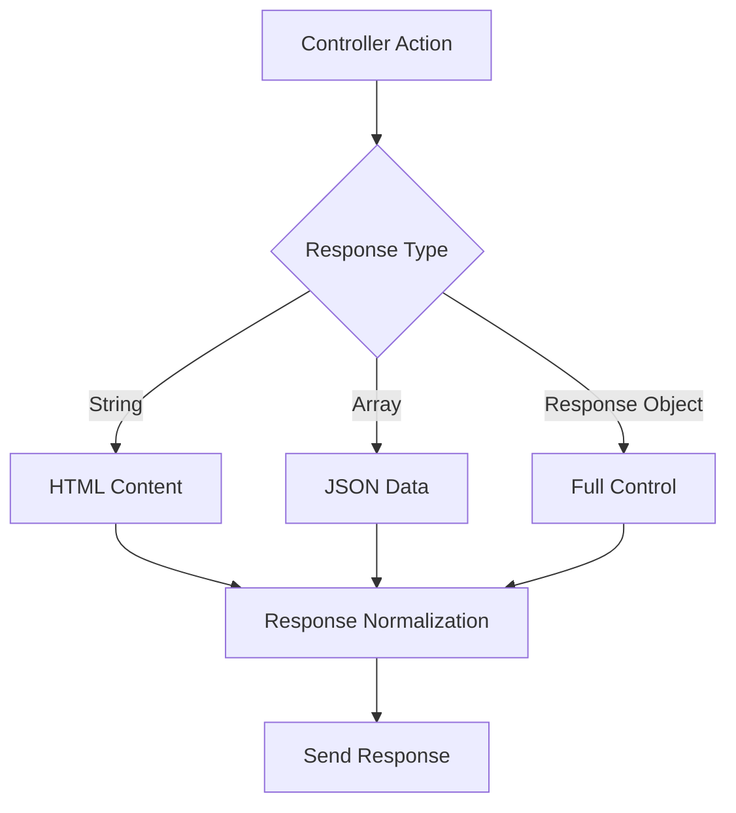
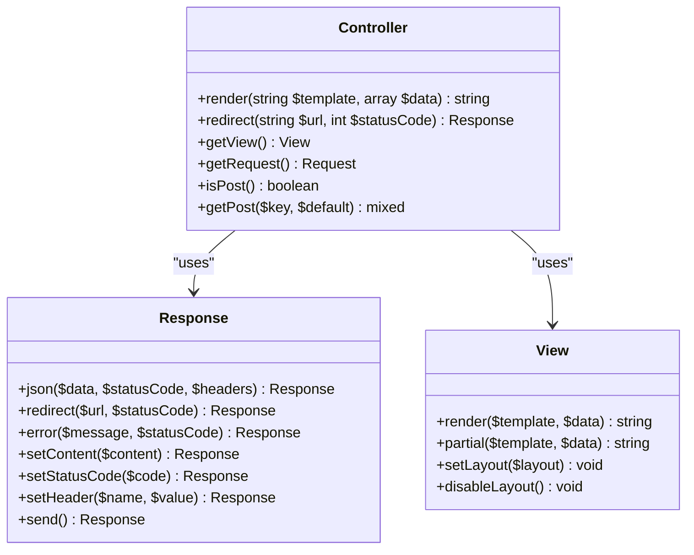
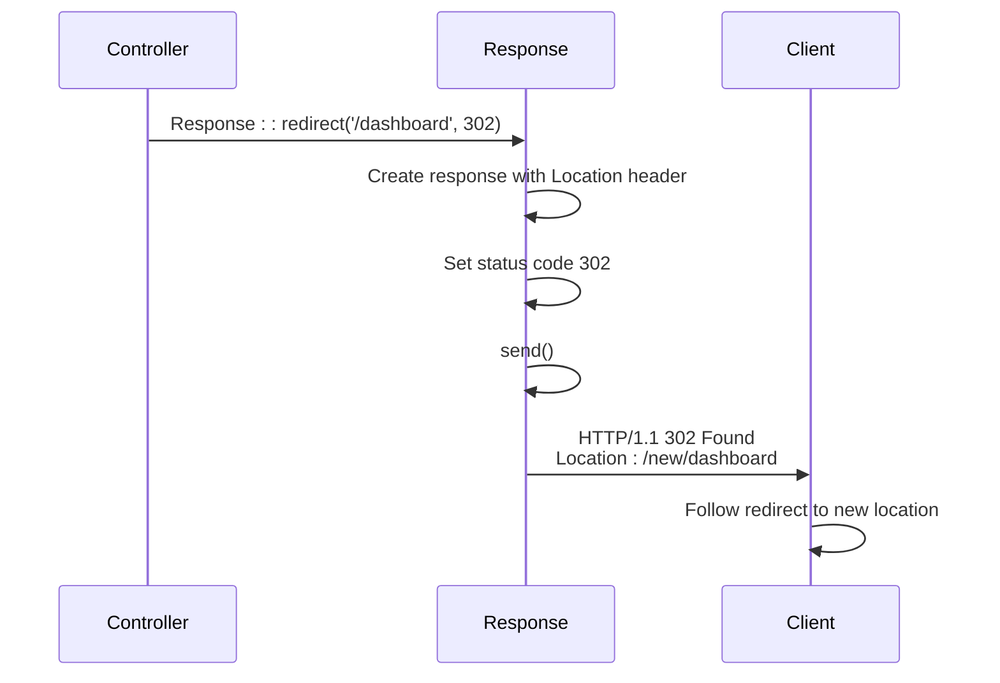
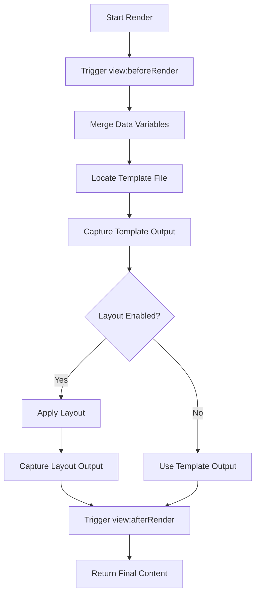
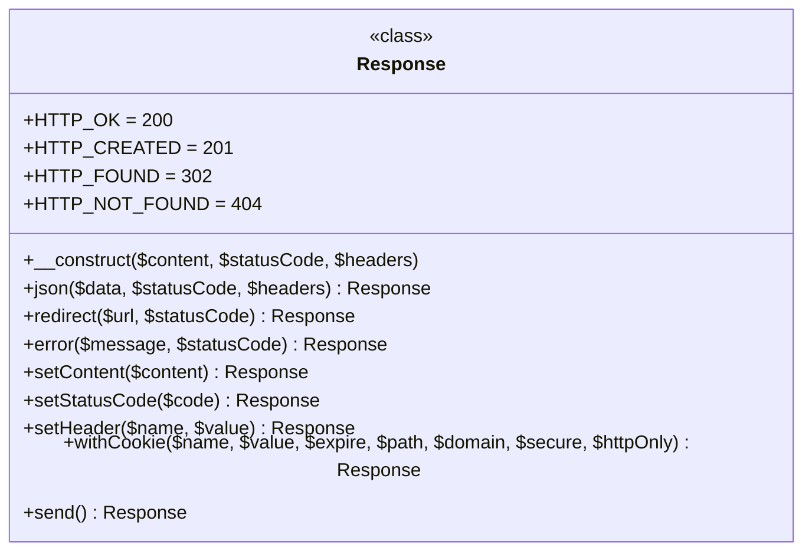
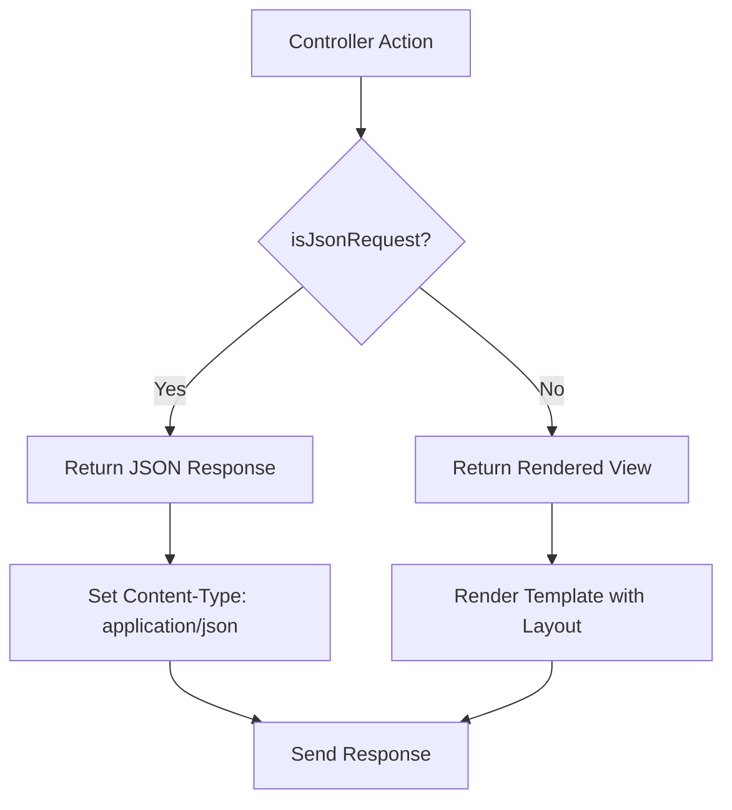

# Response Handling and Redirection

<cite>
**Referenced Files in This Document**   
- [Controller.php](file://app\Core\Mvc\Controller.php) - *Updated in recent commit*
- [Response.php](file://app\Core\Http\Response.php) - *Updated in recent commit*
- [CrudController.php](file://app\Core\Mvc\CrudController.php) - *Added in recent commit*
- [View.php](file://app\Core\Mvc\View.php)
- [Dashboard.php](file://app\Module\Base\Controller\Dashboard.php)
</cite>

## Update Summary
**Changes Made**   
- Updated **AJAX Response Handling** section to reflect new `jsonResponse()` method and content negotiation in `CrudController`
- Added new **Content Negotiation in CRUD Operations** section to document enterprise-level CRUD improvements
- Enhanced **Response Generation Framework** with updated return type information (`string|Response`)
- Updated **Controller Helper Methods** to reflect actual implementation details
- Revised **Troubleshooting Common Issues** with new information about JSON response handling
- Added new diagram for content negotiation flow in CRUD operations

## Table of Contents
1. [Introduction](#introduction)
2. [Response Generation Framework](#response-generation-framework)
3. [Controller Helper Methods](#controller-helper-methods)
4. [Redirect Implementation](#redirect-implementation)
5. [View Rendering Process](#view-rendering-process)
6. [Response Class Capabilities](#response-class-capabilities)
7. [Best Practices](#best-practices)
8. [AJAX Response Handling](#ajax-response-handling)
9. [Content Negotiation in CRUD Operations](#content-negotiation-in-crud-operations)
10. [Troubleshooting Common Issues](#troubleshooting-common-issues)

## Introduction
This document provides comprehensive documentation on response generation and redirection mechanisms within the MVC framework. It covers the complete response handling workflow from controller actions to final output delivery, including view rendering, HTTP redirection, and direct response object manipulation. The framework supports multiple response types including HTML content, JSON data, and full Response objects with complete control over status codes and headers.

## Response Generation Framework

The framework implements a flexible response generation system that allows controllers to return different types of responses based on the use case. The primary response types include:

- **String responses** for HTML content
- **Array responses** for JSON data
- **Response objects** for complete control over HTTP response

The  class handles response normalization, ensuring that all controller outputs are properly converted to Response objects before being sent to the client. This allows for consistent response handling regardless of the return type from controller actions. With the introduction of `CrudController`, actions can now return either a string (for HTML views) or a Response object (for JSON APIs or redirects), indicated by the return type `string|Response`.



**Diagram sources**
- [Controller.php](file://app\Core\Mvc\Controller.php#L61-L101)
- [Response.php](file://app\Core\Http\Response.php#L0-L41)
- [.php](file://app\Core\Mvc\.php#L40-L70)

**Section sources**
- [Controller.php](file://app\Core\Mvc\Controller.php#L9-L124)
- [Response.php](file://app\Core\Http\Response.php#L4-L137)

## Controller Helper Methods

The base Controller class provides two primary helper methods for response generation: `render()` for view rendering and `redirect()` for HTTP redirection. These methods simplify common response patterns while maintaining the flexibility to return different response types.

### Render Method
The `render()` method handles view template rendering with data binding. It accepts an optional template path and data array, returning the rendered HTML content as a string. When no template is specified, it automatically determines the template path based on the current controller and action.

### Redirect Method
The `redirect()` method creates HTTP redirect responses with configurable status codes. It constructs the full URL by prefixing '/new' to the provided path and returns a Response object that immediately sends the redirect headers.



**Diagram sources**
- [Controller.php](file://app\Core\Mvc\Controller.php#L9-L124)
- [Response.php](file://app\Core\Http\Response.php#L4-L137)
- [View.php](file://app\Core\Mvc\View.php#L8-L120)

**Section sources**
- [Controller.php](file://app\Core\Mvc\Controller.php#L61-L101)

## Redirect Implementation

The redirect functionality is implemented through a combination of controller helper methods and static factory methods in the Response class. The process follows a specific pattern to ensure immediate response delivery and prevent further execution.

### Redirect Method Chain
The `redirect()` method in the Controller class creates a redirect response by calling the static `Response::redirect()` factory method, which immediately sends the response using the `send()` method. This ensures that the redirect is processed immediately without requiring additional method calls.

### URL Construction
The framework automatically prefixes '/new' to all redirect URLs, ensuring proper routing within the application context. This prefix can be configured based on the deployment environment.



**Diagram sources**
- [Controller.php](file://app\Core\Mvc\Controller.php#L89-L92)
- [Response.php](file://app\Core\Http\Response.php#L40-L44)

**Section sources**
- [Controller.php](file://app\Core\Mvc\Controller.php#L89-L92)
- [Response.php](file://app\Core\Http\Response.php#L40-L44)

## View Rendering Process

The view rendering system follows a structured process to transform templates into HTML output with bound data. The process involves template location, data binding, layout application, and event triggering.

### Template Resolution
The framework resolves template paths based on a standardized directory structure. Templates are located in the `app/views` directory with a module-based organization. The system automatically determines the correct template path based on the controller and action names.

### Data Binding
Data passed to the render method is merged with existing view variables and made available to the template through PHP's `extract()` function. This allows templates to access data variables directly by name.

### Layout System
The view system supports layouts that wrap content templates. By default, the 'default' layout is applied, but controllers can specify alternative layouts or disable layouts entirely.



**Diagram sources**
- [View.php](file://app\Core\Mvc\View.php#L8-L120)
- [Dashboard.php](file://app\Module\Base\Controller\Dashboard.php#L10-L37)

**Section sources**
- [View.php](file://app\Core\Mvc\View.php#L8-L120)
- [Dashboard.php](file://app\Module\Base\Controller\Dashboard.php#L10-L37)

## Response Class Capabilities

The Response class provides comprehensive control over HTTP responses with methods for setting status codes, headers, content, and cookies. It supports various response types through static factory methods and instance methods.

### Static Factory Methods
The class provides several static factory methods for common response patterns:
- `json()` - Creates JSON responses with proper content type
- `redirect()` - Creates redirect responses with Location header
- `error()` - Creates error responses with customizable messages

### Instance Methods
Instance methods allow for fine-grained control over response properties:
- `setContent()` - Sets the response body content
- `setStatusCode()` - Sets the HTTP status code
- `setHeader()` - Adds or modifies response headers
- `withCookie()` - Adds Set-Cookie headers
- `send()` - Sends the complete response to the client



**Diagram sources**
- [Response.php](file://app\Core\Http\Response.php#L4-L137)

**Section sources**
- [Response.php](file://app\Core\Http\Response.php#L4-L137)

## Best Practices

### Response Termination
Always ensure that responses are properly terminated, especially for redirects. The framework's `redirect()` method automatically sends the response, but custom responses should call `send()` to prevent further execution.

### Output Before Redirects
Avoid sending any output before redirects, as this can prevent header modification. The framework's immediate send pattern helps prevent this issue by sending headers as soon as the redirect is created.

### Status Code Usage
Use appropriate HTTP status codes for different scenarios:
- 200 OK for successful requests
- 201 Created for resource creation
- 301 Moved Permanently for permanent redirects
- 302 Found for temporary redirects
- 400 Bad Request for client errors
- 404 Not Found for missing resources
- 500 Internal Server Error for server errors

### Data Validation
Always validate data before using it in responses, especially when constructing URLs or including user input in output. This prevents security vulnerabilities such as open redirect attacks.

## AJAX Response Handling

The framework provides specific patterns for handling AJAX requests through the `isJsonRequest()` method in CrudController and related response methods. This allows controllers to return different response types based on the request format.

### JSON Response Pattern
Controllers can detect AJAX requests and return JSON responses instead of HTML content. The `jsonResponse()` helper method simplifies this process by creating properly formatted JSON responses with appropriate headers.

### Conditional Response Logic
The typical pattern involves checking the request type and returning either a rendered view for regular requests or a JSON response for AJAX requests:



**Diagram sources**
- [CrudController.php](file://app\Core\Mvc\CrudController.php#L354-L357)
- [UserResourceController.php](file://app\Module\Admin\Controller\UserResourceController.php#L13-L72)

**Section sources**
- [CrudController.php](file://app\Core\Mvc\CrudController.php#L314-L318)
- [UserResourceController.php](file://app\Module\Admin\Controller\UserResourceController.php#L50-L72)

## Content Negotiation in CRUD Operations

The enhanced CRUD system implements enterprise-level content negotiation, automatically determining the appropriate response format based on the request type. This allows a single controller to serve both HTML and JSON APIs without code duplication.

### Request Detection
The `isJsonRequest()` method in `CrudController` detects API requests through multiple indicators:
- AJAX requests (X-Requested-With header)
- Accept header set to application/json
- Format parameter in query string

### Standardized Response Format
JSON responses follow a consistent format with success status, data payload, and optional messages:
```json
{
    "success": true,
    "data": {...},
    "message": "Operation completed successfully"
}
```

### Error Response Handling
The system provides comprehensive error responses with appropriate HTTP status codes and detailed error information:
```json
{
    "success": false,
    "error": "Validation failed",
    "details": {...}
}
```

```mermaid
flowchart TD
A[CRUD Controller Action] --> B{isJsonRequest?}
B --> |Yes| C[Build JSON Response]
B --> |No| D[Build HTML Response]
C --> E[Use jsonResponse() helper]
E --> F[Set Content-Type: application/json]
F --> G[Send JSON Response]
D --> H[Use render() helper]
H --> I[Return HTML Content]
I --> J[Send HTML Response]
G --> K[Response Sent]
J --> K
```

**Diagram sources**
- [CrudController.php](file://app\Core\Mvc\CrudController.php#L354-L375)
- [Response.php](file://app\Core\Http\Response.php#L100-L137)

**Section sources**
- [CrudController.php](file://app\Core\Mvc\CrudController.php#L354-L414)
- [Response.php](file://app\Core\Http\Response.php#L100-L137)

## Troubleshooting Common Issues

### Redirect Loops
Redirect loops typically occur when redirect conditions are not properly terminated or when authentication checks redirect back to the same page. To prevent loops:
- Ensure redirect conditions have proper exit points
- Use session flags to track redirect states
- Implement maximum redirect counts
- Verify URL construction logic

### Missing Output
Missing output issues often stem from:
- Early response termination with `send()`
- Output buffering issues
- Exception handling that suppresses output
- Layout or template file not found errors

### Headers Already Sent
This error occurs when output is sent before headers can be modified. Prevention strategies include:
- Avoiding echo/print statements in controller logic
- Ensuring no whitespace before PHP opening tags
- Using the framework's response methods consistently
- Checking for output from included files

### JSON Encoding Errors
When returning JSON responses, ensure that:
- Data is properly sanitized
- Special characters are handled correctly
- Large datasets are paginated
- Circular references are avoided in object graphs
- Validation errors are properly formatted in responses

**Section sources**
- [Response.php](file://app\Core\Http\Response.php#L100-L137)
- [CrudController.php](file://app\Core\Mvc\CrudController.php#L371-L414)
- [Controller.php](file://app\Core\Mvc\Controller.php#L102-L124)