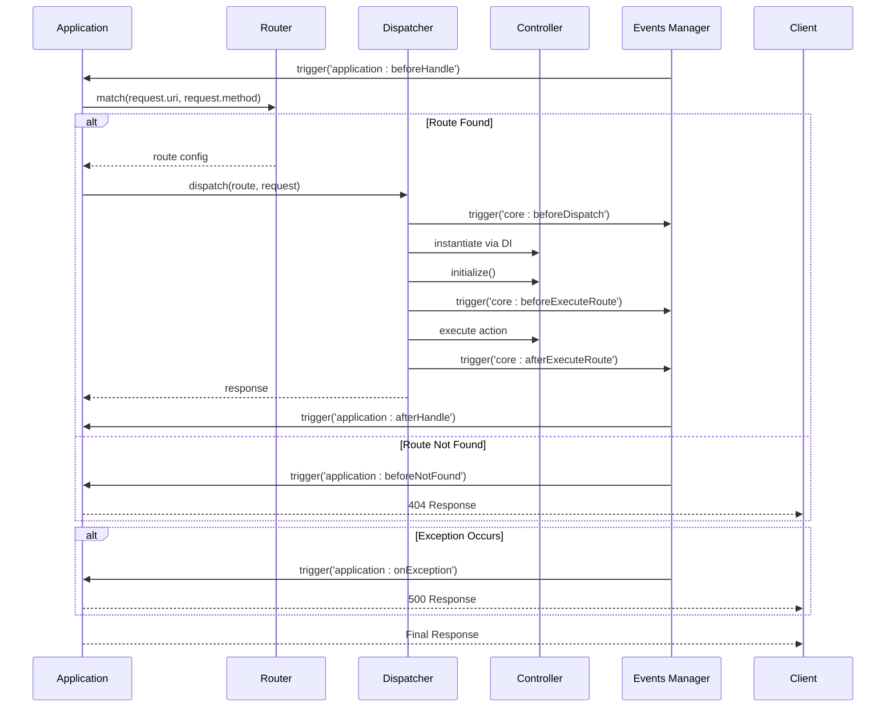
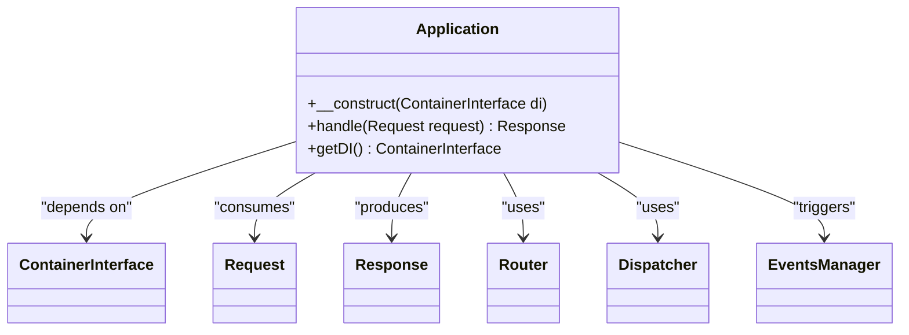
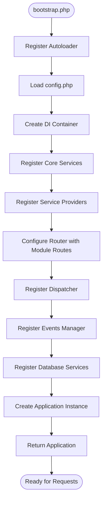
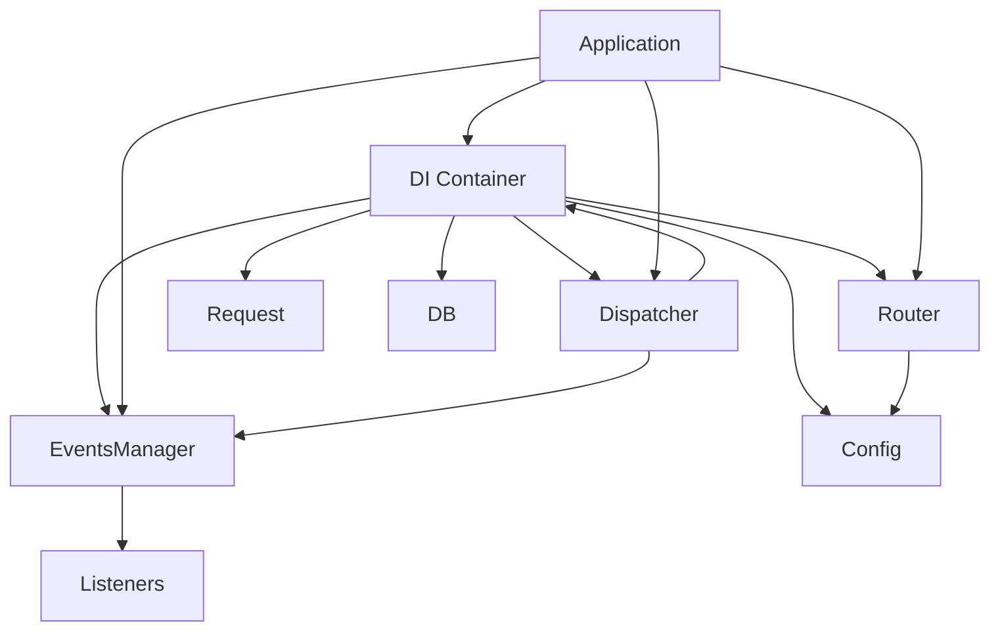

# Application Lifecycle

<cite>
**Referenced Files in This Document**  
- [Application.php](file://app/Core/Mvc/Application.php)
- [bootstrap.php](file://app/bootstrap.php)
- [Router.php](file://app/Core/Mvc/Router.php)
- [Dispatcher.php](file://app/Core/Mvc/Dispatcher.php)
- [Manager.php](file://app/Core/Events/Manager.php)
- [usign-app.php](file://examples/usign-app.php)
</cite>

## Table of Contents
1. [Introduction](#introduction)
2. [Project Structure](#project-structure)
3. [Core Components](#core-components)
4. [Architecture Overview](#architecture-overview)
5. [Detailed Component Analysis](#detailed-component-analysis)
6. [Dependency Analysis](#dependency-analysis)
7. [Performance Considerations](#performance-considerations)
8. [Troubleshooting Guide](#troubleshooting-guide)
9. [Conclusion](#conclusion)

## Introduction
The Application component serves as the central orchestrator of the framework's request lifecycle. It coordinates the entire flow from request reception to response dispatch by initializing the Dependency Injection (DI) container, registering service providers, and managing interactions between the Router, Dispatcher, and Controller components. This document details the bootstrapping process, request handling sequence, public API methods, lifecycle events, configuration patterns, and error handling mechanisms. A real-world example from `usign-app.php` demonstrates the complete setup and execution flow.

## Project Structure
The project follows a modular MVC architecture with clear separation of concerns. The core framework components reside in `app/Core`, while application modules are located in `app/Module`. The `Application` class is the central component in the MVC subsystem, coordinating the request lifecycle. Service providers for session, cookie, and view are registered during bootstrap, and routes are defined per module in the configuration.

```mermaid
graph TD
A[public/index.php] --> B[app/bootstrap.php]
B --> C[DI Container]
C --> D[Service Providers]
C --> E[Router]
C --> F[Dispatcher]
C --> G[Events Manager]
C --> H[Application]
H --> I[Request Handling]
I --> J[Router.match()]
J --> K[Dispatcher.dispatch()]
K --> L[Controller Execution]
L --> M[Response]
```

**Diagram sources**  
- [bootstrap.php](file://app/bootstrap.php#L1-L56)
- [Application.php](file://app/Core/Mvc/Application.php#L1-L70)

**Section sources**  
- [bootstrap.php](file://app/bootstrap.php#L1-L56)
- [Application.php](file://app/Core/Mvc/Application.php#L1-L70)

## Core Components
The Application component is initialized with a DI container and acts as the central coordinator of the request lifecycle. It relies on the Router to match incoming requests to routes, the Dispatcher to invoke the appropriate controller actions, and the Events Manager to trigger lifecycle events. The DI container is used throughout the process to resolve dependencies and manage service instances. The Application class exposes methods to access the DI container and handle incoming requests, forming the backbone of the framework's execution flow.

**Section sources**  
- [Application.php](file://app/Core/Mvc/Application.php#L9-L70)
- [bootstrap.php](file://app/bootstrap.php#L38-L56)

## Architecture Overview
The Application component orchestrates the request lifecycle by coordinating the Router, Dispatcher, and Controller components through the DI container. The process begins with bootstrapping via `bootstrap.php`, which sets up the DI container, registers service providers, and configures core services. When a request arrives, the Application's `handle()` method is called, triggering a sequence of operations: route matching, controller dispatching, action execution, and response rendering. Lifecycle events are triggered at key points in the process, allowing for extensibility and cross-cutting concerns.



**Diagram sources**  
- [Application.php](file://app/Core/Mvc/Application.php#L20-L70)
- [Router.php](file://app/Core/Mvc/Router.php#L30-L50)
- [Dispatcher.php](file://app/Core/Mvc/Dispatcher.php#L15-L50)
- [Manager.php](file://app/Core/Events/Manager.php#L50-L70)

## Detailed Component Analysis

### Application Class Analysis
The Application class serves as the central orchestrator of the framework's request lifecycle. It is initialized with a DI container and registers itself as a service named 'application'. The `handle()` method is the primary entry point for processing requests, coordinating the interaction between the Router, Dispatcher, and Events Manager components.

#### Public Methods


**Diagram sources**  
- [Application.php](file://app/Core/Mvc/Application.php#L9-L70)

**Section sources**  
- [Application.php](file://app/Core/Mvc/Application.php#L9-L70)

### Bootstrap Process Analysis
The bootstrap process initializes the framework by setting up autoloading, loading configuration, creating the DI container, and registering core services and service providers. The process culminates in the creation of the Application instance, which becomes the central coordinator of the request lifecycle.

#### Bootstrap Sequence


**Diagram sources**  
- [bootstrap.php](file://app/bootstrap.php#L1-L56)

**Section sources**  
- [bootstrap.php](file://app/bootstrap.php#L1-L56)

### Request Lifecycle Analysis
The request lifecycle begins when the Application's `handle()` method is invoked with a Request object. The process involves several stages: pre-handling, route matching, dispatching, post-handling, and response preparation. At each stage, the Events Manager triggers appropriate events, allowing for interception and modification of the flow.

#### Request Handling Flow
```mermaid
flowchart TD
Start([handle()]) --> BeforeHandle["trigger('application:beforeHandle')"]
BeforeHandle --> Match["Router.match(uri, method)"]
Match --> RouteFound{"Route Found?"}
RouteFound --> |Yes| Dispatch["Dispatcher.dispatch(route, request)"]
RouteFound --> |No| BeforeNotFound["trigger('application:beforeNotFound')"]
BeforeNotFound --> NotFound["Return 404 Response"]
Dispatch --> ResponseType{"Response Type?"}
ResponseType --> |Response Object| Direct["Use as-is"]
ResponseType --> |Other| Wrap["Wrap in Response"]
Direct --> AfterHandle["trigger('application:afterHandle')"]
Wrap --> AfterHandle
AfterHandle --> Modify["Modify href attributes"]
Modify --> Return["Return Response"]
Start --> Exception["Exception?"]
Exception --> |Yes| OnException["trigger('application:onException')"]
OnException --> Error["Return 500 Response"]
```

**Diagram sources**  
- [Application.php](file://app/Core/Mvc/Application.php#L20-L70)

**Section sources**  
- [Application.php](file://app/Core/Mvc/Application.php#L20-L70)

## Dependency Analysis
The Application component has dependencies on several core services that are resolved through the DI container. These include the Router for route matching, the Dispatcher for controller invocation, and the Events Manager for lifecycle event triggering. The DI container itself is a fundamental dependency that enables service resolution and dependency injection throughout the framework. Service providers extend functionality by registering additional services with the container.



**Diagram sources**  
- [Application.php](file://app/Core/Mvc/Application.php#L9-L70)
- [bootstrap.php](file://app/bootstrap.php#L38-L56)

**Section sources**  
- [Application.php](file://app/Core/Mvc/Application.php#L9-L70)
- [bootstrap.php](file://app/bootstrap.php#L38-L56)

## Performance Considerations
The order of service initialization in the bootstrap process can impact performance, as services are typically instantiated on first access. Registering frequently used services early can improve response times through lazy loading optimization. The Router's route matching algorithm uses regular expressions, so minimizing the number of routes and avoiding overly complex patterns can enhance performance. The DI container's service resolution mechanism should be optimized to minimize overhead during dependency injection.

## Troubleshooting Guide
Common issues during bootstrap include missing service providers, incorrect route configurations, and DI container resolution failures. When a route is not found, the Application triggers the 'application:beforeNotFound' event and returns a 404 response. Exceptions during request handling trigger the 'application:onException' event and result in a 500 response. Debugging should focus on verifying service registration in the DI container, checking route pattern syntax, and ensuring controller classes and action methods exist.

**Section sources**  
- [Application.php](file://app/Core/Mvc/Application.php#L50-L70)
- [bootstrap.php](file://app/bootstrap.php#L38-L56)

## Conclusion
The Application component serves as the central orchestrator of the framework's request lifecycle, coordinating the interaction between the Router, Dispatcher, and Controller components through the DI container. Its `handle()` method implements a robust request processing pipeline with comprehensive error handling and lifecycle event support. The bootstrap process establishes the foundation for the application by configuring services and registering providers. The sequence from request reception to response dispatch is well-defined and extensible through the Events Manager, providing a solid architecture for building web applications.