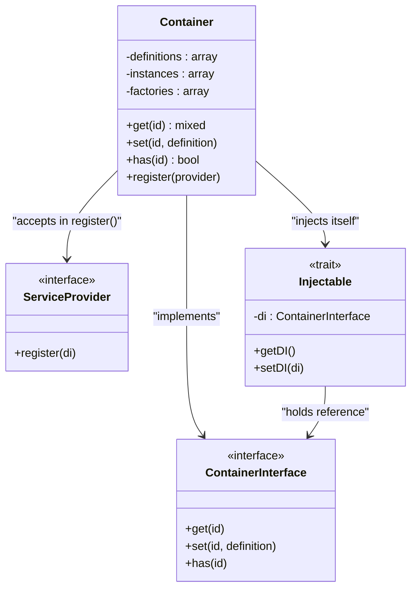

# Core Architecture

<cite>
**Referenced Files in This Document**   
- [bootstrap.php](file://app/bootstrap.php)
- [.php](file://app/Core/Mvc/.php)
- [Router.php](file://app/Core/Mvc/Router.php)
- [Dispatcher.php](file://app/Core/Mvc/Dispatcher.php)
- [View.php](file://app/Core/Mvc/View.php)
- [Container.php](file://app/Core/Di/Container.php)
- [Manager.php](file://app/Core/Events/Manager.php)
- [Request.php](file://app/Core/Http/Request.php)
- [Response.php](file://app/Core/Http/Response.php)
- [using-di.php](file://examples/using-di.php)
- [usign-app.php](file://examples/usign-app.php)
</cite>

## Table of Contents
1. [Introduction](#introduction)
2. [MVC Architecture](#mvc-architecture)
3. [Dependency Injection Container](#dependency-injection-container)
4. [Event System](#event-system)
5. [Service Registration and Bootstrap](#service-registration-and-bootstrap)
6. [Request Handling Sequence](#request-handling-sequence)
7. [Architectural Trade-offs and Scalability](#architectural-trade-offs-and-scalability)
8. [Conclusion](#conclusion)

## Introduction
This document provides a comprehensive architectural overview of the core components of the framework. It details the Model-View-Controller (MVC) pattern, the Dependency Injection (DI) container, and the Event system. The framework is designed to be lightweight, modular, and extensible, with a focus on performance and developer experience. The central coordinator, , orchestrates the request lifecycle through Router, Dispatcher, and View components, all managed via the DI container. The Event system enables extensibility through lifecycle hooks such as 'application:beforeHandle' and 'core:beforeDispatch'.

## MVC Architecture

The framework implements a clean separation of concerns using the MVC pattern. The **** class acts as the central coordinator, receiving HTTP requests and delegating processing to the **Router**, **Dispatcher**, and **View** components.

- **Router**: Matches incoming requests to route configurations based on URI and HTTP method.
- **Dispatcher**: Instantiates controllers and invokes the appropriate action method.
- **View**: Renders templates and layouts to generate the final response content.

These components are loosely coupled and communicate through the DI container, enabling flexibility and testability.

```mermaid
classDiagram
class  {
+handle(Request) Response
-di : ContainerInterface
}
class Router {
+add(pattern, config)
+match(uri, method) array
-routes : array
}
class Dispatcher {
+dispatch(route, request)
-controllerName : string
-actionName : string
-params : array
}
class View {
+render(template, data) string
+partial(template, data) string
-templatePath : string
-layout : string
-vars : array
}
 --> Router : "uses"
 --> Dispatcher : "uses"
 --> View : "via DI"
Dispatcher --> View : "controller may use"
Router -->  : "returns match"
Dispatcher -->  : "returns response"
```

**Diagram sources**
- [.php](file://app/Core/Mvc/.php#L1-L70)
- [Router.php](file://app/Core/Mvc/Router.php#L1-L91)
- [Dispatcher.php](file://app/Core/Mvc/Dispatcher.php#L1-L83)
- [View.php](file://app/Core/Mvc/View.php#L1-L144)

**Section sources**
- [.php](file://app/Core/Mvc/.php#L1-L70)
- [Router.php](file://app/Core/Mvc/Router.php#L1-L91)
- [Dispatcher.php](file://app/Core/Mvc/Dispatcher.php#L1-L83)
- [View.php](file://app/Core/Mvc/View.php#L1-L144)

## Dependency Injection Container

The **Container** class is a lightweight DI container that supports service registration, lazy instantiation, and autowiring. It manages the lifecycle of services and resolves dependencies automatically when instantiating classes.

Key features:
- **Service Definitions**: Services can be registered as closures (for lazy loading) or as concrete instances.
- **Autowiring**: The container uses PHP's Reflection API to inspect constructor parameters and automatically inject dependencies.
- **Singletons and Factories**: By default, services are singletons (same instance on each `get()` call), but factory closures can be used to create new instances.
- **Service Providers**: Modular registration of related services via `ServiceProvider` interface.

The container is central to the framework's architecture, allowing components to declare their dependencies without knowing how they are created.



**Diagram sources**
- [Container.php](file://app/Core/Di/Container.php#L1-L144)
- [Container.php](file://app/Core/Di/Interface/Container.php#L1-L10)
- [ServiceProvider.php](file://app/Core/Di/Interface/ServiceProvider.php#L1-L10)
- [Injectable.php](file://app/Core/Di/Injectable.php)

**Section sources**
- [Container.php](file://app/Core/Di/Container.php#L1-L144)
- [using-di.php](file://examples/using-di.php#L1-L200)

## Event System

The Event system is implemented using the Observer pattern, with the **Manager** class handling event registration and propagation. Components can attach listeners to named events, and the system triggers them at key lifecycle points.

Key events include:
- `application:beforeHandle`: Before request handling begins.
- `application:beforeNotFound`: When no route matches the request.
- `application:onException`: When an uncaught exception occurs.
- `core:beforeDispatch`: Before controller dispatch.
- `core:beforeExecuteRoute`: Before controller action execution.

Events support priority-based listener execution and wildcard patterns (e.g., `application:*`). The system is integrated into the MVC flow, allowing for cross-cutting concerns like logging, authentication, and response modification.

```mermaid
classDiagram
class Manager {
+attach(event, listener, priority)
+detach(event, listener)
+trigger(event, data)
+getListenersForEvent(event)
-listeners : array
-sorted : array
}
class Event {
+getName()
+getData()
+stopPropagation()
+isPropagationStopped()
-name : string
-data : mixed
-propagationStopped : bool
}
class EventInterface {
<<interface>>
+getName()
+getData()
}
class EventAware {
<<trait>>
+fireEvent(name, data)
+setEventsManager(manager)
+getEventsManager()
-eventsManager : Manager
}
Manager --> Event : "creates and dispatches"
EventAware --> Manager : "delegates fireEvent"
 --> EventAware : "uses trait"
Dispatcher --> EventAware : "uses trait"
View --> EventAware : "uses trait"
```

**Diagram sources**
- [Manager.php](file://app/Core/Events/Manager.php#L1-L102)
- [Event.php](file://app/Core/Events/Event.php)
- [EventAware.php](file://app/Core/Events/EventAware.php)
- [.php](file://app/Core/Mvc/.php#L1-L70)
- [Dispatcher.php](file://app/Core/Mvc/Dispatcher.php#L1-L83)
- [View.php](file://app/Core/Mvc/View.php#L1-L144)

**Section sources**
- [Manager.php](file://app/Core/Events/Manager.php#L1-L102)
- [usign-app.php](file://examples/usign-app.php#L105-L144)

## Service Registration and Bootstrap

The **bootstrap.php** file serves as the entry point for the application, configuring the DI container with all core and module-specific services. It defines constants, registers the autoloader, loads configuration, and sets up the container.

Key service registrations:
- **config**:  configuration array.
- **request**: HTTP request object.
- **router**: Configured with routes from the configuration.
- **dispatcher**: Handles controller instantiation.
- **eventsManager**: Central event manager.
- **db**: Database connection.
- **Session, Cookie, View**: Registered via service providers.

Service providers (e.g., `SessionServiceProvider`) encapsulate the registration of related services, promoting modularity and reusability.

**Section sources**
- [bootstrap.php](file://app/bootstrap.php#L1-L56)

## Request Handling Sequence

The request handling process follows a well-defined sequence, coordinated by the  and enhanced by events and DI.

```mermaid
sequenceDiagram
participant Client
participant 
participant EventsManager
participant Router
participant Dispatcher
participant Controller
participant View
participant Response
Client->> : HTTP Request
->>EventsManager : trigger('application : beforeHandle')
->>Router : match(uri, method)
alt Route Found
Router-->> : route config
->>Dispatcher : dispatch(route, request)
Dispatcher->>EventsManager : trigger('core : beforeDispatch')
Dispatcher->>Dispatcher : getDI()->get(controllerClass)
Dispatcher->>Controller : initialize()
Dispatcher->>EventsManager : trigger('core : beforeExecuteRoute')
Dispatcher->>Controller : actionMethod()
alt Controller returns Response
Controller-->>Dispatcher : Response object
else returns array
Dispatcher->>Response : json(data)
else returns string
Dispatcher->>Response : new Response(content)
end
Dispatcher->>Controller : afterExecute()
Dispatcher-->> : Response
->>EventsManager : trigger('application : afterHandle')
else Route Not Found
->>EventsManager : trigger('application : beforeNotFound')
->>Response : error('Not Found')
end
alt Exception Thrown
->>EventsManager : trigger('application : onException')
->>Response : error('Internal Server Error')
end
->>Response : modify content (URL replacement)
Response-->>Client : HTTP Response
```

**Diagram sources**
- [.php](file://app/Core/Mvc/.php#L1-L70)
- [Router.php](file://app/Core/Mvc/Router.php#L1-L91)
- [Dispatcher.php](file://app/Core/Mvc/Dispatcher.php#L1-L83)
- [View.php](file://app/Core/Mvc/View.php#L1-L144)
- [Response.php](file://app/Core/Http/Response.php#L1-L137)

**Section sources**
- [.php](file://app/Core/Mvc/.php#L1-L70)
- [Dispatcher.php](file://app/Core/Mvc/Dispatcher.php#L1-L83)

## Architectural Trade-offs and Scalability

The framework makes several architectural trade-offs to achieve its lightweight nature:

- **Performance**: Minimal overhead due to simple routing, direct DI resolution, and lack of heavy abstractions.
- **Missing Features**: Compared to full-stack frameworks, it lacks built-in ORM, authentication, and scaffolding tools, requiring manual implementation or third-party integration.
- **Scalability**: The stateless design and DI container support horizontal scaling. However, persistent database connections should be managed carefully in high-concurrency environments to avoid connection pool exhaustion.
- **Thread Safety**: PHP's typical process-per-request model avoids thread safety issues, but shared resources (e.g., file-based sessions) must be handled with appropriate locking mechanisms.

The modular design via service providers and event listeners allows for incremental complexity, making it suitable for both small applications and larger systems with proper architectural discipline.

**Section sources**
- [.php](file://app/Core/Mvc/.php#L1-L70)
- [Container.php](file://app/Core/Di/Container.php#L1-L144)
- [Manager.php](file://app/Core/Events/Manager.php#L1-L102)

## Conclusion

The framework's architecture centers around a clean MVC pattern, enhanced by a powerful DI container and a flexible event system. The bootstrap process registers all services, and the request lifecycle is orchestrated through well-defined components. While lightweight and performant, the framework requires developers to implement or integrate additional features for complex applications. Its modular design and extensibility make it a solid foundation for building scalable PHP applications.