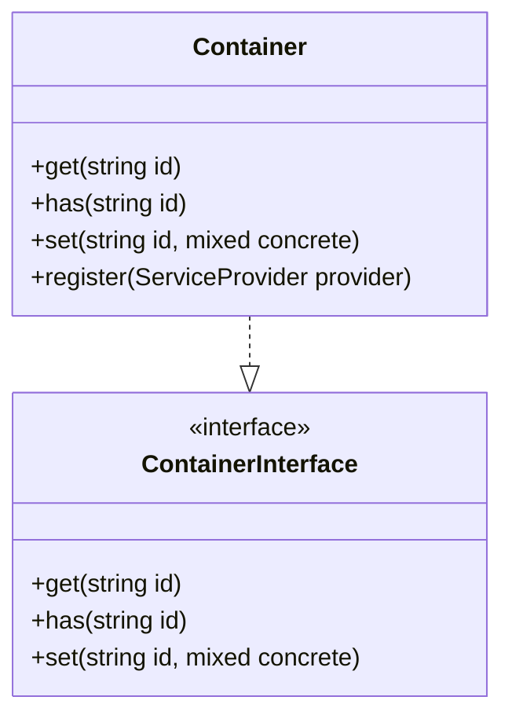
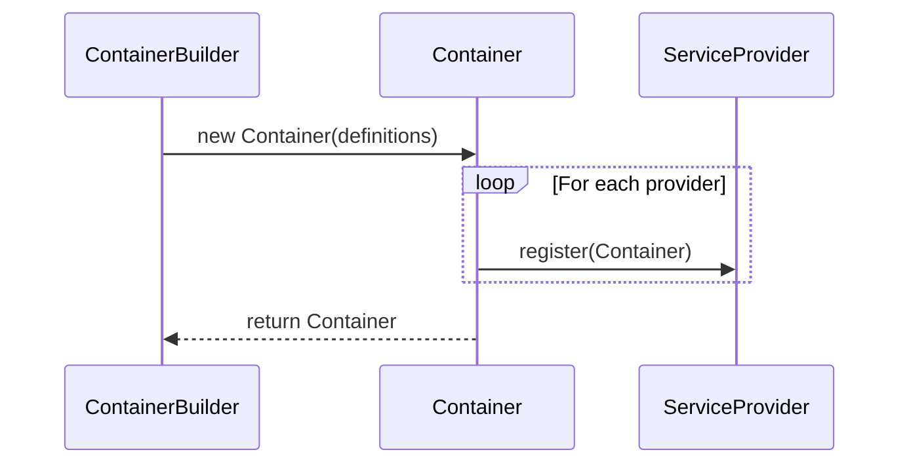
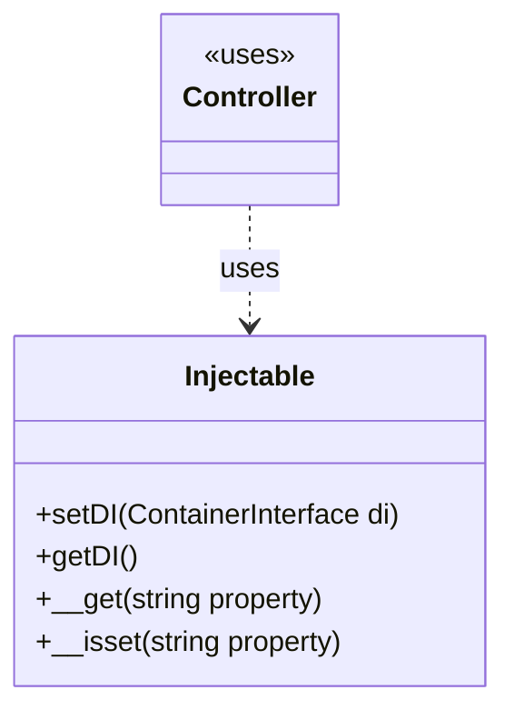
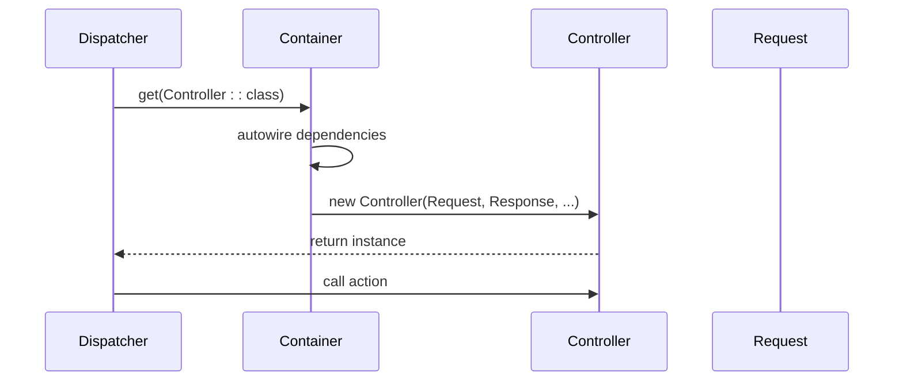

# Dependency Injection

<cite>
**Referenced Files in This Document**  
- [Container.php](file://app/Core/Di/Container.php)
- [ContainerBuilder.php](file://app/Core/Di/ContainerBuilder.php)
- [Injectable.php](file://app/Core/Di/Injectable.php)
- [ServiceProvider.php](file://app/Core/Di/Interface/ServiceProvider.php)
- [ViewServiceProvider.php](file://app/Module/Provider/ViewServiceProvider.php)
- [config.php](file://app/config.php)
- [Dispatcher.php](file://app/Core/Mvc/Dispatcher.php)
</cite>

## Table of Contents
1. [Introduction](#introduction)
2. [Container: The Core Service Locator](#container-the-core-service-locator)
3. [ContainerBuilder: Fluent Service Registration](#containerbuilder-fluent-service-registration)
4. [Injectable Trait: Automatic Dependency Resolution](#injectable-trait-automatic-dependency-resolution)
5. [ServiceProvider Interface: Modular Service Registration](#serviceprovider-interface-modular-service-registration)
6. [Service Resolution in Action: Dispatcher and Controllers](#service-resolution-in-action-dispatcher-and-controllers)
7. [Service Definition Patterns](#service-definition-patterns)
8. [Common Issues and Debugging](#common-issues-and-debugging)
9. [Performance and Best Practices](#performance-and-best-practices)
10. [Conclusion](#conclusion)

## Introduction
This document provides a comprehensive overview of the Dependency Injection (DI) system implemented in the application. It details the core components—Container, ContainerBuilder, Injectable trait, and ServiceProvider interface—and explains how they work together to manage object creation, dependency resolution, and service lifecycle. The system enables loose coupling, enhances testability, and supports modular architecture through configuration-driven service registration.

## Container: The Core Service Locator

The `Container` class serves as the central service locator and object resolver. It implements the `ContainerInterface` and supports both singleton and transient bindings. When a service is requested via `get()`, the container checks for existing instances (singleton), factory closures (transient), or attempts to autowire the class using reflection.

Singleton services are stored in `$instances` and reused on subsequent requests. Transient services defined via closures are executed each time they are resolved. The container also supports autowiring by inspecting constructor parameters and recursively resolving type-hinted dependencies.



**Diagram sources**  
- [Container.php](file://app/Core/Di/Container.php#L14-L144)
- [Interface/Container.php](file://app/Core/Di/Interface/Container.php#L8-L36)

**Section sources**  
- [Container.php](file://app/Core/Di/Container.php#L14-L144)

## ContainerBuilder: Fluent Service Registration

The `ContainerBuilder` class provides a fluent API for configuring the container. It allows batch registration of service definitions and service providers before building the final container instance. This pattern simplifies setup and improves readability, especially when loading services from configuration files like `config.php`.

The builder collects definitions and providers, then instantiates a `Container` with the initial definitions and registers all providers upon `build()`.



**Diagram sources**  
- [ContainerBuilder.php](file://app/Core/Di/ContainerBuilder.php#L10-L42)

**Section sources**  
- [ContainerBuilder.php](file://app/Core/Di/ContainerBuilder.php#L10-L42)

## Injectable Trait: Automatic Dependency Resolution

The `Injectable` trait enables classes—particularly controllers and components—to access the DI container and resolve dependencies automatically. It provides `setDI()` and `getDI()` methods, with `getDI()` defaulting to the global default container if none is set.

Additionally, it uses PHP magic methods `__get()` and `__isset()` to allow accessing services as if they were object properties (e.g., `$this->view`, `$this->db`), enhancing code readability and reducing boilerplate.



**Diagram sources**  
- [Injectable.php](file://app/Core/Di/Injectable.php#L9-L47)

**Section sources**  
- [Injectable.php](file://app/Core/Di/Injectable.php#L9-L47)

## ServiceProvider Interface: Modular Service Registration

The `ServiceProvider` interface defines a contract for modular service registration. Implementations like `ViewServiceProvider`, `CookieServiceProvider`, and `SessionServiceProvider` encapsulate the logic for registering related services, promoting separation of concerns and reusability.

Each provider receives the container instance in its `register()` method and configures services using closures that resolve dependencies from configuration or other services.

```php
// Example: ViewServiceProvider
$di->set('view', function() use ($di) {
    $config = $di->get('config')['view'];
    $view = new View($config['path']);
    $view->setLayout($config['layout']);
    $view->setDI($di);
    return $view;
});
```

**Section sources**  
- [Interface/ServiceProvider.php](file://app/Core/Di/Interface/ServiceProvider.php#L7-L10)
- [Provider/ViewServiceProvider.php](file://app/Module/Provider/ViewServiceProvider.php#L8-L26)
- [Provider/CookieServiceProvider.php](file://app/Module/Provider/CookieServiceProvider.php#L8-L25)
- [Provider/SessionServiceProvider.php](file://app/Module/Provider/SessionServiceProvider.php#L8-L54)

## Service Resolution in Action: Dispatcher and Controllers

The `Dispatcher` class uses the DI container to instantiate controllers, enabling full dependency injection. When a route is dispatched, the container resolves the controller class, injecting any type-hinted dependencies (e.g., Request, Response, Database) via constructor autowiring.

This eliminates the need for manual instantiation and ensures consistent service lifecycle management across the application.



**Diagram sources**  
- [Dispatcher.php](file://app/Core/Mvc/Dispatcher.php#L20-L83)

**Section sources**  
- [Dispatcher.php](file://app/Core/Mvc/Dispatcher.php#L20-L83)

## Service Definition Patterns

The DI system supports multiple service definition patterns:

- **Class Name Binding**: `$di->set('db', Database::class)` – resolved on each `get()` unless singleton.
- **Closure Factory**: Transient or parameterized instantiation.
- **Interface-to-Concrete Binding**: `$di->set(ServiceInterface::class, ConcreteService::class)` enables polymorphism.
- **Parameterized Instantiation**: Closures can use configuration values (e.g., from `config.php`).

Configuration is typically loaded from `config.php`, which defines module-specific services and global settings used during service instantiation.

**Section sources**  
- [config.php](file://app/config.php#L0-L99)

## Common Issues and Debugging

### Circular Dependencies
Occur when Service A depends on B, and B depends on A. The container will throw a `ContainerException` during resolution. Refactor using setter injection or event-driven patterns.

### Missing Service Exceptions
Triggered when a requested service is not registered or cannot be resolved. Ensure the service is defined or the class exists.

### Debugging Unresolved Bindings
Use `$di->has('serviceName')` to check registration. Enable logging in service closures to trace instantiation.

**Section sources**  
- [Container.php](file://app/Core/Di/Container.php#L60-L65)
- [Exception/NotFound.php](file://app/Core/Di/Exception/NotFound.php)
- [Exception/Container.php](file://app/Core/Di/Exception/Container.php)

## Performance and Best Practices

- **Lazy Loading**: Services are only instantiated when first requested, improving startup performance.
- **Eager Initialization**: Not supported by default; use only for critical services requiring early setup.
- **Organize Service Providers**: Group related services (e.g., `DatabaseServiceProvider`, `CacheServiceProvider`) and register them in bootstrap.
- **Avoid Global State**: Prefer dependency injection over static access where possible.

Modular applications should register providers per module, enabling feature-specific service configuration.

## Conclusion
The Dependency Injection system provides a robust foundation for managing object creation and dependencies. By leveraging the `Container`, `ContainerBuilder`, `Injectable` trait, and `ServiceProvider` interface, the application achieves high modularity, testability, and maintainability. Proper use of service definitions, configuration, and resolution patterns ensures efficient and scalable architecture.