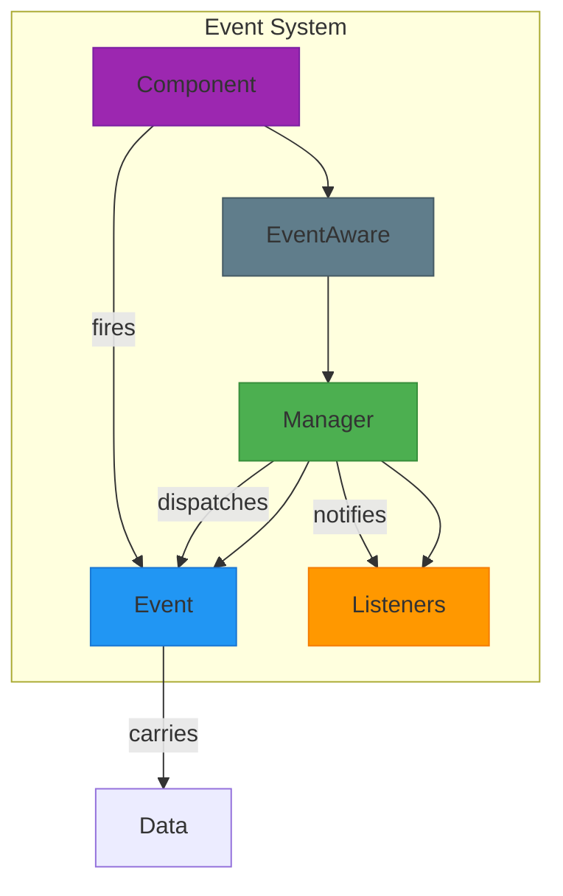
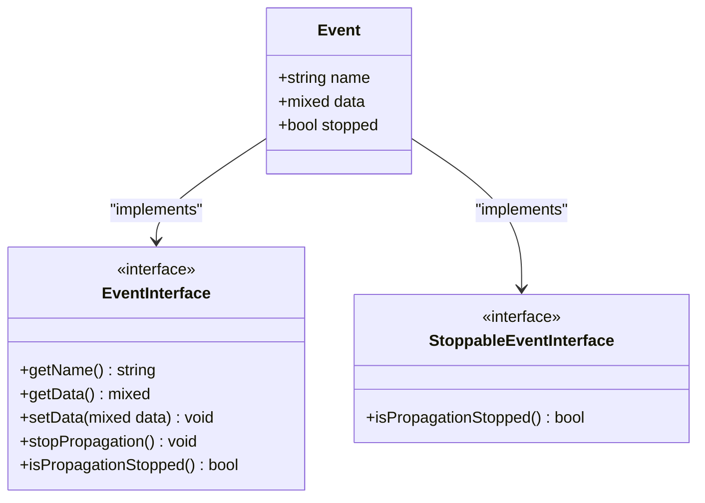
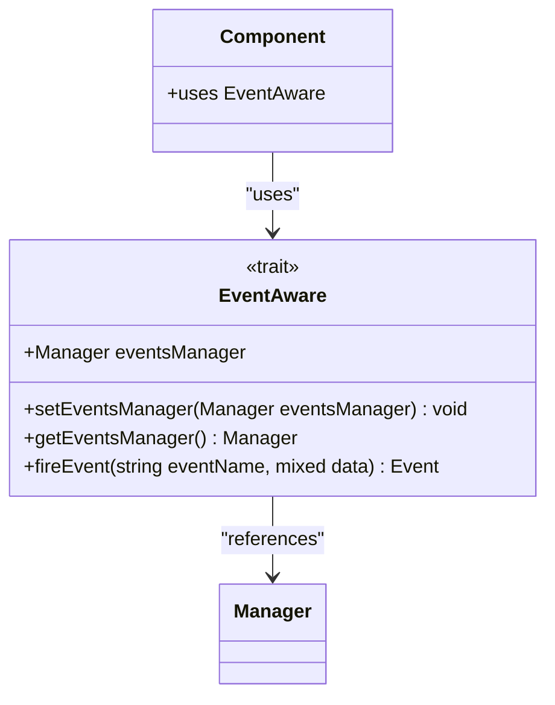
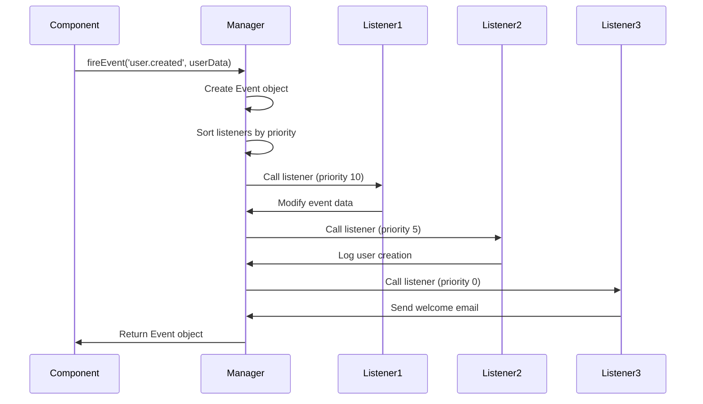
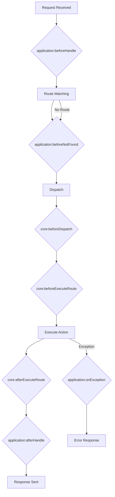

# Events System

<cite>
**Referenced Files in This Document**   
- [Manager.php](file://app/Core/Events/Manager.php)
- [Event.php](file://app/Core/Events/Event.php)
- [EventAware.php](file://app/Core/Events/EventAware.php)
- [StoppableEventInterface.php](file://app/Core/Events/StoppableEventInterface.php)
- [EventInterface.php](file://app/Core/Events/EventInterface.php)
- [events-usage.php](file://examples/events-usage.php)
- [Application.php](file://app/Core/Mvc/Application.php)
- [Dispatcher.php](file://app/Core/Mvc/Dispatcher.php)
</cite>

## Table of Contents
1. [Introduction](#introduction)
2. [Core Components](#core-components)
3. [Architecture Overview](#architecture-overview)
4. [Detailed Component Analysis](#detailed-component-analysis)
5. [Event Data Flow and Propagation](#event-data-flow-and-propagation)
6. [Usage Examples and Patterns](#usage-examples-and-patterns)
7. [Common Pitfalls and Best Practices](#common-pitfalls-and-best-practices)
8. [Conclusion](#conclusion)

## Introduction
The event-driven architecture in this framework is built around the Observer pattern, enabling loose coupling between components through a centralized event system. This documentation details the implementation and usage of the event system, focusing on the Manager class as the central hub for event subscription, dispatching, and propagation. The system supports event prioritization, short-circuiting, and wildcard matching, making it suitable for complex application workflows and lifecycle management.

## Core Components

This section outlines the fundamental building blocks of the event system, including the Event class structure, the Manager class for event orchestration, and the interfaces that enable event capability across components.

**Section sources**
- [Event.php](file://app/Core/Events/Event.php#L1-L40)
- [Manager.php](file://app/Core/Events/Manager.php#L1-L102)
- [EventAware.php](file://app/Core/Events/EventAware.php#L1-L25)
- [StoppableEventInterface.php](file://app/Core/Events/StoppableEventInterface.php#L1-L19)

## Architecture Overview

The event system follows a centralized observer pattern where the Manager class acts as the event dispatcher and registry. Components become event-capable by using the EventAware trait, which provides access to the events manager and methods for firing events. Events propagate synchronously through registered listeners, with support for priority-based execution and short-circuiting.



**Diagram sources**
- [Manager.php](file://app/Core/Events/Manager.php#L1-L102)
- [Event.php](file://app/Core/Events/Event.php#L1-L40)
- [EventAware.php](file://app/Core/Events/EventAware.php#L1-L25)

## Detailed Component Analysis

### Manager Class Analysis
The Manager class serves as the central hub for event management, providing methods to attach, detach, and trigger events. It maintains a priority-sorted collection of listeners and handles event propagation according to registration priority.

```mermaid
classDiagram
class Manager {
+array listeners
+array sorted
+attach(string event, callable listener, int priority) void
+detach(string event, callable listener) void
+clearListeners(string event) void
+trigger(mixed event, mixed data) Event
+getListenersForEvent(Event event) iterable
-sortListeners(string event) void
}
class Event {
+string name
+mixed data
+bool stopped
+__construct(string name, mixed data)
+getName() string
+getData() mixed
+setData(mixed data) void
+stopPropagation() void
+isPropagationStopped() bool
}
Manager --> Event : "creates and dispatches"
Manager --> "callable" : "maintains listeners"
```

**Diagram sources**
- [Manager.php](file://app/Core/Events/Manager.php#L1-L102)
- [Event.php](file://app/Core/Events/Event.php#L1-L40)

**Section sources**
- [Manager.php](file://app/Core/Events/Manager.php#L1-L102)

### Event Class and Interfaces
The Event class implements both EventInterface and StoppableEventInterface, providing a standardized structure for event data and propagation control. The StoppableEventInterface allows listeners to halt further event processing, enabling conditional workflows.



**Diagram sources**
- [Event.php](file://app/Core/Events/Event.php#L1-L40)
- [EventInterface.php](file://app/Core/Events/EventInterface.php#L1-L11)
- [StoppableEventInterface.php](file://app/Core/Events/StoppableEventInterface.php#L1-L19)

**Section sources**
- [Event.php](file://app/Core/Events/Event.php#L1-L40)
- [EventInterface.php](file://app/Core/Events/EventInterface.php#L1-L11)
- [StoppableEventInterface.php](file://app/Core/Events/StoppableEventInterface.php#L1-L19)

### EventAware Trait
The EventAware trait enables any class to become event-capable by providing methods to set the events manager, retrieve it, and fire events. This promotes loose coupling by allowing components to participate in the event system without direct dependencies.



**Diagram sources**
- [EventAware.php](file://app/Core/Events/EventAware.php#L1-L25)
- [Manager.php](file://app/Core/Events/Manager.php#L1-L102)

**Section sources**
- [EventAware.php](file://app/Core/Events/EventAware.php#L1-L25)

## Event Data Flow and Propagation

This section illustrates the complete lifecycle of an event from firing to handling, including data modification and propagation control.



**Diagram sources**
- [EventAware.php](file://app/Core/Events/EventAware.php#L1-L25)
- [Manager.php](file://app/Core/Events/Manager.php#L1-L102)

**Section sources**
- [Manager.php](file://app/Core/Events/Manager.php#L1-L102)
- [EventAware.php](file://app/Core/Events/EventAware.php#L1-L25)

## Usage Examples and Patterns

### Core Lifecycle Events
The framework utilizes the event system extensively in its core components, with predefined lifecycle hooks that allow for extension and customization.



**Diagram sources**
- [Application.php](file://app/Core/Mvc/Application.php#L1-L70)
- [Dispatcher.php](file://app/Core/Mvc/Dispatcher.php#L1-L83)

**Section sources**
- [Application.php](file://app/Core/Mvc/Application.php#L1-L70)
- [Dispatcher.php](file://app/Core/Mvc/Dispatcher.php#L1-L83)

### Practical Implementation Examples
The events-usage.php example demonstrates various patterns for event usage, including basic event triggering, priority-based execution, and data modification through event listeners.

**Section sources**
- [events-usage.php](file://examples/events-usage.php#L1-L239)

## Common Pitfalls and Best Practices

### Potential Issues
- **Memory Leaks**: Failure to detach listeners can lead to memory accumulation, especially in long-running processes.
- **Performance Impact**: Synchronous event processing can become a bottleneck when numerous listeners are registered for frequently fired events.
- **Error Handling**: Exceptions in listeners can disrupt event propagation and affect application stability.

### Recommended Patterns
- **Loose Coupling**: Use events to decouple components rather than creating direct dependencies.
- **Priority Usage**: Leverage priority levels to ensure critical listeners execute first (e.g., security checks).
- **Wildcard Events**: Utilize wildcard patterns (e.g., 'db.*') for broad event handling while maintaining specificity when needed.
- **DI Integration**: Register the events manager in the dependency injection container to make it available throughout the application.

**Section sources**
- [events-usage.php](file://examples/events-usage.php#L1-L239)
- [Manager.php](file://app/Core/Events/Manager.php#L1-L102)

## Conclusion
The event-driven architecture implemented in this framework provides a robust mechanism for component communication and lifecycle management. By leveraging the Observer pattern through the Manager class, the system enables extensible and maintainable code organization. The combination of event prioritization, short-circuiting capabilities, and seamless integration with the dependency injection system makes it well-suited for modular applications requiring flexible event handling.