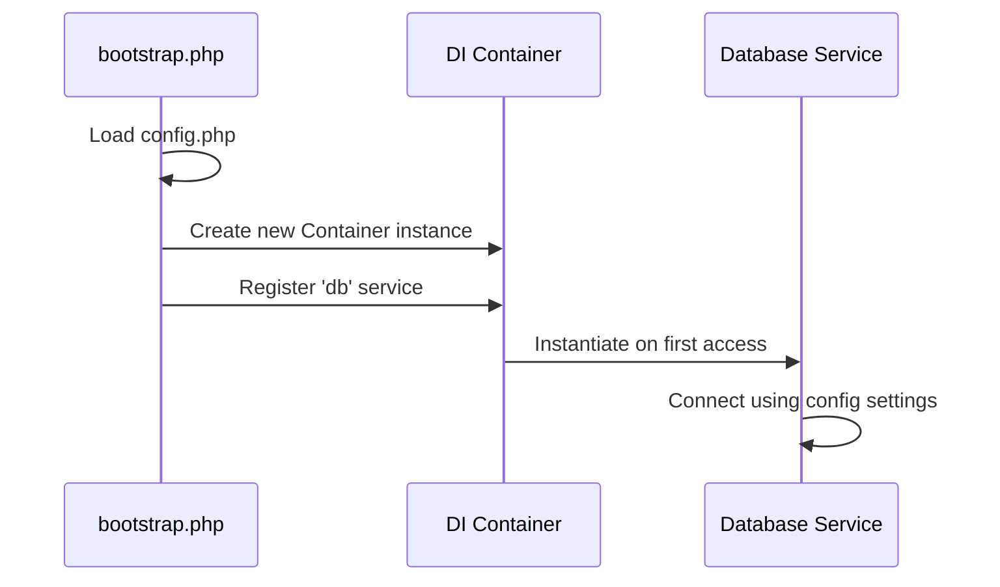
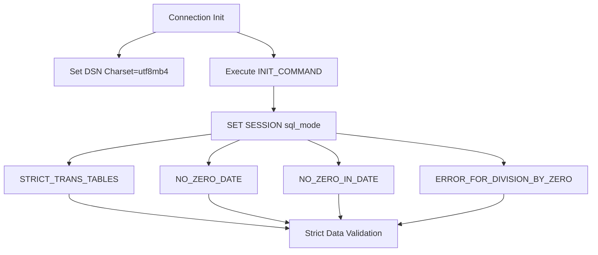
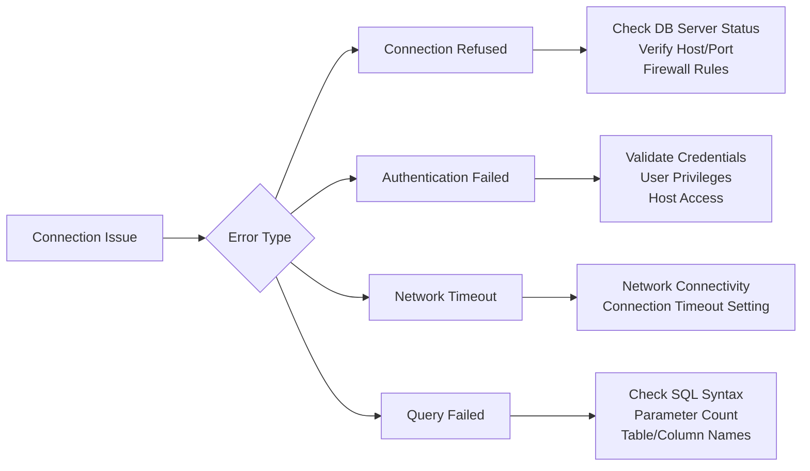

# Configuration

<cite>
**Referenced Files in This Document**   
- [config.php](file://app/config.php)
- [bootstrap.php](file://app/bootstrap.php)
- [Database.php](file://app/Core/Database/Database.php)
- [DatabaseException.php](file://app/Core/Database/DatabaseException.php)
</cite>

## Table of Contents
1. [Database Configuration](#database-configuration)
2. [DI Container Initialization](#di-container-initialization)
3. [Connection Pooling and Persistent Connections](#connection-pooling-and-persistent-connections)
4. [Charset and SQL Mode Configuration](#charset-and-sql-mode-configuration)
5. [Multiple Database Connections](#multiple-database-connections)
6. [Security Considerations](#security-considerations)
7. [Troubleshooting Common Issues](#troubleshooting-common-issues)
8. [Performance Tuning](#performance-tuning)

## Database Configuration

The database connection settings are defined in the `db` section of the `config.php` file. This configuration array includes essential parameters for establishing a database connection:

- **driver**: Specifies the database driver (e.g., `mysql`)
- **host**: The hostname or IP address of the database server (e.g., `localhost`)
- **database**: The name of the target database (e.g., `web`)
- **username**: The database user for authentication (e.g., `root`)
- **password**: The password for the database user (can be empty)
- **charset**: The character set used for the connection (e.g., `utf8mb4`)

These settings are structured as a key-value array under the `'db'` key in the configuration return array. The values are directly used by the Database service during connection initialization.

**Section sources**
- [config.php](file://app/config.php#L15-L23)

## DI Container Initialization

The `bootstrap.php` file initializes the Dependency Injection (DI) container and registers the Database service using the configuration settings. The process involves:

1. Loading the configuration array via `require APP_PATH . 'config.php'`
2. Creating a new instance of `\Core\Di\Container`
3. Registering core services, including the Database service under the key `'db'`

The Database service is registered as a closure that instantiates the `\Core\Database\Database` class. This ensures that the database connection is established only when the service is first accessed, promoting lazy loading and efficient resource usage.

**Diagram sources**
- [bootstrap.php](file://app/bootstrap.php#L27-L28)
- [Database.php](file://app/Core/Database/Database.php#L15-L17)

**Section sources**
- [bootstrap.php](file://app/bootstrap.php#L25-L30)
- [Database.php](file://app/Core/Database/Database.php#L15-L17)

## Connection Pooling and Persistent Connections

The application supports connection pooling through persistent connections, controlled by the `persistent` configuration option in the `db` section of `config.php`. When set to `true`, the PDO connection uses persistent connections, which remain open across requests and can be reused by subsequent requests, reducing connection overhead.

Persistent connections are implemented via PDO's built-in persistence mechanism. While the current configuration does not explicitly pass the `PDO::ATTR_PERSISTENT` attribute in the options array, the persistent behavior is implied by the configuration comment and standard PDO practices. For explicit control, this attribute should be added to the PDO options in the `connect()` method.

**Section sources**
- [config.php](file://app/config.php#L22)
- [Database.php](file://app/Core/Database/Database.php#L35-L45)

## Charset and SQL Mode Configuration

The database connection specifies `charset=utf8mb4` in the DSN string, ensuring full Unicode support, including emojis and special characters. This charset is critical for internationalization and data integrity.

Additionally, the connection sets the MySQL session SQL mode via `PDO::MYSQL_ATTR_INIT_COMMAND` to enforce strict data handling:
- `STRICT_TRANS_TABLES`: Enables strict mode for transactional tables
- `NO_ZERO_DATE`: Prevents "0000-00-00" dates
- `NO_ZERO_IN_DATE`: Prevents dates with zero month or day
- `ERROR_FOR_DIVISION_BY_ZERO`: Treats division by zero as an error

This configuration ensures data consistency and prevents silent data truncation or invalid values.

**Diagram sources**
- [Database.php](file://app/Core/Database/Database.php#L38-L43)

**Section sources**
- [Database.php](file://app/Core/Database/Database.php#L38-L43)

## Multiple Database Connections

While the current configuration supports only a single database connection under the `'db'` key, the architecture allows for multiple named database services. This can be achieved by registering additional services in the DI container with different configuration keys and service names.

For example, separate read and write connections or connections to different databases can be configured by defining additional database configuration arrays and registering them as distinct services (e.g., `'db_read'`, `'db_write'`). Each service would instantiate `\Core\Database\Database` with its own configuration subset.

**Section sources**
- [bootstrap.php](file://app/bootstrap.php#L28)
- [Database.php](file://app/Core/Database/Database.php#L15)

## Security Considerations

The current configuration presents several security considerations:

- **Credential Storage**: Database credentials are stored in plain text in `config.php`. For production environments, credentials should be moved to environment variables or a secure secrets management system.
- **SSL Enforcement**: The configuration does not enforce SSL/TLS connections to the database. For production deployments over untrusted networks, SSL should be configured via PDO attributes like `PDO::MYSQL_ATTR_SSL_VERIFY_SERVER_CERT` and `PDO::MYSQL_ATTR_SSL_CA`.
- **Connection Timeout**: No explicit connection timeout is set. Consider adding `PDO::ATTR_TIMEOUT` or using MySQL's `connect_timeout` in the DSN for better control over hanging connections.

The empty password field in the example configuration should be avoided in production environments.

**Section sources**
- [config.php](file://app/config.php#L15-L23)
- [Database.php](file://app/Core/Database/Database.php#L35-L45)

## Troubleshooting Common Issues

Common database connection issues and their solutions include:

- **Connection Refused**: Verify that the database server is running and accessible at the specified host and port. Check firewall settings and MySQL's `bind-address` configuration.
- **Authentication Failure**: Confirm username and password are correct. Ensure the user has privileges to access the specified database from the application host.
- **Network Timeout**: Test network connectivity between the application and database server. Increase connection timeout settings if necessary.
- **Charset Issues**: Ensure the database and tables are created with `utf8mb4` character set and `utf8mb4_unicode_ci` collation to match the connection setting.
- **PDOException**: The `DatabaseException` wrapper provides detailed error messages including SQL and parameters, aiding in debugging query-related issues.

**Diagram sources**
- [Database.php](file://app/Core/Database/Database.php#L40-L45)
- [DatabaseException.php](file://app/Core/Database/DatabaseException.php#L5-L9)

**Section sources**
- [Database.php](file://app/Core/Database/Database.php#L40-L45)
- [DatabaseException.php](file://app/Core/Database/DatabaseException.php#L5-L9)

## Performance Tuning

To optimize database performance:

- **Connection Limits**: Monitor and tune MySQL's `max_connections` setting based on application load and server resources.
- **Query Caching**: Leverage MySQL's query cache or implement application-level caching using a service like Redis for frequently accessed data.
- **Persistent Connections**: Use persistent connections (`persistent => true`) to reduce connection overhead, but monitor for connection leaks.
- **Indexing**: Ensure database tables have appropriate indexes on columns used in WHERE, JOIN, and ORDER BY clauses.
- **Query Optimization**: Use the `execute()` method's debug output to analyze query performance and parameter binding.

The current implementation provides a solid foundation for performance optimization through proper configuration and monitoring.

**Section sources**
- [config.php](file://app/config.php#L22)
- [Database.php](file://app/Core/Database/Database.php#L211-L257)