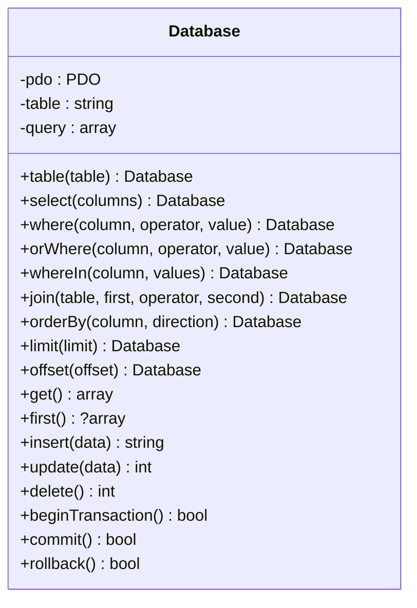
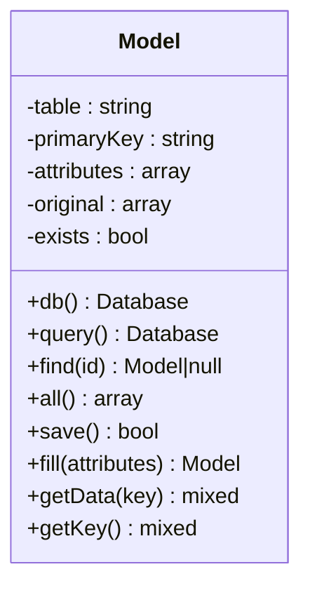
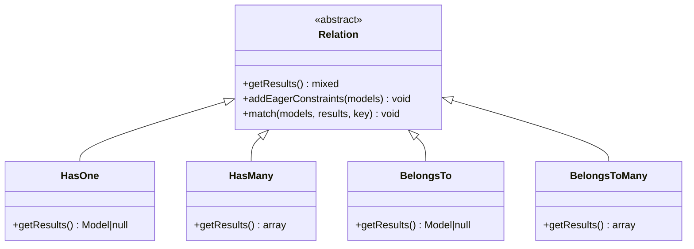
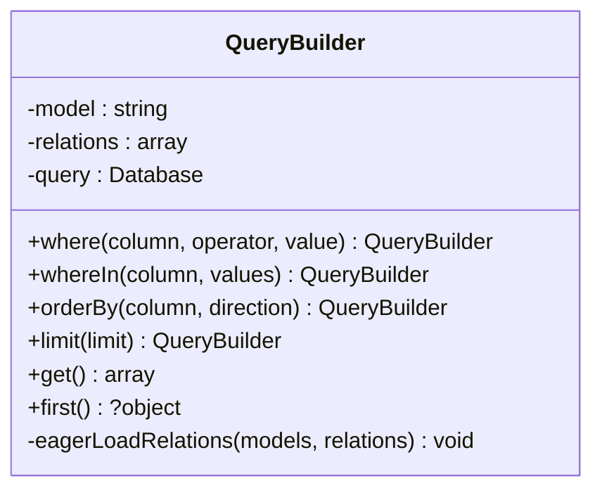
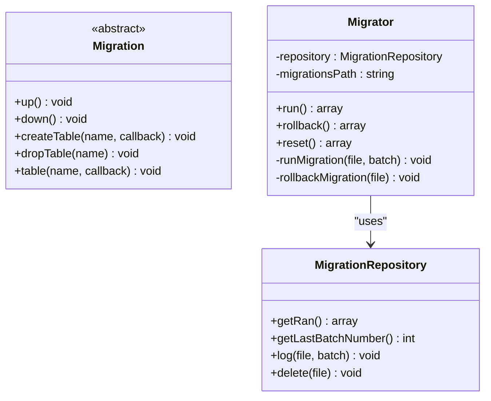
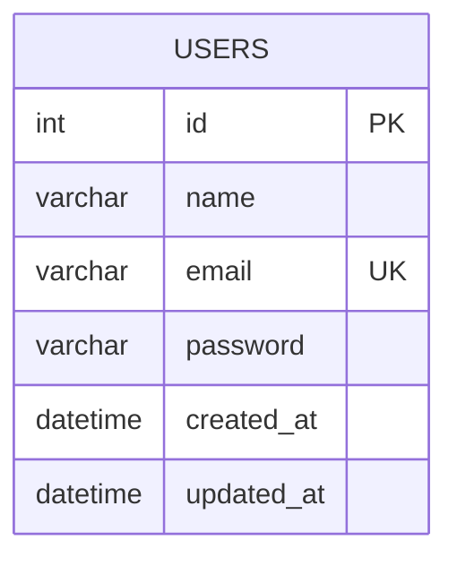
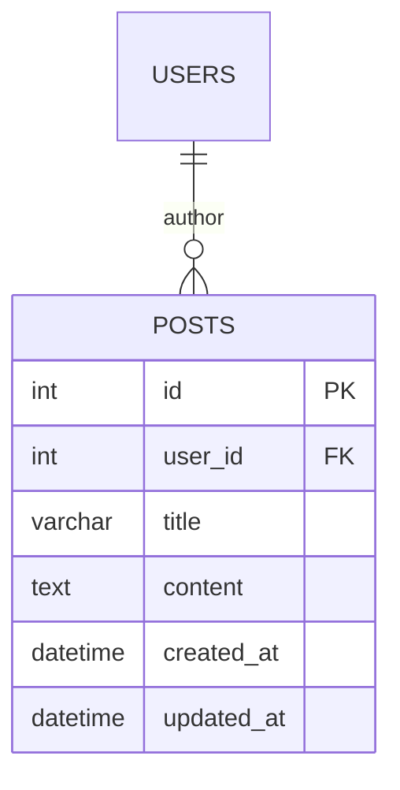
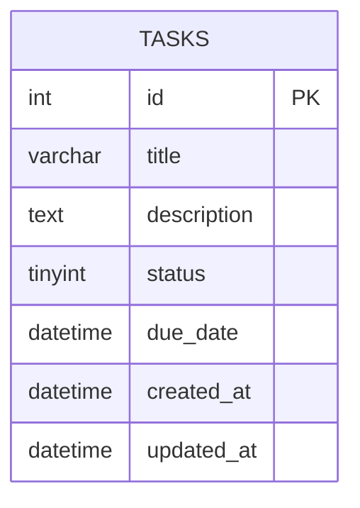

# Database

<cite>
**Referenced Files in This Document**  
- [Database.php](file://app/Core/Database/Database.php)
- [Model.php](file://app/Core/Database/Model.php)
- [QueryBuilder.php](file://app/Core/Database/QueryBuilder.php)
- [Migration.php](file://app/Core/Database/Migration.php)
- [Migrator.php](file://app/Core/Database/Migrator.php)
- [config.php](file://app/config.php)
- [2023_10_15_123456_create_users_table.php](file://migrations/2023_10_15_123456_create_users_table.php)
- [2025_09_16_100000_create_posts_table.php](file://migrations/2025_09_16_100000_create_posts_table.php)
- [2025_09_18_100000_create_tasks_table.php](file://migrations/2025_09_18_100000_create_tasks_table.php)
</cite>

## Table of Contents
1. [Introduction](#introduction)
2. [Database Connection and Query Execution](#database-connection-and-query-execution)
3. [Model System and CRUD Operations](#model-system-and-crud-operations)
4. [Relationship Handling](#relationship-handling)
5. [Query Builder](#query-builder)
6. [Migration System](#migration-system)
7. [Configuration](#configuration)
8. [Data Access Patterns and Transactions](#data-access-patterns-and-transactions)
9. [Performance Considerations](#performance-considerations)
10. [Common Issues and Troubleshooting](#common-issues-and-troubleshooting)
11. [Schema Diagrams](#schema-diagrams)

## Introduction
This document provides comprehensive documentation for the database layer of the application. It details the core components responsible for data persistence, including the Database class as a PDO wrapper, the Model system for ORM functionality, the QueryBuilder for constructing SQL queries fluently, and the migration system for schema versioning. The architecture supports clean data access patterns, relationship management, and robust configuration.

## Database Connection and Query Execution

The `Database` class serves as a lightweight PDO wrapper that manages database connections and provides a fluent interface for query construction and execution. It ensures connection reuse and handles exceptions through `DatabaseException`.

Connection parameters are retrieved from the configuration system, and the PDO instance is initialized with strict error handling, associative fetch mode, and proper charset settings. The class supports common operations such as SELECT, INSERT, UPDATE, DELETE, and JOINs through method chaining.



**Diagram sources**  
- [Database.php](file://app/Core/Database/Database.php#L15-L258)

**Section sources**  
- [Database.php](file://app/Core/Database/Database.php#L15-L258)

## Model System and CRUD Operations

The `Model` class provides an Active Record pattern implementation, enabling CRUD operations directly on PHP objects. Each model corresponds to a database table and includes built-in methods for querying, saving, and deleting records.

Models automatically derive their table name from the class name (e.g., `Users` model maps to `users` table). The primary key defaults to `id`, but can be overridden. The class supports mass assignment via `$fillable`, attribute access via magic methods (`__get`, `__set`), and dirty tracking to optimize updates.

Key static methods include:
- `find($id)` – Retrieve a single record by primary key
- `all()` – Retrieve all records
- `query()` – Begin a new query on the model’s table
- `save()` – Insert or update the model instance



**Diagram sources**  
- [Model.php](file://app/Core/Database/Model.php#L15-L275)

**Section sources**  
- [Model.php](file://app/Core/Database/Model.php#L15-L275)

## Relationship Handling

The ORM supports four types of relationships through dedicated classes: `HasOne`, `HasMany`, `BelongsTo`, and `BelongsToMany`. These are defined as methods on the model class and return relationship instances that can be executed or eager-loaded.

- **HasOne**: One-to-one relationship (e.g., User has one Profile)
- **HasMany**: One-to-many relationship (e.g., User has many Posts)
- **BelongsTo**: Inverse of HasOne/HasMany (e.g., Post belongs to User)
- **BelongsToMany**: Many-to-many relationship using a pivot table (e.g., User belongs to many Roles)

Eager loading is supported via the `with()` method on queries, which accepts an array of relationship names and optionally allows constraint callbacks. Nested eager loading (e.g., `with(['posts.comments'])`) is also implemented.



**Diagram sources**  
- [Model.php](file://app/Core/Database/Model.php#L15-L275)
- [HasOne.php](file://app/Core/Database/Model/HasOne.php)
- [HasMany.php](file://app/Core/Database/Model/HasMany.php)
- [BelongsTo.php](file://app/Core/Database/Model/BelongsTo.php)
- [BelongsToMany.php](file://app/Core/Database/Model/BelongsToMany.php)

**Section sources**  
- [Model.php](file://app/Core/Database/Model.php#L15-L275)

## Query Builder

The `QueryBuilder` class enables fluent construction of complex queries with support for eager loading. It wraps the base `Database` query functionality and extends it with relationship resolution.

When using `Model::with()`, a `QueryBuilder` instance is returned, allowing method chaining for filtering and sorting before execution. The builder normalizes relationship definitions and recursively resolves nested eager loads.

The `get()` and `first()` methods return fully hydrated model instances with relationships pre-loaded, reducing N+1 query problems.



**Diagram sources**  
- [QueryBuilder.php](file://app/Core/Database/QueryBuilder.php#L1-L136)

**Section sources**  
- [QueryBuilder.php](file://app/Core/Database/QueryBuilder.php#L1-L136)

## Migration System

The migration system provides version-controlled schema management. Migrations are PHP classes that define `up()` and `down()` methods for applying and rolling back schema changes.

The `Migration` base class provides helper methods:
- `createTable($name, $callback)` – Define a new table
- `dropTable($name)` – Remove a table
- `table($name, $callback)` – Modify an existing table

Schema definitions use `Blueprint` and `ColumnDefinition` to build SQL statements programmatically.

The `Migrator` class orchestrates migration execution:
- Loads migration files from the `migrations/` directory
- Tracks executed migrations via `MigrationRepository`
- Runs migrations in batch by timestamp order
- Supports `run()`, `rollback()`, and `reset()` operations



**Diagram sources**  
- [Migration.php](file://app/Core/Database/Migration.php#L1-L61)
- [Migrator.php](file://app/Core/Database/Migrator.php#L1-L142)
- [MigrationRepository.php](file://app/Core/Database/MigrationRepository.php)

**Section sources**  
- [Migration.php](file://app/Core/Database/Migration.php#L1-L61)
- [Migrator.php](file://app/Core/Database/Migrator.php#L1-L142)

## Configuration

Database configuration is defined in `config.php` under the `db` key. The configuration includes:
- **driver**: mysql
- **host**: localhost
- **database**: web
- **username**: root
- **password**: (empty)
- **charset**: utf8mb4
- **persistent**: true (enables connection pooling)

The `Database` class retrieves this configuration via the dependency injection container (`$this->getDI()->get('config')['db']`), ensuring loose coupling and testability.

**Section sources**  
- [config.php](file://app/config.php#L1-L100)
- [Database.php](file://app/Core/Database/Database.php#L45-L55)

## Data Access Patterns and Transactions

The system supports both direct query execution and model-based access. For complex operations involving multiple statements, transaction handling is available via:
- `beginTransaction()`
- `commit()`
- `rollback()`

These methods are exposed on the `Database` instance and should be used when atomicity is required.

Example usage:
```php
$db = Model::db();
$db->beginTransaction();
try {
    $user = Users::find(1);
    $user->status = 'inactive';
    $user->save();
    $db->commit();
} catch (Exception $e) {
    $db->rollback();
}
```

**Section sources**  
- [Database.php](file://app/Core/Database/Database.php#L250-L258)
- [Model.php](file://app/Core/Database/Model.php#L1-L275)

## Performance Considerations

Key performance practices include:
- **Indexing**: Ensure foreign keys and frequently queried columns are indexed
- **Eager Loading**: Use `with()` to avoid N+1 query problems in relationship loading
- **Query Optimization**: Use `select()` to retrieve only needed columns
- **Connection Pooling**: Enabled via `persistent => true` in config
- **Prepared Statements**: Used automatically via PDO for security and performance

Avoid loading large datasets without pagination (`limit()` and `offset()`).

**Section sources**  
- [Database.php](file://app/Core/Database/Database.php#L1-L258)
- [Model.php](file://app/Core/Database/Model.php#L1-L275)
- [QueryBuilder.php](file://app/Core/Database/QueryBuilder.php#L1-L136)

## Common Issues and Troubleshooting

### Connection Timeouts
Ensure `persistent => true` is set and verify database server timeout settings. Test connectivity independently.

### Migration Conflicts
Migration filenames must be unique and timestamped. If two developers create migrations with the same timestamp, rename one manually to a later time.

### Relationship Loading Performance
N+1 queries occur when accessing relationships in loops without eager loading. Always use `Model::with(['relation'])` when retrieving multiple models that will access related data.

### Parameter Binding Errors
The `execute()` method throws detailed exceptions showing SQL, parameter count mismatch, and bound values, aiding in debugging malformed queries.

**Section sources**  
- [Database.php](file://app/Core/Database/Database.php#L230-L248)
- [Migrator.php](file://app/Core/Database/Migrator.php#L1-L142)
- [QueryBuilder.php](file://app/Core/Database/QueryBuilder.php#L1-L136)

## Schema Diagrams

### Users Table


**Diagram sources**  
- [2023_10_15_123456_create_users_table.php](file://migrations/2023_10_15_123456_create_users_table.php)

### Posts Table


**Diagram sources**  
- [2025_09_16_100000_create_posts_table.php](file://migrations/2025_09_16_100000_create_posts_table.php)

### Tasks Table


**Diagram sources**  
- [2025_09_18_100000_create_tasks_table.php](file://migrations/2025_09_18_100000_create_tasks_table.php)