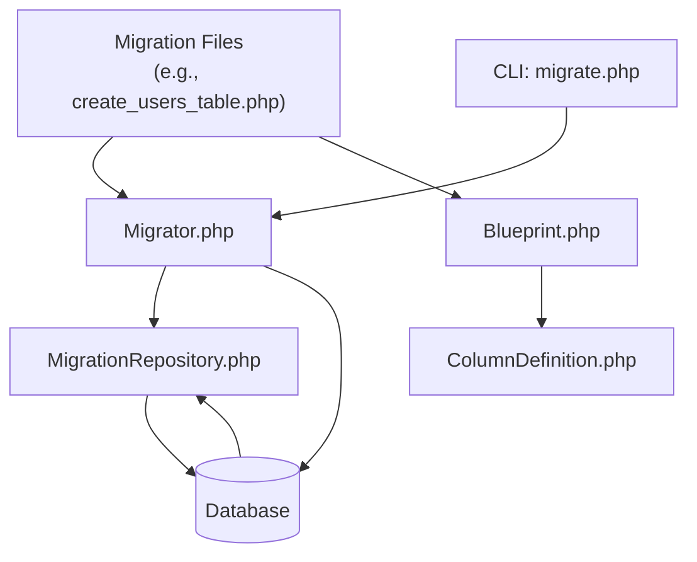
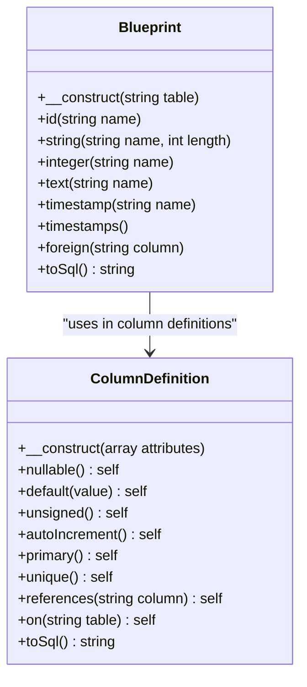
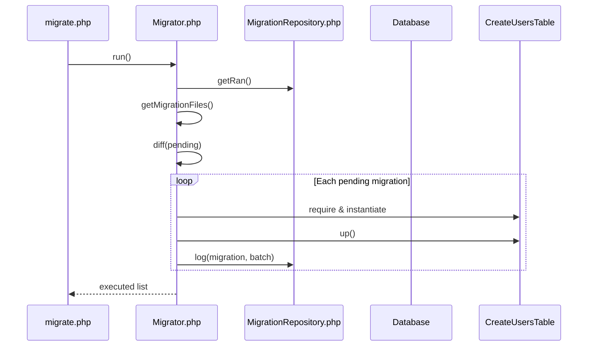
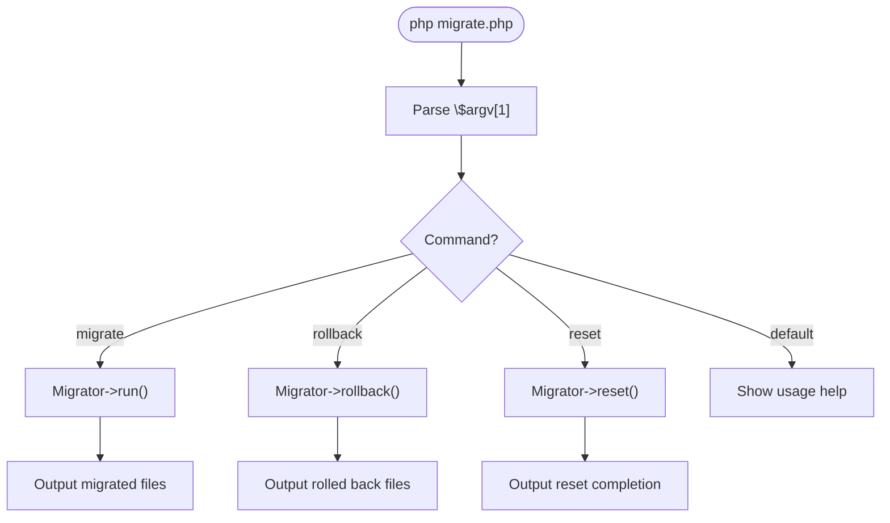

# Migrations

<cite>
**Referenced Files in This Document**   
- [Migration.php](file://app/Core/Database/Migration.php)
- [Migrator.php](file://app/Core/Database/Migrator.php)
- [MigrationRepository.php](file://app/Core/Database/MigrationRepository.php)
- [Blueprint.php](file://app/Core/Database/Blueprint.php)
- [ColumnDefinition.php](file://app/Core/Database/ColumnDefinition.php)
- [migrate.php](file://public/migrate.php)
- [2023_10_15_123456_create_users_table.php](file://migrations/2023_10_15_123456_create_users_table.php)
- [2025_09_16_100000_create_posts_table.php](file://migrations/2025_09_16_100000_create_posts_table.php)
- [2025_09_18_100000_create_tasks_table.php](file://migrations/2025_09_18_100000_create_tasks_table.php)
</cite>

## Table of Contents
1. [Introduction](#introduction)
2. [Migration System Architecture](#migration-system-architecture)
3. [Core Components](#core-components)
4. [Schema Definition with Blueprint DSL](#schema-definition-with-blueprint-dsl)
5. [Migration Lifecycle and Execution](#migration-lifecycle-and-execution)
6. [CLI Interface and Commands](#cli-interface-and-commands)
7. [Migration Examples](#migration-examples)
8. [Common Issues and Troubleshooting](#common-issues-and-troubleshooting)
9. [Best Practices](#best-practices)
10. [Conclusion](#conclusion)

## Introduction
The Migrations system provides a structured, version-controlled approach to managing database schema changes. It enables developers to define, apply, and reverse schema modifications in a consistent and collaborative environment. This document details the architecture, components, and workflows of the migration system, including schema definition, execution lifecycle, CLI interface, and best practices for team-based development.

## Migration System Architecture

The migration system follows a layered architecture where migrations are defined as versioned classes, executed by a migrator, tracked via a repository, and expressed through a declarative DSL.



**Diagram sources**
- [Migrator.php](file://app/Core/Database/Migrator.php#L1-L142)
- [MigrationRepository.php](file://app/Core/Database/MigrationRepository.php#L1-L100)
- [Blueprint.php](file://app/Core/Database/Blueprint.php#L1-L90)

**Section sources**
- [Migration.php](file://app/Core/Database/Migration.php#L1-L61)
- [Migrator.php](file://app/Core/Database/Migrator.php#L1-L142)

## Core Components

### Migration.php
The base `Migration` class defines the contract for all migration operations. Each migration must implement `up()` to apply changes and `down()` to reverse them. It provides helper methods like `createTable()`, `dropTable()`, and `table()` to interact with the schema via the `Blueprint` DSL.

### Migrator.php
The `Migrator` orchestrates migration execution. It discovers migration files, determines pending migrations, and applies them in order. It supports batch execution and rollback operations, ensuring atomicity at the batch level.

### MigrationRepository.php
This component tracks which migrations have been applied by storing records in the `migrations` table. It enables idempotent execution by preventing re-application of completed migrations and supports rollback by batch number.

**Section sources**
- [Migration.php](file://app/Core/Database/Migration.php#L1-L61)
- [Migrator.php](file://app/Core/Database/Migrator.php#L1-L142)
- [MigrationRepository.php](file://app/Core/Database/MigrationRepository.php#L1-L100)

## Schema Definition with Blueprint DSL

The `Blueprint` class provides a fluent, declarative interface for defining table structures. It abstracts raw SQL into a readable PHP DSL.

### Blueprint Methods
- `id()`: Creates an auto-incrementing primary key
- `string()`, `integer()`, `text()`: Define column types
- `timestamps()`: Adds `created_at` and `updated_at` columns
- `foreign()`: Declares foreign key constraints

### ColumnDefinition.php
This class represents individual column attributes and supports method chaining for constraints:
- `nullable()`: Allows NULL values
- `default()`: Sets default value
- `unsigned()`, `autoIncrement()`: Numeric modifiers
- `primary()`, `unique()`: Index constraints
- `references()` and `on()`: Foreign key linkage



**Diagram sources**
- [Blueprint.php](file://app/Core/Database/Blueprint.php#L1-L90)
- [ColumnDefinition.php](file://app/Core/Database/ColumnDefinition.php#L1-L97)

**Section sources**
- [Blueprint.php](file://app/Core/Database/Blueprint.php#L1-L90)
- [ColumnDefinition.php](file://app/Core/Database/ColumnDefinition.php#L1-L97)

## Migration Lifecycle and Execution

### Execution Flow
1. **Discovery**: `Migrator` scans the `migrations/` directory for versioned files
2. **Comparison**: Compares found files against `migrations` table entries
3. **Execution**: Runs `up()` on pending migrations in filename order
4. **Logging**: Records successful migrations with batch number
5. **Rollback**: Reverses migrations in reverse order using `down()`

### Batch Processing
Each `migrate` command runs in a new batch (incrementing number). Rollbacks affect entire batches, ensuring consistency.



**Diagram sources**
- [Migrator.php](file://app/Core/Database/Migrator.php#L1-L142)
- [MigrationRepository.php](file://app/Core/Database/MigrationRepository.php#L1-L100)
- [Migration.php](file://app/Core/Database/Migration.php#L1-L61)

**Section sources**
- [Migrator.php](file://app/Core/Database/Migrator.php#L1-L142)
- [MigrationRepository.php](file://app/Core/Database/MigrationRepository.php#L1-L100)

## CLI Interface and Commands

The `public/migrate.php` script serves as the command-line entry point.

### Available Commands
- `php migrate.php migrate`: Apply pending migrations
- `php migrate.php rollback`: Undo last batch
- `php migrate.php reset`: Rollback all migrations

### Command Flow


**Diagram sources**
- [migrate.php](file://public/migrate.php#L1-L65)

**Section sources**
- [migrate.php](file://public/migrate.php#L1-L65)

## Migration Examples

### Users Table
Creates the foundational `users` table with unique email constraint and timestamps.

```php
// 2023_10_15_123456_create_users_table.php
$this->createTable('users', function($table) {
    $table->id();
    $table->string('name');
    $table->string('email')->unique();
    $table->string('password');
    $table->timestamps();
});
```

### Posts Table
Establishes a relationship with users via foreign key.

```php
// 2025_09_16_100000_create_posts_table.php
$this->createTable('posts', function($table) {
    $table->id();
    $table->string('title', 200)->unique();
    $table->text('body');
    $table->integer('user_id')->unsigned();
    $table->timestamps();
    $table->foreign('user_id')->references('id')->on('users');
});
```

### Tasks Table
Demonstrates multiple foreign keys to the same table (created_by, assigned_to).

```php
// 2025_09_18_100000_create_tasks_table.php
$this->createTable('tasks', function($table) {
    $table->id('task_id');
    $table->integer('created_by')->unsigned();
    $table->integer('assigned_to')->unsigned();
    $table->string('title', 255);
    $table->date('created_date');
    $table->date('begin_date')->nullable();
    $table->date('end_date')->nullable();
    $table->string('status', 20)->default('open');
    $table->integer('priority')->default(1);
    $table->timestamps();
    $table->foreign('created_by')->references('user_id')->on('users');
    $table->foreign('assigned_to')->references('user_id')->on('users');
});
```

**Section sources**
- [2023_10_15_123456_create_users_table.php](file://migrations/2023_10_15_123456_create_users_table.php#L1-L21)
- [2025_09_16_100000_create_posts_table.php](file://migrations/2025_09_16_100000_create_posts_table.php#L1-L24)
- [2025_09_18_100000_create_tasks_table.php](file://migrations/2025_09_18_100000_create_tasks_table.php#L1-L27)

## Common Issues and Troubleshooting

### Migration Conflicts
When multiple developers create migrations with the same timestamp, file naming conflicts occur. Solution: Use unique timestamps or coordinate migration creation.

### Failed Rollbacks
If `down()` logic is incorrect or database state has diverged, rollbacks may fail. Always test rollback logic and avoid irreversible operations in `up()`.

### Schema Drift
Manual database changes outside migrations cause drift. Enforce migration-only schema changes and use schema comparison tools.

### Handling Large Data Migrations
For zero-downtime migrations:
- Split schema and data changes
- Use temporary columns
- Perform data migration in application code
- Remove old columns in subsequent migrations

**Section sources**
- [Migration.php](file://app/Core/Database/Migration.php#L1-L61)
- [Migrator.php](file://app/Core/Database/Migrator.php#L1-L142)

## Best Practices

### Versioning and Naming
- Use timestamp-based filenames: `YYYY_MM_DD_HHMMSS_description.php`
- Keep migrations small and focused
- Never modify executed migration files

### Team Collaboration
- Commit migrations with application code
- Use pre-commit hooks to check migration status
- Establish migration review processes

### Data Seeding
Use separate seed files or migration hooks for test data. Avoid mixing schema changes with large data inserts.

### Testing
- Test both `up()` and `down()` methods
- Verify foreign key constraints
- Check index creation
- Validate default values and nullability

## Conclusion
The migration system provides a robust framework for managing database schema evolution. By combining versioned migration classes, a declarative DSL, and batched execution, it enables reliable, collaborative database development. Proper use of the system ensures schema consistency across environments and supports safe deployment practices.