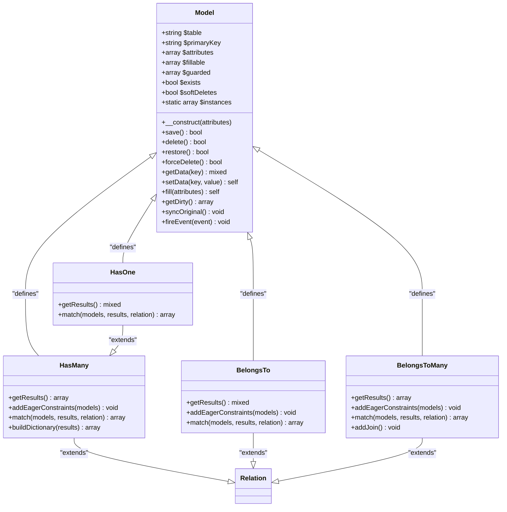
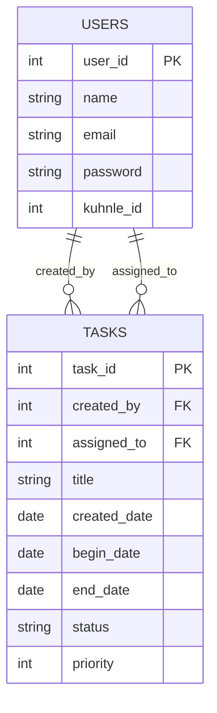
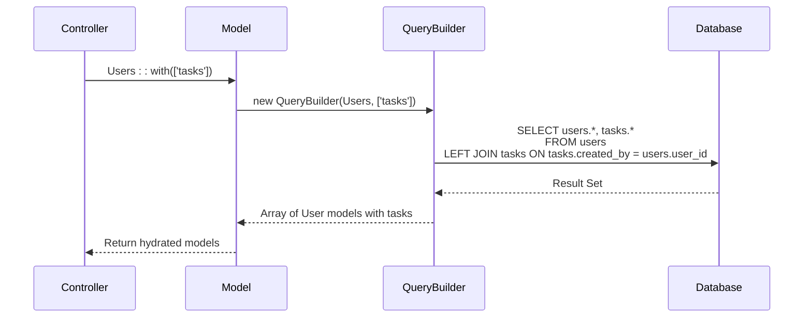
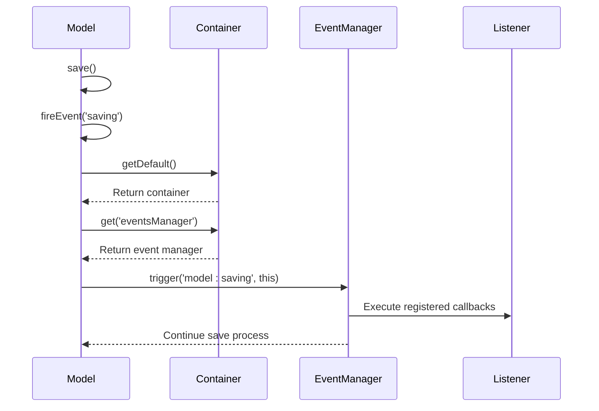
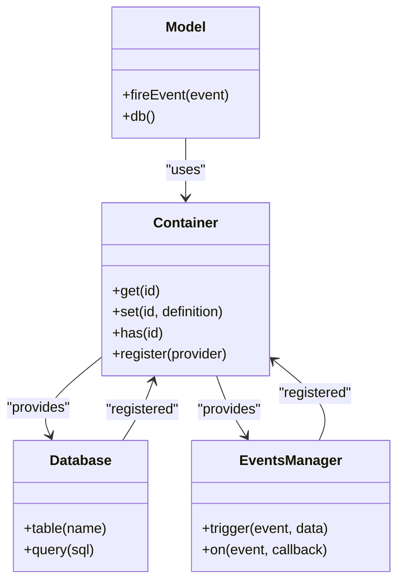
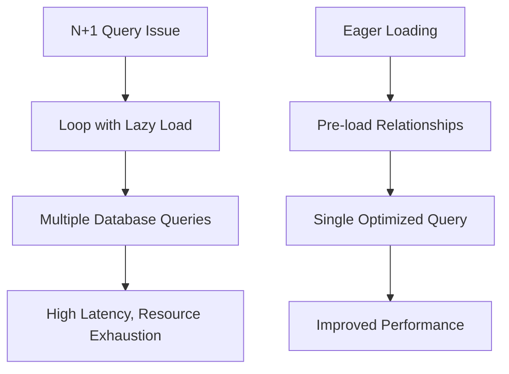

# Model System

<cite>
**Referenced Files in This Document**  
- [Model.php](file://app/Core/Database/Model.php)
- [Users.php](file://app/Module/Admin/Models/Users.php)
- [Tasks.php](file://app/Module/Admin/Models/Tasks.php)
- [HasOne.php](file://app/Core/Database/Model/HasOne.php)
- [HasMany.php](file://app/Core/Database/Model/HasMany.php)
- [BelongsTo.php](file://app/Core/Database/Model/BelongsTo.php)
- [BelongsToMany.php](file://app/Core/Database/Model/BelongsToMany.php)
- [Container.php](file://app/Core/Di/Container.php)
</cite>

## Table of Contents
1. [Introduction](#introduction)
2. [Core Architecture of Model.php](#core-architecture-of-modelphp)
3. [CRUD Operations and Attribute Management](#crud-operations-and-attribute-management)
4. [Relationship System](#relationship-system)
5. [Eager and Lazy Loading](#eager-and-lazy-loading)
6. [Lifecycle Events and Event Integration](#lifecycle-events-and-event-integration)
7. [Integration with DI Container](#integration-with-di-container)
8. [Real-World Usage Examples](#real-world-usage-examples)
9. [Common Issues and Performance Implications](#common-issues-and-performance-implications)
10. [Optimization Strategies](#optimization-strategies)
11. [Conclusion](#conclusion)

## Introduction
The Model system serves as the foundational layer for all database entities in the application, providing a robust Object-Relational Mapping (ORM) interface. Built on top of a lightweight dependency injection (DI) container and event system, the `Model` class enables automatic table mapping, attribute handling, and built-in CRUD operations. This document details the architecture, functionality, and best practices for using the Model system, with emphasis on relationship management, lifecycle hooks, and performance optimization.

## Core Architecture of Model.php
The `Model` class is an abstract base class that defines the core behavior for all database entities. It leverages PHP magic methods, static proxies, and internal state tracking to provide a fluent and intuitive API.

Key architectural components include:
- **Automatic Table Mapping**: Derived from class name using snake_case pluralization
- **Attribute Management**: Uses `$attributes` and `$original` arrays to track current and original state
- **State Tracking**: The `$exists` flag indicates whether the model instance corresponds to a database record
- **Global Scopes**: Support for soft deletes via `deleted_at` field
- **Casting System**: Type casting for attributes (e.g., date, boolean, JSON)

The class uses a static instance registry (`$instances`) to avoid redundant object creation during relationship resolution.



**Diagram sources**  
- [Model.php](file://app/Core/Database/Model.php#L1-L464)
- [HasOne.php](file://app/Core/Database/Model/HasOne.php#L1-L31)
- [HasMany.php](file://app/Core/Database/Model/HasMany.php#L1-L63)
- [BelongsTo.php](file://app/Core/Database/Model/BelongsTo.php#L1-L57)
- [BelongsToMany.php](file://app/Core/Database/Model/BelongsToMany.php#L1-L73)

**Section sources**  
- [Model.php](file://app/Core/Database/Model.php#L1-L464)

## CRUD Operations and Attribute Management
The Model system provides built-in methods for Create, Read, Update, and Delete operations, abstracting direct database interactions.

### Create and Update
The `save()` method handles both insertion and updating based on the `$exists` flag. It automatically manages timestamps (`created_at`, `updated_at`) when present in the schema or when the `timestamps` property is defined.

### Delete Operations
Three deletion strategies are supported:
- **Soft Delete**: Sets `deleted_at` timestamp (when `$softDeletes = true`)
- **Hard Delete**: Removes record permanently
- **Force Delete**: Bypasses soft delete logic

### Attribute Handling
Models support:
- **Fillable/Guarded Attributes**: Controlled mass assignment via `$fillable` and `$guarded` arrays
- **Attribute Casting**: Automatic type conversion using `$casts` array
- **Hidden Attributes**: Sensitive fields excluded from output via `$hidden`

```mermaid
flowchart TD
Start([Model->save()]) --> CheckExists{"Exists?"}
CheckExists --> |No| InsertFlow
CheckExists --> |Yes| UpdateFlow
InsertFlow --> CheckTimestamps["Check for timestamps"]
CheckTimestamps --> SetTimestamps["Set created_at/updated_at"]
SetTimestamps --> InsertDB["Insert into DB"]
InsertDB --> SetID["Set primary key"]
SetID --> MarkExists["Set exists=true"]
MarkExists --> Sync["syncOriginal()"]
Sync --> FireEvents["Fire created/saved events"]
FireEvents --> End([Success])
UpdateFlow --> GetDirty["Get dirty attributes"]
GetDirty --> HasChanges{"Changes?"}
HasChanges --> |No| ReturnTrue["Return true"]
HasChanges --> |Yes| AddTimestamp["Add updated_at"]
AddTimestamp --> UpdateDB["Update DB"]
UpdateDB --> CheckAffected["Rows affected > 0?"]
CheckAffected --> |Yes| SyncOriginal["syncOriginal()"]
SyncOriginal --> FireUpdateEvents["Fire updated/saved events"]
FireUpdateEvents --> End
CheckAffected --> |No| ReturnFalse["Return false"]
```

**Diagram sources**  
- [Model.php](file://app/Core/Database/Model.php#L200-L300)

**Section sources**  
- [Model.php](file://app/Core/Database/Model.php#L200-L300)

## Relationship System
The Model system implements four primary relationship types: `HasOne`, `HasMany`, `BelongsTo`, and `BelongsToMany`, enabling rich data associations.

### HasOne
Represents a one-to-one relationship. Returns a single related model instance.

### HasMany
Represents a one-to-many relationship. Returns a collection of related models.

### BelongsTo
Represents the inverse of HasOne/HasMany. Links a child model to its parent.

### BelongsToMany
Represents a many-to-many relationship through a pivot table. Automatically determines join table name by sorting model names alphabetically.

All relationships extend the base `Relation` class and implement consistent interfaces for eager loading and result matching.



**Diagram sources**  
- [Users.php](file://app/Module/Admin/Models/Users.php#L1-L39)
- [Tasks.php](file://app/Module/Admin/Models/Tasks.php#L1-L52)

**Section sources**  
- [HasOne.php](file://app/Core/Database/Model/HasOne.php#L1-L31)
- [HasMany.php](file://app/Core/Database/Model/HasMany.php#L1-L63)
- [BelongsTo.php](file://app/Core/Database/Model/BelongsTo.php#L1-L57)
- [BelongsToMany.php](file://app/Core/Database/Model/BelongsToMany.php#L1-L73)

## Eager and Lazy Loading
The system supports both eager and lazy loading of relationships to balance performance and convenience.

### Lazy Loading
Relationships are loaded on-demand when accessed via magic `__get()`:
```php
$user = Users::find(1);
echo $user->tasks; // Triggers query
```

### Eager Loading
Prevents N+1 queries by loading relationships upfront:
```php
$users = Users::with(['tasks'])->get();
```

The `with()` method returns a `QueryBuilder` instance that applies join conditions and optimizes data retrieval in a single query.



**Diagram sources**  
- [Model.php](file://app/Core/Database/Model.php#L150-L170)
- [HasMany.php](file://app/Core/Database/Model/HasMany.php#L40-L63)
- [BelongsTo.php](file://app/Core/Database/Model/BelongsTo.php#L40-L57)

**Section sources**  
- [Model.php](file://app/Core/Database/Model.php#L150-L170)

## Lifecycle Events and Event Integration
Models emit lifecycle events that can be intercepted for custom logic.

### Available Events
- `creating` / `created`
- `updating` / `updated`
- `saving` / `saved`
- `deleting` / `deleted`

### Event Firing Mechanism
Events are triggered through the DI container's event manager:
```php
$this->fireEvent('saving');
```

The event manager dispatches events globally, allowing external listeners to react to model state changes.



**Diagram sources**  
- [Model.php](file://app/Core/Database/Model.php#L400-L420)
- [Container.php](file://app/Core/Di/Container.php#L1-L144)

**Section sources**  
- [Model.php](file://app/Core/Database/Model.php#L400-L420)

## Integration with DI Container
The Model system integrates with the Dependency Injection (DI) container to access shared services.

### Database Access
The `db()` method retrieves the database service:
```php
return Container::getDefault()->get('db');
```

### Service Access
Any service registered in the container can be accessed:
```php
Container::getDefault()->get('logger')
```

This enables models to interact with logging, caching, and other application services without tight coupling.



**Diagram sources**  
- [Model.php](file://app/Core/Database/Model.php#L50-L60)
- [Container.php](file://app/Core/Di/Container.php#L1-L144)

**Section sources**  
- [Container.php](file://app/Core/Di/Container.php#L1-L144)

## Real-World Usage Examples
### Users Model
The `Users` model demonstrates basic configuration:
```php
class Users extends Model
{
    protected $table = 'users';
    protected $primaryKey = 'user_id';
    protected array $fillable = ['name', 'email', 'password', 'kuhnle_id'];
}
```

### Tasks Model with Relationships
The `Tasks` model shows relationship definitions:
```php
class Tasks extends Model
{
    public function creator()
    {
        return $this->belongsTo(Users::class, 'created_by', 'user_id');
    }

    public function assigned()
    {
        return $this->belongsTo(Users::class, 'assigned_to', 'user_id');
    }
}
```

Usage:
```php
$task = Tasks::with(['creator', 'assigned'])->find(1);
echo $task->creator->name; // Access related data
```

**Section sources**  
- [Users.php](file://app/Module/Admin/Models/Users.php#L1-L39)
- [Tasks.php](file://app/Module/Admin/Models/Tasks.php#L1-L52)

## Common Issues and Performance Implications
### N+1 Query Problem
Occurs when relationships are lazily loaded in loops:
```php
$users = Users::all();
foreach ($users as $user) {
    echo $user->tasks->count(); // Query per user
}
```

### Relationship Configuration Errors
- Incorrect foreign/primary key specification
- Mismatched pivot table names in many-to-many relationships
- Circular references causing infinite loops

### Recursive Loading Risks
Eager loading with deep nesting can generate excessively complex queries and large result sets.



**Diagram sources**  
- [Model.php](file://app/Core/Database/Model.php#L150-L170)
- [HasMany.php](file://app/Core/Database/Model/HasMany.php#L40-L63)

**Section sources**  
- [Model.php](file://app/Core/Database/Model.php#L150-L170)

## Optimization Strategies
### Selective Field Loading
Use query constraints to limit retrieved columns:
```php
Users::select('user_id', 'name')->get();
```

### Relationship Caching
Cache frequently accessed relationships:
```php
// In controller or service
$tasks = cache()->remember('user_tasks_' . $userId, 3600, function () use ($userId) {
    return Users::with('tasks')->find($userId)->tasks;
});
```

### Batch Processing
Use chunked queries for large datasets:
```php
Users::chunk(100, function ($users) {
    // Process batch
});
```

### Proper Indexing
Ensure foreign keys and frequently queried fields are indexed in the database.

**Section sources**  
- [Model.php](file://app/Core/Database/Model.php#L100-L150)
- [QueryBuilder.php](file://app/Core/Database/QueryBuilder.php)

## Conclusion
The Model system provides a comprehensive ORM solution with automatic table mapping, built-in CRUD operations, and sophisticated relationship management. By leveraging the DI container and event system, it enables extensible and maintainable data access patterns. Proper use of eager loading, selective field retrieval, and caching can mitigate performance issues. Understanding the lifecycle events and relationship mechanics is essential for building efficient and reliable applications on this foundation.