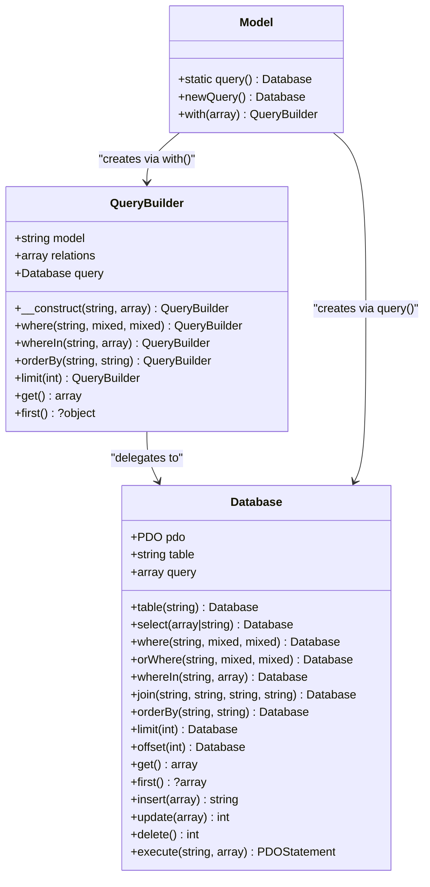
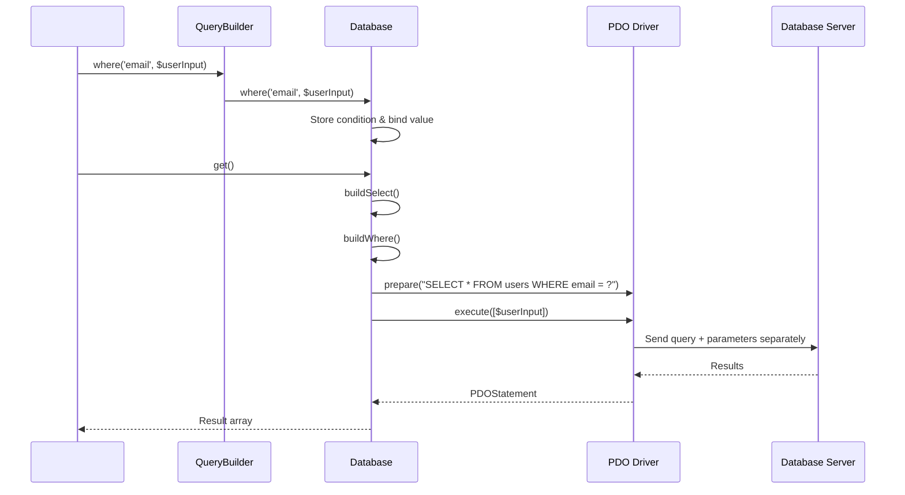

# Query Builder

<cite>
**Referenced Files in This Document**   
- [QueryBuilder.php](file://app/Core/Database/QueryBuilder.php)
- [Database.php](file://app/Core/Database/Database.php)
- [database-usage.php](file://examples/database-usage.php)
- [Model.php](file://app/Core/Database/Model.php)
</cite>

## Table of Contents
1. [Introduction](#introduction)
2. [Fluent Query Interface](#fluent-query-interface)
3. [Integration with Database Layer](#integration-with-database-layer)
4. [Practical Usage Examples](#practical-usage-examples)
5. [Advanced Features](#advanced-features)
6. [Security and SQL Injection Prevention](#security-and-sql-injection-prevention)
7. [Common Issues and Debugging](#common-issues-and-debugging)
8. [Performance Optimization](#performance-optimization)
9. [Conclusion](#conclusion)

## Introduction

The Query Builder provides a fluent, object-oriented interface for constructing dynamic SQL queries in a secure and readable manner. It abstracts raw SQL syntax and enables developers to build complex database operations using method chaining. The system integrates tightly with the Database component, which handles PDO-based execution with prepared statements, ensuring protection against SQL injection attacks. This documentation details the full capabilities of the QueryBuilder, its integration points, and best practices for effective usage.

## Fluent Query Interface

The QueryBuilder offers a chainable API for constructing SQL queries through intuitive method calls. Each method returns the instance itself, enabling fluid syntax for query construction.

Key methods include:
- `select()` - Specifies columns to retrieve
- `where()` and `orWhere()` - Adds conditional filters
- `whereIn()` - Filters by values in an array
- `join()` - Performs table joins
- `orderBy()` - Sorts results
- `limit()` and `offset()` - Controls pagination
- `get()` and `first()` - Executes and retrieves results

These methods allow incremental query building while maintaining code readability and type safety.

**Section sources**
- [QueryBuilder.php](file://app/Core/Database/QueryBuilder.php#L15-L136)
- [Database.php](file://app/Core/Database/Database.php#L69-L132)

## Integration with Database Layer

The QueryBuilder acts as a higher-level abstraction over the Database component, which serves as the primary interface to the PDO layer. When a query is constructed via the builder, it delegates execution to an underlying Database instance obtained from the model's static `query()` method.

The Database class maintains query state in an internal array structure, tracking SELECT clauses, WHERE conditions, JOINs, ordering, and limits. During execution, it compiles these components into valid SQL and binds parameters securely using PDO prepared statements. This separation of concerns allows the QueryBuilder to focus on query construction while relying on Database for safe execution and connection management.



**Diagram sources**
- [QueryBuilder.php](file://app/Core/Database/QueryBuilder.php#L3-L136)
- [Database.php](file://app/Core/Database/Database.php#L8-L257)
- [Model.php](file://app/Core/Database/Model.php#L45-L55)

## Practical Usage Examples

The QueryBuilder supports all major SQL operations through clean, expressive syntax. The following examples demonstrate common patterns for data retrieval and manipulation.

For SELECT operations, the builder enables column specification, filtering, sorting, and limiting:
```php
$users = $this->db->table('users')
    ->select(['id', 'name', 'email'])
    ->where('active', 1)
    ->orderBy('name', 'ASC')
    ->get();
```

INSERT operations accept associative arrays mapping column names to values:
```php
$id = $this->db->table('users')->insert($userData);
```

UPDATE statements require a WHERE clause to target specific records:
```php
$affected = $this->db->table('users')
    ->where('id', $userId)
    ->update($userData);
```

DELETE operations follow a similar pattern:
```php
$deleted = $this->db->table('users')
    ->where('id', $userId)
    ->delete();
```

These patterns are demonstrated in the database-usage.php example file, showing real-world implementation within service classes.

**Section sources**
- [database-usage.php](file://examples/database-usage.php#L10-L64)
- [Database.php](file://app/Core/Database/Database.php#L134-L185)

## Advanced Features

Beyond basic CRUD operations, the QueryBuilder supports advanced database features including eager loading of relationships, nested constraints, and transaction management.

Eager loading is achieved through the `with()` method on models, which returns a QueryBuilder instance configured to resolve related data efficiently:
```php
$user = Users::with(['posts', 'profile'])->find($id);
```

The builder supports dot notation for nested relationships:
```php
$user = Users::with(['posts.comments.author'])->find($id);
```

Constraints can be applied to eager loads using closure syntax:
```php
$user = Users::with(['posts' => function($query) {
    $query->where('published', true);
}])->find($id);
```

Transaction support is provided directly by the Database component:
```php
$this->db->beginTransaction();
try {
    $this->db->table('orders')->insert($orderData);
    $this->db->table('items')->update($itemUpdates);
    $this->db->commit();
} catch (Exception $e) {
    $this->db->rollback();
}
```

**Section sources**
- [QueryBuilder.php](file://app/Core/Database/QueryBuilder.php#L100-L136)
- [Database.php](file://app/Core/Database/Database.php#L245-L257)
- [Model.php](file://app/Core/Database/Model.php#L145-L155)

## Security and SQL Injection Prevention

The Query Builder prevents SQL injection attacks through systematic use of parameterized queries. All user-supplied data is treated as parameters rather than interpolated directly into SQL strings.

When building WHERE clauses, the Database component separates the SQL template from input values:
- Column names and operators are validated whitelist-controlled elements
- User data is always bound as parameters using `?` placeholders
- Arrays in IN clauses generate appropriate numbers of placeholders

The `execute()` method uses PDO's prepare/execute cycle, ensuring that parameters are properly escaped at the driver level. Even when raw values are used, they never become part of the SQL command text.

Additionally, the system validates table names through model definitions and restricts direct SQL injection vectors by avoiding dynamic query composition with untrusted input.



**Diagram sources**
- [Database.php](file://app/Core/Database/Database.php#L210-L231)
- [Database.php](file://app/Core/Database/Database.php#L233-L243)

## Common Issues and Debugging

Several common issues may arise when using the Query Builder, particularly around parameter binding, malformed queries, and complex join scenarios.

Parameter binding errors often occur when the number of placeholders does not match the number of provided parameters. The Database component includes detailed debugging information in exceptions:
- Expected vs. provided parameter counts
- Full SQL query with placeholders
- Bound parameter values (as JSON)

Malformed queries typically result from incorrect method chaining or invalid column references. Since queries are built incrementally, errors may not surface until execution time.

Complex joins can lead to performance issues or unexpected Cartesian products if join conditions are improperly specified. The system currently supports only INNER JOINs through the basic `join()` method.

When debugging, developers should:
- Check exception messages for parameter count mismatches
- Verify table and column names exist
- Use `buildSelect()` to inspect generated SQL
- Monitor query execution time and result set sizes

The execute() method's exception handling provides comprehensive diagnostic data to identify binding issues quickly.

**Section sources**
- [Database.php](file://app/Core/Database/Database.php#L233-L243)
- [Database.php](file://app/Core/Database/Database.php#L210-L231)

## Performance Optimization

Effective query optimization requires attention to indexing, eager loading strategies, and result set management.

N+1 query problems are mitigated through eager loading with the `with()` method, which resolves relationships in separate, optimized queries rather than individual lookups.

For large datasets, pagination should be implemented using `limit()` and `offset()`:
```php
$users = $this->db->table('users')
    ->limit(20)
    ->offset(40)
    ->get();
```

Select only required columns using `select()` to reduce memory usage and network overhead:
```php
->select(['id', 'name', 'email'])
```

Indexing recommendations:
- Primary keys are automatically indexed
- Foreign key columns should be indexed
- Frequently queried columns benefit from indexes
- Composite indexes help for multi-column WHERE clauses

Avoid selecting all columns (`SELECT *`) in production code, especially on tables with many fields or large text/blob columns.

**Section sources**
- [Database.php](file://app/Core/Database/Database.php#L128-L132)
- [Database.php](file://app/Core/Database/Database.php#L134-L138)
- [QueryBuilder.php](file://app/Core/Database/QueryBuilder.php#L55-L75)

## Conclusion

The Query Builder provides a robust, secure, and developer-friendly interface for database interactions. By combining a fluent API with underlying PDO prepared statements, it enables expressive query construction while protecting against SQL injection. Its integration with the Model system supports advanced features like relationship eager loading and transaction management. When used according to best practices—particularly regarding parameter usage, selective column retrieval, and proper indexing—the Query Builder facilitates both productivity and performance in database-driven applications.