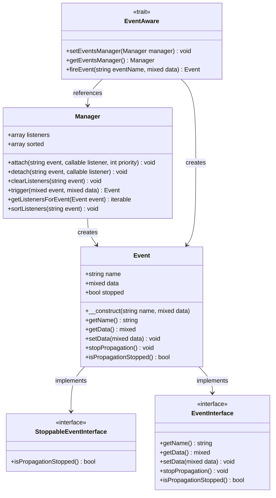
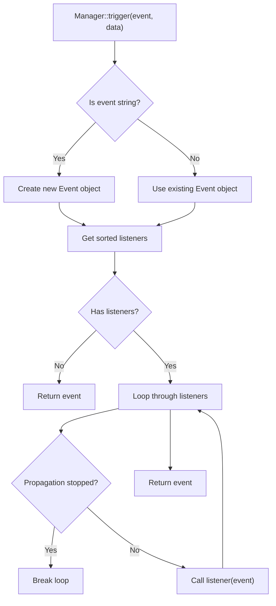
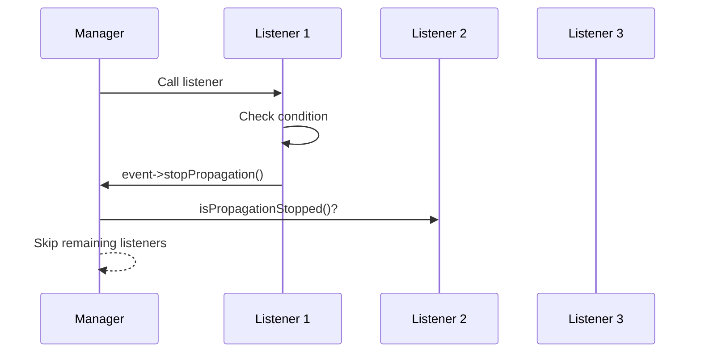

# Events

<cite>
**Referenced Files in This Document**   
- [Event.php](file://app/Core/Events/Event.php)
- [Manager.php](file://app/Core/Events/Manager.php)
- [StoppableEventInterface.php](file://app/Core/Events/StoppableEventInterface.php)
- [EventInterface.php](file://app/Core/Events/EventInterface.php)
- [EventAware.php](file://app/Core/Events/EventAware.php)
- [events-usage.php](file://examples/events-usage.php)
</cite>

## Table of Contents
1. [Introduction](#introduction)
2. [Core Components](#core-components)
3. [Architecture Overview](#architecture-overview)
4. [Detailed Component Analysis](#detailed-component-analysis)
5. [Usage Examples](#usage-examples)
6. [Stoppable Events](#stoppable-events)
7. [Event Listener Management](#event-listener-management)
8. [Use Cases](#use-cases)
9. [Common Issues and Best Practices](#common-issues-and-best-practices)
10. [Error Handling in Listeners](#error-handling-in-listeners)

## Introduction
The event system in this framework implements the Observer pattern to enable decoupled communication between components. It allows objects to subscribe to specific events and react when those events are triggered. This document details the implementation of the `Event` and `Manager` classes, demonstrates how to register and handle events using `Manager::attach()` and `Event::fire()`, and explains advanced features such as stoppable events, priority-based execution, and wildcard event matching.

## Core Components

The event system is built around two primary classes: `Event` and `Manager`. The `Event` class encapsulates event data and provides methods for controlling propagation, while the `Manager` class handles listener registration, sorting, and dispatching.

**Section sources**
- [Event.php](file://app/Core/Events/Event.php#L1-L41)
- [Manager.php](file://app/Core/Events/Manager.php#L1-L103)

## Architecture Overview



**Diagram sources**
- [Event.php](file://app/Core/Events/Event.php#L1-L41)
- [Manager.php](file://app/Core/Events/Manager.php#L1-L103)
- [StoppableEventInterface.php](file://app/Core/Events/StoppableEventInterface.php#L1-L20)
- [EventInterface.php](file://app/Core/Events/EventInterface.php#L1-L12)
- [EventAware.php](file://app/Core/Events/EventAware.php#L1-L26)

## Detailed Component Analysis

### Event Class Implementation
The `Event` class represents a single event occurrence. It stores the event name, associated data, and a flag indicating whether further propagation should be stopped. It implements both `EventInterface` and `StoppableEventInterface`, making it compatible with PSR-14 standards.

**Section sources**
- [Event.php](file://app/Core/Events/Event.php#L1-L41)
- [EventInterface.php](file://app/Core/Events/EventInterface.php#L1-L12)
- [StoppableEventInterface.php](file://app/Core/Events/StoppableEventInterface.php#L1-L20)

### Manager Class Implementation
The `Manager` class is responsible for managing event listeners. It supports attaching listeners with priorities, detaching them, and triggering events. Listeners are sorted by priority (higher numbers execute first), and the manager supports wildcard event names (e.g., `db.*`) for broad event matching.



**Diagram sources**
- [Manager.php](file://app/Core/Events/Manager.php#L1-L103)

**Section sources**
- [Manager.php](file://app/Core/Events/Manager.php#L1-L103)

## Usage Examples

### Attaching Listeners
Listeners can be attached to specific events using `Manager::attach()`. The third parameter specifies priority, where higher values mean earlier execution.

```php
$events->attach('user.created', function($event) {
    // Handle event
}, 10);
```

### Triggering Events
Events are triggered using `Manager::trigger()`, which accepts either an event name (string) or an `Event` object.

```php
$events->trigger('user.created', $userData);
```

### Using Event-Aware Objects
Classes can use the `EventAware` trait to fire events directly.

```php
class UserService {
    use EventAware;
    
    public function createUser($data) {
        // ... create user
        $this->fireEvent('user:created', $user);
    }
}
```

**Section sources**
- [events-usage.php](file://examples/events-usage.php#L1-L240)
- [EventAware.php](file://app/Core/Events/EventAware.php#L1-L26)

## Stoppable Events

The `StoppableEventInterface` allows events to be canceled during propagation. When `stopPropagation()` is called on an event, no further listeners will be executed.



**Diagram sources**
- [Event.php](file://app/Core/Events/Event.php#L1-L41)
- [StoppableEventInterface.php](file://app/Core/Events/StoppableEventInterface.php#L1-L20)

**Section sources**
- [events-usage.php](file://examples/events-usage.php#L100-L120)

## Event Listener Management

### Priority-Based Execution
Listeners are executed in descending order of priority. This ensures critical operations (like security checks) can run first.

### Wildcard Matching
The manager supports wildcard patterns (`*`) for event names, allowing a single listener to respond to multiple related events.

### Listener Lifecycle
- `attach()`: Register a listener
- `detach()`: Remove a specific listener
- `clearListeners()`: Remove all listeners for an event or globally

**Section sources**
- [Manager.php](file://app/Core/Events/Manager.php#L1-L103)
- [events-usage.php](file://examples/events-usage.php#L180-L200)

## Use Cases

### Logging
Attach listeners to key events (e.g., `user.login`, `db.query`) to log activity.

### Authentication Checks
Use `request.before` events to validate authentication and stop propagation if unauthorized.

### Response Modification
Modify response objects in `response.beforeSend` events (e.g., add headers, compress content).

**Section sources**
- [events-usage.php](file://examples/events-usage.php#L210-L240)

## Common Issues and Best Practices

### Memory Leaks
Always detach listeners when no longer needed, especially in long-running processes.

### Execution Order
Use priority values to control execution order. Critical listeners (security, validation) should have high priority.

### Performance Impact
Avoid synchronous processing of expensive operations in event listeners. Consider queuing or asynchronous handling for tasks like email sending.

### Best Practices
- Keep listeners lightweight
- Use descriptive event names
- Document event data structure
- Test event flows thoroughly

**Section sources**
- [Manager.php](file://app/Core/Events/Manager.php#L1-L103)
- [events-usage.php](file://examples/events-usage.php#L1-L240)

## Error Handling in Listeners

Each listener should implement proper error handling. Exceptions within listeners will halt event processing unless caught.

```php
$events->attach('user.created', function($event) {
    try {
        // Risky operation
    } catch (Exception $e) {
        // Log error, but don't rethrow to avoid breaking other listeners
        error_log($e->getMessage());
    }
});
```

Always ensure listeners do not throw unhandled exceptions to prevent disruption of the event chain.

**Section sources**
- [events-usage.php](file://examples/events-usage.php#L1-L240)