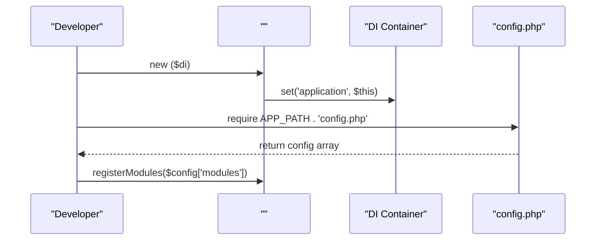

#  Initialization Example

<cite>
**Referenced Files in This Document**   
- [usign-app.php](file://examples/usign-app.php)
- [.php](file://app/Core/Mvc/.php)
- [bootstrap.php](file://app/bootstrap.php)
- [index.php](file://public/index.php)
- [Router.php](file://app/Core/Mvc/Router.php)
- [Dispatcher.php](file://app/Core/Mvc/Dispatcher.php)
- [Container.php](file://app/Core/Di/Container.php)
</cite>

## Table of Contents
1. [Introduction](#introduction)
2. [Project Structure Overview](#project-structure-overview)
3. [Manual  Bootstrapping](#manual-application-bootstrapping)
4. [Routing Configuration and Dispatching](#routing-configuration-and-dispatching)
5. [Custom Entry Points and CLI Integration](#custom-entry-points-and-cli-integration)
6. [Advanced Use Cases: Microservices and Embedded s](#advanced-use-cases-microservices-and-embedded-applications)
7. [Common Configuration Mistakes](#common-configuration-mistakes)
8. [Lifecycle Management and Event Hooks](#lifecycle-management-and-event-hooks)
9. [Conclusion](#conclusion)

## Introduction
This document provides a comprehensive guide to initializing and using the application framework through manual bootstrapping. It focuses on the `` class, routing setup, and request handling outside the standard `public/index.php` entry point. The example in `usign-app.php` demonstrates how to instantiate the application programmatically, configure modules, and dispatch requests directly. This approach enables advanced use cases such as CLI tools, microservices, and embedded applications.

**Section sources**
- [usign-app.php](file://examples/usign-app.php#L0-L144)

## Project Structure Overview
The project follows a modular architecture with clear separation of concerns. The core MVC components reside in `app/Core/Mvc`, while dependency injection and service providers are located in `app/Core/Di`. Modules are organized under `app/Module`, each containing controllers, models, and forms. The `examples` directory contains usage demonstrations, including `usign-app.php`, which illustrates custom application initialization.

```mermaid
graph TB
subgraph "Core Framework"
A[]
B[Router]
C[Dispatcher]
D[Container]
end
subgraph "Configuration & Bootstrap"
E[config.php]
F[bootstrap.php]
end
subgraph "Entry Points"
G[public/index.php]
H[examples/usign-app.php]
end
E --> F
F --> D
D --> A
A --> B
A --> C
G --> F
H --> A
```

**Diagram sources**
- [bootstrap.php](file://app/bootstrap.php#L0-L56)
- [.php](file://app/Core/Mvc/.php#L0-L70)
- [usign-app.php](file://examples/usign-app.php#L0-L144)

## Manual  Bootstrapping
The `usign-app.php` example demonstrates how to manually instantiate the `` class and configure it without relying on the default bootstrap process. This involves creating a dependency injection container, registering core services, loading configuration, and setting up the application instance directly.

The `` constructor accepts a `ContainerInterface` instance, which is used to manage all framework services. During initialization, the application registers itself in the DI container under the 'application' key, enabling access throughout the system.



**Diagram sources**
- [.php](file://app/Core/Mvc/.php#L9-L20)
- [bootstrap.php](file://app/bootstrap.php#L25-L30)
- [usign-app.php](file://examples/usign-app.php#L50-L55)

**Section sources**
- [.php](file://app/Core/Mvc/.php#L9-L20)
- [bootstrap.php](file://app/bootstrap.php#L25-L30)
- [usign-app.php](file://examples/usign-app.php#L50-L55)

## Routing Configuration and Dispatching
The framework's routing system is configured through the DI container in `bootstrap.php`, where the `router` service is defined with route patterns from the configuration. The `Router` class converts URL patterns into regular expressions and matches incoming requests based on URI and HTTP method.

When handling a request, the `::handle()` method triggers the `application:beforeHandle` event, matches the route using the `Router`, and dispatches to the appropriate controller via the `Dispatcher`. If no route matches, the `application:beforeNotFound` event is triggered.

```mermaid
flowchart TD
Start([Request Received]) --> BeforeHandle["Trigger application:beforeHandle"]
BeforeHandle --> MatchRoute["Router->match(uri, method)"]
MatchRoute --> RouteFound{"Route Found?"}
RouteFound --> |No| BeforeNotFound["Trigger application:beforeNotFound"]
BeforeNotFound --> NotFound["Return 404 Response"]
RouteFound --> |Yes| SetDI["Dispatcher->setDI()"]
SetDI --> Dispatch["Dispatcher->dispatch(route, request)"]
Dispatch --> AfterHandle["Trigger application:afterHandle"]
AfterHandle --> ReturnResponse["Return Response"]
Exception --> OnException["Trigger application:onException"]
Exception --> ErrorResponse["Return 500 Response"]
try
SetDI --> Dispatch
catch
Exception
end
Start --> try
Dispatch --> AfterHandle
AfterHandle --> ReturnResponse
Exception --> OnException
OnException --> ErrorResponse
```

**Diagram sources**
- [.php](file://app/Core/Mvc/.php#L25-L70)
- [Router.php](file://app/Core/Mvc/Router.php#L0-L91)
- [Dispatcher.php](file://app/Core/Mvc/Dispatcher.php#L0-L83)

**Section sources**
- [.php](file://app/Core/Mvc/.php#L25-L70)
- [Router.php](file://app/Core/Mvc/Router.php#L0-L91)
- [Dispatcher.php](file://app/Core/Mvc/Dispatcher.php#L0-L83)

## Custom Entry Points and CLI Integration
The manual initialization pattern demonstrated in `usign-app.php` enables the creation of custom entry points for CLI tools and background processing. By bypassing the web server entry point (`public/index.php`), developers can bootstrap the application in scripts that run from the command line.

The `bootstrap.php` file returns an application instance that can be used in various contexts. For CLI applications, the request object can be constructed programmatically with specific URIs and methods, then passed to the `handle()` method for processing.

```mermaid
graph LR
A[CLI Script] --> B[require bootstrap.php]
B --> C[Create Request Object]
C --> D[Set URI and Method]
D --> E[Call ->handle()]
E --> F[Process Response]
F --> G[Output Result]
H[Web Request] --> I[public/index.php]
I --> B
```

**Diagram sources**
- [bootstrap.php](file://app/bootstrap.php#L50-L56)
- [index.php](file://public/index.php#L0-L6)
- [usign-app.php](file://examples/usign-app.php#L0-L144)

**Section sources**
- [bootstrap.php](file://app/bootstrap.php#L50-L56)
- [index.php](file://public/index.php#L0-L6)
- [usign-app.php](file://examples/usign-app.php#L0-L144)

## Advanced Use Cases: Microservices and Embedded s
The manual application initialization pattern is particularly valuable for microservices and embedded applications. By controlling the bootstrap process, developers can create lightweight service instances that expose only specific functionality.

For microservices, this approach allows creating dedicated entry points that load only the necessary modules and services, reducing memory footprint and improving performance. Embedded applications can use this pattern to integrate the framework into larger systems, where the application instance is created and managed by a host system.

The dependency injection container enables flexible service composition, allowing different configurations for different deployment scenarios. Service providers such as `SessionServiceProvider`, `CookieServiceProvider`, and `ViewServiceProvider` can be selectively registered based on the use case.

```mermaid
graph TB
subgraph "Microservice A"
A1[]
A2[Router with limited routes]
A3[Dispatcher]
A4[Database Service]
end
subgraph "Microservice B"
B1[]
B2[Router with different routes]
B3[Dispatcher]
B4[Cache Service]
end
subgraph "Embedded "
C1[Host System]
C2[Framework Instance]
C3[Custom Router]
C4[Shared Services]
end
A1 --> A2
A1 --> A3
A1 --> A4
B1 --> B2
B1 --> B3
B1 --> B4
C1 --> C2
C2 --> C3
C2 --> C4
```

**Diagram sources**
- [bootstrap.php](file://app/bootstrap.php#L35-L44)
- [.php](file://app/Core/Mvc/.php#L9-L20)
- [Container.php](file://app/Core/Di/Container.php#L0-L144)

**Section sources**
- [bootstrap.php](file://app/bootstrap.php#L35-L44)
- [.php](file://app/Core/Mvc/.php#L9-L20)
- [Container.php](file://app/Core/Di/Container.php#L0-L144)

## Common Configuration Mistakes
When bypassing the default bootstrap process, several configuration issues commonly arise:

1. **Missing service registration**: Forgetting to register essential services like `router`, `dispatcher`, or `eventsManager` in the DI container.
2. **Incorrect route pattern syntax**: Using invalid placeholder syntax in route patterns (e.g., `{controller` instead of `{controller}`).
3. **DI container scope issues**: Creating multiple container instances instead of using a single shared instance.
4. **Autoloader configuration errors**: Incorrect path resolution in the autoloader function.
5. **Event listener omissions**: Not registering event listeners that are required for proper application behavior.

The `Container` class provides autowiring capabilities through reflection, but constructors with scalar parameters without default values will cause resolution failures. Service providers should be registered before they are needed to ensure proper service availability.

**Section sources**
- [bootstrap.php](file://app/bootstrap.php#L0-L56)
- [Container.php](file://app/Core/Di/Container.php#L0-L144)
- [usign-app.php](file://examples/usign-app.php#L0-L144)

## Lifecycle Management and Event Hooks
The framework provides a comprehensive event system that allows interception of key lifecycle moments. The `::handle()` method triggers several events:

- `application:beforeHandle`: Before request processing begins
- `application:beforeNotFound`: When no route matches the request
- `application:afterHandle`: After successful request processing
- `application:onException`: When an unhandled exception occurs

These events enable cross-cutting concerns such as logging, authentication, and error handling to be implemented consistently across the application. The event system is integrated with the dependency injection container, allowing event listeners to receive dependencies automatically.

Proper lifecycle management is crucial when bypassing the default bootstrap process. Developers must ensure that all necessary services are registered, events are properly handled, and resources are cleaned up appropriately.

```mermaid
stateDiagram-v2
[*] --> BeforeHandle
BeforeHandle --> RouteMatch
BeforeHandle --> BeforeNotFound
RouteMatch --> BeforeDispatch
BeforeDispatch --> BeforeExecuteRoute
BeforeExecuteRoute --> AfterExecuteRoute
AfterExecuteRoute --> AfterDispatch
AfterDispatch --> AfterHandle
AnyState --> OnException
OnException --> ErrorResponse
AfterHandle --> ResponseSent
BeforeNotFound --> ResponseSent
ErrorResponse --> ResponseSent
ResponseSent --> [*]
note right of OnException
Exception handling
with error logging
end
```

**Diagram sources**
- [.php](file://app/Core/Mvc/.php#L25-L70)
- [Dispatcher.php](file://app/Core/Mvc/Dispatcher.php#L0-L83)
- [usign-app.php](file://examples/usign-app.php#L105-L144)

**Section sources**
- [.php](file://app/Core/Mvc/.php#L25-L70)
- [Dispatcher.php](file://app/Core/Mvc/Dispatcher.php#L0-L83)
- [usign-app.php](file://examples/usign-app.php#L105-L144)

## Conclusion
The manual application initialization pattern demonstrated in `usign-app.php` provides significant flexibility for advanced use cases. By understanding the bootstrapping process, routing configuration, and lifecycle management, developers can create custom entry points for CLI tools, microservices, and embedded applications. The dependency injection container and event system enable extensible and maintainable application architectures. Care must be taken to avoid common configuration mistakes and ensure proper lifecycle management when bypassing the default bootstrap process.