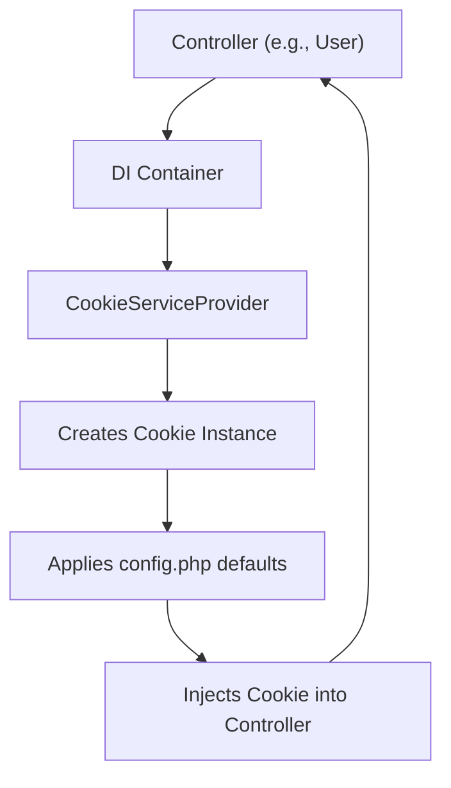
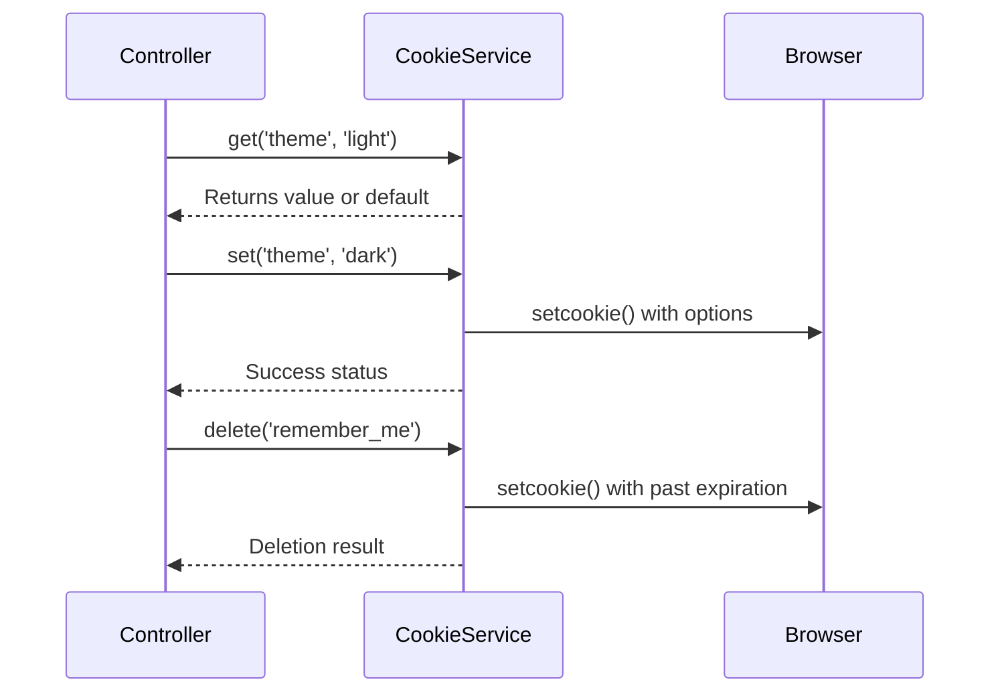
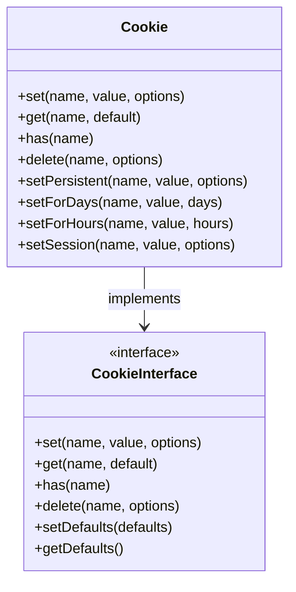
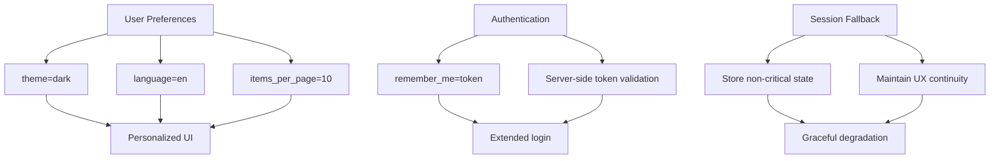
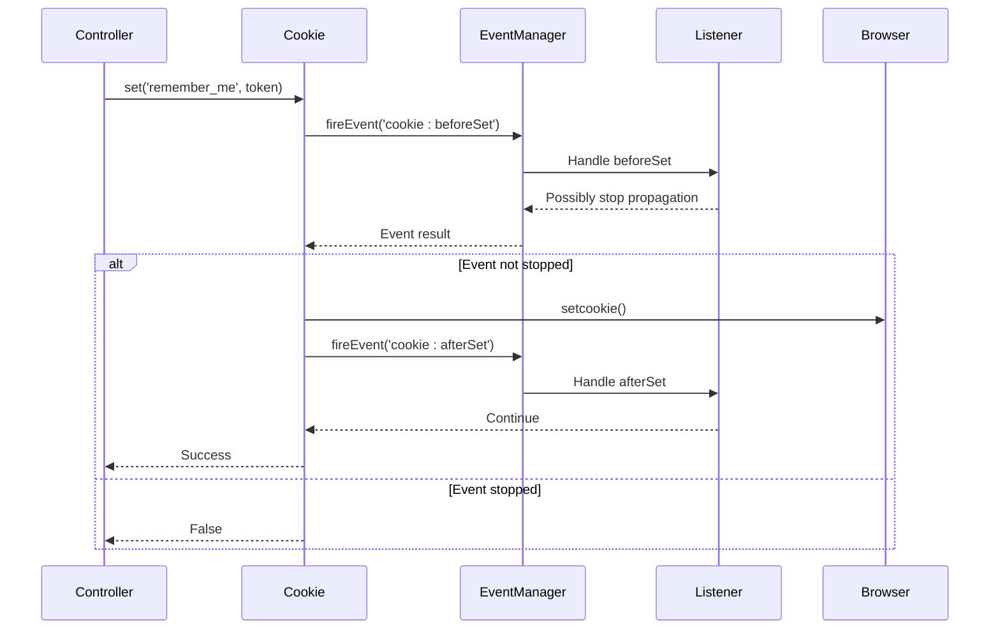

# Cookie Management in Controllers

<cite>
**Referenced Files in This Document**   
- [using-cookie-controller.php](file://examples/using-cookie-controller.php)
- [CookieInterface.php](file://app/Core/Cookie/CookieInterface.php)
- [Cookie.php](file://app/Core/Cookie/Cookie.php)
- [CookieServiceProvider.php](file://app/Module/Provider/CookieServiceProvider.php)
- [config.php](file://app/config.php)
</cite>

## Table of Contents
1. [Introduction](#introduction)
2. [Cookie Service Injection and Configuration](#cookie-service-injection-and-configuration)
3. [Core Cookie Operations in Controllers](#core-cookie-operations-in-controllers)
4. [Secure Cookie Practices](#secure-cookie-practices)
5. [Real-World Use Cases](#real-world-use-cases)
6. [Event-Driven Cookie Handling](#event-driven-cookie-handling)
7. [Browser Compatibility and Limitations](#browser-compatibility-and-limitations)
8. [Privacy and Regulatory Compliance](#privacy-and-regulatory-compliance)
9. [Conclusion](#conclusion)

## Introduction
This document provides a comprehensive guide to managing cookies within controllers using the application's dependency injection and cookie service architecture. It explains how cookies are injected into controllers, demonstrates core operations such as setting, reading, and deleting cookies, and illustrates secure implementation practices. The analysis is based on the `using-cookie-controller.php` example and related core components that define the cookie handling system.

## Cookie Service Injection and Configuration

The Cookie service is automatically injected into controllers through the Dependency Injection (DI) container, enabled by the `CookieServiceProvider`. This service implements the `CookieInterface` and provides a consistent API for cookie operations across the application.

The default cookie behavior is configured in `config.php`, where global settings such as expiration (30 days), path, domain, and security flags (HttpOnly, SameSite=Lax) are defined. These defaults are merged with any runtime options when setting cookies, ensuring consistent security policies.

**Diagram sources**
- [CookieServiceProvider.php](file://app/Module/Provider/CookieServiceProvider.php#L4-L25)
- [config.php](file://app/config.php#L30-L37)

**Section sources**
- [CookieServiceProvider.php](file://app/Module/Provider/CookieServiceProvider.php#L1-L25)
- [config.php](file://app/config.php#L30-L37)

## Core Cookie Operations in Controllers

Controllers interact with cookies through the `$this->cookie` property, which provides access to methods defined in `CookieInterface`. The primary operations include setting, retrieving, checking existence, and deleting cookies.

The `preferencesAction` method in the User controller demonstrates reading user preferences from cookies with fallback defaults and saving updated preferences back to cookies. The `rememberMeAction` shows setting a persistent authentication token, while `logoutAction` illustrates proper cookie deletion.

**Diagram sources**
- [using-cookie-controller.php](file://examples/using-cookie-controller.php#L35-L75)
- [CookieInterface.php](file://app/Core/Cookie/CookieInterface.php#L1-L12)

**Section sources**
- [using-cookie-controller.php](file://examples/using-cookie-controller.php#L35-L75)
- [Cookie.php](file://app/Core/Cookie/Cookie.php#L15-L123)

## Secure Cookie Practices

The application enforces secure cookie practices through configuration and dedicated methods. The `setPersistent` method used in `rememberMeAction` sets cookies with a one-year expiration and allows specification of security flags.

Critical security attributes include:
- **HttpOnly**: Prevents client-side script access to cookie values
- **Secure**: Ensures cookies are only sent over HTTPS connections
- **SameSite**: Mitigates CSRF attacks by controlling cross-origin sending

The example demonstrates best practice by setting `secure=true` and `samesite=Strict` for the remember-me token, which contains sensitive authentication data.

**Diagram sources**
- [Cookie.php](file://app/Core/Cookie/Cookie.php#L15-L208)
- [CookieInterface.php](file://app/Core/Cookie/CookieInterface.php#L1-L12)

**Section sources**
- [Cookie.php](file://app/Core/Cookie/Cookie.php#L15-L208)
- [using-cookie-controller.php](file://examples/using-cookie-controller.php#L25-L30)

## Real-World Use Cases

The implementation demonstrates three primary use cases for cookies in web applications:

### User Preferences
The `preferencesAction` stores UI preferences such as theme, language, and items per page. These non-sensitive settings enhance user experience without requiring database storage.

### Authentication Tokens
The "remember me" functionality uses a persistent cookie containing a random token to maintain login state across sessions. The actual token is also stored server-side for validation, implementing a secure remember-me pattern.

### Session Fallback
While the application uses server-side sessions, cookies serve as a fallback mechanism for maintaining state when sessions expire or are unavailable, ensuring a seamless user experience.

**Diagram sources**
- [using-cookie-controller.php](file://examples/using-cookie-controller.php#L35-L75)

**Section sources**
- [using-cookie-controller.php](file://examples/using-cookie-controller.php#L35-L75)

## Event-Driven Cookie Handling

The Cookie class implements event awareness, allowing the application to hook into cookie operations. Before and after events are fired for set, get, and delete operations, enabling logging, validation, or additional processing.

This event system allows for cross-cutting concerns such as audit logging of authentication tokens or monitoring cookie usage patterns without modifying the core controller logic.

**Diagram sources**
- [Cookie.php](file://app/Core/Cookie/Cookie.php#L30-L50)
- [Cookie.php](file://app/Core/Cookie/Cookie.php#L90-L100)

**Section sources**
- [Cookie.php](file://app/Core/Cookie/Cookie.php#L30-L123)

## Browser Compatibility and Limitations

The implementation respects standard browser cookie limitations:
- **Size limits**: Individual cookies are limited to 4KB
- **Quantity limits**: Browsers typically allow 50-100 cookies per domain
- **Domain restrictions**: Cookies are scoped to specific domains and paths
- **Expiration**: Session cookies vs. persistent cookies with maximum 1-year lifespan

The helper methods `setForDays`, `setForHours`, and `setPersistent` abstract time-based expiration logic, ensuring consistent behavior across different browsers while working within these constraints.

**Section sources**
- [Cookie.php](file://app/Core/Cookie/Cookie.php#L150-L200)

## Privacy and Regulatory Compliance

The cookie system supports compliance with privacy regulations such as GDPR through several mechanisms:
- **Explicit consent**: While not shown in the example, the architecture allows for implementing consent checks before setting non-essential cookies
- **Secure defaults**: HttpOnly and SameSite flags protect user data
- **Easy removal**: The `delete` and `clearAll` methods enable user data removal requests
- **Minimal data**: Cookies store tokens rather than personal data, with sensitive information kept server-side

Applications should extend this foundation with cookie consent banners and preference centers to achieve full regulatory compliance.

**Section sources**
- [Cookie.php](file://app/Core/Cookie/Cookie.php#L1-L208)
- [using-cookie-controller.php](file://examples/using-cookie-controller.php#L1-L99)

## Conclusion

The cookie management system provides a robust, secure, and flexible foundation for maintaining state in web applications. By leveraging dependency injection, interface contracts, and event-driven architecture, it enables controllers to handle cookies consistently while enforcing security best practices. The implementation balances functionality with security, supporting essential use cases like user preferences and authentication while respecting privacy regulations and browser limitations. Developers should follow the demonstrated patterns for secure cookie usage, particularly when handling sensitive data or implementing features that require user consent.