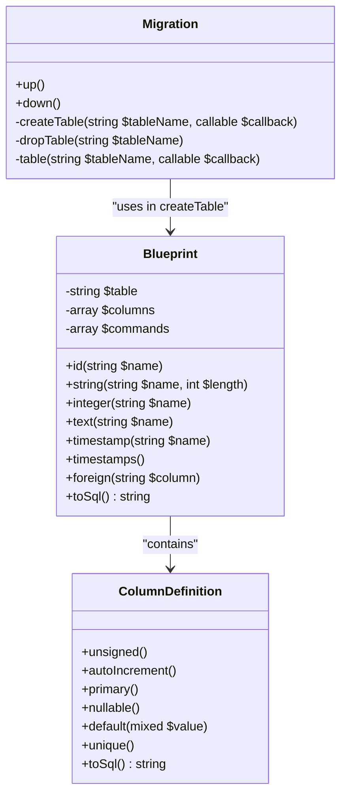
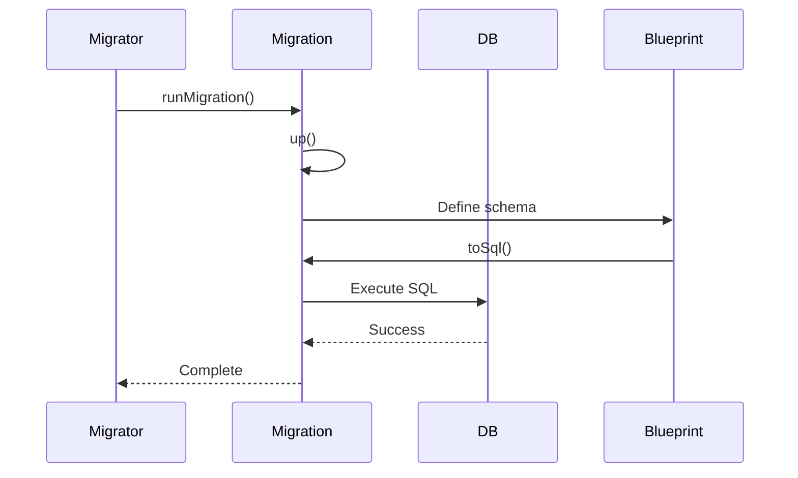
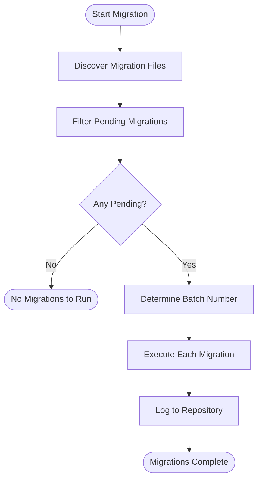

# Database Migrations Examples

<cite>
**Referenced Files in This Document**   
- [migrations.php](file://examples/migrations.php)
- [Migration.php](file://app/Core/Database/Migration.php)
- [Migrator.php](file://app/Core/Database/Migrator.php)
- [Blueprint.php](file://app/Core/Database/Blueprint.php)
- [MigrationRepository.php](file://app/Core/Database/MigrationRepository.php)
- [2023_10_15_123456_create_users_table.php](file://migrations/2023_10_15_123456_create_users_table.php)
- [2025_09_16_100000_create_posts_table.php](file://migrations/2025_09_16_100000_create_posts_table.php)
- [2025_09_18_100000_create_tasks_table.php](file://migrations/2025_09_18_100000_create_tasks_table.php)
</cite>

## Table of Contents
1. [Introduction](#introduction)
2. [Core Components of Migration System](#core-components-of-migration-system)
3. [Defining Schema Changes with Migration and Blueprint](#defining-schema-changes-with-migration-and-blueprint)
4. [Creating Tables and Managing Relationships](#creating-tables-and-managing-relationships)
5. [Reversible Migrations: up() and down() Methods](#reversible-migrations-up-and-down-methods)
6. [Applying Migrations via Migrator](#applying-migrations-via-migrator)
7. [Migration Tracking with MigrationRepository](#migration-tracking-with-migrationrepository)
8. [Migration Workflows in Team Environments](#migration-workflows-in-team-environments)
9. [Handling Failed Migrations and Rollbacks](#handling-failed-migrations-and-rollbacks)
10. [Common Issues and Best Practices](#common-issues-and-best-practices)

## Introduction
This document provides a comprehensive guide to database migrations within the application framework. It explains how schema changes are defined using the `Migration` and `Blueprint` classes, demonstrates the creation of tables, modification of columns, addition of indexes, and management of relationships through migration files. The document also covers how the `Migrator` class applies migrations and tracks their execution state using the `MigrationRepository`. Guidance is provided on structuring migration workflows in collaborative environments and handling common issues such as conflicts, irreversible operations, and data loss risks during rollbacks.

## Core Components of Migration System

The migration system is composed of several key components that work together to manage database schema evolution:

- **Migration**: Abstract base class defining the interface for individual migration files.
- **Blueprint**: Constructs SQL schema definitions for table creation and modification.
- **Migrator**: Orchestrates the execution of pending migrations and rollback operations.
- **MigrationRepository**: Tracks which migrations have been applied and in what batch.
- **Migration Files**: Concrete implementations of the `Migration` class that define specific schema changes.

These components enable a structured, version-controlled approach to evolving the database schema over time.

**Section sources**
- [Migration.php](file://app/Core/Database/Migration.php#L1-L61)
- [Blueprint.php](file://app/Core/Database/Blueprint.php#L1-L90)
- [Migrator.php](file://app/Core/Database/Migrator.php#L1-L142)
- [MigrationRepository.php](file://app/Core/Database/MigrationRepository.php#L1-L100)

## Defining Schema Changes with Migration and Blueprint

Schema changes are defined using migration classes that extend the `Migration` base class. Each migration must implement two methods: `up()` to apply changes and `down()` to reverse them. The `Blueprint` class provides a fluent interface for defining table structures.

The `Blueprint` class supports various column types such as `id()`, `string()`, `integer()`, `text()`, and `timestamp()`. It also allows defining constraints like primary keys, unique indexes, foreign key relationships, and default values. The `timestamps()` method automatically adds `created_at` and `updated_at` columns.

When a migration is executed, the `Blueprint` instance generates the corresponding SQL statements, which are then executed against the database.

**Diagram sources**
- [Migration.php](file://app/Core/Database/Migration.php#L1-L61)
- [Blueprint.php](file://app/Core/Database/Blueprint.php#L1-L90)
- [ColumnDefinition.php](file://app/Core/Database/ColumnDefinition.php#L1-L50)

## Creating Tables and Managing Relationships

Creating tables is accomplished using the `createTable()` method within a migration's `up()` method. This method accepts a table name and a closure that receives a `Blueprint` instance for defining the schema.

Foreign key relationships are established using the `foreign()` method followed by `references()` and `on()` to specify the referenced column and table. Indexes can be added implicitly via constraints like `unique()` or explicitly through additional methods if supported.

For example, the `CreatePostsTable` migration creates a `posts` table with a foreign key to the `users` table via the `user_id` column.

**Section sources**
- [2025_09_16_100000_create_posts_table.php](file://migrations/2025_09_16_100000_create_posts_table.php#L1-L25)
- [2025_09_18_100000_create_tasks_table.php](file://migrations/2025_09_18_100000_create_tasks_table.php#L1-L28)

## Reversible Migrations: up() and down() Methods

Each migration must implement both `up()` and `down()` methods to support reversible changes. The `up()` method applies the schema change (e.g., creating a table), while the `down()` method reverses it (e.g., dropping the table).

This design ensures that migrations can be safely rolled back in development or reverted in case of errors in production. For instance, the `CreateUsersTable` migration creates the `users` table in `up()` and drops it in `down()`.

Irreversible operations (like data deletion) should be avoided in migrations, or clearly documented if unavoidable.

**Diagram sources**
- [Migration.php](file://app/Core/Database/Migration.php#L1-L61)
- [Migrator.php](file://app/Core/Database/Migrator.php#L1-L142)

## Applying Migrations via Migrator

The `Migrator` class is responsible for discovering, executing, and rolling back migrations. It scans the migrations directory for files matching the naming pattern `YYYY_MM_DD_HHMMSS_description.php`, determines which migrations have not yet been applied by consulting the `MigrationRepository`, and runs them in chronological order.

The `run()` method executes all pending migrations in a single batch, while `rollback()` reverts the most recent batch by calling `down()` on each migration in reverse order. The `reset()` method rolls back all migrations completely.

**Diagram sources**
- [Migrator.php](file://app/Core/Database/Migrator.php#L1-L142)

## Migration Tracking with MigrationRepository

The `MigrationRepository` maintains a record of applied migrations in a dedicated `migrations` table. This table stores the migration filename, batch number, and execution timestamp.

Upon startup, the repository ensures the `migrations` table exists. When a migration is successfully applied, it is logged with the current batch number. During rollback, entries are removed from the log after the `down()` method executes.

This tracking mechanism prevents duplicate execution and enables safe rollback operations.

**Section sources**
- [MigrationRepository.php](file://app/Core/Database/MigrationRepository.php#L1-L100)

## Migration Workflows in Team Environments

In team settings, consistent migration workflows are essential:

1. Always generate migrations with timestamp-based filenames to ensure correct ordering.
2. Commit migrations alongside code changes that depend on the new schema.
3. Never modify an already-committed migration; instead, create a new migration to correct it.
4. Use feature branches to isolate schema changes until merged.
5. Coordinate deployment order when multiple migrations affect related tables.

The `Migrator` processes migrations in filename order, so chronological timestamps ensure proper dependency resolution.

## Handling Failed Migrations and Rollbacks

When a migration fails, the system may be left in an inconsistent state. To mitigate this:

- Wrap complex migrations in transactions if the database supports DDL transactions.
- Test migrations thoroughly in staging environments.
- Avoid destructive operations (e.g., `DROP COLUMN`) unless absolutely necessary.
- Provide data backup procedures before running destructive migrations.

Rollbacks should be tested regularly. Note that some operations (like removing a column with data) are irreversible and may result in data loss.

## Common Issues and Best Practices

### Migration Conflicts
Multiple developers creating migrations simultaneously can lead to filename collisions or out-of-order execution. Use precise timestamps and coordinate via version control.

### Irreversible Operations
Operations like `DROP TABLE` or `DROP COLUMN` cannot be undone without data restoration. Always evaluate whether a change can be safely reversed.

### Data Loss Risks
Be cautious with migrations that modify or delete data. Prefer soft deletes or archiving patterns when possible.

### Best Practices
- Keep migrations small and focused.
- Use descriptive names in migration filenames.
- Test both `up()` and `down()` methods.
- Document breaking changes in release notes.
- Backup production databases before applying migrations.

**Section sources**
- [migrations.php](file://examples/migrations.php#L1-L78)
- [Migrator.php](file://app/Core/Database/Migrator.php#L1-L142)
- [MigrationRepository.php](file://app/Core/Database/MigrationRepository.php#L1-L100)