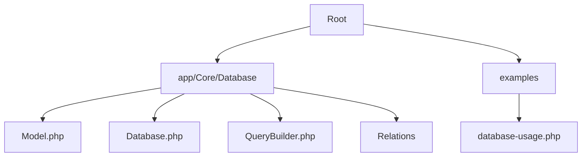
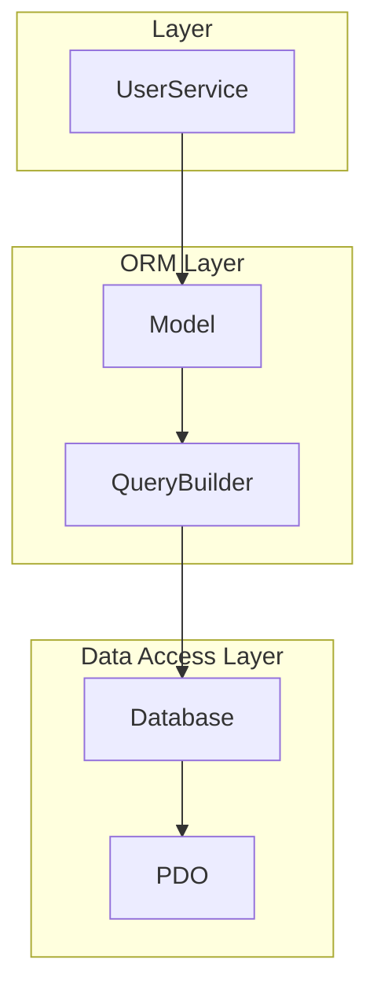
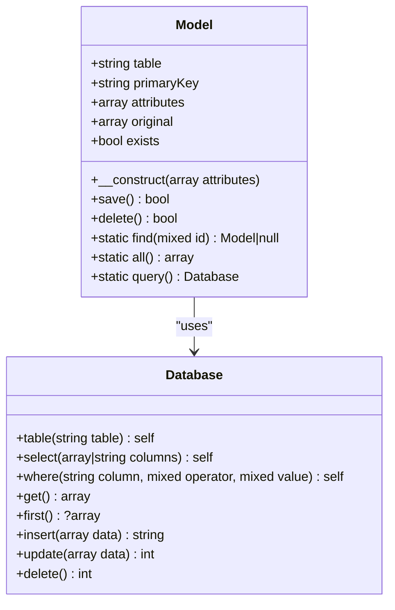
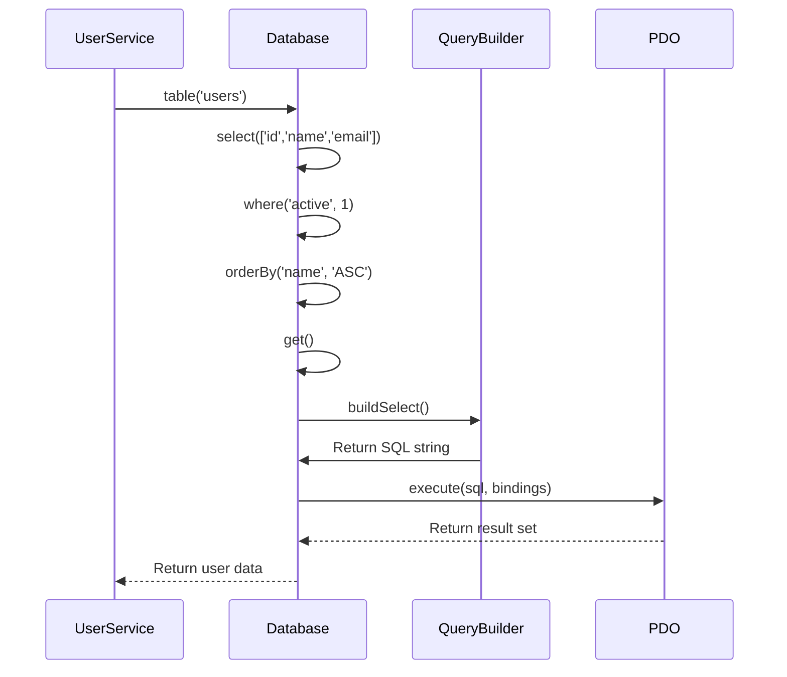
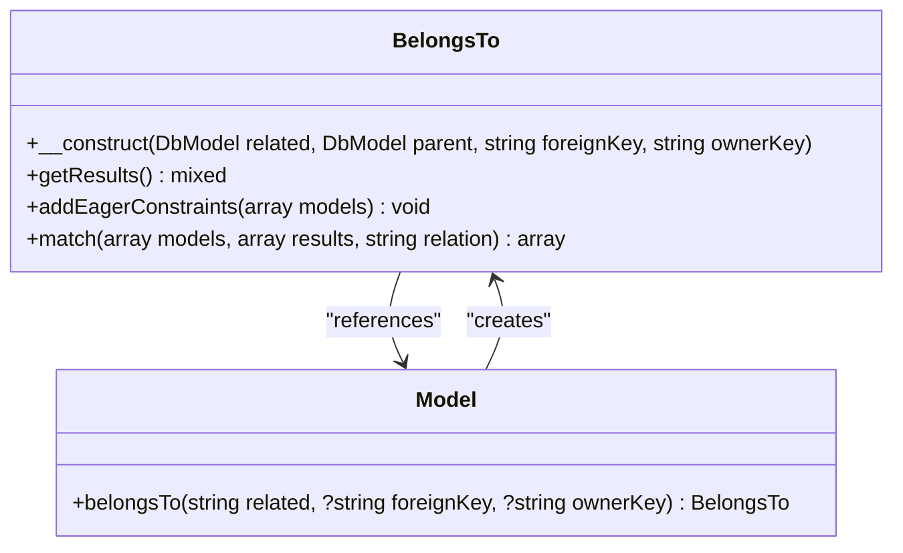
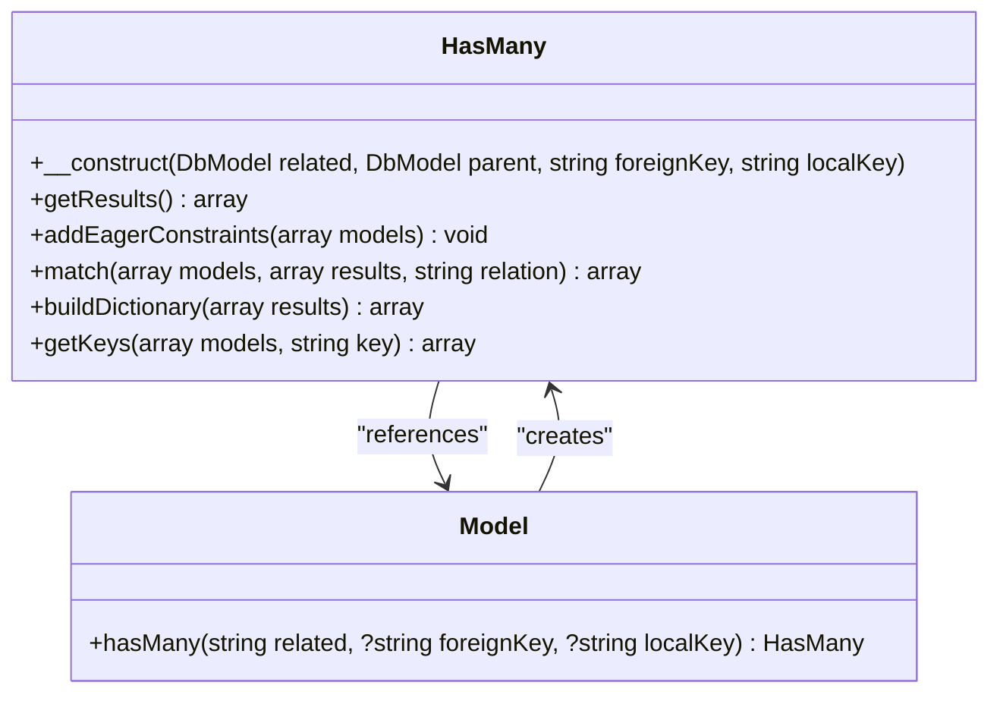
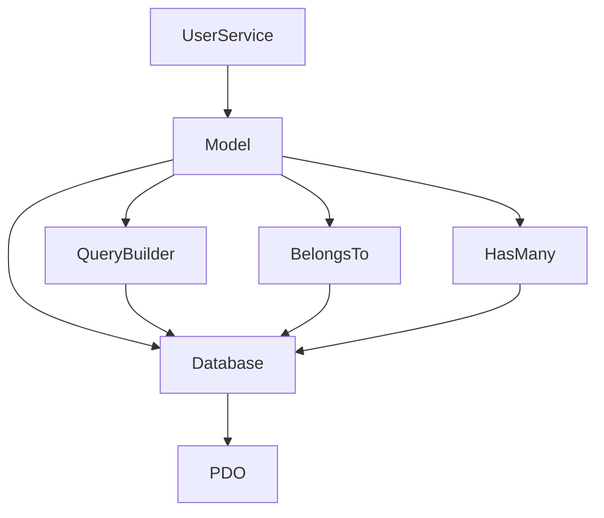

# Database Usage Examples

<cite>
**Referenced Files in This Document**   
- [database-usage.php](file://examples/database-usage.php)
- [Model.php](file://app/Core/Database/Model.php)
- [Database.php](file://app/Core/Database/Database.php)
- [QueryBuilder.php](file://app/Core/Database/QueryBuilder.php)
- [BelongsTo.php](file://app/Core/Database/Model/BelongsTo.php)
- [HasMany.php](file://app/Core/Database/Model/HasMany.php)
- [config.php](file://app/config.php)
</cite>

## Table of Contents
1. [Introduction](#introduction)
2. [Project Structure](#project-structure)
3. [Core Components](#core-components)
4. [Architecture Overview](#architecture-overview)
5. [Detailed Component Analysis](#detailed-component-analysis)
6. [Dependency Analysis](#dependency-analysis)
7. [Performance Considerations](#performance-considerations)
8. [Troubleshooting Guide](#troubleshooting-guide)
9. [Conclusion](#conclusion)

## Introduction
This document provides a comprehensive guide to database usage within the application, focusing on practical examples and implementation details. It explains how to perform CRUD operations, use the query builder, manage model relationships, configure database connections, and troubleshoot common issues. The examples are based on real implementation patterns found in the codebase, particularly from the `database-usage.php` example file and core database components.

## Project Structure
The application follows a modular structure with a clear separation of concerns. Database-related functionality is centralized in the `app/Core/Database` directory, while usage examples are provided in the `examples` folder. This organization promotes reusability and maintainability of database code across different modules.

**Diagram sources**
- [Model.php](file://app/Core/Database/Model.php#L1-L50)
- [Database.php](file://app/Core/Database/Database.php#L1-L50)
- [database-usage.php](file://examples/database-usage.php#L1-L10)

**Section sources**
- [database-usage.php](file://examples/database-usage.php#L1-L64)
- [Model.php](file://app/Core/Database/Model.php#L1-L50)

## Core Components
The database system is built around three core components: the `Database` service for query execution, the `Model` class for object-relational mapping, and the `QueryBuilder` for constructing complex queries. These components work together to provide a fluent interface for database interactions, enabling developers to perform operations with minimal boilerplate code.

**Section sources**
- [Database.php](file://app/Core/Database/Database.php#L1-L50)
- [Model.php](file://app/Core/Database/Model.php#L1-L50)
- [QueryBuilder.php](file://app/Core/Database/QueryBuilder.php#L1-L50)

## Architecture Overview
The database architecture follows a layered pattern where the `Database` service acts as the data access layer, the `Model` class serves as the domain model layer, and the `QueryBuilder` provides a fluent interface for query construction. This separation allows for flexible data access patterns while maintaining clean code organization.

**Diagram sources**
- [Database.php](file://app/Core/Database/Database.php#L1-L50)
- [Model.php](file://app/Core/Database/Model.php#L1-L50)
- [QueryBuilder.php](file://app/Core/Database/QueryBuilder.php#L1-L50)

## Detailed Component Analysis

### Model Instantiation and CRUD Operations
The `Model` class provides an elegant way to interact with database tables through object-oriented syntax. Model instantiation automatically determines the corresponding table name using naming conventions, and CRUD operations are performed through intuitive methods.

#### Model Instantiation
When a model is instantiated, it automatically determines its corresponding database table based on the class name. For example, a `Users` model would map to a `users` table. The `__construct` method initializes the model with attributes and sets up the connection to the database through the dependency injection container.

**Diagram sources**
- [Model.php](file://app/Core/Database/Model.php#L10-L100)
- [Database.php](file://app/Core/Database/Database.php#L10-L50)

#### CRUD Operations
The example in `database-usage.php` demonstrates basic CRUD operations through the `UserService` class. The service uses dependency injection to obtain a database instance and performs operations using a fluent query builder interface.

- **SELECT**: The `getActiveUsers` method demonstrates querying with filtering and sorting
- **INSERT**: The `createUser` method shows how to insert new records
- **UPDATE**: The `updateUser` method illustrates updating existing records
- **DELETE**: While not explicitly shown, deletion is available through the `delete` method on models

**Section sources**
- [database-usage.php](file://examples/database-usage.php#L15-L45)
- [Model.php](file://app/Core/Database/Model.php#L150-L250)
- [Database.php](file://app/Core/Database/Database.php#L100-L200)

### Query Builder Usage
The query builder provides a fluent interface for constructing SQL queries without writing raw SQL. It supports method chaining for building complex queries in a readable and maintainable way.

**Diagram sources**
- [Database.php](file://app/Core/Database/Database.php#L150-L250)
- [database-usage.php](file://examples/database-usage.php#L15-L25)

### Relationship Management
The ORM supports various relationship types including BelongsTo, HasMany, BelongsToMany, and HasOne. These relationships allow for easy navigation between related models and provide methods for eager loading to prevent N+1 query problems.

#### BelongsTo Relationship
The `BelongsTo` relationship represents a many-to-one connection between two models. It's used when a model belongs to another model. For example, a `Task` might belong to a `User`.

**Diagram sources**
- [BelongsTo.php](file://app/Core/Database/Model/BelongsTo.php#L1-L30)
- [Model.php](file://app/Core/Database/Model.php#L300-L320)

#### HasMany Relationship
The `HasMany` relationship represents a one-to-many connection between two models. It's used when a model has multiple instances of another model. For example, a `User` might have many `Posts`.

**Diagram sources**
- [HasMany.php](file://app/Core/Database/Model/HasMany.php#L1-L30)
- [Model.php](file://app/Core/Database/Model.php#L320-L340)

## Dependency Analysis
The database components have a clear dependency hierarchy where higher-level components depend on lower-level ones. This structure ensures loose coupling and high cohesion within the database layer.

**Diagram sources**
- [Model.php](file://app/Core/Database/Model.php#L1-L50)
- [Database.php](file://app/Core/Database/Database.php#L1-L50)
- [QueryBuilder.php](file://app/Core/Database/QueryBuilder.php#L1-L50)

**Section sources**
- [Model.php](file://app/Core/Database/Model.php#L1-L50)
- [Database.php](file://app/Core/Database/Database.php#L1-L50)

## Performance Considerations
The database system includes several features designed to optimize performance:

- **Eager Loading**: The `with` method on models allows for eager loading of relationships, preventing N+1 query problems
- **Query Caching**: While not explicitly shown, the persistent connection setting in configuration suggests connection pooling
- **Indexing**: Proper indexing should be applied to columns used in WHERE, JOIN, and ORDER BY clauses
- **Batch Operations**: The query builder supports batch operations for improved efficiency

When working with large datasets, consider using pagination through the `limit` and `offset` methods, and leverage the `select` method to retrieve only necessary columns.

**Section sources**
- [QueryBuilder.php](file://app/Core/Database/QueryBuilder.php#L50-L100)
- [config.php](file://app/config.php#L10-L20)

## Troubleshooting Guide
Common database issues and their solutions:

### Connection Failures
Connection failures typically occur due to incorrect configuration or network issues. Ensure that:
- Database server is running
- Host, port, username, and password are correct
- Database name exists
- Network connectivity is available

Configuration is loaded from `config.php`, specifically the `db` section, which must contain valid connection parameters.

### Query Errors
Query errors often result from:
- Invalid column names
- Mismatched parameter counts in prepared statements
- Syntax errors in complex queries

The `Database` class provides detailed error messages including the SQL query and parameter count, which aids in debugging.

### Common Issues and Solutions
- **"Connection failed"**: Verify database server status and credentials in `config.php`
- **"Query failed"**: Check SQL syntax and parameter binding
- **"Table not found"**: Ensure migrations have been run to create tables
- **"Column not found"**: Verify column names match database schema

**Section sources**
- [Database.php](file://app/Core/Database/Database.php#L50-L100)
- [config.php](file://app/config.php#L10-L30)

## Conclusion
The database system provides a robust foundation for data persistence with a clean, intuitive API. By leveraging the Model-Database-QueryBuilder architecture, developers can perform complex database operations with minimal code. The relationship system enables rich data modeling, while the configuration system ensures flexibility across different environments. Following the patterns demonstrated in the examples will lead to maintainable, efficient database interactions.