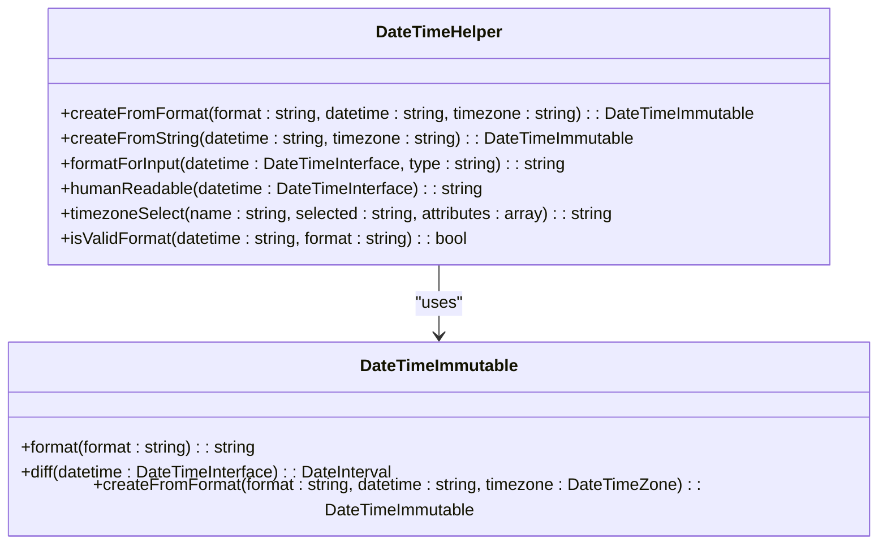
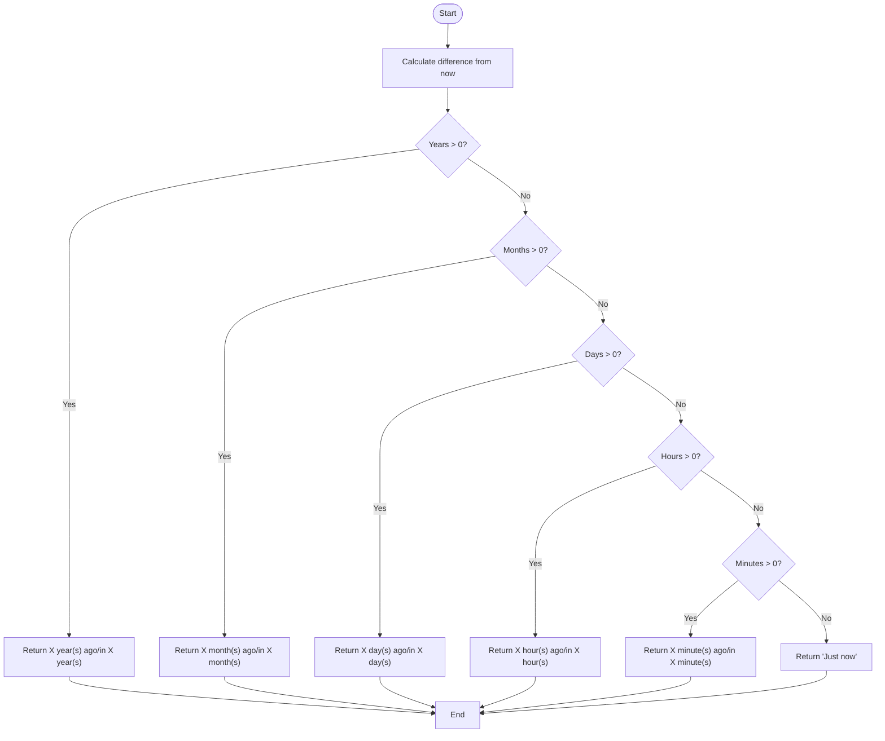
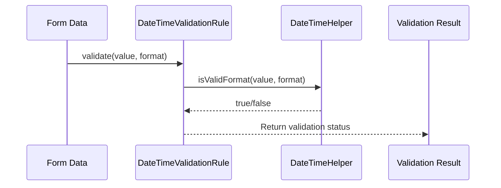

# DateTime Helper Examples

<cite>
**Referenced Files in This Document**   
- [DateTimeHelper.php](file://app/Core/Utils/DateTimeHelper.php)
- [datatime-usage.php](file://examples/datatime-usage.php)
- [Tag.php](file://app/Core/Utils/Tag.php)
- [Tasks.php](file://app/Module/Admin/Models/Tasks.php)
</cite>

## Table of Contents
1. [Introduction](#introduction)
2. [Core Functionality of DateTimeHelper](#core-functionality-of-datetimehelper)
3. [Date and Time Parsing](#date-and-time-parsing)
4. [Formatting for Input and Display](#formatting-for-input-and-display)
5. [Human-Readable Relative Time](#human-readable-relative-time)
6. [Timezone Handling](#timezone-handling)
7. [Validation with DateTimeHelper](#validation-with-datetimehelper)
8. [Integration with Models and Views](#integration-with-models-and-views)
9. [Best Practices and Pitfalls](#best-practices-and-pitfalls)
10. [Performance Tips for Large Datasets](#performance-tips-for-large-datasets)

## Introduction
The `DateTimeHelper` class provides a robust and consistent way to handle date and time operations across the application. It abstracts PHP's native `DateTimeImmutable` functionality into a clean, reusable utility that supports parsing, formatting, validation, and user-friendly display of temporal data. This document demonstrates how `DateTimeHelper.php` is used in practice, with real examples from `datatime-usage.php`, and explains integration points with forms, models, and views.

**Section sources**
- [DateTimeHelper.php](file://app/Core/Utils/DateTimeHelper.php#L1-L74)
- [datatime-usage.php](file://examples/datatime-usage.php#L1-L129)

## Core Functionality of DateTimeHelper
`DateTimeHelper` is a static utility class designed to simplify common date/time operations while ensuring immutability and avoiding side effects. It wraps PHP’s `DateTimeImmutable` class with safe error handling and provides methods tailored for web application needs such as form input formatting, validation, and human-readable output.



**Diagram sources**
- [DateTimeHelper.php](file://app/Core/Utils/DateTimeHelper.php#L1-L74)

## Date and Time Parsing
The helper provides two primary methods for safely creating `DateTimeImmutable` instances from strings.

### Parsing with Format Specification
Use `createFromFormat()` when you need to parse a datetime string in a known format, optionally with a timezone:

```php
$date = DateTimeHelper::createFromFormat('Y-m-d', '2023-12-31', 'UTC');
```

This method returns `null` on failure instead of throwing exceptions, making it safe for user input.

### Parsing from String
For flexible parsing using PHP’s built-in date detection:

```php
$date = DateTimeHelper::createFromString('2023-12-31 20:00:00', 'America/New_York');
```

Again, returns `null` if the string cannot be parsed.

**Section sources**
- [DateTimeHelper.php](file://app/Core/Utils/DateTimeHelper.php#L10-L30)
- [datatime-usage.php](file://examples/datatime-usage.php#L15-L38)

## Formatting for Input and Display
The `formatForInput()` method generates standardized strings suitable for HTML form fields.

### Supported Types
- **datetime**: Outputs in `Y-m-d\TH:i` format (ISO 8601) for `<input type="datetime-local">`
- **date**: Outputs in `Y-m-d` for `<input type="date">`
- **time**: Outputs in `H:i` for `<input type="time">`

Example usage:
```php
echo DateTimeHelper::formatForInput($task->begin_date, 'date');
// Outputs: 2023-12-31
```

This ensures consistent formatting across forms and prevents client-side validation errors.

**Section sources**
- [DateTimeHelper.php](file://app/Core/Utils/DateTimeHelper.php#L32-L40)
- [datatime-usage.php](file://examples/datatime-usage.php#L60-L65)

## Human-Readable Relative Time
The `humanReadable()` method converts timestamps into user-friendly relative expressions like "2 hours ago" or "in 3 days".

### How It Works
It calculates the difference between the current time and the given datetime, then returns the most significant unit (year, month, day, hour, minute). If no significant difference exists, it returns "Just now".

Example outputs:
- `2 minutes ago`
- `in 5 hours`
- `3 days ago`
- `Just now`

Usage in templates:
```php
echo DateTimeHelper::humanReadable($task->created_date);
```



**Diagram sources**
- [DateTimeHelper.php](file://app/Core/Utils/DateTimeHelper.php#L42-L58)

## Timezone Handling
The `timezoneSelect()` method generates an HTML `<select>` dropdown populated with all available timezone identifiers.

### Usage
```php
echo DateTimeHelper::timezoneSelect('user_timezone', 'America/New_York');
```

This leverages the `Tag` utility class to build valid HTML and automatically marks the selected option.

### Integration
This is particularly useful in user profile forms where timezone preferences are collected and stored for personalized datetime rendering.

**Section sources**
- [DateTimeHelper.php](file://app/Core/Utils/DateTimeHelper.php#L60-L70)
- [Tag.php](file://app/Core/Utils/Tag.php#L1-L271)

## Validation with DateTimeHelper
The `isValidFormat()` method checks whether a given string matches a specified datetime format.

### Example Usage in Validation Rules
```php
if (DateTimeHelper::isValidFormat($value, 'Y-m-d')) {
    // Valid date
}
```

This is used in custom validation rules like `DateTimeValidationRule`, which provides convenience methods for validating date, time, and datetime fields.



**Diagram sources**
- [DateTimeHelper.php](file://app/Core/Utils/DateTimeHelper.php#L72-L74)
- [datatime-usage.php](file://examples/datatime-usage.php#L104-L115)

## Integration with Models and Views
`DateTimeHelper` is used throughout the application to ensure consistent handling of temporal data.

### Model Integration
Models like `Tasks.php` contain date fields (`created_date`, `begin_date`, `end_date`) that should be formatted using `DateTimeHelper` when passed to views.

Example:
```php
// In controller
$task = Tasks::find(1);
$formattedDate = DateTimeHelper::formatForInput($task->begin_date, 'date');
```

### View Integration
In PHTML templates (e.g., `task/index.phtml`), use `DateTimeHelper::humanReadable()` for activity feeds and `formatForInput()` for pre-filling forms.

Example in view:
```php
<p>Created <strong><?= DateTimeHelper::humanReadable($task->created_date) ?></strong></p>
<input type="date" value="<?= DateTimeHelper::formatForInput($task->begin_date, 'date') ?>">
```

**Section sources**
- [Tasks.php](file://app/Module/Admin/Models/Tasks.php#L1-L52)
- [datatime-usage.php](file://examples/datatime-usage.php#L50-L80)

## Best Practices and Pitfalls
### Best Practices
- Always use `DateTimeImmutable` to avoid accidental mutations
- Store all timestamps in UTC and convert to user timezone only for display
- Use `DateTimeHelper::createFromFormat()` with explicit formats for parsing user input
- Validate date inputs using `isValidFormat()` before processing

### Common Pitfalls
- **Timezone mismatches**: Ensure server, database, and application timezone settings are aligned
- **Daylight Saving Time (DST)**: Use timezone-aware objects (`DateTimeZone`) rather than fixed offsets
- **Invalid date strings**: Always check for `null` return values when parsing
- **Over-formatting**: Avoid formatting dates too early; keep as objects until rendering

## Performance Tips for Large Datasets
When rendering large lists (e.g., task tables), avoid repeated formatting calls in loops.

### Caching Formatted Dates
Pre-format dates in bulk before passing to the view:
```php
$tasks = Tasks::all();
$formattedTasks = $tasks->map(function ($task) {
    return [
        'id' => $task->task_id,
        'title' => $task->title,
        'begin_date_display' => DateTimeHelper::humanReadable($task->begin_date),
        'begin_date_input' => DateTimeHelper::formatForInput($task->begin_date, 'date')
    ];
});
```

### Lazy Formatting
For very large datasets, consider formatting dates client-side using JavaScript and ISO strings passed from the server.

```php
// Pass ISO string to JavaScript
$data = [
    'created_at' => $task->created_at->format('c') // ISO 8601
];
```

This reduces server CPU load and improves scalability.

**Section sources**
- [DateTimeHelper.php](file://app/Core/Utils/DateTimeHelper.php#L1-L74)
- [datatime-usage.php](file://examples/datatime-usage.php#L1-L129)