# Dependency Injection Examples

<cite>
**Referenced Files in This Document**   
- [using-di.php](file://examples/using-di.php)
- [Container.php](file://app/Core/Di/Container.php)
- [Injectable.php](file://app/Core/Di/Injectable.php)
- [ServiceProvider.php](file://app/Core/Di/Interface/ServiceProvider.php)
- [SessionServiceProvider.php](file://app/Module/Provider/SessionServiceProvider.php)
- [ViewServiceProvider.php](file://app/Module/Provider/ViewServiceProvider.php)
- [ContainerBuilder.php](file://app/Core/Di/ContainerBuilder.php)
</cite>

## Table of Contents
1. [Introduction](#introduction)
2. [Service Registration Methods](#service-registration-methods)
3. [Service Resolution and Auto-Wiring](#service-resolution-and-auto-wiring)
4. [Injectable Trait for Dependency Access](#injectable-trait-for-dependency-access)
5. [Factory Services and Shared Instances](#factory-services-and-shared-instances)
6. [Service Providers for Modular Registration](#service-providers-for-modular-registration)
7. [Configuration-Based Service Setup](#configuration-based-service-setup)
8. [Service Extension and Decorators](#service-extension-and-decorators)
9. [Complex Service Dependencies](#complex-service-dependencies)
10. [Environment-Specific Configuration](#environment-specific-configuration)
11. [Controller Dependency Injection](#controller-dependency-injection)
12. [Container Builder for Fluent Configuration](#container-builder-for-fluent-configuration)
13. [Testing with Mock Dependencies](#testing-with-mock-dependencies)
14. [Best Practices and Performance Considerations](#best-practices-and-performance-considerations)

## Introduction
This document provides a comprehensive analysis of dependency injection patterns implemented in the application using the `Di\Container` class. It demonstrates various techniques for service registration, resolution, and injection, with practical examples from the `using-di.php` file. The documentation covers basic to advanced patterns, including service providers, configuration-based setup, decorators, and testing strategies.

**Section sources**
- [using-di.php](file://examples/using-di.php#L1-L20)

## Service Registration Methods
The dependency injection container supports multiple methods for registering services. Basic registration includes simple values, object instances, and closures for lazy loading. The container stores definitions and resolves them when requested, enabling flexible service management.

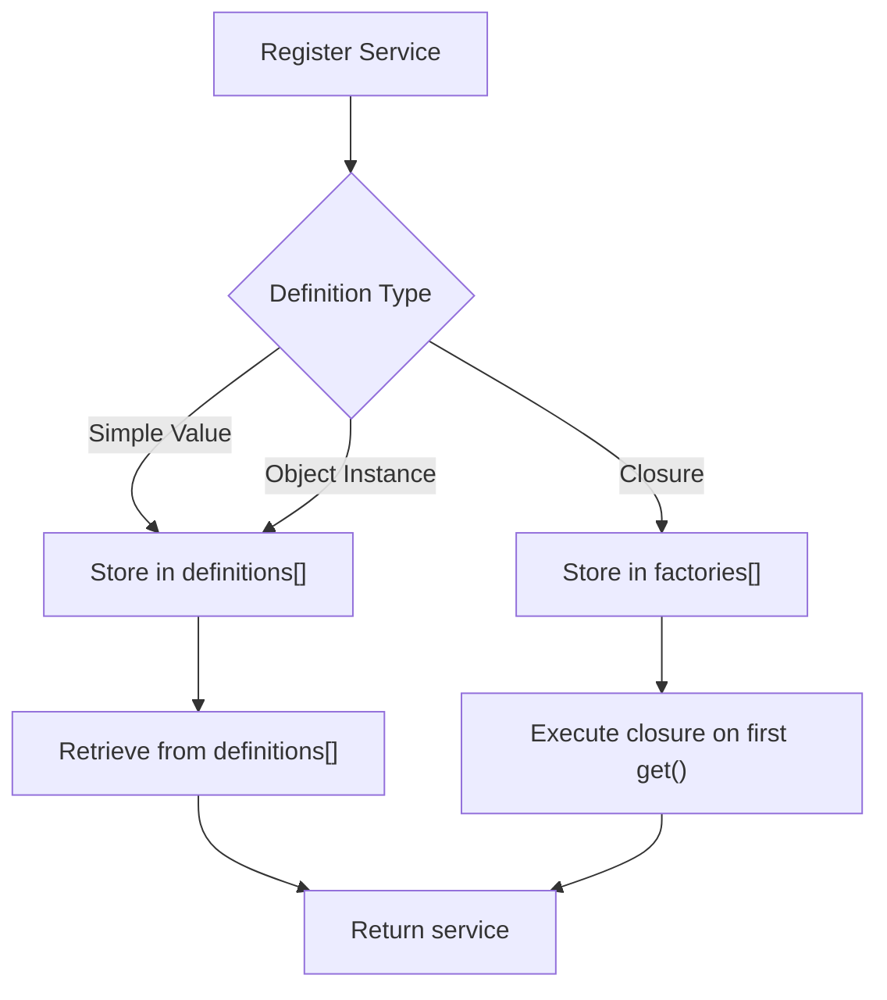

**Diagram sources**
- [Container.php](file://app/Core/Di/Container.php#L50-L70)
- [using-di.php](file://examples/using-di.php#L10-L25)

**Section sources**
- [Container.php](file://app/Core/Di/Container.php#L50-L85)
- [using-di.php](file://examples/using-di.php#L10-L25)

## Service Resolution and Auto-Wiring
The container automatically resolves class dependencies through constructor injection using PHP's Reflection API. When a class is requested, the container examines its constructor parameters and recursively resolves type-hinted dependencies. This auto-wiring capability eliminates the need for explicit service definitions for many classes.

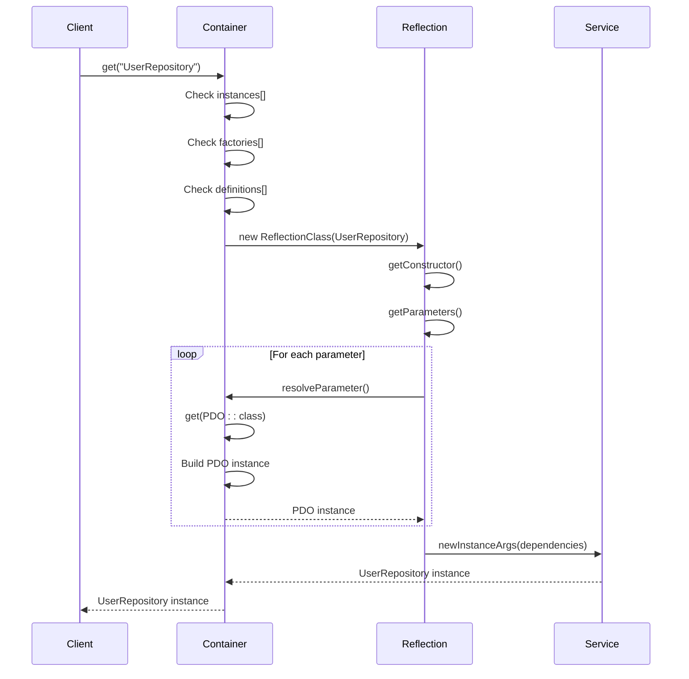

**Diagram sources**
- [Container.php](file://app/Core/Di/Container.php#L90-L120)
- [using-di.php](file://examples/using-di.php#L30-L45)

**Section sources**
- [Container.php](file://app/Core/Di/Container.php#L90-L124)
- [using-di.php](file://examples/using-di.php#L30-L45)

## Injectable Trait for Dependency Access
The `Injectable` trait enables classes to access services from the container through magic properties. Classes using this trait can access registered services directly as properties, providing a convenient way to retrieve dependencies without explicit container references.

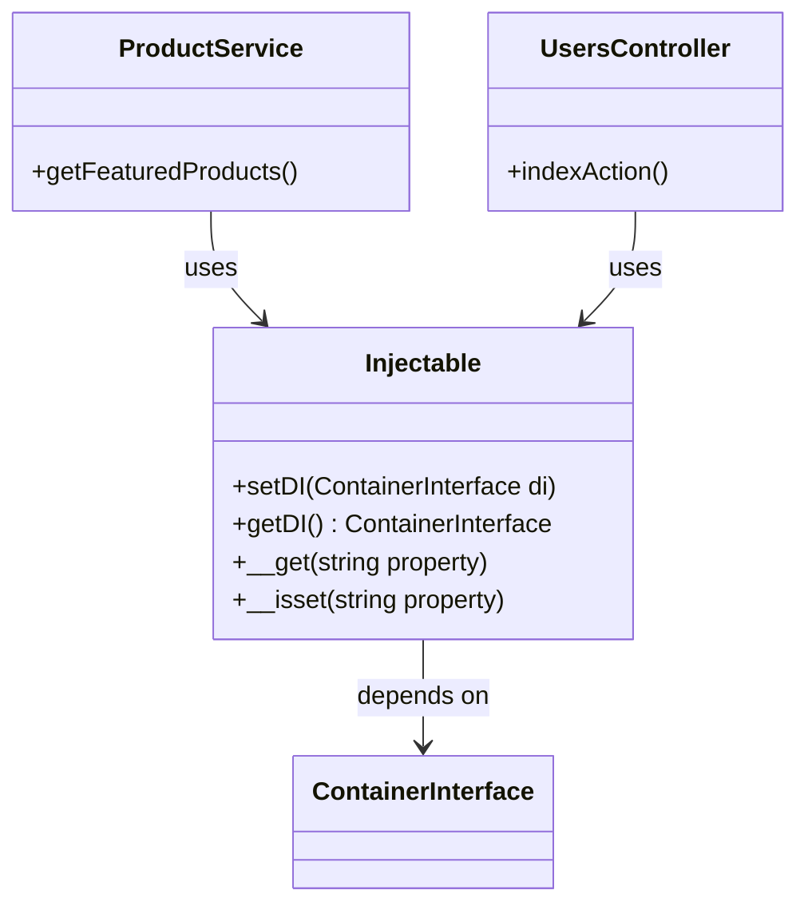

**Diagram sources**
- [Injectable.php](file://app/Core/Di/Injectable.php#L10-L47)
- [using-di.php](file://examples/using-di.php#L60-L75)

**Section sources**
- [Injectable.php](file://app/Core/Di/Injectable.php#L10-L47)
- [using-di.php](file://examples/using-di.php#L60-L75)

## Factory Services and Shared Instances
The container distinguishes between factory services (new instance on each request) and shared instances (same instance returned on subsequent requests). This pattern allows fine-grained control over object lifecycle, enabling stateless services to be created fresh while maintaining singletons for stateful components.

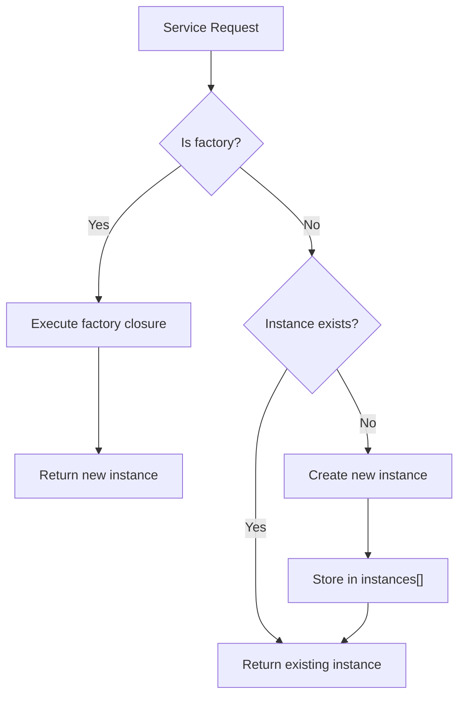

**Diagram sources**
- [Container.php](file://app/Core/Di/Container.php#L75-L90)
- [using-di.php](file://examples/using-di.php#L80-L100)

**Section sources**
- [Container.php](file://app/Core/Di/Container.php#L75-L90)
- [using-di.php](file://examples/using-di.php#L80-L100)

## Service Providers for Modular Registration
Service providers implement the `ServiceProvider` interface to encapsulate related service registrations. This pattern promotes modularity and organization, allowing services to be grouped by functionality and registered collectively. Providers can be reused across different applications or environments.

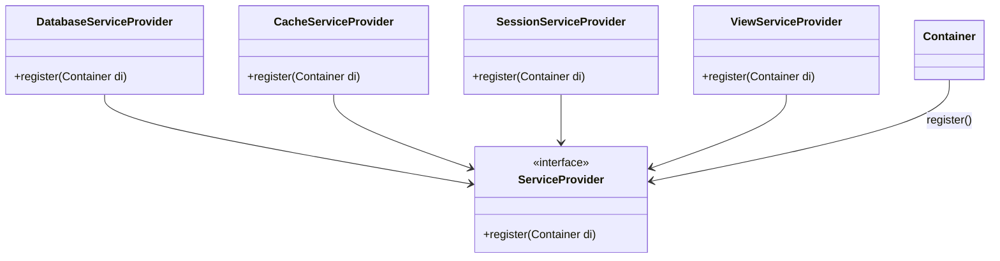

**Diagram sources**
- [ServiceProvider.php](file://app/Core/Di/Interface/ServiceProvider.php#L5-L10)
- [DatabaseServiceProvider](file://examples/using-di.php#L130-L140)
- [CacheServiceProvider](file://examples/using-di.php#L140-L150)
- [SessionServiceProvider](file://app/Module/Provider/SessionServiceProvider.php#L10-L25)
- [ViewServiceProvider](file://app/Module/Provider/ViewServiceProvider.php#L10-L20)

**Section sources**
- [ServiceProvider.php](file://app/Core/Di/Interface/ServiceProvider.php#L5-L10)
- [using-di.php](file://examples/using-di.php#L130-L150)
- [SessionServiceProvider.php](file://app/Module/Provider/SessionServiceProvider.php#L10-L25)
- [ViewServiceProvider.php](file://app/Module/Provider/ViewServiceProvider.php#L10-L20)

## Configuration-Based Service Setup
Services can be defined in configuration arrays, enabling centralized service definitions that can be easily modified or replaced. This approach separates service configuration from implementation, facilitating environment-specific setups and promoting configuration reuse.

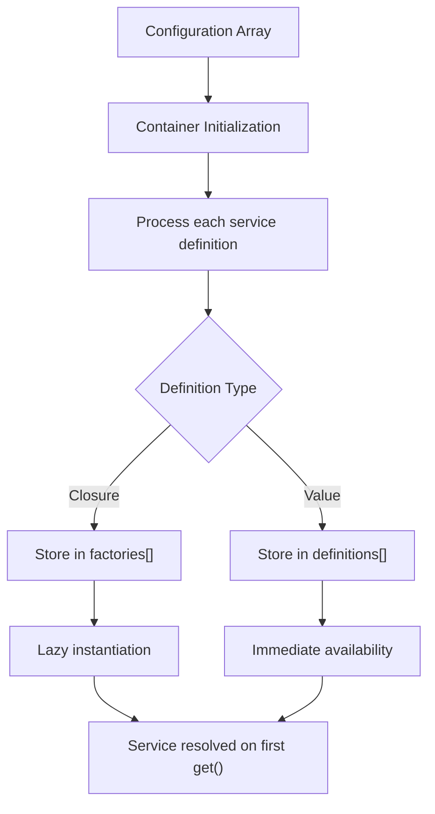

**Diagram sources**
- [Container.php](file://app/Core/Di/Container.php#L30-L45)
- [using-di.php](file://examples/using-di.php#L155-L180)

**Section sources**
- [Container.php](file://app/Core/Di/Container.php#L30-L45)
- [using-di.php](file://examples/using-di.php#L155-L180)

## Service Extension and Decorators
The container supports service extension through decorator patterns, allowing existing services to be wrapped with additional functionality. This enables cross-cutting concerns like logging, caching, or security to be added without modifying the original service implementation.

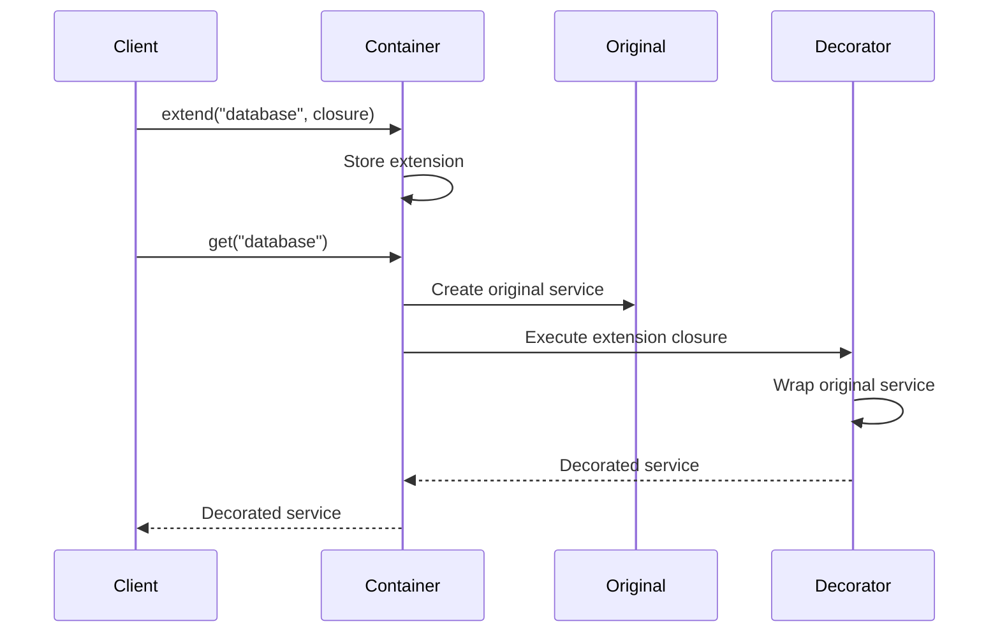

**Diagram sources**
- [Container.php](file://app/Core/Di/Container.php#L140-L144)
- [using-di.php](file://examples/using-di.php#L190-L200)

**Section sources**
- [Container.php](file://app/Core/Di/Container.php#L140-L144)
- [using-di.php](file://examples/using-di.php#L190-L200)

## Complex Service Dependencies
The container handles complex dependency graphs by recursively resolving constructor parameters. Services with multiple dependencies are automatically wired with their required collaborators, enabling the creation of sophisticated service hierarchies without manual dependency management.

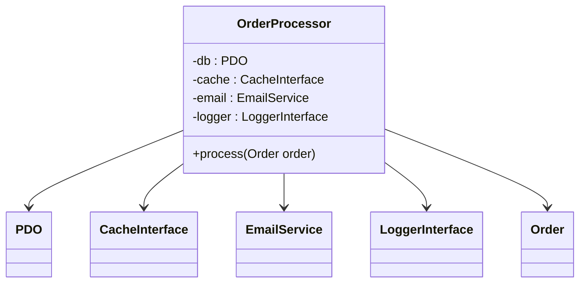

**Diagram sources**
- [Container.php](file://app/Core/Di/Container.php#L90-L124)
- [using-di.php](file://examples/using-di.php#L210-L240)

**Section sources**
- [Container.php](file://app/Core/Di/Container.php#L90-L124)
- [using-di.php](file://examples/using-di.php#L210-L240)

## Environment-Specific Configuration
The container supports environment-specific service configurations by loading different configuration files based on the current environment. This enables different service implementations (e.g., development vs production) to be used without code changes.

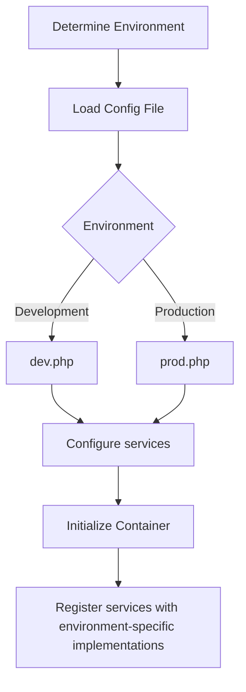

**Diagram sources**
- [using-di.php](file://examples/using-di.php#L250-L280)

**Section sources**
- [using-di.php](file://examples/using-di.php#L250-L280)

## Controller Dependency Injection
Controllers can receive their dependencies through constructor injection, promoting testability and separation of concerns. The container resolves controller dependencies when the controller is instantiated, ensuring all required services are available.

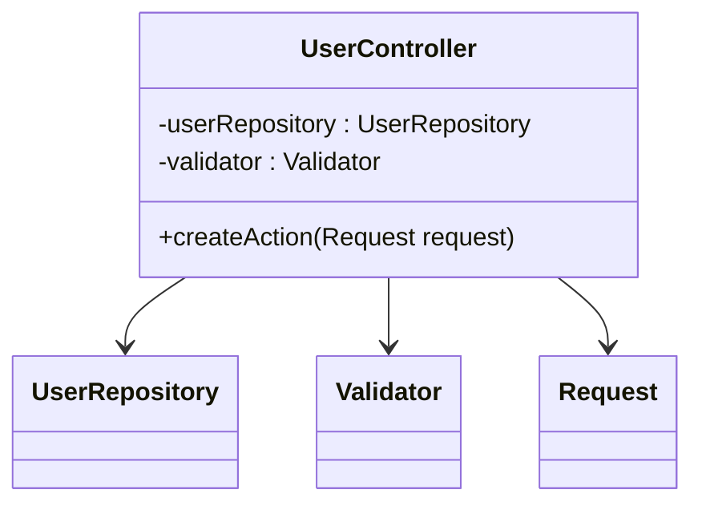

**Diagram sources**
- [using-di.php](file://examples/using-di.php#L290-L330)

**Section sources**
- [using-di.php](file://examples/using-di.php#L290-L330)

## Container Builder for Fluent Configuration
The `ContainerBuilder` class provides a fluent interface for configuring the container. This pattern enables method chaining for service definitions and provider registration, resulting in clean, readable configuration code.

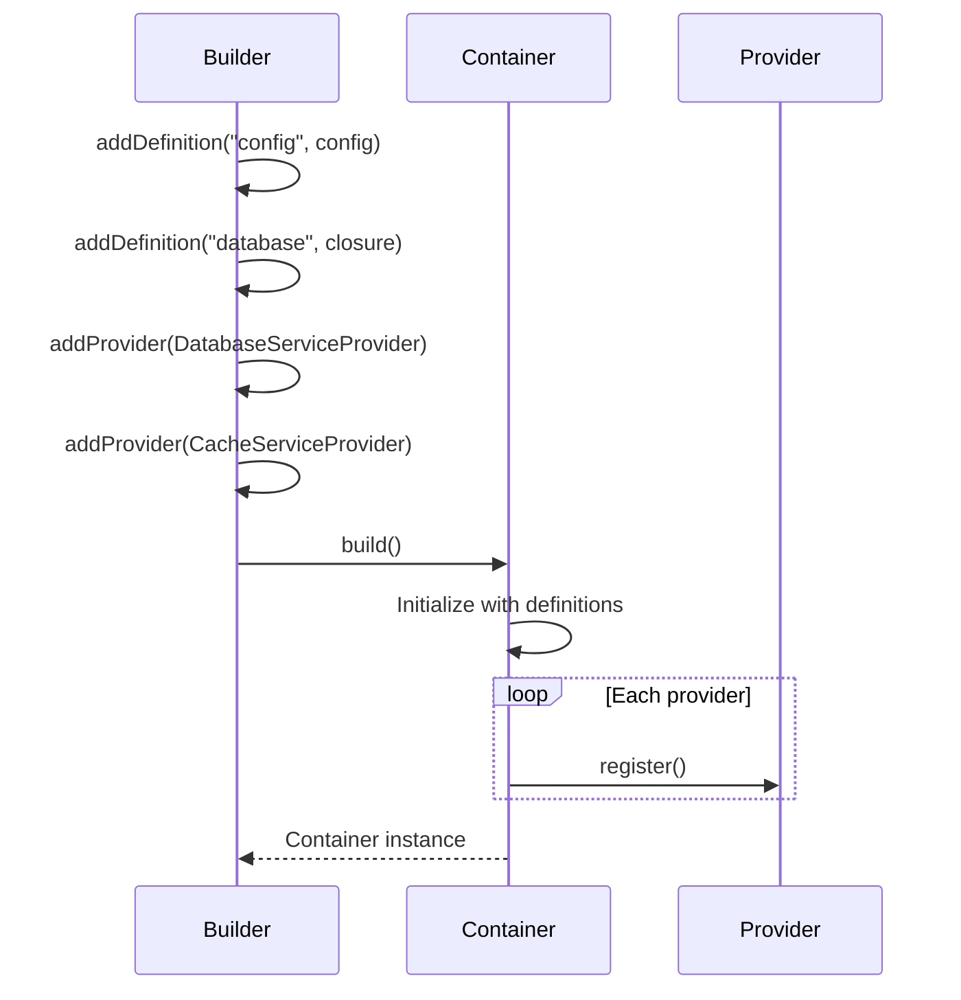

**Diagram sources**
- [ContainerBuilder.php](file://app/Core/Di/ContainerBuilder.php#L8-L42)
- [using-di.php](file://examples/using-di.php#L340-L360)

**Section sources**
- [ContainerBuilder.php](file://app/Core/Di/ContainerBuilder.php#L8-L42)
- [using-di.php](file://examples/using-di.php#L340-L360)

## Testing with Mock Dependencies
The container facilitates unit testing by allowing mock objects to be injected in place of real dependencies. This enables isolated testing of services without relying on external systems like databases or network services.

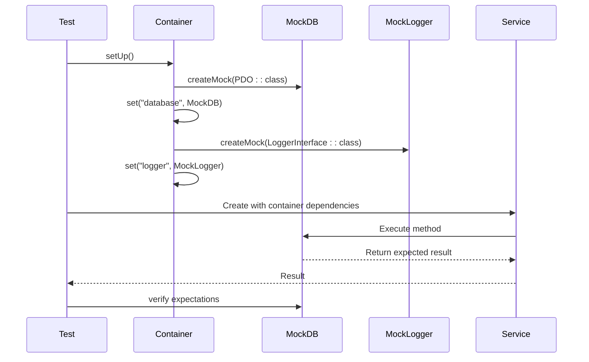

**Diagram sources**
- [Container.php](file://app/Core/Di/Container.php#L50-L85)
- [using-di.php](file://examples/using-di.php#L370-L400)

**Section sources**
- [Container.php](file://app/Core/Di/Container.php#L50-L85)
- [using-di.php](file://examples/using-di.php#L370-L400)

## Best Practices and Performance Considerations
When using the dependency injection container, several best practices should be followed to ensure optimal performance and maintainability. These include organizing service providers by module, avoiding circular dependencies, and understanding the performance implications of service instantiation.

### Service Provider Organization
Organize service providers by functional area (e.g., database, session, view) to maintain a clean separation of concerns. Register providers in a consistent order to ensure dependencies are available when needed.

### Circular Dependency Prevention
Avoid circular dependencies by using setter injection for optional dependencies or by introducing interfaces to break direct dependencies between services.

### Performance Implications
Understand that service instantiation has performance costs. Use shared instances for stateless services and factories for stateful ones. Consider lazy loading for services that are not always needed.

### Debugging Container Resolution
When debugging container resolution issues, check that all type-hinted dependencies can be resolved and that service definitions are correctly registered. Use the container's `has()` method to verify service availability.

**Section sources**
- [Container.php](file://app/Core/Di/Container.php#L85-L124)
- [using-di.php](file://examples/using-di.php#L1-L434)