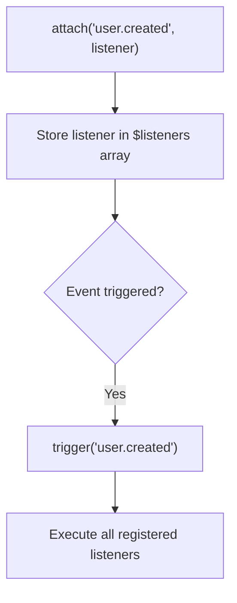
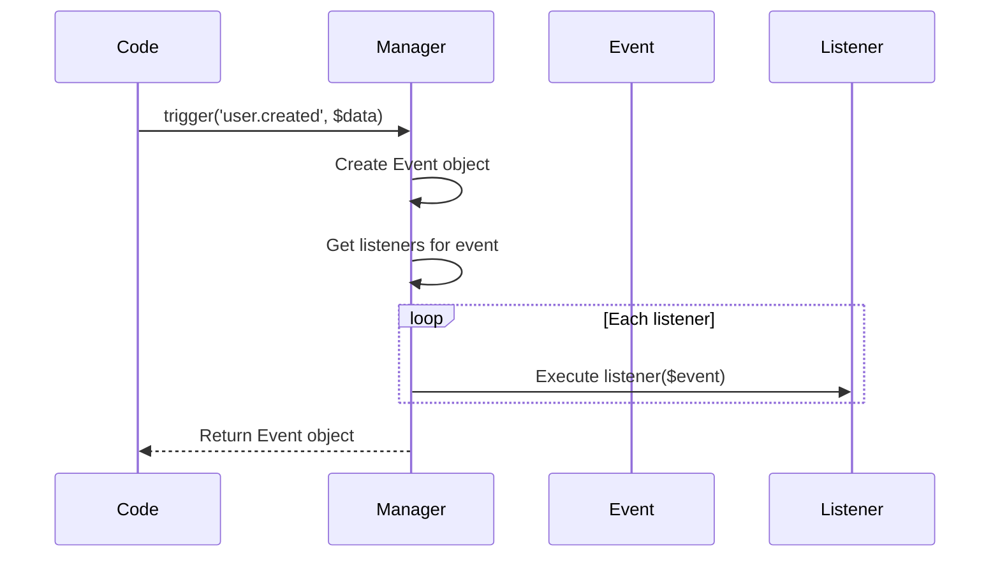
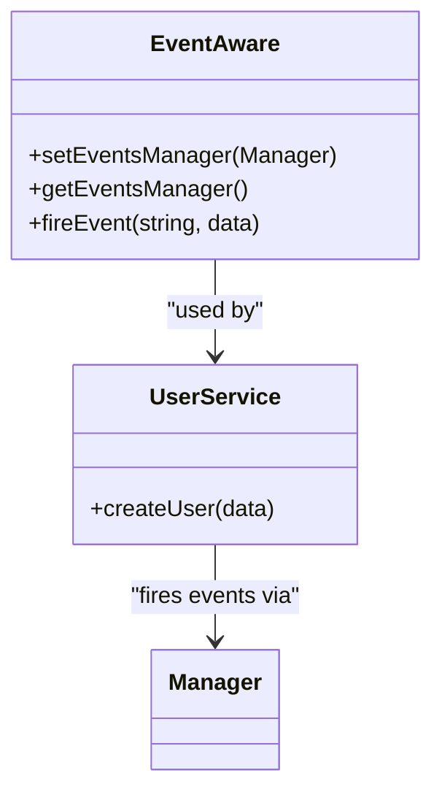
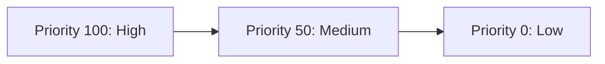
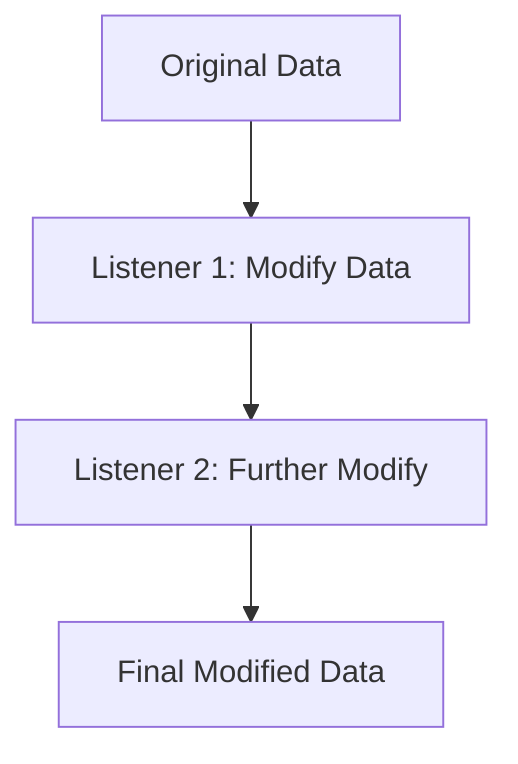
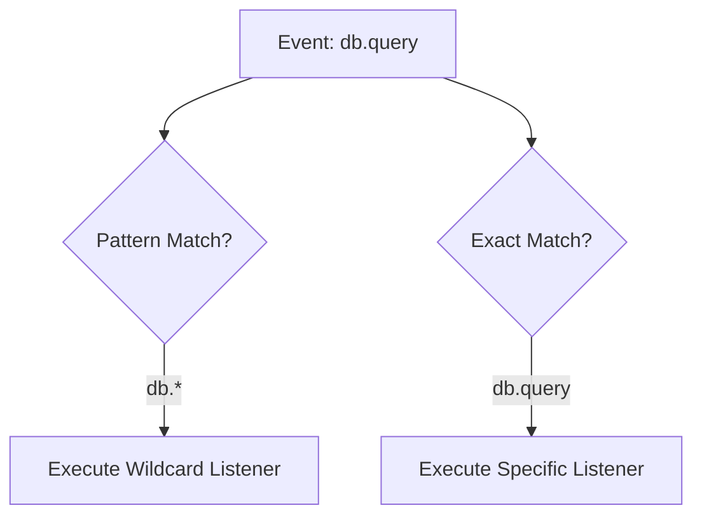
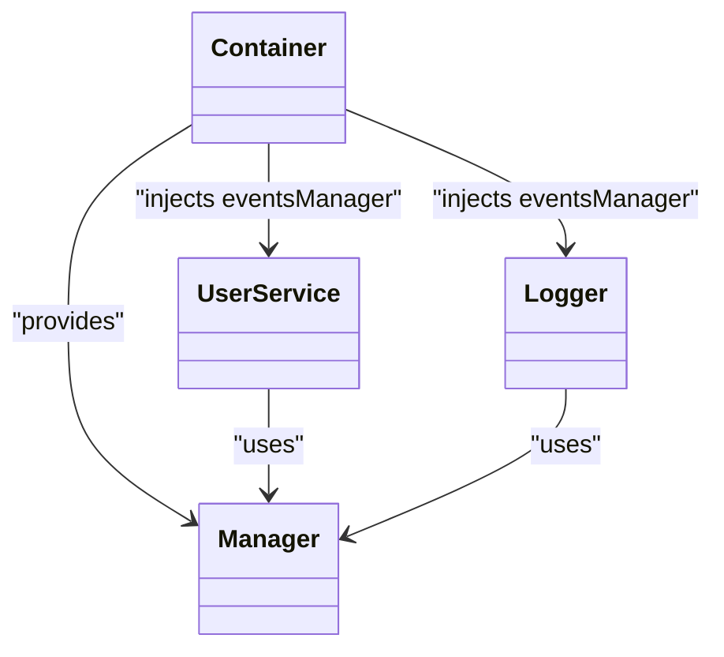
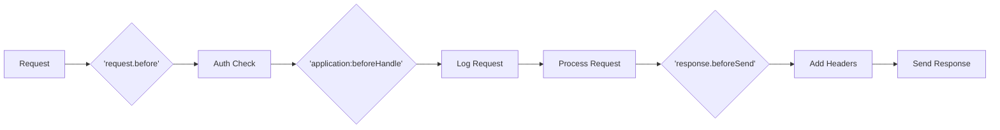

# Events System Examples

<cite>
**Referenced Files in This Document**   
- [events-usage.php](file://examples/events-usage.php)
- [Manager.php](file://app/Core/Events/Manager.php)
- [Event.php](file://app/Core/Events/Event.php)
- [EventInterface.php](file://app/Core/Events/EventInterface.php)
- [StoppableEventInterface.php](file://app/Core/Events/StoppableEventInterface.php)
- [EventAware.php](file://app/Core/Events/EventAware.php)
- [Application.php](file://app/Core/Mvc/Application.php)
</cite>

## Table of Contents
1. [Introduction](#introduction)
2. [Event Registration and Listener Attachment](#event-registration-and-listener-attachment)
3. [Event Triggering and Execution Flow](#event-triggering-and-execution-flow)
4. [Using Event-Aware Objects](#using-event-aware-objects)
5. [Controlling Event Propagation](#controlling-event-propagation)
6. [Listener Priority and Execution Order](#listener-priority-and-execution-order)
7. [Data Modification Through Events](#data-modification-through-events)
8. [Wildcard and Multiple Event Handling](#wildcard-and-multiple-event-handling)
9. [Integration with Dependency Injection](#integration-with-dependency-injection)
10. [Real-World Use Cases](#real-world-use-cases)
11. [Common Pitfalls and Best Practices](#common-pitfalls-and-best-practices)

## Introduction
The event system in this framework provides a flexible mechanism for decoupling components through publish-subscribe patterns. It enables various parts of the application to react to specific occurrences (events) without direct dependencies. This document explores the usage of the `Core\Events\Manager` class, demonstrating how events are registered, triggered, and handled using closures, callable objects, and event-aware components. The examples are drawn from real implementation patterns shown in the codebase, particularly in `events-usage.php`, and supported by core event classes.

## Event Registration and Listener Attachment
Listeners are attached to named events using the `attach()` method of the `Manager` class. Any PHP callable, including closures and object methods, can serve as a listener. Listeners respond to specific event names such as `'user.created'` or `'application:beforeHandle'`.



**Diagram sources**
- [Manager.php](file://app/Core/Events/Manager.php#L12-L20)
- [events-usage.php](file://examples/events-usage.php#L4-L10)

**Section sources**
- [Manager.php](file://app/Core/Events/Manager.php#L12-L20)
- [events-usage.php](file://examples/events-usage.php#L4-L10)

## Event Triggering and Execution Flow
Events are triggered using the `trigger()` method, which accepts either an event name (string) or an `Event` object. When triggered, the manager retrieves all relevant listeners and executes them sequentially unless propagation is stopped.



**Diagram sources**
- [Manager.php](file://app/Core/Events/Manager.php#L48-L62)
- [Event.php](file://app/Core/Events/Event.php#L10-L15)

**Section sources**
- [Manager.php](file://app/Core/Events/Manager.php#L48-L62)
- [events-usage.php](file://examples/events-usage.php#L18-L20)

## Using Event-Aware Objects
Classes can become event producers by using the `EventAware` trait, which provides methods to set an event manager and fire events. This pattern is useful for domain objects like `UserService` that need to broadcast state changes.



**Diagram sources**
- [EventAware.php](file://app/Core/Events/EventAware.php#L4-L25)
- [events-usage.php](file://examples/events-usage.php#L25-L45)

**Section sources**
- [EventAware.php](file://app/Core/Events/EventAware.php#L4-L25)
- [events-usage.php](file://examples/events-usage.php#L25-L45)

## Controlling Event Propagation
The `StoppableEventInterface` allows listeners to halt further processing of an event. By calling `stopPropagation()` on the event object, subsequent listeners are skipped. This is particularly useful for access control or early termination.

```mermaid
flowchart TD
A[Trigger 'request.before'] --> B{First Listener}
B --> C[Check IP address]
C --> |Banned IP| D[stopPropagation()]
D --> E[Propagation stopped?]
E --> |Yes| F[Skip remaining listeners]
E --> |No| G[Execute next listener]
```

**Diagram sources**
- [StoppableEventInterface.php](file://app/Core/Events/StoppableEventInterface.php#L7-L19)
- [Manager.php](file://app/Core/Events/Manager.php#L56-L58)
- [events-usage.php](file://examples/events-usage.php#L65-L75)

**Section sources**
- [StoppableEventInterface.php](file://app/Core/Events/StoppableEventInterface.php#L7-L19)
- [events-usage.php](file://examples/events-usage.php#L65-L75)

## Listener Priority and Execution Order
Listeners are executed in descending order of priority. Higher priority values mean earlier execution. This allows critical operations (like security checks) to run before others.



**Diagram sources**
- [Manager.php](file://app/Core/Events/Manager.php#L85-L92)
- [events-usage.php](file://examples/events-usage.php#L85-L100)

**Section sources**
- [Manager.php](file://app/Core/Events/Manager.php#L85-L92)
- [events-usage.php](file://examples/events-usage.php#L85-L100)

## Data Modification Through Events
Listeners can modify event data using `setData()` or by returning a value that the framework automatically sets. This enables transformation pipelines, such as sanitizing user input or enriching responses.



**Diagram sources**
- [Event.php](file://app/Core/Events/Event.php#L28-L32)
- [events-usage.php](file://examples/events-usage.php#L150-L180)

**Section sources**
- [Event.php](file://app/Core/Events/Event.php#L28-L32)
- [events-usage.php](file://examples/events-usage.php#L150-L180)

## Wildcard and Multiple Event Handling
The system supports wildcard event names (e.g., `'db.*'`) to allow a single listener to respond to multiple related events. This reduces boilerplate and improves maintainability.



**Diagram sources**
- [Manager.php](file://app/Core/Events/Manager.php#L70-L80)
- [events-usage.php](file://examples/events-usage.php#L125-L130)

**Section sources**
- [Manager.php](file://app/Core/Events/Manager.php#L70-L80)
- [events-usage.php](file://examples/events-usage.php#L125-L130)

## Integration with Dependency Injection
The event manager can be registered in the DI container and injected into services, enabling loose coupling and centralized event management across the application.



**Diagram sources**
- [events-usage.php](file://examples/events-usage.php#L110-L120)
- [EventAware.php](file://app/Core/Events/EventAware.php#L10-L12)

**Section sources**
- [events-usage.php](file://examples/events-usage.php#L110-L120)

## Real-World Use Cases
Common applications of the event system include:
- **Logging**: Listen to `'application:beforeHandle'` to log incoming requests
- **Authentication**: Use `'request.before'` to validate sessions or API keys
- **Response Modification**: Hook into `'response.beforeSend'` to add headers or compress content
- **Data Validation**: Intercept `'user.beforeSave'` to sanitize input or hash passwords



**Diagram sources**
- [Application.php](file://app/Core/Mvc/Application.php#L29)
- [events-usage.php](file://examples/events-usage.php#L135-L145)

**Section sources**
- [Application.php](file://app/Core/Mvc/Application.php#L29)
- [events-usage.php](file://examples/events-usage.php#L135-L145)

## Common Pitfalls and Best Practices
- **Event Order Dependency**: Avoid relying on listener execution order unless using priorities explicitly
- **Memory Leaks**: Always detach listeners when no longer needed, especially in long-running processes
- **Performance**: Minimize heavy operations in high-frequency listeners
- **Error Handling**: Ensure listeners handle exceptions gracefully to prevent breaking the event chain

**Section sources**
- [Manager.php](file://app/Core/Events/Manager.php#L22-L30)
- [events-usage.php](file://examples/events-usage.php#L185-L200)