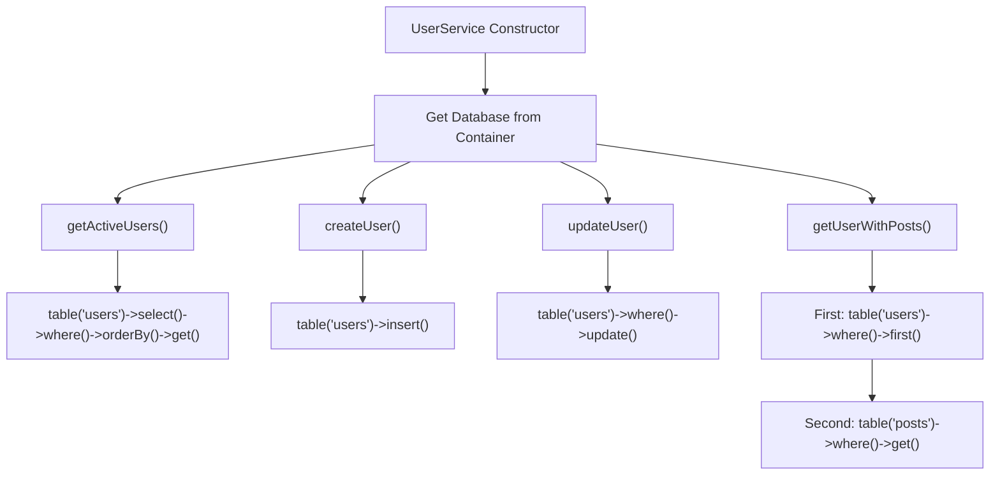
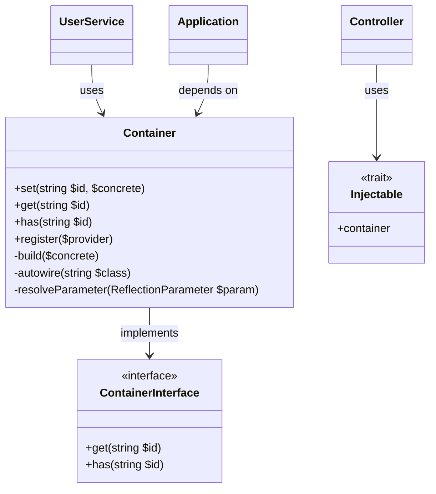
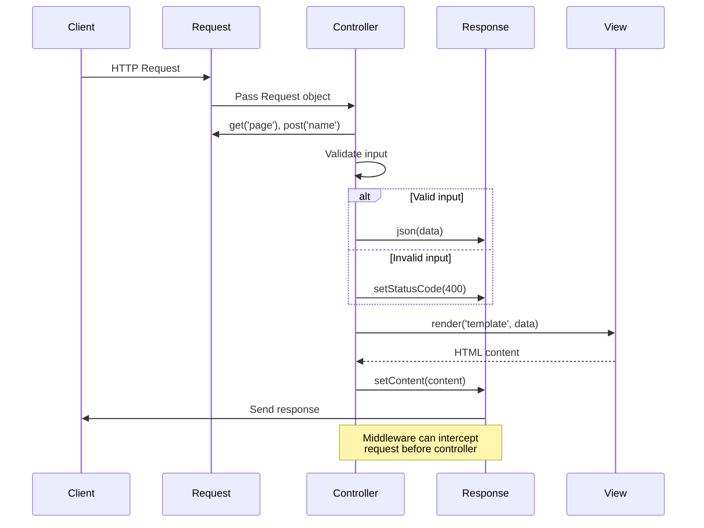
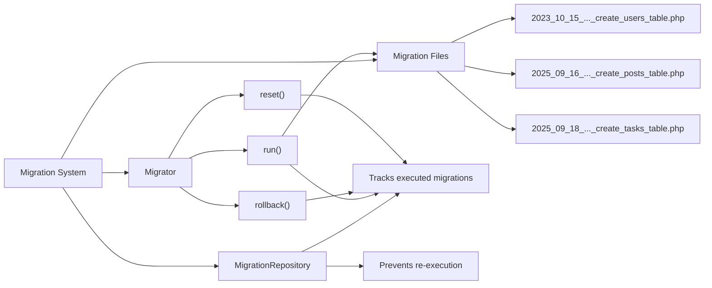
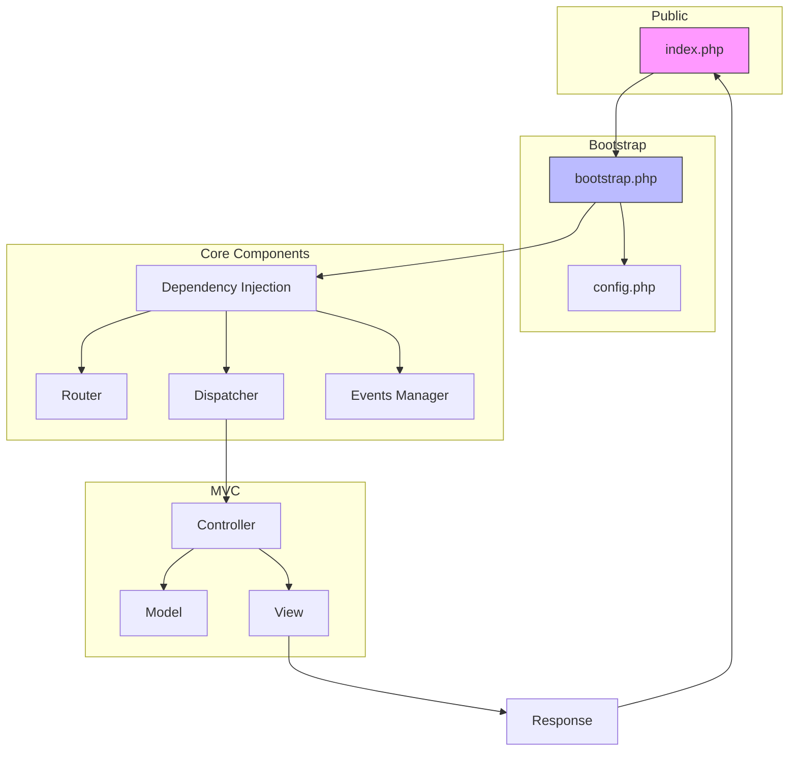

# Examples

<cite>
**Referenced Files in This Document**   
- [database-usage.php](file://examples/database-usage.php)
- [http-req-res.php](file://examples/http-req-res.php)
- [migrations.php](file://examples/migrations.php)
- [usign-app.php](file://examples/usign-app.php)
- [bootstrap.php](file://app/bootstrap.php)
- [index.php](file://public/index.php)
- [config.php](file://app/config.php)
- [Model.php](file://app/Core/Database/Model.php)
- [Container.php](file://app/Core/Di/Container.php)
- [Request.php](file://app/Core/Http/Request.php)
- [Response.php](file://app/Core/Http/Response.php)
- [Migration.php](file://app/Core/Database/Migration.php)
- [Application.php](file://app/Core/Mvc/Application.php)
- [Controller.php](file://app/Core/Mvc/Controller.php)
- [View.php](file://app/Core/Mvc/View.php)
</cite>

## Table of Contents
1. [Database Usage Examples](#database-usage-examples)
2. [Dependency Injection Usage Examples](#dependency-injection-usage-examples)
3. [HTTP Request and Response Handling](#http-request-and-response-handling)
4. [Database Migrations](#database-migrations)
5. [Complete Small Application Example](#complete-small-application-example)
6. [Setup Requirements and Expected Outputs](#setup-requirements-and-expected-outputs)
7. [Common Adaptation Issues](#common-adaptation-issues)

## Database Usage Examples

This section demonstrates practical usage of the database layer, including model operations and query building. The example shows how to interact with the database using both direct queries and Eloquent-style models.

The `UserService` class illustrates how to perform common database operations such as retrieving active users, creating new users, updating existing records, and fetching related data through multiple queries. It leverages the dependency injection container to access the database instance, promoting loose coupling and testability.

The configuration array at the bottom shows the database connection settings used by the application, including driver, host, database name, credentials, and connection options like charset and persistence.

**Diagram sources**
- [database-usage.php](file://examples/database-usage.php#L1-L64)

**Section sources**
- [database-usage.php](file://examples/database-usage.php#L1-L64)
- [Model.php](file://app/Core/Database/Model.php#L1-L465)

## Dependency Injection Usage Examples

Although the `di-usage.php` file was not found in the examples directory, the dependency injection pattern is extensively used throughout the framework. The Container class implements a lightweight DI container with autowiring capabilities, allowing automatic resolution of class dependencies through constructor injection.

The bootstrap process registers core services such as configuration, session, cookie, and view providers into the container. Services can be registered as singletons (shared instances) or factories (new instance each time). The container supports both callable definitions and direct object assignments.

Key features include:
- Automatic constructor parameter resolution using reflection
- Support for service providers to group related registrations
- Default container instance accessible statically
- Exception handling for unresolved dependencies

**Diagram sources**
- [Container.php](file://app/Core/Di/Container.php#L1-L145)
- [bootstrap.php](file://app/bootstrap.php#L1-L57)

**Section sources**
- [Container.php](file://app/Core/Di/Container.php#L1-L145)
- [bootstrap.php](file://app/bootstrap.php#L1-L57)

## HTTP Request and Response Handling

This example demonstrates comprehensive HTTP request and response handling patterns within the framework. It shows how to retrieve input data, handle different HTTP methods, implement middleware, and generate various response types.

The `UserController` illustrates action methods that accept Request and Response objects as parameters. It demonstrates query parameter extraction, POST data retrieval, method validation, JSON responses, redirects, and view rendering. The controller pattern promotes separation of concerns and testability.

Middleware examples show authentication checks and CORS header management, including preflight request handling. The API controller demonstrates AJAX request validation and appropriate status code usage for different scenarios.

**Diagram sources**
- [http-req-res.php](file://examples/http-req-res.php#L1-L187)
- [Request.php](file://app/Core/Http/Request.php#L1-L171)
- [Response.php](file://app/Core/Http/Response.php#L1-L138)

**Section sources**
- [http-req-res.php](file://examples/http-req-res.php#L1-L187)
- [Request.php](file://app/Core/Http/Request.php#L1-L171)
- [Response.php](file://app/Core/Http/Response.php#L1-L138)

## Database Migrations

This example demonstrates the migration system for managing database schema changes over time. The migrator component handles running, rolling back, and resetting migrations, ensuring database schema consistency across environments.

The `MigrationCommand` class shows how to integrate migration operations into console commands, providing methods for migrate, rollback, and reset operations. Each operation outputs feedback about which migrations were affected, making it easy to track changes.

Migration files follow a naming convention with timestamps (e.g., `2023_10_15_123456_create_users_table.php`) to ensure proper execution order. The base `Migration` class provides helper methods like `createTable`, `dropTable`, and `table` for schema modifications.

**Diagram sources**
- [migrations.php](file://examples/migrations.php#L1-L79)
- [Migration.php](file://app/Core/Database/Migration.php#L1-L62)
- [bootstrap.php](file://app/bootstrap.php#L1-L57)

**Section sources**
- [migrations.php](file://examples/migrations.php#L1-L79)
- [Migration.php](file://app/Core/Database/Migration.php#L1-L62)

## Complete Small Application Example

This section demonstrates a complete small application integrating routing, controller, model, view, and form handling components. The example shows how these pieces work together in a real application context.

The application bootstrap creates a DI container, registers core services, configures the database connection, sets up the router with module-based routes, and initializes the application instance. The public index file handles incoming requests by creating a request object and passing it to the application for processing.

The MVC pattern is fully implemented with controllers extending a base Controller class that provides DI and event awareness. Views are rendered using a template system with layout support, and forms can be handled through request input methods.

**Diagram sources**
- [usign-app.php](file://examples/usign-app.php#L1-L145)
- [bootstrap.php](file://app/bootstrap.php#L1-L57)
- [index.php](file://public/index.php#L1-L7)
- [Application.php](file://app/Core/Mvc/Application.php#L1-L71)
- [Controller.php](file://app/Core/Mvc/Controller.php#L1-L125)
- [View.php](file://app/Core/Mvc/View.php#L1-L145)

**Section sources**
- [usign-app.php](file://examples/usign-app.php#L1-L145)
- [bootstrap.php](file://app/bootstrap.php#L1-L57)
- [index.php](file://public/index.php#L1-L7)

## Setup Requirements and Expected Outputs

To run the examples, the following setup is required:

1. **Environment**: PHP 7.4+ with PDO MySQL extension
2. **Web Server**: Apache with mod_rewrite or Nginx
3. **Database**: MySQL server with database configured in `config.php`
4. **Directory Structure**: Properly configured XAMPP environment at ``

The application uses a front controller pattern with all requests routed through `public/index.php`. The `.htaccess` file (not shown) would typically handle URL rewriting to remove `index.php` from URLs.

Expected outputs vary by example:
- Database operations return query results or boolean success indicators
- HTTP responses output JSON data, HTML content, or perform redirects
- Migration commands output text indicating which migrations were executed
- Form submissions either redirect on success or display validation errors

Configuration is centralized in `config.php`, which defines database credentials, session settings, cookie parameters, and module routes. The bootstrap process loads this configuration and registers services accordingly.

**Section sources**
- [config.php](file://app/config.php#L1-L100)
- [bootstrap.php](file://app/bootstrap.php#L1-L57)
- [index.php](file://public/index.php#L1-L7)

## Common Adaptation Issues

When applying these example patterns to production code, several common issues may arise:

1. **Service Registration Order**: Services must be registered in the correct order, especially when one service depends on another. Late registration can cause resolution failures.

2. **Circular Dependencies**: Be cautious of circular references between services (A depends on B, B depends on A), which can cause infinite loops during resolution.

3. **Database Connection Limits**: Persistent connections can exhaust database connection pools if not managed properly, especially under high load.

4. **Migration Conflicts**: Concurrent development can lead to migration filename conflicts when multiple developers create migrations with the same timestamp.

5. **Route Priority**: Routes are matched in registration order, so more specific routes should be registered before generic ones to prevent premature matching.

6. **Error Handling**: The framework catches exceptions but may expose sensitive information in error messages. Production deployments should implement proper error logging and user-friendly error pages.

7. **Security Considerations**: Input validation, CSRF protection, and output escaping should be implemented beyond the basic examples shown.

8. **Performance**: Eager loading of relationships can cause N+1 query problems. Use the `with()` method judiciously to optimize queries.

**Section sources**
- [Container.php](file://app/Core/Di/Container.php#L1-L145)
- [Model.php](file://app/Core/Database/Model.php#L1-L465)
- [Application.php](file://app/Core/Mvc/Application.php#L1-L71)
- [config.php](file://app/config.php#L1-L100)