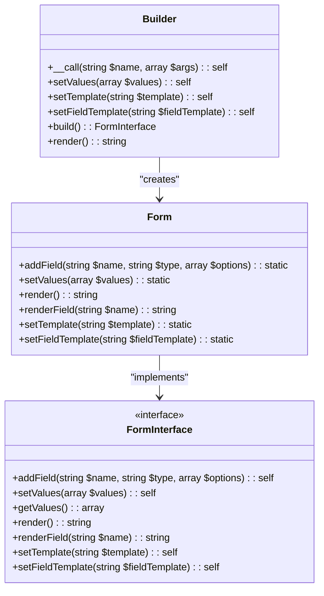
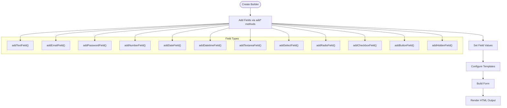
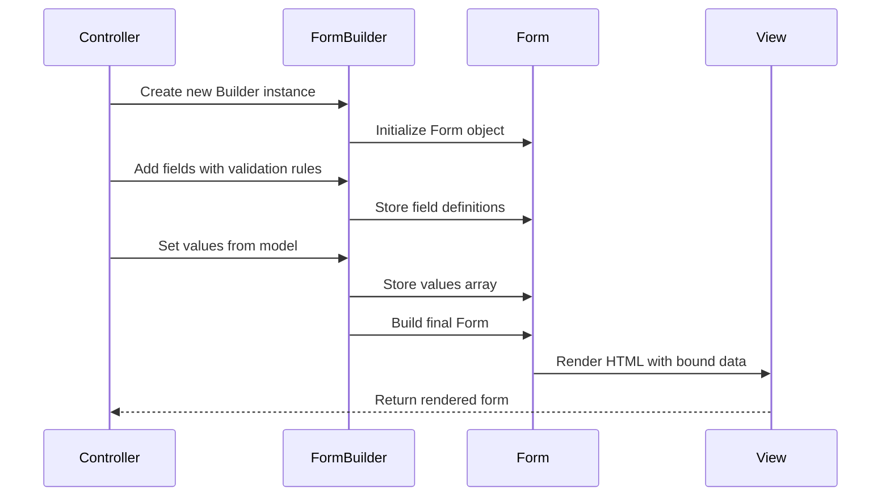
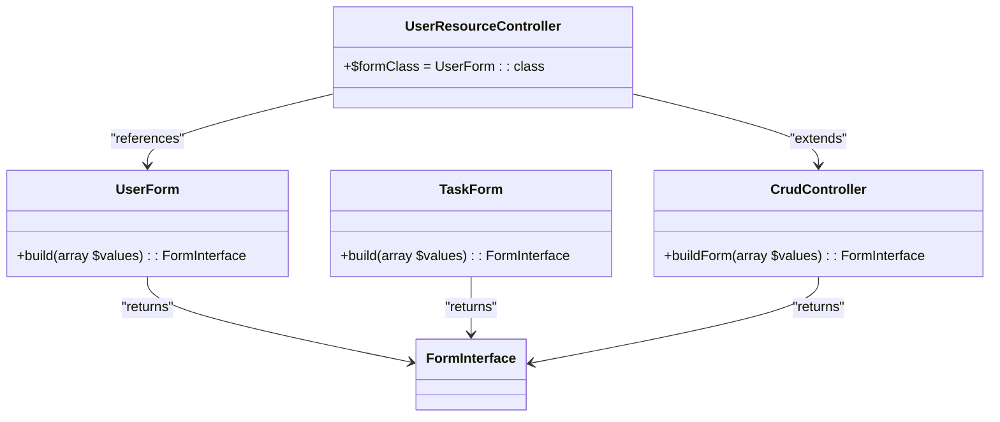
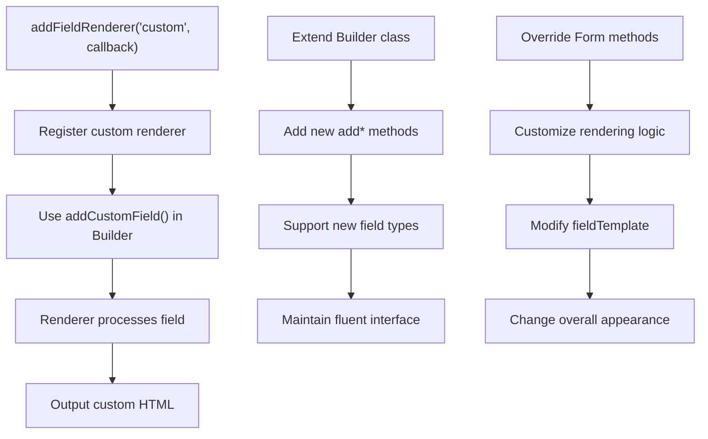
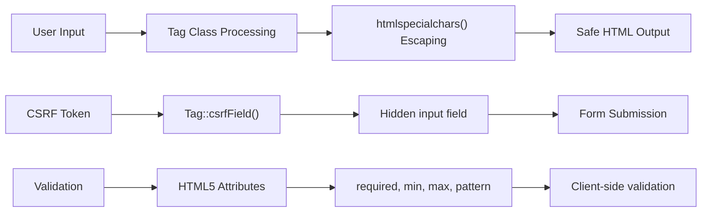

# Forms Builder Examples

<cite>
**Referenced Files in This Document**   
- [forms-usage.php](file://examples/forms-usage.php)
- [Builder.php](file://app/Core/Forms/Builder.php)
- [Form.php](file://app/Core/Forms/Form.php)
- [FormInterface.php](file://app/Core/Forms/FormInterface.php)
- [UserForm.php](file://app/Module/Admin/Forms/UserForm.php)
- [TaskForm.php](file://app/Module/Admin/Forms/TaskForm.php)
- [Tag.php](file://app/Core/Utils/Tag.php)
</cite>

## Table of Contents
1. [Introduction](#introduction)
2. [Core Components](#core-components)
3. [Basic Form Construction](#basic-form-construction)
4. [Advanced Layout Techniques](#advanced-layout-techniques)
5. [Data Binding and Validation](#data-binding-and-validation)
6. [Integration with Controllers and Models](#integration-with-controllers-and-models)
7. [Extending the Form System](#extending-the-form-system)
8. [Security Considerations](#security-considerations)
9. [Conclusion](#conclusion)

## Introduction
This document provides comprehensive guidance on using the Forms\Builder and Form classes to create dynamic HTML forms within the application. It demonstrates practical implementation patterns through examples from forms-usage.php, covering form construction, layout customization, data binding, validation, and security practices. The system enables developers to programmatically generate forms with various input types, flexible templates, and integration with backend models and controllers.

## Core Components

The form builder system consists of two primary classes: Builder and Form. The Builder class provides a fluent interface for constructing forms, while the Form class handles rendering and state management. Together, they enable the creation of complex forms with minimal code.



**Diagram sources**
- [Builder.php](file://app/Core/Forms/Builder.php#L4-L110)
- [Form.php](file://app/Core/Forms/Form.php#L6-L210)
- [FormInterface.php](file://app/Core/Forms/FormInterface.php#L6-L13)

**Section sources**
- [Builder.php](file://app/Core/Forms/Builder.php#L4-L110)
- [Form.php](file://app/Core/Forms/Form.php#L6-L210)
- [FormInterface.php](file://app/Core/Forms/FormInterface.php#L6-L13)

## Basic Form Construction

The form builder system supports various field types including text, email, password, number, date, datetime, textarea, select, radio, checkbox, button, and hidden fields. Each field type has specific rendering logic handled by the Form class.



**Diagram sources**
- [Builder.php](file://app/Core/Forms/Builder.php#L4-L110)
- [Form.php](file://app/Core/Forms/Form.php#L6-L210)

**Section sources**
- [forms-usage.php](file://examples/forms-usage.php#L3-L82)
- [Builder.php](file://app/Core/Forms/Builder.php#L4-L110)

## Advanced Layout Techniques

The form system supports advanced layout customization through template placeholders. Developers can control the exact placement of individual fields using {field_name} syntax or group remaining fields with {fields} placeholder.

```mermaid
graph TB
subgraph "Template Types"
Default["Default Template: {fields}"]
Custom["Custom Template: {field_name}"]
Mixed["Mixed Template: Both"]
end
subgraph "Layout Examples"
Grid["Grid Layout with CSS classes"]
Sectional["Sectional Layout with headings"]
Table["Table-based Layout"]
Complex["Complex Layout with mixed placement"]
end
Default --> Grid
Custom --> Sectional
Custom --> Table
Mixed --> Complex
Grid --> [forms-usage.php Example 1]
Sectional --> [forms-usage.php Example 2]
Table --> [forms-usage.php Example 3]
Complex --> [forms-usage.php Example 4]
```

**Diagram sources**
- [Form.php](file://app/Core/Forms/Form.php#L150-L190)
- [forms-usage.php](file://examples/forms-usage.php#L80-L207)

**Section sources**
- [forms-usage.php](file://examples/forms-usage.php#L80-L207)
- [Form.php](file://app/Core/Forms/Form.php#L150-L190)

## Data Binding and Validation

The form system supports data binding through the setValues() method, which populates form fields with existing data. Validation states are handled through HTML5 attributes like required, min, max, and pattern, which are automatically rendered in the output.



**Diagram sources**
- [Form.php](file://app/Core/Forms/Form.php#L100-L130)
- [forms-usage.php](file://examples/forms-usage.php#L40-L80)

**Section sources**
- [Form.php](file://app/Core/Forms/Form.php#L100-L130)
- [forms-usage.php](file://examples/forms-usage.php#L40-L80)

## Integration with Controllers and Models

Forms integrate with controllers through static build methods in form classes like UserForm and TaskForm. These methods accept values from models and return configured forms. The CrudController base class provides a buildForm() method that leverages the formClass property.



**Diagram sources**
- [UserForm.php](file://app/Module/Admin/Forms/UserForm.php#L6-L23)
- [TaskForm.php](file://app/Module/Admin/Forms/TaskForm.php#L6-L40)
- [CrudController.php](file://app/Core/Mvc/CrudController.php#L332-L339)

**Section sources**
- [UserForm.php](file://app/Module/Admin/Forms/UserForm.php#L6-L23)
- [TaskForm.php](file://app/Module/Admin/Forms/TaskForm.php#L6-L40)
- [CrudController.php](file://app/Core/Mvc/CrudController.php#L332-L339)

## Extending the Form System

The form system can be extended with custom field types and renderers. The addFieldRenderer() method allows registration of custom rendering logic for specific field types. The Builder class uses __call() magic method to support fluent interface for field addition.



**Diagram sources**
- [Form.php](file://app/Core/Forms/Form.php#L80-L90)
- [Builder.php](file://app/Core/Forms/Builder.php#L50-L70)

**Section sources**
- [Form.php](file://app/Core/Forms/Form.php#L80-L90)
- [Builder.php](file://app/Core/Forms/Builder.php#L50-L70)

## Security Considerations

The form system addresses security through proper escaping of user input via the Tag utility class. All content is automatically escaped using htmlspecialchars() to prevent XSS attacks. While CSRF protection is not directly implemented in the form classes, the Tag class provides csrfField() and csrfMetaTag() methods for integration.



**Diagram sources**
- [Tag.php](file://app/Core/Utils/Tag.php#L200-L250)
- [Form.php](file://app/Core/Forms/Form.php#L200-L210)

**Section sources**
- [Tag.php](file://app/Core/Utils/Tag.php#L200-L250)
- [Form.php](file://app/Core/Forms/Form.php#L200-L210)

## Conclusion
The Forms\Builder and Form classes provide a robust system for creating dynamic HTML forms with flexible layout options, data binding capabilities, and secure rendering. By leveraging the fluent interface of the Builder class and the rendering power of the Form class, developers can efficiently create complex forms that integrate seamlessly with models and controllers. The system supports various field types, advanced layout techniques through custom templates, and proper security practices through automatic output escaping. For complete security, developers should combine this system with server-side validation and CSRF protection mechanisms.