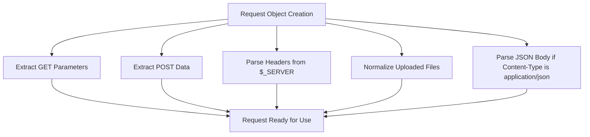
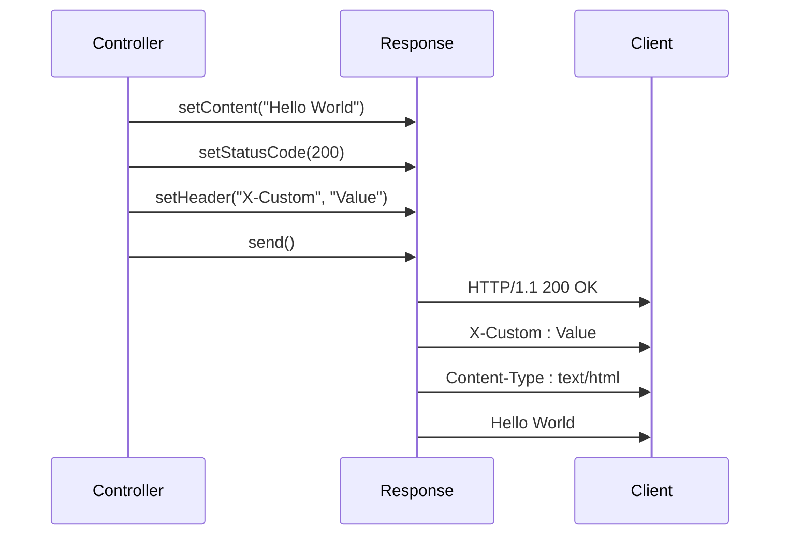
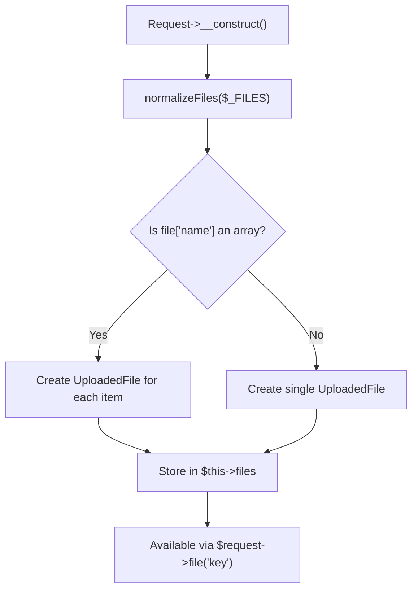
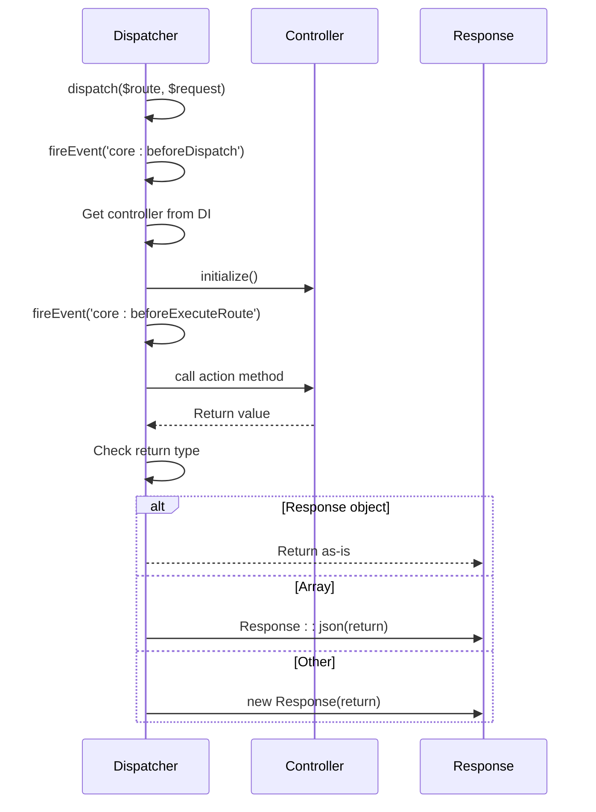

# HTTP Request and Response Examples

<cite>
**Referenced Files in This Document**   
- [http-req-res.php](file://examples/http-req-res.php)
- [Request.php](file://app/Core/Http/Request.php)
- [Response.php](file://app/Core/Http/Response.php)
- [UploadedFile.php](file://app/Core/Http/UploadedFile.php)
- [Dispatcher.php](file://app/Core/Mvc/Dispatcher.php)
</cite>

## Table of Contents
1. [Introduction](#introduction)
2. [Request Handling](#request-handling)
3. [Response Construction](#response-construction)
4. [File Upload Handling](#file-upload-handling)
5. [Request Lifecycle and Dispatch Process](#request-lifecycle-and-dispatch-process)
6. [Middleware Integration](#middleware-integration)
7. [API Usage Patterns](#api-usage-patterns)
8. [Best Practices](#best-practices)
9. [Common Issues and Troubleshooting](#common-issues-and-troubleshooting)
10. [Conclusion](#conclusion)

## Introduction
This document provides a comprehensive overview of HTTP request and response handling within the application framework. It explains how the `Http\Request` and `Http\Response` classes are used to manage incoming requests and generate appropriate responses. The analysis is based on the example file `http-req-res.php` and the core HTTP component classes, illustrating practical usage patterns for retrieving input data, managing file uploads, setting headers, and returning structured responses such as JSON or redirects.

**Section sources**
- [http-req-res.php](file://examples/http-req-res.php#L1-L186)

## Request Handling

The `Core\Http\Request` class encapsulates all aspects of an incoming HTTP request, providing a clean interface for accessing query parameters, POST data, headers, and JSON payloads. It abstracts the raw PHP superglobals (`$_GET`, `$_POST`, `$_SERVER`, `$_FILES`) into a unified and testable object.

Key methods include:
- `get(string $key = null, $default = null)` for retrieving GET parameters
- `post(string $key = null, $default = null)` for retrieving POST data
- `input(string $key, $default = null)` which checks POST, JSON, and GET data in order
- `all()` to retrieve all input data merged into a single array
- `header(string $name, $default = null)` for accessing request headers
- `isMethod(string $method)` to verify the HTTP method
- `isAjax()` to detect AJAX requests via the `X-Requested-With` header

The request object also supports method spoofing through the `_method` parameter in POST data, allowing clients to simulate PUT, DELETE, and other HTTP methods.

**Diagram sources**
- [Request.php](file://app/Core/Http/Request.php#L15-L170)

**Section sources**
- [Request.php](file://app/Core/Http/Request.php#L15-L170)
- [http-req-res.php](file://examples/http-req-res.php#L45-L60)

## Response Construction

The `Core\Http\Response` class provides a fluent interface for building HTTP responses. It allows developers to set content, status codes, headers, and cookies before sending the final output.

Key features include:
- Fluent setters: `setContent()`, `setStatusCode()`, `setHeader()`
- Static factory methods: `json()`, `redirect()`, `error()`
- Support for multiple `Set-Cookie` headers
- Protection against multiple sends via the `$sent` flag

The `json()` method automatically sets the `Content-Type` to `application/json` and encodes the provided data. The `redirect()` method sets the `Location` header and sends the response immediately. The `withCookie()` method constructs proper `Set-Cookie` headers without relying on PHP's global `setcookie()` function, making it easier to test.

**Diagram sources**
- [Response.php](file://app/Core/Http/Response.php#L10-L137)

**Section sources**
- [Response.php](file://app/Core/Http/Response.php#L10-L137)
- [http-req-res.php](file://examples/http-req-res.php#L70-L85)

## File Upload Handling

File uploads are managed through the `Core\Http\UploadedFile` class, which wraps the `$_FILES` array and provides a safe interface for handling uploaded files. The `Request` class normalizes the `$_FILES` structure and instantiates `UploadedFile` objects for each uploaded file.

Key methods in `UploadedFile`:
- `isValid()` to check if the upload was successful
- `moveTo(string $targetPath)` to move the file to its final destination
- `getClientOriginalName()` and `getClientMimeType()` for metadata access
- `getSize()` and `getError()` for diagnostics

The normalization process handles both single files and arrays of files, making it easy to work with multiple file inputs.

**Diagram sources**
- [UploadedFile.php](file://app/Core/Http/UploadedFile.php#L10-L58)
- [Request.php](file://app/Core/Http/Request.php#L130-L150)

**Section sources**
- [UploadedFile.php](file://app/Core/Http/UploadedFile.php#L10-L58)
- [Request.php](file://app/Core/Http/Request.php#L130-L150)

## Request Lifecycle and Dispatch Process

The request lifecycle begins with the `Dispatcher` class, which receives a route configuration and the current `Request` object. It instantiates the appropriate controller using the DI container, calls the designated action method, and processes the return value into a proper `Response`.

If the controller action returns:
- A `Response` object: it is used directly
- An array: converted to a JSON response
- Any other value: treated as HTML content

This allows flexible response patterns while ensuring consistent output handling.

**Diagram sources**
- [Dispatcher.php](file://app/Core/Mvc/Dispatcher.php#L15-L83)

**Section sources**
- [Dispatcher.php](file://app/Core/Mvc/Dispatcher.php#L15-L83)

## Middleware Integration

Middleware components can intercept the request-response cycle for tasks like authentication and CORS handling. The example shows two middleware types:

- `AuthMiddleware`: checks user authentication and redirects to login if not authenticated
- `CorsMiddleware`: sets CORS headers and handles preflight (OPTIONS) requests by sending a 200 response immediately

Middleware returns `true` to continue processing or a `Response` object to terminate the chain early.

**Section sources**
- [http-req-res.php](file://examples/http-req-res.php#L100-L135)

## API Usage Patterns

The `UserApiController` demonstrates RESTful API patterns:
- Using `isAjax()` to restrict endpoint access
- Validating required fields from POST data
- Returning appropriate status codes (201 for creation, 400 for bad requests)
- Sending JSON responses with structured error messages

The `input()` method simplifies data retrieval by checking POST, JSON, and GET sources in order, making the API flexible for different client implementations.

**Section sources**
- [http-req-res.php](file://examples/http-req-res.php#L145-L185)

## Best Practices

### Content Negotiation
Use `header('Accept')` to determine response format when needed, though the framework currently defaults to JSON for array returns.

### Status Code Usage
Leverage the defined constants in `Response` (e.g., `HTTP_CREATED`, `HTTP_NOT_FOUND`) for clarity and consistency.

### Large Payload Handling
For large file uploads or JSON payloads, ensure `php.ini` settings (`upload_max_filesize`, `post_max_size`) are appropriately configured. The framework does not impose additional limits beyond PHP's configuration.

### Security
- Always validate and sanitize input data
- Use prepared statements for database operations
- Validate file types and sizes before moving uploaded files
- Set appropriate cache and security headers in responses

## Common Issues and Troubleshooting

### Missing Input Sanitization
The current implementation does not automatically sanitize input. Always validate and sanitize data before use, especially when interacting with databases or generating output.

### Header Ordering
When setting multiple headers, ensure that `Content-Type` is set before sending the response. The framework processes headers in order, but PHP's `header()` function may have specific requirements.

### File Upload Errors
Check `isValid()` before calling `moveTo()`. Common upload errors include exceeding size limits or directory permissions.

### JSON Parsing Issues
Ensure the request's `Content-Type` is `application/json` for automatic JSON body parsing. Malformed JSON will result in an empty array.

### Redirects in Middleware
When returning a redirect response from middleware, ensure it's properly sent using `send()` to prevent further execution.

## Conclusion
The HTTP request and response system provides a robust foundation for handling web interactions. By encapsulating the raw PHP superglobals and functions, it enables cleaner, more testable code. The integration with DI, middleware, and the dispatcher creates a cohesive flow from request to response. Following best practices for input validation, error handling, and security will ensure reliable and maintainable applications.