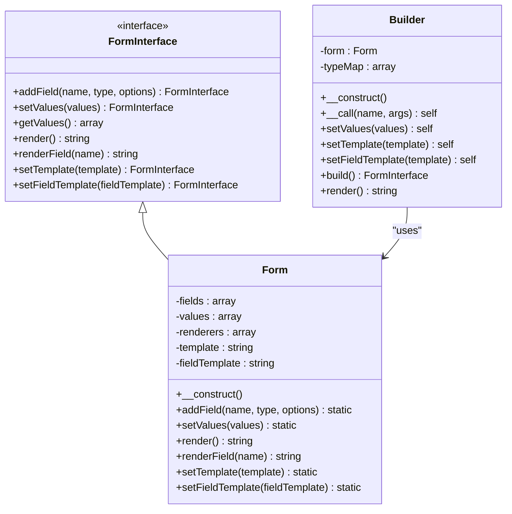
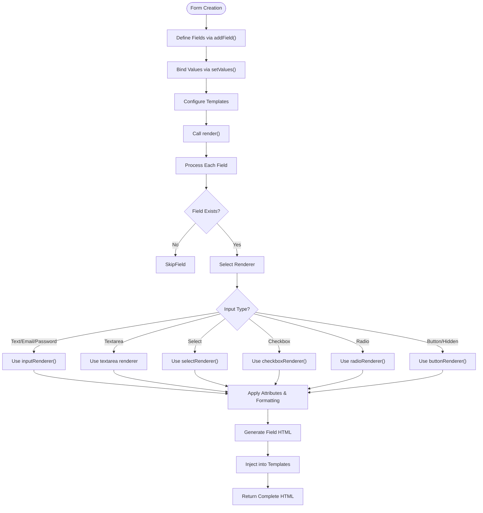
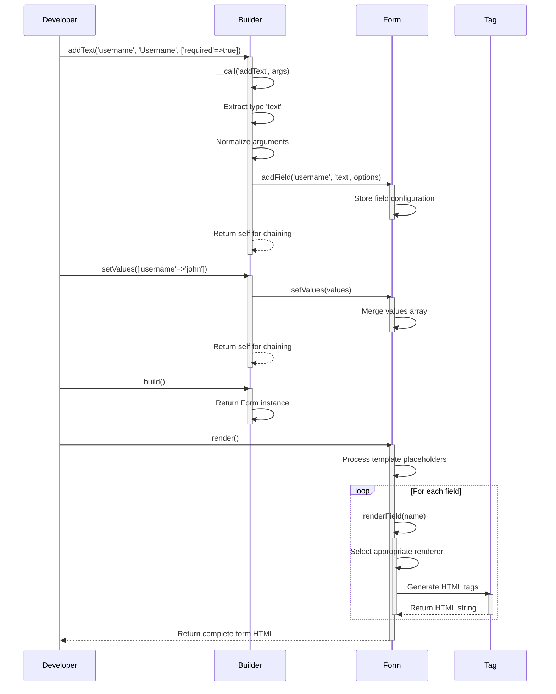
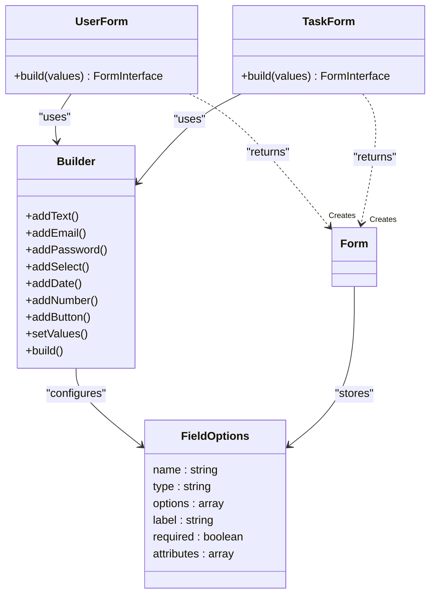
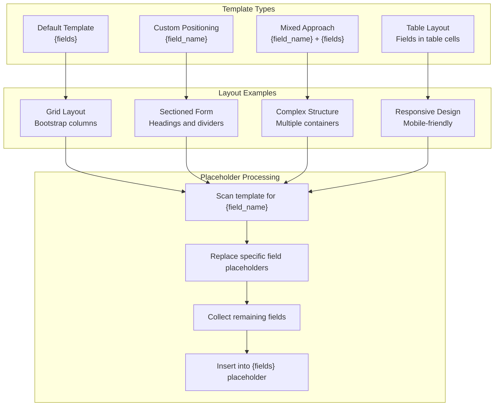
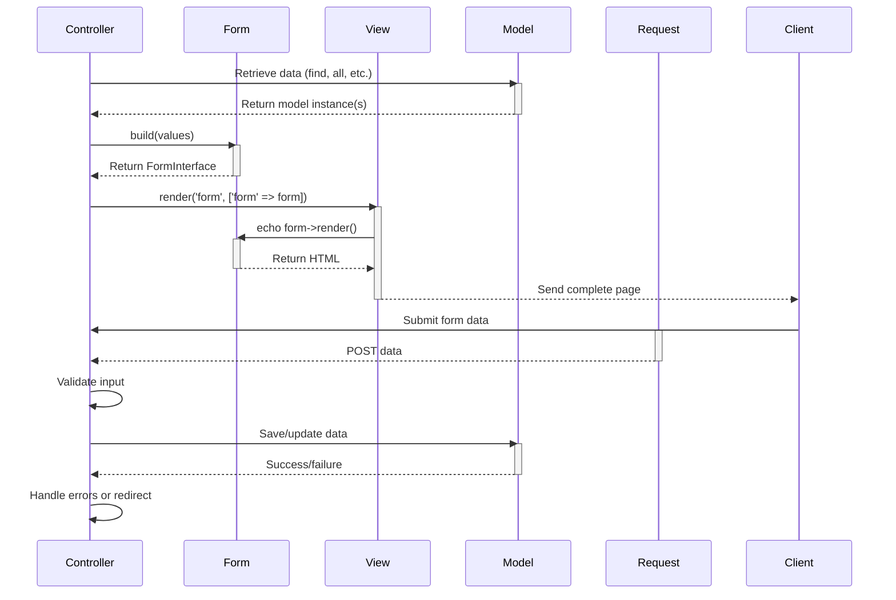

# Forms

<cite>
**Referenced Files in This Document**   
- [Form.php](file://app/Core/Forms/Form.php)
- [Builder.php](file://app/Core/Forms/Builder.php)
- [FormInterface.php](file://app/Core/Forms/FormInterface.php)
- [UserForm.php](file://app/Module/Admin/Forms/UserForm.php)
- [TaskForm.php](file://app/Module/Admin/Forms/TaskForm.php)
- [forms-usage.php](file://examples/forms-usage.php)
- [Tag.php](file://app/Core/Utils/Tag.php)
</cite>

## Table of Contents
1. [Introduction](#introduction)
2. [Core Components](#core-components)
3. [Form Class Architecture](#form-class-architecture)
4. [Builder Class Functionality](#builder-class-functionality)
5. [Form Implementation Examples](#form-implementation-examples)
6. [Advanced Layout Techniques](#advanced-layout-techniques)
7. [Integration with Controllers and Views](#integration-with-controllers-and-views)
8. [Best Practices](#best-practices)
9. [Conclusion](#conclusion)

## Introduction
The form building system provides a programmatic approach to generating HTML forms with consistent structure, validation attributes, and accessibility features. This documentation explains the architecture and usage patterns of the Form and Builder classes, demonstrating how to create dynamic forms for various use cases. The system supports multiple input types, custom layouts, value binding, and seamless integration with the MVC framework.

## Core Components

The form system consists of two primary classes working in tandem: Form and Builder. The Form class handles the internal representation and rendering logic, while the Builder provides a fluent interface for form construction. Together, they enable developers to create complex forms with minimal code.

**Diagram sources**
- [FormInterface.php](file://app/Core/Forms/FormInterface.php#L4-L13)
- [Form.php](file://app/Core/Forms/Form.php#L6-L210)
- [Builder.php](file://app/Core/Forms/Builder.php#L4-L110)

**Section sources**
- [FormInterface.php](file://app/Core/Forms/FormInterface.php#L4-L13)
- [Form.php](file://app/Core/Forms/Form.php#L6-L210)
- [Builder.php](file://app/Core/Forms/Builder.php#L4-L110)

## Form Class Architecture

The Form class implements the FormInterface and serves as the foundation for form generation. It maintains the form's state through several key properties: fields (configuration for each input), values (current data binding), renderers (functions that generate HTML for each field type), and templates (HTML structure for the entire form and individual fields).

The class supports various input types including text, email, password, number, date, time, datetime, textarea, select, checkbox, radio, button, and hidden fields. Each field type has a corresponding renderer function that generates the appropriate HTML markup using the Tag utility class. The form system automatically handles label generation, ID assignment, and required attribute propagation.

**Diagram sources**
- [Form.php](file://app/Core/Forms/Form.php#L6-L210)
- [Tag.php](file://app/Core/Utils/Tag.php#L0-L271)

**Section sources**
- [Form.php](file://app/Core/Forms/Form.php#L6-L210)

## Builder Class Functionality

The Builder class provides a fluent interface for constructing forms through method chaining. It uses PHP's magic __call() method to intercept method calls that follow the pattern add[FieldType](), enabling a clean and intuitive API. The builder maintains a mapping of field type aliases to ensure consistency across the system.

When a method like addText() or addEmail() is called, the builder extracts the field type, normalizes the arguments, and delegates to the underlying Form object's addField() method. This abstraction simplifies form creation by handling parameter organization and default value assignment. The builder also provides convenience methods for setting templates and field templates, as well as direct access to the render() method for immediate output.

**Diagram sources**
- [Builder.php](file://app/Core/Forms/Builder.php#L4-L110)
- [Form.php](file://app/Core/Forms/Form.php#L6-L210)
- [Tag.php](file://app/Core/Utils/Tag.php#L0-L271)

**Section sources**
- [Builder.php](file://app/Core/Forms/Builder.php#L4-L110)

## Form Implementation Examples

The system provides concrete implementations through UserForm.php and TaskForm.php, which demonstrate how to create specialized forms for specific use cases. These classes follow a factory pattern, using the Builder to construct forms with predefined fields and validation rules.

The UserForm creates a form for user management with fields for name, email, Kuhnle ID, and password, all marked as required. It includes a submit button styled with Bootstrap classes. The TaskForm is more complex, incorporating select fields populated with user data from the database, date fields for tracking task timelines, and a priority field with numeric constraints.

**Diagram sources**
- [UserForm.php](file://app/Module/Admin/Forms/UserForm.php#L5-L23)
- [TaskForm.php](file://app/Module/Admin/Forms/TaskForm.php#L6-L40)
- [Builder.php](file://app/Core/Forms/Builder.php#L4-L110)

**Section sources**
- [UserForm.php](file://app/Module/Admin/Forms/UserForm.php#L5-L23)
- [TaskForm.php](file://app/Module/Admin/Forms/TaskForm.php#L6-L40)

## Advanced Layout Techniques

The form system supports advanced layout configurations through template customization. Developers can define custom form templates using placeholder syntax to control field positioning. The system recognizes two types of placeholders: {fields} for inserting all remaining fields, and {field_[name]} for placing specific fields at designated locations.

This capability enables complex layouts such as multi-column forms, tabbed interfaces, and table-based arrangements. The examples in forms-usage.php demonstrate various layout patterns, including responsive grid layouts, sectioned forms with headings, and mixed positioning strategies that combine specific field placement with grouped rendering.

**Diagram sources**
- [forms-usage.php](file://examples/forms-usage.php#L80-L257)
- [Form.php](file://app/Core/Forms/Form.php#L100-L138)

**Section sources**
- [forms-usage.php](file://examples/forms-usage.php#L80-L257)

## Integration with Controllers and Views

The form system integrates seamlessly with the MVC architecture through controller actions and view templates. Controllers can instantiate forms, bind model data, and pass them to views for rendering. The CrudController's buildForm() method demonstrates this pattern, using the formClass property to dynamically create forms with pre-populated values from existing records.

In the view layer, forms can be rendered directly or incorporated into larger templates. The system's output is pure HTML, making it compatible with any templating approach. When processing form submissions, controllers should handle data validation and error display, though the current implementation focuses on form generation rather than validation logic.

**Diagram sources**
- [TaskForm.php](file://app/Module/Admin/Forms/TaskForm.php#L6-L40)
- [CrudController.php](file://app/Core/Mvc/CrudController.php#L332-L339)
- [datatime-usage.php](file://examples/datatime-usage.php#L12-L48)

**Section sources**
- [TaskForm.php](file://app/Module/Admin/Forms/TaskForm.php#L6-L40)
- [CrudController.php](file://app/Core/Mvc/CrudController.php#L332-L339)

## Best Practices

When working with the form system, several best practices ensure optimal results. For accessibility, always provide meaningful labels and ensure proper field associations through ID/for attributes, which the system handles automatically. For validation, leverage HTML5 attributes like required, min, max, and pattern through the options array.

When integrating with CSS frameworks like Bootstrap, use the class attribute in field options to apply appropriate styling. For complex forms, consider using custom templates to create responsive layouts. Always bind values when editing existing records to pre-populate fields. When handling datetime values, ensure proper formatting as demonstrated in the datetime usage examples.

Security considerations include implementing CSRF protection, though this specific implementation does not show explicit CSRF token handling. Developers should extend the system to include hidden CSRF fields in forms. For dynamic forms, validate all user input on submission and sanitize output when displaying data.

## Conclusion

The form building system provides a robust foundation for creating HTML forms programmatically. By leveraging the Form and Builder classes, developers can generate consistent, accessible, and maintainable forms with minimal effort. The system's flexibility supports various layout requirements and integrates well with the MVC architecture. Through examples like UserForm and TaskForm, the documentation demonstrates practical applications of the system, while the advanced layout techniques show its capability for complex user interfaces. Following best practices for accessibility, validation, and security ensures high-quality form implementations.