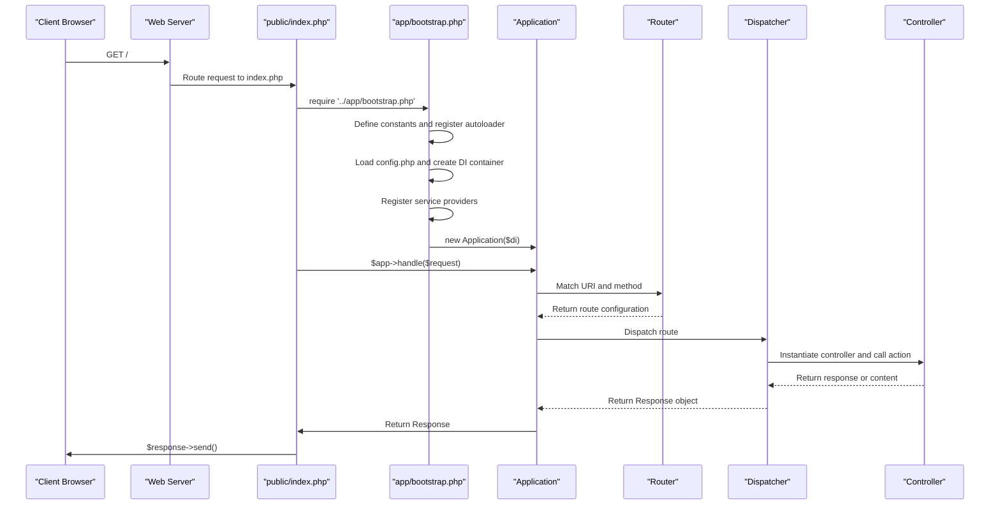

# Getting Started

<cite>
**Referenced Files in This Document**   
- [config.php](file://app/config.php)
- [index.php](file://public/index.php)
- [bootstrap.php](file://app/bootstrap.php)
- [Application.php](file://app/Core/Mvc/Application.php)
- [Container.php](file://app/Core/Di/Container.php)
- [Router.php](file://app/Core/Mvc/Router.php)
- [Controller.php](file://app/Core/Mvc/Controller.php)
- [Request.php](file://app/Core/Http/Request.php)
- [Response.php](file://app/Core/Http/Response.php)
- [View.php](file://app/Core/Mvc/View.php)
- [migrate.php](file://public/migrate.php)
- [usign-app.php](file://examples/usign-app.php)
</cite>

## Table of Contents
1. [Project Setup](#project-setup)
2. [Directory Structure Overview](#directory-structure-overview)
3. [First Request Flow](#first-request-flow)
4. [Creating a Hello World Example](#creating-a-hello-world-example)
5. [Accessing Core Services](#accessing-core-services)
6. [Common Setup Issues](#common-setup-issues)

## Project Setup

To get started with the framework, follow these steps to set up your project correctly.

### File Placement
Place the entire project under your web server's document root. For XAMPP on Windows, this typically means placing the project folder inside `c:\xampp\htdocs\`. In this case, the project is located at ``.

Ensure that the `public` directory is accessible via the web. This directory contains the entry points for your application: `index.php` for regular requests and `migrate.php` for database migrations.

### Database Configuration
Open `app/config.php` and locate the `db` section. Configure your database connection settings:

```php
'db' => [
    'driver'        => 'mysql',
    'host'          => 'localhost',
    'database'      => 'web',
    'username'      => 'root',
    'password'      => '',
    'charset'       => 'utf8mb4',
    'persistent'    => true,
],
```

Update the values according to your environment:
- `database`: Name of your MySQL database
- `username`: Database user
- `password`: User password
- `host`: Database server address

Ensure the database exists before running migrations.

### Running Migrations
Navigate to the project's `public` directory and execute the migration script via command line:

```bash
php migrate.php migrate
```

This command runs all migration files located in the `migrations/` directory in chronological order. Each migration file corresponds to a database schema change (e.g., creating tables). The migrator tracks executed migrations in the database using the `migration_repository` table.

To roll back the last migration batch:
```bash
php migrate.php rollback
```

To reset all migrations:
```bash
php migrate.php reset
```

**Section sources**
- [migrate.php](file://public/migrate.php#L1-L65)
- [config.php](file://app/config.php#L10-L19)

## Directory Structure Overview

Understanding the directory layout is crucial for effective development.

### app/
The `app/` directory contains the core application logic:
- `Core/`: Framework components (DI container, MVC classes, HTTP utilities)
- `Module/`: Application modules (Base and Admin with controllers, models, forms)
- `views/`: Template files organized by module and controller
- `bootstrap.php`: Initializes the application and DI container
- `config.php`: Configuration array loaded at runtime

### public/
The `public/` directory serves as the web root:
- `index.php`: Main entry point handling all HTTP requests
- `migrate.php`: CLI script for managing database schema changes
- `css/`, `js/`: Static assets

All external access should go through files in this directory to ensure security.

### examples/
Contains usage examples demonstrating various framework features:
- `usign-app.php`: Shows basic application structure and configuration
- Other files illustrate specific components like database usage, forms, events

### migrations/
Holds PHP classes that define database schema changes. Each filename follows the pattern `YYYY_MM_DD_HHMMSS_description.php`. These classes implement methods to `up()` (apply changes) and `down()` (revert changes).

**Section sources**
- [config.php](file://app/config.php#L1-L99)
- [bootstrap.php](file://app/bootstrap.php#L1-L56)

## First Request Flow

When a user accesses the application, the request follows this path:



**Diagram sources**
- [index.php](file://public/index.php#L1-L6)
- [bootstrap.php](file://app/bootstrap.php#L1-L56)
- [Application.php](file://app/Core/Mvc/Application.php#L1-L70)
- [Router.php](file://app/Core/Mvc/Router.php#L1-L91)

**Section sources**
- [index.php](file://public/index.php#L1-L6)
- [bootstrap.php](file://app/bootstrap.php#L1-L56)
- [Application.php](file://app/Core/Mvc/Application.php#L1-L70)

## Creating a Hello World Example

Create a simple "Hello World" endpoint by adding a custom controller and route.

### Step 1: Create the Controller
Create a new file `app/Module/Base/Controller/Hello.php`:

```php
<?php
namespace Module\Base\Controller;

use Core\Mvc\Controller;

class Hello extends Controller
{
    public function world()
    {
        return "Hello, World!";
    }
}
```

### Step 2: Register the Route
Add a new route in `app/config.php` under the `base` module routes:

```php
'/hello' => [
    'controller' => 'Module\Base\Controller\Hello',
    'action' => 'world',
    'method' => 'GET'
]
```

Now visiting `/new/hello` will display "Hello, World!".

**Section sources**
- [config.php](file://app/config.php#L50-L55)
- [Controller.php](file://app/Core/Mvc/Controller.php#L1-L124)

## Accessing Core Services

Controllers can access essential services through dependency injection.

### Request Service
Access incoming request data:

```php
$request = $this->getRequest();
$method = $request->method();
$uri = $request->uri();
$name = $request->input('name', 'Guest');
```

### Response Service
Return structured responses:

```php
return Response::json(['message' => 'Success'], 200);
return $this->redirect('/dashboard', 302);
```

### View Service
Render templates with data:

```php
return $this->render('hello/index', [
    'title' => 'Hello Page',
    'message' => 'Welcome!'
]);
```

Views are located in `app/views/module/base/hello/index.phtml`.

The DI container automatically injects these services when requested via `$this->getDI()->get('service_name')`.

**Section sources**
- [Controller.php](file://app/Core/Mvc/Controller.php#L1-L124)
- [Request.php](file://app/Core/Http/Request.php#L1-L170)
- [Response.php](file://app/Core/Http/Response.php#L1-L137)
- [View.php](file://app/Core/Mvc/View.php#L1-L144)

## Common Setup Issues

### Path Configuration
Ensure `APP_DIR` is correctly defined in `bootstrap.php`. It should reflect the subdirectory name if running under a subpath:

```php
define('APP_DIR', dirname($_SERVER['SCRIPT_NAME'],2));
```

If accessing via `/new`, this sets the correct base path for URL generation.

### URL Rewriting
Enable Apache's `mod_rewrite` and ensure `.htaccess` rules are applied. If using XAMPP, verify that `httpd.conf` includes:
```
LoadModule rewrite_module modules/mod_rewrite.so
```

And directory settings allow overrides:
```
<Directory "c:/xampp/htdocs">
    AllowOverride All
</Directory>
```

### Database Connection Errors
Common causes:
- Incorrect database name, username, or password in `config.php`
- MySQL service not running
- Database not created

Test connection manually using PHP:
```php
$pdo = new PDO("mysql:host=localhost;dbname=web", "root", "");
```

Check error logs in XAMPP control panel for specific issues.

**Section sources**
- [bootstrap.php](file://app/bootstrap.php#L3-L5)
- [config.php](file://app/config.php#L10-L19)
- [migrate.php](file://public/migrate.php#L1-L65)