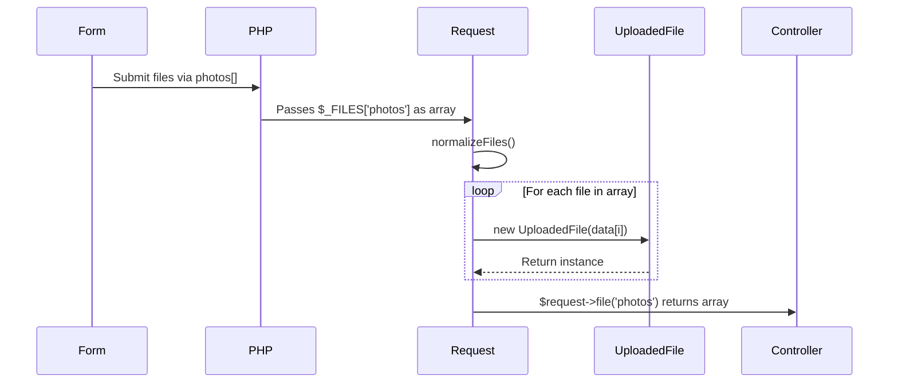

# File Upload Handling

<cite>
**Referenced Files in This Document**   
- [Request.php](file://app/Core/Http/Request.php)
- [UploadedFile.php](file://app/Core/Http/UploadedFile.php)
- [http-req-res.php](file://examples/http-req-res.php)
- [User.php](file://app/Module/Admin/Controller/User.php)
</cite>

## Table of Contents
1. [Introduction](#introduction)
2. [Request and UploadedFile Integration](#request-and-uploadedfile-integration)
3. [UploadedFile Interface and Methods](#uploadedfile-interface-and-methods)
4. [Usage Patterns for File Uploads](#usage-patterns-for-file-uploads)
5. [Validation Workflows](#validation-workflows)
6. [Handling Array-Style File Inputs](#handling-array-style-file-inputs)
7. [Security Considerations](#security-considerations)
8. [Common Issues and Best Practices](#common-issues-and-best-practices)
9. [Performance and Server Configuration](#performance-and-server-configuration)
10. [Conclusion](#conclusion)

## Introduction
This document provides a comprehensive guide to file upload handling within the application framework, focusing on the integration between the `Request` class and the `UploadedFile` object. It explains how file uploads are normalized during request construction, how to safely access and process uploaded files, and best practices for validation, security, and performance. The system supports both single and multiple file uploads through structured normalization and encapsulation.

## Request and UploadedFile Integration
The `Request` class automatically processes the PHP superglobal `$_FILES` during its construction by invoking the `normalizeFiles()` method. This method transforms raw file data into instances of the `UploadedFile` class, enabling a consistent and object-oriented interface for handling uploads.

When a file is uploaded via an HTML form, PHP populates the `$_FILES` array with metadata such as name, type, temporary path, error status, and size. The `normalizeFiles()` method iterates over this array and constructs `UploadedFile` objects accordingly—either as a single instance or as an indexed array when multiple files are submitted under the same form key.

```mermaid
flowchart TD
Start([Request Construction]) --> Normalize["normalizeFiles($_FILES)"]
Normalize --> IsArray{"Is file['name'] an array?"}
IsArray --> |Yes| CreateMultiple["Create UploadedFile[]"]
IsArray --> |No| CreateSingle["Create new UploadedFile(file)"]
CreateMultiple --> Store["Store in $this->files[key][index]"]
CreateSingle --> Store["Store in $this->files[key]"]
Store --> End([Ready for access via $request->file()])
```

**Diagram sources**
- [Request.php](file://app/Core/Http/Request.php#L144-L170)

**Section sources**
- [Request.php](file://app/Core/Http/Request.php#L101-L170)

## UploadedFile Interface and Methods
The `UploadedFile` class provides a safe and standardized API for interacting with uploaded files. It encapsulates the raw file data and exposes methods that abstract low-level operations while enforcing validation checks.

Key methods include:

- `moveTo(string $targetPath): bool` – Moves the uploaded file from its temporary location to a specified destination. Throws an exception if the upload contains errors.
- `isValid(): bool` – Checks whether the file was uploaded without errors by comparing the error code to `UPLOAD_ERR_OK`.
- `getClientOriginalName(): string` – Returns the original filename as provided by the client.
- `getClientMimeType(): string` – Returns the MIME type reported by the client.
- `getSize(): int` – Returns the size of the uploaded file in bytes.
- `getError(): int` – Returns the raw PHP upload error code for detailed inspection.

These methods ensure that developers interact with uploads in a secure and predictable manner, minimizing direct access to superglobals or risky filesystem operations.

**Section sources**
- [UploadedFile.php](file://app/Core/Http/UploadedFile.php#L0-L58)

## Usage Patterns for File Uploads
Files can be accessed from the request using the `file(string $key)` method, which returns a nullable `UploadedFile` instance. A typical workflow involves retrieving the file, validating its integrity, and moving it to a secure location.

Example usage:
```php
$file = $request->file('avatar');
if ($file && $file->isValid()) {
    $file->moveTo('/secure/uploads/' . $file->getClientOriginalName());
}
```

This pattern ensures that only successfully uploaded files are processed. The `moveTo()` method internally uses PHP’s `move_uploaded_file()` function, which prevents attacks involving malicious file paths by ensuring the file originated from an upload.

**Section sources**
- [http-req-res.php](file://examples/http-req-res.php#L165-L168)

## Validation Workflows
Before processing any uploaded file, it is essential to call `isValid()` to confirm the upload completed successfully. This method guards against common issues such as partial uploads, exceeding size limits, or missing temporary directories.

Additional validation—such as checking file extensions, MIME types, or file size limits—should be performed after confirming validity. For example:

```php
if ($file && $file->isValid()) {
    if ($file->getSize() > 5_000_000) {
        // Reject files larger than 5MB
    }
    $allowedTypes = ['image/jpeg', 'image/png'];
    if (!in_array($file->getClientMimeType(), $allowedTypes)) {
        // Reject invalid MIME types
    }
}
```

Client-reported values like `getClientMimeType()` should not be trusted exclusively; server-side MIME detection (e.g., using `finfo`) is recommended for security-critical applications.

**Section sources**
- [UploadedFile.php](file://app/Core/Http/UploadedFile.php#L30-L35)
- [Request.php](file://app/Core/Http/Request.php#L62-L65)

## Handling Array-Style File Inputs
The framework supports HTML forms that submit multiple files under the same input name (e.g., `<input type="file" name="photos[]" multiple>`). In such cases, `$_FILES['photos']` becomes an array of values, which the `normalizeFiles()` method processes into an indexed array of `UploadedFile` objects.

After normalization, these files can be accessed as:
```php
$photos = $request->file('photos'); // Returns array of UploadedFile
if (is_array($photos)) {
    foreach ($photos as $photo) {
        if ($photo->isValid()) {
            $photo->moveTo("/uploads/{$photo->getClientOriginalName()}");
        }
    }
}
```

This design maintains consistency between single and multiple upload scenarios while preserving type safety and error handling.



**Diagram sources**
- [Request.php](file://app/Core/Http/Request.php#L144-L170)

**Section sources**
- [Request.php](file://app/Core/Http/Request.php#L144-L170)

## Security Considerations
File uploads present several security risks that must be mitigated:

- **Path Traversal**: Always use `moveTo()` instead of direct `rename()` or `copy()` calls. The method ensures the source is a valid upload.
- **MIME Type Spoofing**: Do not rely solely on `getClientMimeType()`. Use server-side tools like `finfo_file()` to verify actual content.
- **File Extension Validation**: Restrict allowed extensions and avoid executing uploaded files. Store files with random names when possible.
- **Web Root Exposure**: Store uploaded files outside the web-accessible directory or use a proxy script to serve them.
- **Untrusted Filenames**: Sanitize or replace original filenames to prevent directory traversal or overwrites.

Example secure storage:
```php
$extension = pathinfo($file->getClientOriginalName(), PATHINFO_EXTENSION);
$safeName = bin2hex(random_bytes(16)) . ".$extension";
$file->moveTo("/var/storage/uploads/$safeName");
```

**Section sources**
- [UploadedFile.php](file://app/Core/Http/UploadedFile.php#L30-L35)

## Common Issues and Best Practices
### Upload Size Limits
PHP enforces upload limits via `upload_max_filesize` and `post_max_size` in `php.ini`. Exceeding these results in `UPLOAD_ERR_INI_SIZE` or `UPLOAD_ERR_FORM_SIZE`. These must be checked using `isValid()`.

### Temporary File Cleanup
PHP automatically removes temporary files after script execution. However, if `moveTo()` fails, the file remains until cleanup. Avoid relying on temporary files beyond the current request.

### Race Conditions
The `move_uploaded_file()` function is atomic and safe from race conditions, making `moveTo()` reliable even under high concurrency.

### Error Handling
Always check `isValid()` before processing. Use `getError()` for debugging specific upload issues (e.g., `UPLOAD_ERR_NO_FILE`).

Best practices:
- Validate file size and type before moving.
- Use non-executable directories for storage.
- Log failed uploads for monitoring.
- Set appropriate PHP limits based on use case.

**Section sources**
- [UploadedFile.php](file://app/Core/Http/UploadedFile.php#L30-L35)
- [Request.php](file://app/Core/Http/Request.php#L144-L170)

## Performance and Server Configuration
For large file handling:
- Increase `upload_max_filesize`, `post_max_size`, and `max_execution_time` in `php.ini`.
- Use chunked uploads for very large files (not natively supported; requires frontend coordination).
- Stream processing may be necessary for memory efficiency.
- Consider offloading uploads to cloud storage (e.g., AWS S3) via signed URLs.

Server tuning tips:
- Ensure the temporary upload directory (`upload_tmp_dir`) has sufficient space and fast I/O.
- Monitor disk usage and clean stale temporary files if needed.
- Use OPcache and proper memory limits to avoid timeouts.

While the current implementation handles standard uploads efficiently, streaming or resumability would require architectural extensions.

**Section sources**
- [Request.php](file://app/Core/Http/Request.php#L144-L170)
- [UploadedFile.php](file://app/Core/Http/UploadedFile.php#L30-L35)

## Conclusion
The file upload system in this framework provides a robust, secure, and developer-friendly interface through the integration of the `Request` and `UploadedFile` classes. By normalizing `$_FILES` into objects during request construction, it enables consistent handling of both single and multiple uploads. The `UploadedFile` API promotes safe practices via validation and atomic file movement. Developers should always validate uploads, sanitize outputs, and configure server settings appropriately to ensure reliability and security.