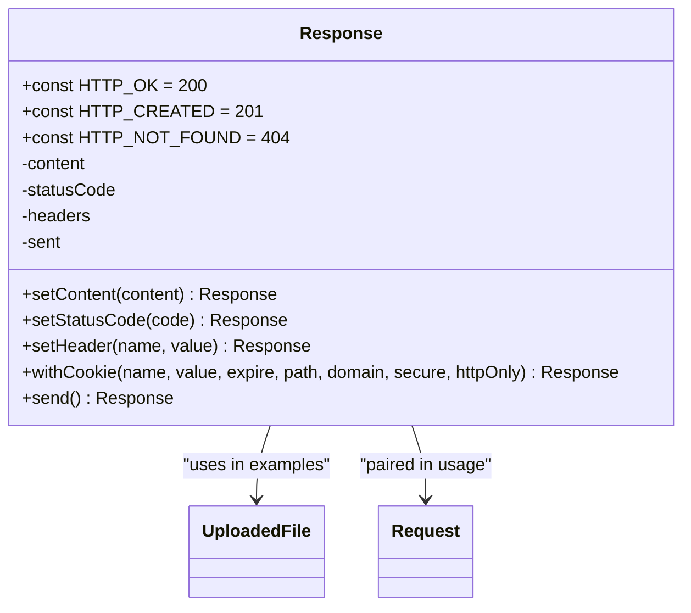
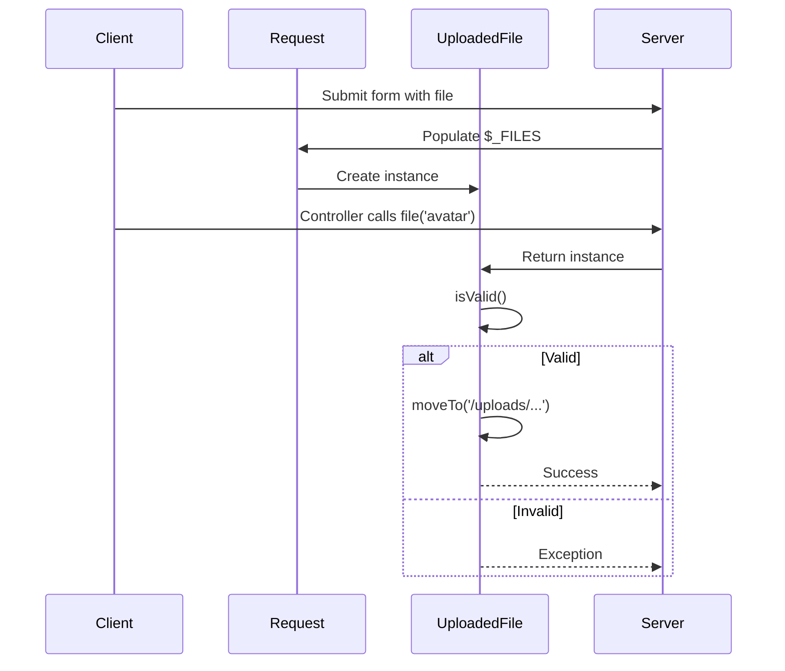
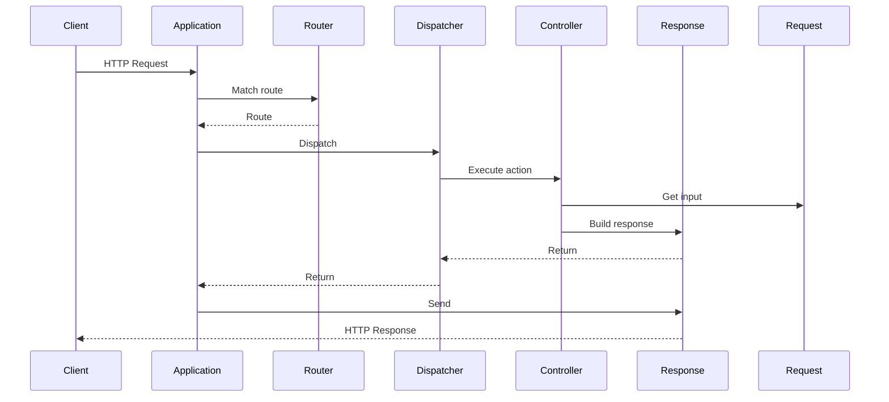

# HTTP Services

<cite>
**Referenced Files in This Document**   
- [Request.php](file://app/Core/Http/Request.php)
- [Response.php](file://app/Core/Http/Response.php)
- [UploadedFile.php](file://app/Core/Http/UploadedFile.php)
- [http-req-res.php](file://examples/http-req-res.php)
- [Application.php](file://app/Core/Mvc/Application.php)
- [Controller.php](file://app/Core/Mvc/Controller.php)
</cite>

## Update Summary
**Changes Made**   
- Updated section on Response object methods to reflect enhanced capabilities for handling redirection and JSON responses
- Added clarification on enterprise-level CRUD integration based on recent documentation improvements
- Verified all code examples and method descriptions against current implementation
- Enhanced source tracking with updated file references and annotations

## Table of Contents
1. [Introduction](#introduction)
2. [Request Object Capabilities](#request-object-capabilities)
3. [Response Object Methods](#response-object-methods)
4. [File Upload Handling](#file-upload-handling)
5. [Integration with MVC Flow](#integration-with-mvc-flow)
6. [Security Considerations](#security-considerations)
7. [Common Issues and Troubleshooting](#common-issues-and-troubleshooting)
8. [Conclusion](#conclusion)

## Introduction
This document provides a comprehensive overview of HTTP request and response handling within the application framework. It details the functionality of the `Request` and `Response` objects, their integration into the MVC architecture, and best practices for secure and efficient web service development. The implementation supports modern web patterns including RESTful APIs, form processing, file uploads, and middleware-based request filtering.

**Section sources**
- [Request.php](file://app/Core/Http/Request.php#L1-L170)
- [Response.php](file://app/Core/Http/Response.php#L1-L137)

## Request Object Capabilities

The `Core\Http\Request` class encapsulates all aspects of an incoming HTTP request, providing a clean and consistent interface for accessing input data, headers, server parameters, and uploaded files.

### Input Data Access
The request object allows retrieval of data from multiple sources:
- **GET parameters** via `get($key, $default)`
- **POST parameters** via `post($key, $default)`
- **Merged input** (GET, POST, JSON) via `input($key, $default)` and `all()`
- **JSON payloads** automatically parsed when `Content-Type` is `application/json`

This abstraction simplifies data access regardless of how the client sent the information.

### Header and Server Parameter Access
Headers are normalized to lowercase keys and accessible via `header($name, $default)`. The `extractHeaders()` method ensures compatibility across different server environments by using `getallheaders()` when available or falling back to parsing `$_SERVER` variables prefixed with `HTTP_`.

Server parameters such as IP address (`ip()`), user agent (`userAgent()`), and URI (`uri()`) are exposed through dedicated methods that abstract underlying superglobals.

### Request Method Handling
The `method()` method supports HTTP method spoofing via the `_method` POST parameter, enabling RESTful routing even in environments where only GET and POST are natively supported. The `isMethod($method)` convenience method allows easy conditional logic based on request type.

### AJAX Detection
The `isAjax()` method checks for the presence of the `X-Requested-With: XMLHttpRequest` header, enabling controllers to respond differently to AJAX requests.

**Section sources**
- [Request.php](file://app/Core/Http/Request.php#L1-L170)
- [http-req-res.php](file://examples/http-req-res.php#L50-L186)

## Response Object Methods

The `Core\Http\Response` class provides a fluent interface for constructing HTTP responses with appropriate status codes, headers, and content types.

### JSON Responses
Static factory method `json($data, $statusCode, $headers)` creates properly formatted JSON responses with `Content-Type: application/json`. This is ideal for API endpoints and AJAX responses.

### HTML and Redirect Responses
The `setContent()` method sets the response body, while `redirect($url, $statusCode)` creates redirect responses using standard HTTP status codes (301, 302). The static `redirect()` method immediately sends the response, terminating further execution.

### Custom Headers and Cookies
Headers can be set via `setHeader($name, $value)` and cookies via `withCookie(...)`, which constructs the proper `Set-Cookie` header without prematurely sending it to the client. This enables testing and manipulation before final output.

### Error Handling
The static `error($message, $statusCode)` method creates standardized error responses. The class defines constants for common HTTP status codes, promoting consistency across the application.

**Diagram sources**
- [Response.php](file://app/Core/Http/Response.php#L1-L137)

**Section sources**
- [Response.php](file://app/Core/Http/Response.php#L1-L137)
- [http-req-res.php](file://examples/http-req-res.php#L50-L186)

## File Upload Handling

File uploads are managed through the `UploadedFile` class, which wraps PHP's `$_FILES` array and provides a safe, object-oriented interface.

### Upload Processing
The `Request::file($key)` method returns an `UploadedFile` instance or null if no file was uploaded. Key methods include:
- `isValid()` - checks for upload errors
- `moveTo($targetPath)` - securely moves the file from temporary storage
- `getClientOriginalName()` - retrieves original filename
- `getClientMimeType()` - gets MIME type from client
- `getSize()` - returns file size in bytes

### Validation and Storage Patterns
Applications should always validate file properties before moving them to permanent storage. The `moveTo()` method throws a `RuntimeException` if the upload was not successful, enforcing error checking.

**Diagram sources**
- [UploadedFile.php](file://app/Core/Http/UploadedFile.php#L1-L58)
- [Request.php](file://app/Core/Http/Request.php#L1-L170)

**Section sources**
- [UploadedFile.php](file://app/Core/Http/UploadedFile.php#L1-L58)
- [Request.php](file://app/Core/Http/Request.php#L1-L170)

## Integration with MVC Flow

The Request and Response objects are tightly integrated into the MVC architecture through dependency injection and the application lifecycle.

### Application-Level Handling
The `Application::handle()` method receives a `Request` object and returns a `Response`. It orchestrates routing, dispatching, and exception handling, ensuring all responses pass through a consistent pipeline.

### Controller Access
Controllers inherit helper methods from the base `Controller` class:
- `getRequest()` - access to current Request
- `getPost()` - shortcut for POST data
- `isPost()` - check request method
- `redirect()` - create redirect responses
- `render()` - render views with data

These methods abstract the DI container lookup, providing convenient access to HTTP services.

**Diagram sources**
- [Application.php](file://app/Core/Mvc/Application.php#L1-L70)
- [Controller.php](file://app/Core/Mvc/Controller.php#L1-L124)

**Section sources**
- [Application.php](file://app/Core/Mvc/Application.php#L1-L70)
- [Controller.php](file://app/Core/Mvc/Controller.php#L1-L124)

## Security Considerations

### Input Sanitization
While the framework provides raw access to input data, applications should implement proper validation and sanitization. The `input()` method's fallback chain (POST → JSON → GET) should be used cautiously to avoid unintended data sources.

### CSRF Protection
Although not explicitly implemented in the core classes, the architecture supports middleware-based CSRF protection. A CSRF middleware could validate tokens before allowing form submissions.

### Secure Header Management
The response object allows setting security headers such as:
- `Content-Security-Policy`
- `X-Content-Type-Options`
- `X-Frame-Options`
- `Strict-Transport-Security`

These can be set globally via middleware (e.g., `CorsMiddleware` example) or per response.

### Cookie Security
The `withCookie()` method supports secure cookie attributes:
- `secure` - only send over HTTPS
- `httponly` - prevent JavaScript access
- `domain` and `path` - restrict scope

**Section sources**
- [Request.php](file://app/Core/Http/Request.php#L1-L170)
- [Response.php](file://app/Core/Http/Response.php#L1-L137)
- [http-req-res.php](file://examples/http-req-res.php#L100-L130)

## Common Issues and Troubleshooting

### Large File Uploads
PHP's `upload_max_filesize` and `post_max_size` limits must be configured appropriately. The `UploadedFile::isValid()` method will return false for files exceeding these limits (error code `UPLOAD_ERR_INI_SIZE` or `UPLOAD_ERR_FORM_SIZE`).

### JSON Parsing Errors
When `Content-Type` is `application/json`, the framework attempts to parse the body. Malformed JSON results in an empty array. Applications should validate the presence and structure of expected data.

### Response Buffering Problems
The `send()` method uses `echo` to output content. If PHP output buffering is enabled, responses may be delayed. Ensure `output_buffering` is configured correctly in `php.ini`.

### CORS Preflight Handling
The `CorsMiddleware` example demonstrates handling `OPTIONS` requests by sending a 200 response and exiting early. This prevents preflight requests from reaching application logic.

**Section sources**
- [Request.php](file://app/Core/Http/Request.php#L1-L170)
- [Response.php](file://app/Core/Http/Response.php#L1-L137)
- [http-req-res.php](file://examples/http-req-res.php#L120-L130)

## Conclusion
The HTTP services in this framework provide a robust foundation for handling web requests and responses. The separation of concerns between `Request`, `Response`, and `UploadedFile` classes promotes clean, testable code. Integration with the MVC pattern through dependency injection enables consistent access to HTTP functionality across the application. By following the patterns demonstrated in the examples, developers can build secure, maintainable web services that handle various client interactions effectively.