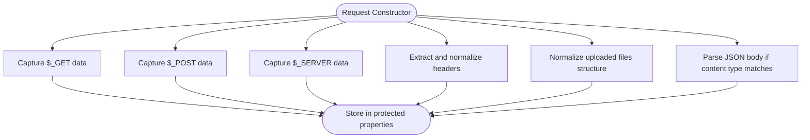
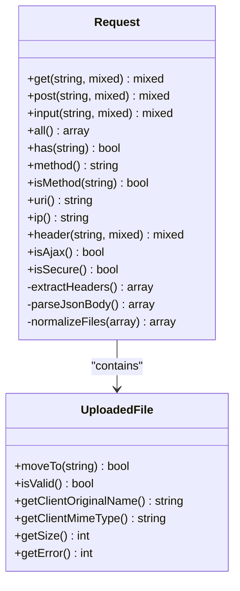
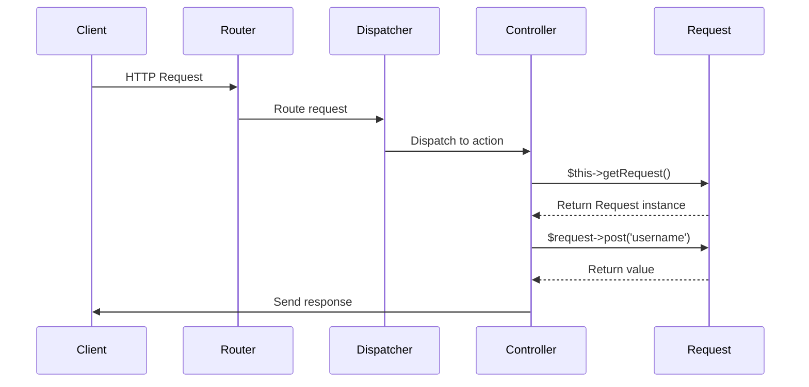
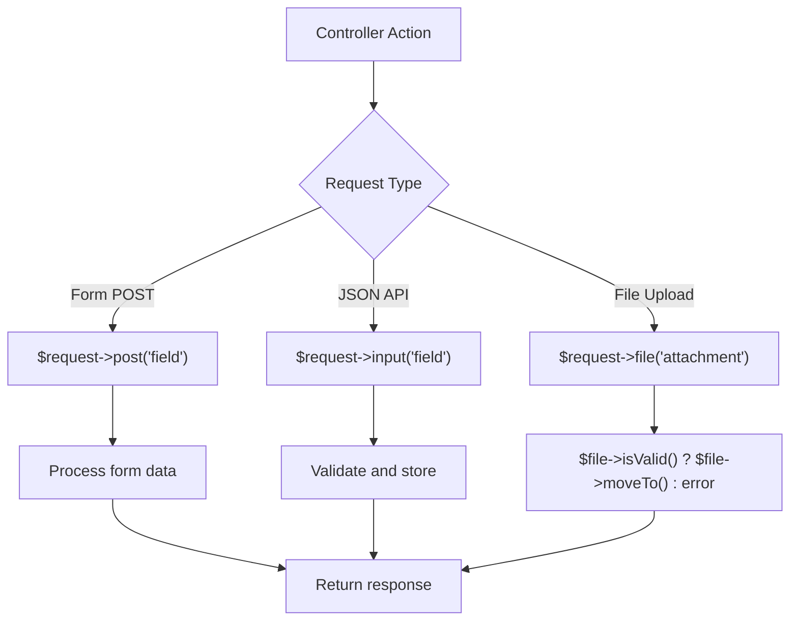

# Request Handling

<cite>
**Referenced Files in This Document**   
- [Request.php](file://app/Core/Http/Request.php)
- [UploadedFile.php](file://app/Core/Http/UploadedFile.php)
- [Controller.php](file://app/Core/Mvc/Controller.php)
- [http-req-res.php](file://examples/http-req-res.php)
- [using-di.php](file://examples/using-di.php)
- [using-cookie-controller.php](file://examples/using-cookie-controller.php)
</cite>

## Table of Contents
1. [Introduction](#introduction)
2. [Request Object Initialization](#request-object-initialization)
3. [Input Retrieval Methods](#input-retrieval-methods)
4. [Advanced Request Features](#advanced-request-features)
5. [Integration with MVC Flow](#integration-with-mvc-flow)
6. [Common Usage Patterns](#common-usage-patterns)
7. [Error Handling and Edge Cases](#error-handling-and-edge-cases)
8. [Performance and Security Considerations](#performance-and-security-considerations)

## Introduction
The Request class serves as a centralized abstraction for handling HTTP input in the application. It encapsulates data from various sources including query parameters, form submissions, JSON payloads, uploaded files, and server variables. By providing a consistent interface for accessing request data, it simplifies controller logic and enhances code readability. This document details the implementation, usage patterns, and integration points of the Request object within the application architecture.

## Request Object Initialization
The Request object is instantiated with no parameters, automatically populating its internal state from global PHP superglobals during construction. It captures $_GET, $_POST, $_SERVER, and $_FILES data, while also parsing JSON payloads from the request body when appropriate. The constructor also normalizes HTTP headers for case-insensitive access.



**Diagram sources**
- [Request.php](file://app/Core/Http/Request.php#L15-L30)

**Section sources**
- [Request.php](file://app/Core/Http/Request.php#L15-L30)

## Input Retrieval Methods
The Request class provides several methods for retrieving user input with flexible fallback mechanisms and default values.

### get() and post() Methods
These methods access query string parameters and form data respectively. When called without arguments, they return the complete dataset. With a key parameter, they return the specific value or a specified default if the key doesn't exist.

### input() Method
This method provides a unified interface for accessing input data, searching for a key in POST data first, then JSON payload, and finally GET parameters. This hierarchical approach ensures consistent data access regardless of submission method.

### all() Method
Retrieves a merged array of all input data from GET, POST, and JSON sources. This is useful for bulk processing of request parameters.

### has() Method
Checks for the existence of a parameter across all input sources (GET, POST, JSON), returning a boolean result.

```mermaid
flowchart LR
A[input('username', 'Guest')] --> B{Search Order}
B --> C["POST['username']"]
B --> D["JSON['username']"]
B --> E["GET['username']"]
C --> |Found| F[Return Value]
C --> |Not Found| D
D --> |Found| F
D --> |Not Found| E
E --> |Found| F
E --> |Not Found| G[Return Default 'Guest']
```

**Diagram sources**
- [Request.php](file://app/Core/Http/Request.php#L40-L65)

**Section sources**
- [Request.php](file://app/Core/Http/Request.php#L40-L65)

## Advanced Request Features
The Request class implements several advanced features for handling complex HTTP scenarios.

### Method Spoofing
Supports HTTP method overriding through the _method parameter in POST data, enabling PUT, DELETE, and other methods in environments where they're not directly supported.

### Header Processing
Provides case-insensitive header access through the header() method, with automatic normalization of header names to lowercase. The extractHeaders() method intelligently retrieves headers from either getallheaders() function or $_SERVER variables.

### AJAX Detection
The isAjax() method checks for the presence of X-Requested-With header with value XMLHttpRequest, enabling conditional logic based on request type.

### URI and Client Information
Methods for retrieving the request URI (with application directory stripped), client IP address, user agent string, and secure connection status.



**Diagram sources**
- [Request.php](file://app/Core/Http/Request.php#L32-L170)
- [UploadedFile.php](file://app/Core/Http/UploadedFile.php#L10-L50)

**Section sources**
- [Request.php](file://app/Core/Http/Request.php#L67-L170)

## Integration with MVC Flow
The Request object is seamlessly integrated into the MVC architecture through dependency injection and controller inheritance.

### Dependency Injection
The Request service is registered as a shared instance in the DI container, ensuring a single Request object is used throughout the request lifecycle.

### Controller Access
Base controllers provide direct access to the Request object through getRequest() method and convenience methods like isPost() and getPost(). This enables clean, readable controller actions.



**Diagram sources**
- [Controller.php](file://app/Core/Mvc/Controller.php#L38-L41)
- [http-req-res.php](file://examples/http-req-res.php#L5-L10)

**Section sources**
- [Controller.php](file://app/Core/Mvc/Controller.php#L38-L50)
- [http-req-res.php](file://examples/http-req-res.php#L5-L10)

## Common Usage Patterns
The Request object is used throughout the application in various patterns.

### Form Processing
In form submissions, the all() method is often used to retrieve all input data for model population, while individual get() and post() calls handle specific fields.

### API Endpoints
API controllers frequently use input() method to handle both form-encoded and JSON requests transparently, with isAjax() checks to enforce request type requirements.

### File Uploads
The file() method provides access to uploaded files through the UploadedFile abstraction, enabling safe file operations with validation.



**Diagram sources**
- [using-di.php](file://examples/using-di.php#L300-L330)
- [using-cookie-controller.php](file://examples/using-cookie-controller.php#L5-L20)
- [http-req-res.php](file://examples/http-req-res.php#L15-L30)

**Section sources**
- [using-di.php](file://examples/using-di.php#L300-L330)
- [using-cookie-controller.php](file://examples/using-cookie-controller.php#L5-L20)

## Error Handling and Edge Cases
The Request implementation addresses several potential issues.

### Missing Input
All retrieval methods accept default values, preventing undefined index errors when accessing non-existent parameters.

### JSON Parsing Failures
The parseJsonBody() method includes error handling, returning an empty array if JSON decoding fails rather than throwing exceptions.

### Server Variable Availability
Fallback values are provided for critical server variables like REMOTE_ADDR to ensure reliability across different hosting environments.

### File Upload Errors
The UploadedFile class encapsulates upload error codes and provides isValid() method to safely check upload status before processing.

**Section sources**
- [Request.php](file://app/Core/Http/Request.php#L130-L150)
- [UploadedFile.php](file://app/Core/Http/UploadedFile.php#L40-L50)

## Performance and Security Considerations
Several factors should be considered when using the Request object.

### Large Payloads
The all() method merges all input sources, which could consume significant memory with large payloads. Selective access via specific methods is recommended for performance-critical scenarios.

### Input Sanitization
While the Request object provides clean access to input data, application-level sanitization is required for security. Never trust raw input from get(), post(), or input() methods.

### CSRF Protection
The framework does not implement built-in CSRF protection. Applications should implement token validation for state-changing operations, especially when using method spoofing.

### Header Injection
The header() method normalizes input to lowercase but does not validate header names. Applications should validate and sanitize header values when used in output.

**Section sources**
- [Request.php](file://app/Core/Http/Request.php#L100-L120)
- [http-req-res.php](file://examples/http-req-res.php#L100-L120)