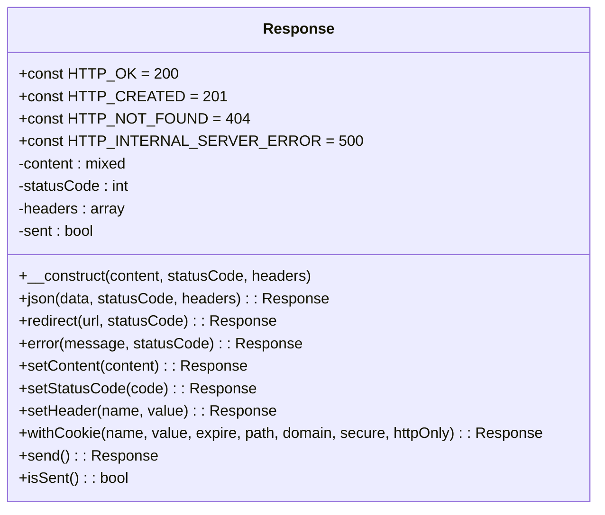
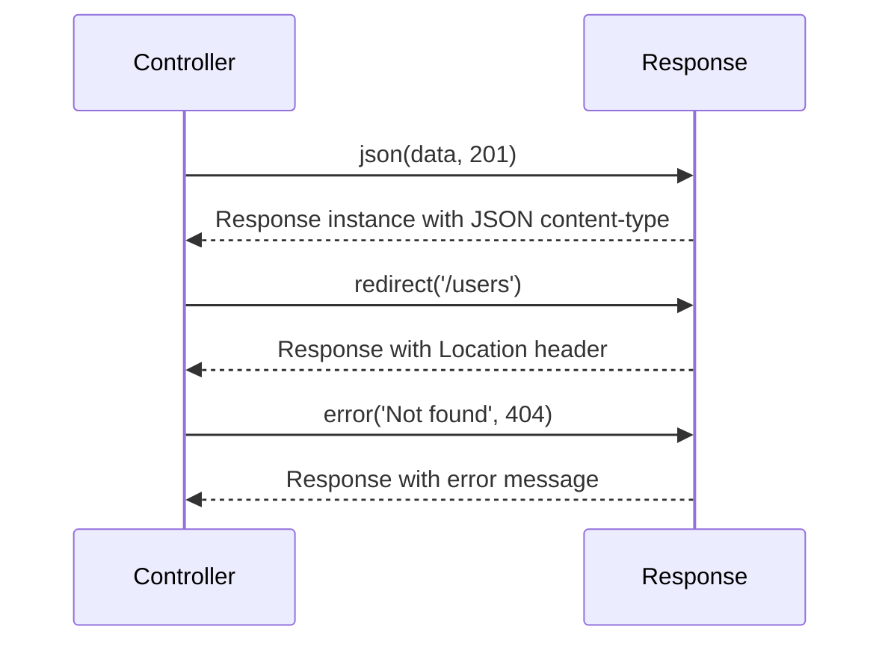
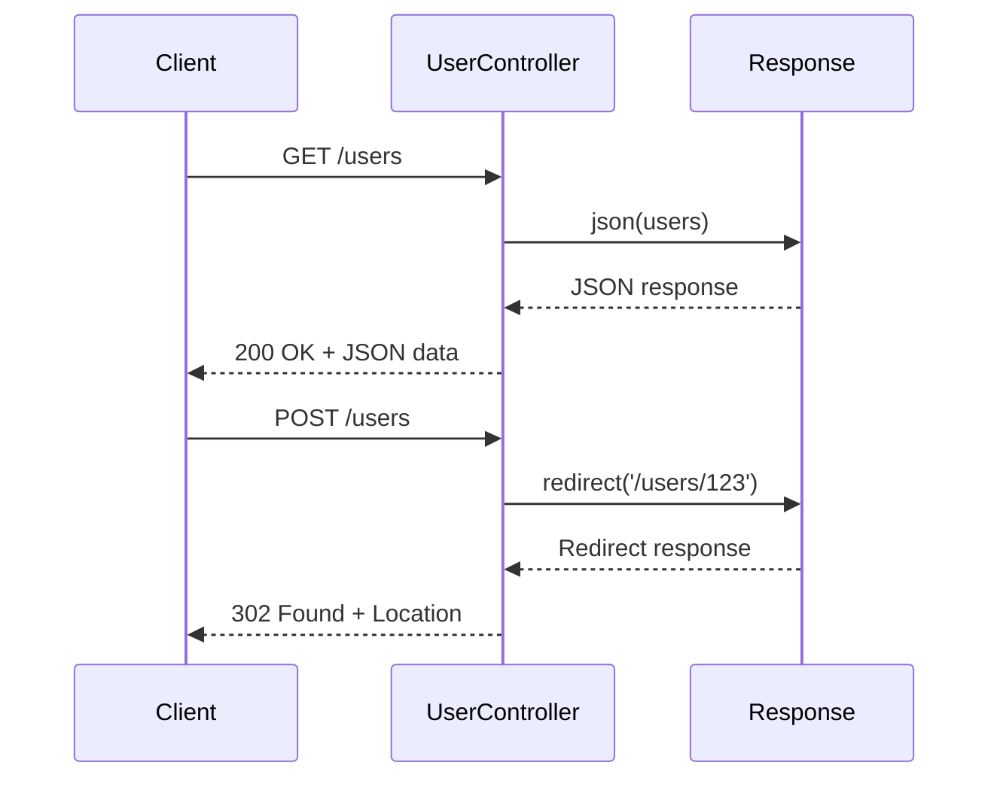
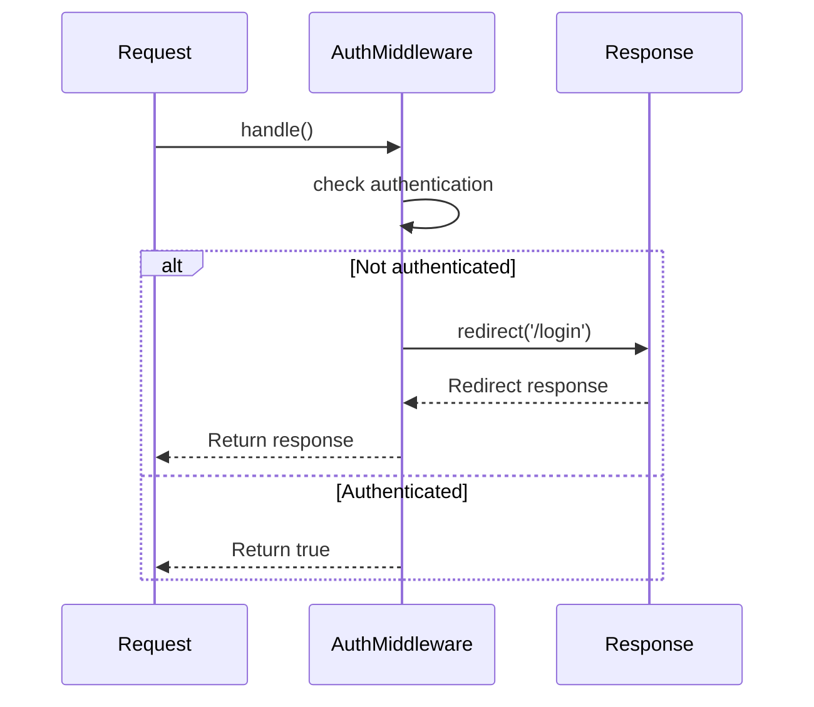
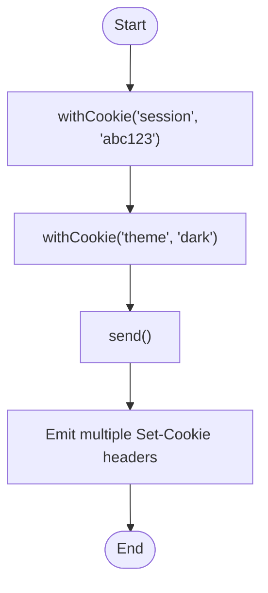

# Response Generation

<cite>
**Referenced Files in This Document**   
- [Response.php](file://app/Core/Http/Response.php)
- [User.php](file://app/Module/Admin/Controller/User.php)
- [http-req-res.php](file://examples/http-req-res.php)
- [UserResourceController.php](file://app/Module/Admin/Controller/UserResourceController.php)
- [CorsMiddleware.php](file://examples/http-req-res.php)
- [CookieServiceProvider.php](file://app/Module/Provider/CookieServiceProvider.php)
</cite>

## Table of Contents
1. [Introduction](#introduction)
2. [Core Components](#core-components)
3. [Architecture Overview](#architecture-overview)
4. [Detailed Component Analysis](#detailed-component-analysis)
5. [Integration with MVC System](#integration-with-mvc-system)
6. [Advanced Use Cases](#advanced-use-cases)
7. [Common Issues and Troubleshooting](#common-issues-and-troubleshooting)
8. [Performance and Security Considerations](#performance-and-security-considerations)

## Introduction
The Response class is a central component in the framework's HTTP handling system, responsible for managing output content, status codes, headers, and cookies. It provides a fluent interface for building HTTP responses and ensures safe output delivery by preventing duplicate sends. This document details its implementation, usage patterns, integration points, and best practices.

## Core Components

The Response class encapsulates HTTP response logic with built-in constants for standard status codes, methods for content and header manipulation, and static factory methods for common response types. It integrates tightly with the MVC system through controllers and middleware, enabling clean separation of concerns and consistent response handling across the application.

**Section sources**
- [Response.php](file://app/Core/Http/Response.php#L1-L137)

## Architecture Overview

**Diagram sources**
- [Response.php](file://app/Core/Http/Response.php#L1-L137)

## Detailed Component Analysis

### Response Class Implementation
The Response class manages HTTP output through a fluent interface that allows method chaining. It maintains internal state for content, status code, headers, and a sent flag to prevent duplicate output.

#### HTTP Status Constants
The class defines constants for common HTTP status codes, providing type-safe access to standard response codes:
- `HTTP_OK` (200)
- `HTTP_CREATED` (201)
- `HTTP_NOT_FOUND` (404)
- `HTTP_INTERNAL_SERVER_ERROR` (500)
- And others for redirects, client errors, and server errors

These constants improve code readability and reduce errors from using magic numbers.

**Section sources**
- [Response.php](file://app/Core/Http/Response.php#L15-L30)

#### Instance Methods for Mutable Response Construction
The Response class provides instance methods that return the instance itself (`$this`), enabling method chaining:

- `setContent($content)`: Sets the response body content
- `setStatusCode($code)`: Updates the HTTP status code
- `setHeader($name, $value)`: Adds or replaces a header
- `withCookie(...)`: Appends a Set-Cookie header with cookie parameters
- `send()`: Emits headers and content to the client

These methods allow incremental construction of responses in controller workflows.

**Section sources**
- [Response.php](file://app/Core/Http/Response.php#L65-L115)

#### Static Factory Methods for Common Patterns
The class includes static methods that create pre-configured responses for common use cases:

**Diagram sources**
- [Response.php](file://app/Core/Http/Response.php#L38-L64)

- `json($data, $statusCode, $headers)`: Creates a JSON response with proper Content-Type
- `redirect($url, $statusCode)`: Creates a redirect response with Location header
- `error($message, $statusCode)`: Creates a simple error response

These factory methods streamline API and web application development by encapsulating common response patterns.

**Section sources**
- [Response.php](file://app/Core/Http/Response.php#L38-L64)

#### Send Method and Output Control
The `send()` method is responsible for emitting the HTTP response:
1. Checks the `sent` flag to prevent duplicate output
2. Sets the HTTP status code via `http_response_code()`
3. Sends all headers using PHP's `header()` function
4. Outputs the content body via `echo`
5. Marks the response as sent

This ensures responses are sent exactly once, preventing "headers already sent" errors.

**Section sources**
- [Response.php](file://app/Core/Http/Response.php#L117-L137)

## Integration with MVC System

### Controller Workflows
Controllers use the Response object to return various types of responses based on application logic:

**Diagram sources**
- [User.php](file://app/Module/Admin/Controller/User.php#L10-L81)
- [http-req-res.php](file://examples/http-req-res.php#L0-L186)

In the `User` controller, responses are used for:
- Redirecting after form submissions
- Displaying views with `setContent()`
- Handling errors with appropriate status codes

**Section sources**
- [User.php](file://app/Module/Admin/Controller/User.php#L10-L81)

### Middleware Integration
Middleware components use the Response object to implement cross-cutting concerns:

**Diagram sources**
- [http-req-res.php](file://examples/http-req-res.php#L96-L152)

The `CorsMiddleware` demonstrates header management by:
- Setting CORS headers for all responses
- Handling preflight OPTIONS requests with immediate `send()`
- Allowing request processing to continue for valid requests

**Section sources**
- [http-req-res.php](file://examples/http-req-res.php#L96-L152)

## Advanced Use Cases

### Multiple Set-Cookie Headers
The `withCookie()` method supports multiple cookies by storing header values in an array:

**Diagram sources**
- [Response.php](file://app/Core/Http/Response.php#L105-L115)

Each call appends to the `Set-Cookie` header array, allowing multiple cookies to be set in a single response.

**Section sources**
- [Response.php](file://app/Core/Http/Response.php#L105-L115)

### Custom Header Management
The `setHeader()` method allows setting any HTTP header, enabling features like:
- Cache control
- Security headers
- API versioning
- Content negotiation

Headers are stored in a simple key-value array and sent during the `send()` process.

**Section sources**
- [Response.php](file://app/Core/Http/Response.php#L95-L103)

## Common Issues and Troubleshooting

### Headers Already Sent Errors
The `sent` flag prevents duplicate output, but issues can occur when:
- Output buffering is not properly configured
- Debug output precedes response sending
- Exceptions occur after partial output

Solution: Always ensure no output occurs before `send()` and use proper error handling.

### Improper JSON Encoding
The `json()` method uses `json_encode()` without error checking. Potential issues include:
- Non-UTF8 data causing encoding failures
- Circular references in data structures
- Large payloads exceeding memory limits

Best practice: Validate data before passing to `json()` and check `json_last_error()`.

### Redirect Loops
Improper redirect logic can cause infinite loops when:
- Authentication redirects back to login page
- Conditional logic fails to terminate
- Session state isn't properly updated

Prevention: Implement redirect guards and ensure state changes occur before redirects.

**Section sources**
- [User.php](file://app/Module/Admin/Controller/User.php#L44-L81)
- [http-req-res.php](file://examples/http-req-res.php#L96-L152)

## Performance and Security Considerations

### Response Buffering
For optimal performance:
- Use output buffering to control when content is sent
- Minimize response size through compression
- Cache responses when appropriate
- Batch header operations to reduce system calls

The current implementation sends content immediately during `send()`, which is efficient for most use cases.

### Security Considerations
Critical security aspects include:
- **Header Injection**: Validate header names and values to prevent CRLF injection
- **Secure Redirects**: Validate redirect URLs to prevent open redirect vulnerabilities
- **Cookie Security**: Use secure and HttpOnly flags for sensitive cookies
- **Content Security**: Escape content properly to prevent XSS attacks

The `withCookie()` method includes secure defaults (HttpOnly), but redirect validation should be added to prevent security issues.

**Section sources**
- [Response.php](file://app/Core/Http/Response.php#L105-L115)
- [CookieServiceProvider.php](file://app/Module/Provider/CookieServiceProvider.php#L0-L25)