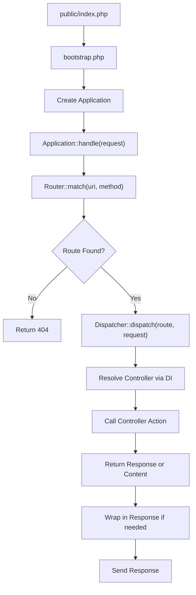

# Introduction

<cite>
**Referenced Files in This Document**  
- [public/index.php](file://public/index.php)
- [app/bootstrap.php](file://app/bootstrap.php)
- [app/config.php](file://app/config.php)
- [app/Core/Mvc/Application.php](file://app/Core/Mvc/Application.php)
- [app/Core/Mvc/Router.php](file://app/Core/Mvc/Router.php)
- [app/Core/Mvc/Dispatcher.php](file://app/Core/Mvc/Dispatcher.php)
- [app/Core/Di/Container.php](file://app/Core/Di/Container.php)
- [app/Core/Events/Manager.php](file://app/Core/Events/Manager.php)
- [app/Core/Mvc/View.php](file://app/Core/Mvc/View.php)
- [app/Core/Database/Database.php](file://app/Core/Database/Database.php)
</cite>

## Table of Contents
1. [Introduction](#introduction)
2. [Framework Overview](#framework-overview)
3. [Core Components](#core-components)
4. [Request Lifecycle](#request-lifecycle)
5. [Key Design Decisions](#key-design-decisions)
6. [Component Relationships and Data Flow](#component-relationships-and-data-flow)
7. [Extensibility and Configuration](#extensibility-and-configuration)

## Framework Overview

This is a lightweight, modular PHP MVC framework built entirely with native PHP, requiring no external dependencies. It is designed to promote clean separation of concerns through a well-defined MVC architecture, while enabling extensibility via dependency injection (DI) and service providers. The framework emphasizes simplicity, performance, and developer control by avoiding heavy abstractions and leveraging PHP’s built-in capabilities.

The core architecture is centered around five key components:
- **MVC System**: Organizes application logic into Models, Views, and Controllers for maintainable code structure.
- **Dependency Injection Container**: Manages object creation and dependencies, supporting autowiring and service registration.
- **Database Abstraction Layer**: Provides a fluent query builder interface for database interactions without requiring an ORM.
- **Event Management System**: Enables decoupled communication between components through event listeners and triggers.
- **Modular Structure**: Supports organized, reusable code through module-based routing and service configuration.

This framework is ideal for developers seeking a minimal yet powerful foundation that balances structure with flexibility. It supports both beginners learning MVC and DI patterns and experienced developers who value explicit control and extensibility.

**Section sources**
- [app/bootstrap.php](file://app/bootstrap.php#L1-L56)
- [app/config.php](file://app/config.php#L1-L100)
- [app/Core/Mvc/Application.php](file://app/Core/Mvc/Application.php#L1-L70)

## Core Components

The framework is composed of several cohesive components that work together to handle HTTP requests and generate responses.

- **MVC System**: The `Application`, `Router`, `Dispatcher`, and `View` classes form the backbone of the MVC pattern. Requests are routed to controllers, which interact with models and render views.
- **DI Container**: The `Container` class resolves dependencies automatically using reflection, allowing for type-hinted constructor injection and service registration.
- **Database Abstraction**: The `Database` class provides a fluent interface for building and executing SQL queries, abstracting low-level PDO operations.
- **Event Manager**: The `Manager` class allows components to emit and listen to events, facilitating loose coupling and cross-cutting concerns.
- **Modular Architecture**: Modules (e.g., `base`, `admin`) encapsulate related functionality, with routes and services defined in configuration.

These components are orchestrated through the DI container, which serves as the central hub for service resolution and lifecycle management.

**Section sources**
- [app/Core/Mvc/Application.php](file://app/Core/Mvc/Application.php#L1-L70)
- [app/Core/Di/Container.php](file://app/Core/Di/Container.php#L1-L144)
- [app/Core/Database/Database.php](file://app/Core/Database/Database.php#L1-L258)
- [app/Core/Events/Manager.php](file://app/Core/Events/Manager.php#L1-L102)
- [app/Core/Mvc/View.php](file://app/Core/Mvc/View.php#L1-L144)

## Request Lifecycle

The request lifecycle begins at `public/index.php` and proceeds through a series of well-defined stages:

1. **Entry Point**: `public/index.php` includes `bootstrap.php` and creates the application instance.
2. **Bootstrap**: `bootstrap.php` sets up autoloading, loads configuration, and registers core services in the DI container.
3. **Application Handle**: The `Application::handle()` method receives the request and initiates processing.
4. **Routing**: The `Router` matches the request URI and method to a configured route from `config.php`.
5. **Dispatching**: The `Dispatcher` instantiates the controller via the DI container and invokes the specified action method.
6. **Response Generation**: The controller returns content, which is wrapped in a `Response` object.
7. **Output**: The response is sent back to the client.

This flow ensures a predictable and testable execution path, with clear separation between routing, business logic, and output generation.



**Diagram sources**
- [public/index.php](file://public/index.php#L1-L7)
- [app/bootstrap.php](file://app/bootstrap.php#L1-L56)
- [app/Core/Mvc/Application.php](file://app/Core/Mvc/Application.php#L1-L70)
- [app/Core/Mvc/Router.php](file://app/Core/Mvc/Router.php#L1-L91)
- [app/Core/Mvc/Dispatcher.php](file://app/Core/Mvc/Dispatcher.php#L1-L83)

## Key Design Decisions

Several intentional design choices shape the framework’s architecture:

- **Manual Autoloading**: Uses `spl_autoload_register` with a simple PSR-0-like convention, avoiding Composer for minimalism.
- **Service Provider Pattern**: Core services (session, cookie, view) are registered via service providers, promoting modularity and testability.
- **Configuration-Driven Modules**: Module routes and services are defined in `config.php`, enabling declarative configuration without hardcoding.
- **Autowiring in DI Container**: The container uses PHP reflection to automatically resolve constructor dependencies, reducing boilerplate.
- **Fluent Query Builder**: The database layer provides a chainable interface for query construction while remaining close to raw SQL.

These decisions reflect a philosophy of explicitness, performance, and developer control, avoiding magic while still providing convenience.

**Section sources**
- [app/bootstrap.php](file://app/bootstrap.php#L7-L56)
- [app/config.php](file://app/config.php#L1-L100)
- [app/Core/Di/Container.php](file://app/Core/Di/Container.php#L1-L144)

## Component Relationships and Data Flow

The framework’s components interact through a dependency injection container, which coordinates object creation and service access. The request flows from the entry point through the application, router, dispatcher, and finally to the controller and view.

```mermaid
graph TD
subgraph "Entry"
Index["public/index.php"]
end
subgraph "Bootstrap"
Bootstrap["app/bootstrap.php"]
Config["config.php"]
Container["Di\Container"]
end
subgraph "Core Components"
Application["Mvc\Application"]
Router["Mvc\Router"]
Dispatcher["Mvc\Dispatcher"]
View["Mvc\View"]
Database["Database\Database"]
Events["Events\Manager"]
end
subgraph "Modules"
Base["Module\Base"]
Admin["Module\Admin"]
end
Index --> Bootstrap
Bootstrap --> Config
Bootstrap --> Container
Container --> Application
Application --> Router
Application --> Dispatcher
Application --> Events
Dispatcher --> View
Dispatcher --> Database
Router --> Config
Application --> Events
Base --> Router
Admin --> Router
View --> Container
Database --> Container
```

**Diagram sources**
- [public/index.php](file://public/index.php#L1-L7)
- [app/bootstrap.php](file://app/bootstrap.php#L1-L56)
- [app/config.php](file://app/config.php#L1-L100)
- [app/Core/Mvc/Application.php](file://app/Core/Mvc/Application.php#L1-L70)
- [app/Core/Mvc/Router.php](file://app/Core/Mvc/Router.php#L1-L91)
- [app/Core/Mvc/Dispatcher.php](file://app/Core/Mvc/Dispatcher.php#L1-L83)
- [app/Core/Mvc/View.php](file://app/Core/Mvc/View.php#L1-L144)
- [app/Core/Database/Database.php](file://app/Core/Database/Database.php#L1-L258)

## Extensibility and Configuration

The framework supports extensibility through service providers and configuration. New modules can be added to `config.php` with their own routes and services. Service providers (e.g., `SessionServiceProvider`, `ViewServiceProvider`) encapsulate the registration logic for specific features.

For example, the `admin` module defines routes for user and task management, while the `base` module handles the dashboard. Each module’s routes are automatically loaded by the router during bootstrap, based on the configuration array.

Developers can extend the framework by:
- Adding new modules with custom routes and controllers
- Creating service providers to register application-specific services
- Listening to framework events (e.g., `application:beforeHandle`) for cross-cutting logic
- Overriding or extending core classes as needed

This design ensures that the framework remains lightweight while being highly adaptable to different project requirements.

**Section sources**
- [app/config.php](file://app/config.php#L1-L100)
- [app/bootstrap.php](file://app/bootstrap.php#L1-L56)
- [app/Module/Provider/SessionServiceProvider.php](file://app/Module/Provider/SessionServiceProvider.php)
- [app/Module/Provider/ViewServiceProvider.php](file://app/Module/Provider/ViewServiceProvider.php)