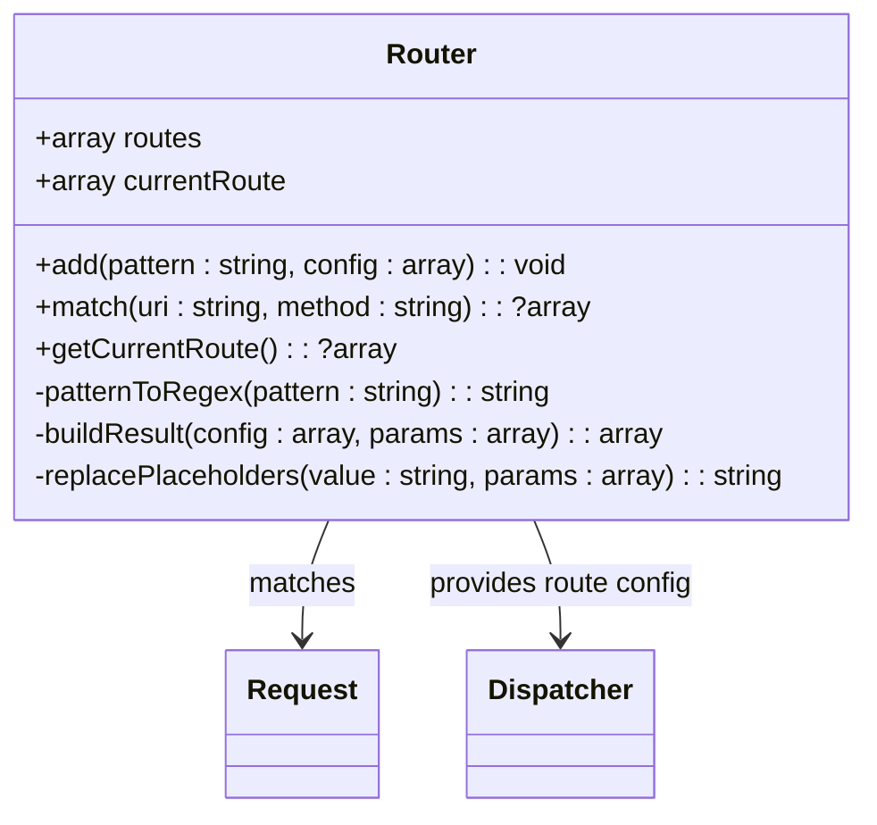
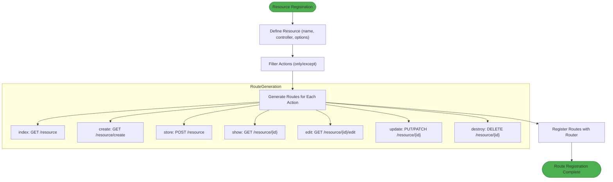
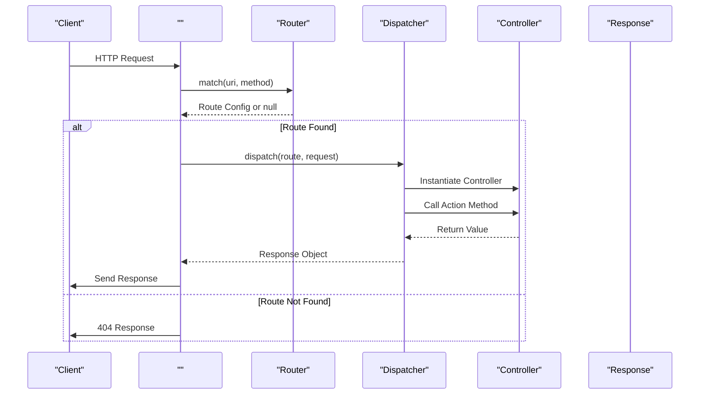
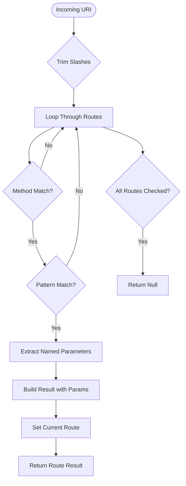
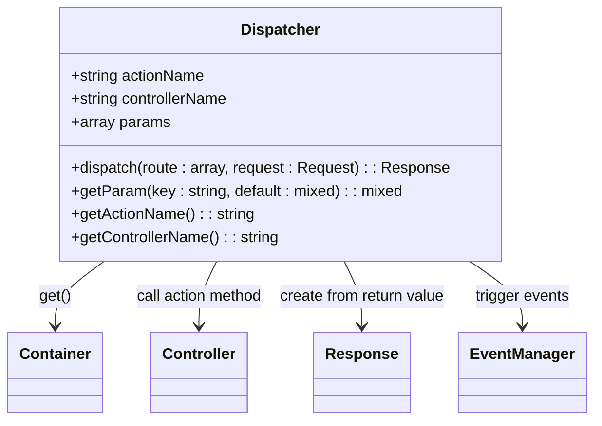

# Routing

<cite>
**Referenced Files in This Document**   
- [Router.php](file://app/Core/Mvc/Router.php)
- [ResourceRouter.php](file://app/Core/Mvc/ResourceRouter.php)
- [Dispatcher.php](file://app/Core/Mvc/Dispatcher.php)
- [.php](file://app/Core/Mvc/.php)
- [UserResourceController.php](file://app/Module/Admin/Controller/UserResourceController.php)
- [Task.php](file://app/Module/Admin/Controller/Task.php)
</cite>

## Table of Contents
1. [Introduction](#introduction)
2. [Core Routing Components](#core-routing-components)
3. [Router Implementation](#router-implementation)
4. [Resource-Based Routing](#resource-based-routing)
5. [Routing Flow and Dispatch Process](#routing-flow-and-dispatch-process)
6. [Route Matching Algorithm](#route-matching-algorithm)
7. [Dispatcher and Controller Execution](#dispatcher-and-controller-execution)
8. [Practical Usage Examples](#practical-usage-examples)
9. [Conclusion](#conclusion)

## Introduction
This document provides a comprehensive analysis of the routing system in the PHP application framework. The routing mechanism serves as the entry point for HTTP requests, mapping URLs to appropriate controller actions. The system combines a flexible pattern-based router with a resource-oriented router that automatically generates CRUD routes, following RESTful conventions and enabling rapid development of web applications and APIs.

## Core Routing Components
The routing system consists of three main components working together: the Router, the ResourceRouter, and the Dispatcher. These components are orchestrated by the  class to handle incoming requests and route them to the appropriate controller actions.

```mermaid
graph TB
Request --> 
 --> Router
Router --> |Matched Route| Dispatcher
Dispatcher --> Controller
Controller --> Response
ResourceRouter --> |Generates Routes| Router
classDef component fill:#f9f,stroke:#333;
class ,Router,Dispatcher,ResourceRouter component;
```

**Diagram sources**
- [.php](file://app/Core/Mvc/.php#L0-L70)
- [Router.php](file://app/Core/Mvc/Router.php#L0-L91)
- [Dispatcher.php](file://app/Core/Mvc/Dispatcher.php#L0-L83)
- [ResourceRouter.php](file://app/Core/Mvc/ResourceRouter.php#L0-L188)

**Section sources**
- [.php](file://app/Core/Mvc/.php#L0-L70)
- [Router.php](file://app/Core/Mvc/Router.php#L0-L91)
- [Dispatcher.php](file://app/Core/Mvc/Dispatcher.php#L0-L83)

## Router Implementation
The Router class is responsible for matching incoming HTTP requests to route configurations. It uses regular expressions to match URL patterns and supports named parameters, wildcards, and HTTP method constraints. The router converts URL patterns into regex patterns and extracts parameters from the matched segments.



**Diagram sources**
- [Router.php](file://app/Core/Mvc/Router.php#L0-L91)

**Section sources**
- [Router.php](file://app/Core/Mvc/Router.php#L0-L91)

## Resource-Based Routing
The ResourceRouter provides a higher-level abstraction for defining CRUD routes following RESTful conventions. It automatically generates standard routes for common operations (index, create, store, show, edit, update, destroy) based on resource names and controller classes. This eliminates repetitive route definitions and enforces consistent API design.



**Diagram sources**
- [ResourceRouter.php](file://app/Core/Mvc/ResourceRouter.php#L0-L188)

**Section sources**
- [ResourceRouter.php](file://app/Core/Mvc/ResourceRouter.php#L0-L188)

## Routing Flow and Dispatch Process
The complete routing and dispatch process involves multiple components working in sequence to handle an HTTP request. The  receives the request, uses the Router to find a matching route, and then delegates to the Dispatcher to execute the appropriate controller action.



**Diagram sources**
- [.php](file://app/Core/Mvc/.php#L0-L70)
- [Router.php](file://app/Core/Mvc/Router.php#L0-L91)
- [Dispatcher.php](file://app/Core/Mvc/Dispatcher.php#L0-L83)

**Section sources**
- [.php](file://app/Core/Mvc/.php#L0-L70)
- [Router.php](file://app/Core/Mvc/Router.php#L0-L91)
- [Dispatcher.php](file://app/Core/Mvc/Dispatcher.php#L0-L83)

## Route Matching Algorithm
The Router uses a pattern-to-regex conversion algorithm to match incoming URLs against defined routes. It supports named parameters (enclosed in curly braces) and wildcards, converting them to appropriate regex patterns. The algorithm also handles HTTP method constraints and extracts named parameters from the URL for use in controller actions.



**Diagram sources**
- [Router.php](file://app/Core/Mvc/Router.php#L0-L91)

**Section sources**
- [Router.php](file://app/Core/Mvc/Router.php#L0-L91)

## Dispatcher and Controller Execution
The Dispatcher component is responsible for executing the controller action once a route has been matched. It uses the DI container to instantiate the controller, calls the appropriate action method (with 'Action' suffix), and handles the return value by converting it to an appropriate Response object. The Dispatcher also manages controller lifecycle events and parameter injection.



**Diagram sources**
- [Dispatcher.php](file://app/Core/Mvc/Dispatcher.php#L0-L83)

**Section sources**
- [Dispatcher.php](file://app/Core/Mvc/Dispatcher.php#L0-L83)

## Practical Usage Examples
The routing system supports both manual route definition and automatic resource-based route generation. The ResourceRouter can create complete CRUD routes with a single method call, while also supporting API-specific routes that exclude form-related actions like 'create' and 'edit'.

```mermaid
flowchart LR
A[ResourceRouter] --> B["resource('users', 'UserController')"]
A --> C["apiResource('api/users', 'UserController')"]
A --> D["nestedResource('posts', 'comments', 'CommentController')"]
B --> E[Generates 7 CRUD routes]
C --> F[Generates 5 API routes<br>(excludes create/edit)]
D --> G[Generates nested routes<br>/posts/{post_id}/comments/{id}]
E --> Router
F --> Router
G --> Router
classDef example fill:#2196F3,stroke:#1976D2;
class B,C,D example;
```

**Diagram sources**
- [ResourceRouter.php](file://app/Core/Mvc/ResourceRouter.php#L0-L188)
- [UserResourceController.php](file://app/Module/Admin/Controller/UserResourceController.php#L0-L72)

**Section sources**
- [ResourceRouter.php](file://app/Core/Mvc/ResourceRouter.php#L0-L188)
- [UserResourceController.php](file://app/Module/Admin/Controller/UserResourceController.php#L0-L72)

## Conclusion
The routing system in this PHP framework provides a robust and flexible foundation for handling HTTP requests. By combining a low-level pattern-matching router with a high-level resource-based router, it supports both fine-grained control over individual routes and rapid development of RESTful APIs and CRUD interfaces. The integration with the Dispatcher and DI container enables clean separation of concerns and promotes maintainable code organization. This routing architecture follows modern PHP practices while maintaining simplicity and performance.