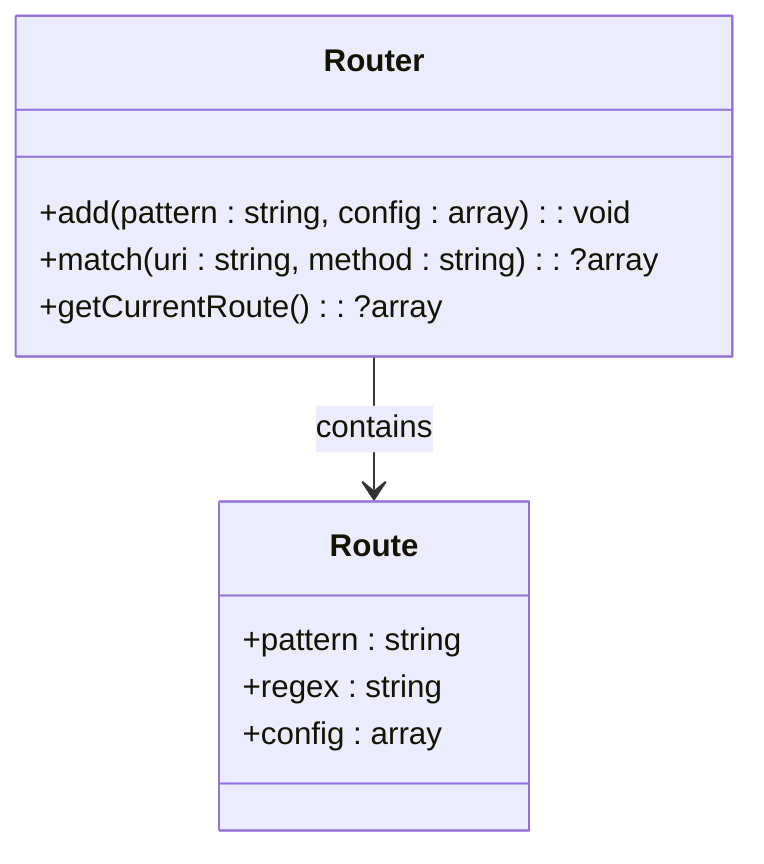
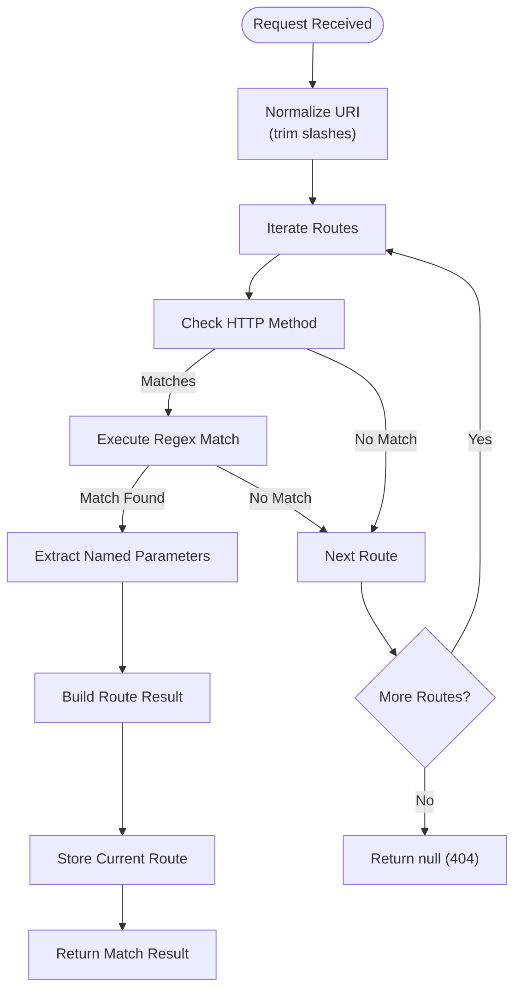
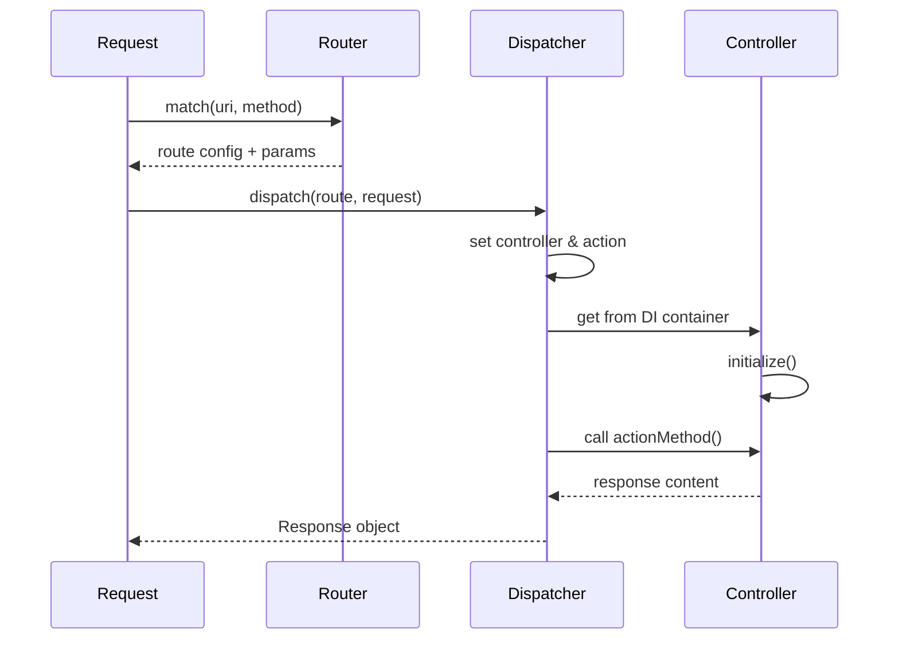

# Routing

<cite>
**Referenced Files in This Document**   
- [config.php](file://app/config.php)
- [Router.php](file://app/Core/Mvc/Router.php)
- [Dispatcher.php](file://app/Core/Mvc/Dispatcher.php)
- [User.php](file://app/Module/Admin/Controller/User.php)
- [Task.php](file://app/Module/Admin/Controller/Task.php)
- [bootstrap.php](file://app/bootstrap.php)
</cite>

## Table of Contents
1. [Introduction](#introduction)
2. [Route Definition in Configuration](#route-definition-in-configuration)
3. [Router Class Implementation](#router-class-implementation)
4. [Route Matching and Parameter Extraction](#route-matching-and-parameter-extraction)
5. [HTTP Method Constraints](#http-method-constraints)
6. [Route Types and Usage Examples](#route-types-and-usage-examples)
7. [Integration with Dispatcher](#integration-with-dispatcher)
8. [Internal Mechanics of Route Compilation](#internal-mechanics-of-route-compilation)
9. [Common Issues and Best Practices](#common-issues-and-best-practices)
10. [Performance Optimization Tips](#performance-optimization-tips)

## Introduction
This document provides a comprehensive overview of the routing system in the application. It explains how routes are defined, matched, and dispatched to appropriate controllers and actions. The routing mechanism is central to request handling, enabling clean URL patterns, parameterized routes, and RESTful design. The system leverages configuration-driven route definitions and a robust matching algorithm based on regular expressions.

## Route Definition in Configuration

Routes are defined in the `config.php` file under the `'modules' => 'routes'` configuration section. Each module (e.g., `base`, `admin`) can define its own set of routes as key-value pairs where the key is the URL pattern and the value contains the controller, action, and optional HTTP method.

The configuration supports:
- Static routes (e.g., `/admin/users`)
- Parameterized routes using `{param}` syntax (e.g., `/admin/user-edit/{id}`)
- HTTP method constraints via the `method` key

These routes are loaded during application bootstrap and registered with the `Router` instance.

**Section sources**
- [config.php](file://app/config.php#L50-L99)

## Router Class Implementation

The `Router` class (`Core\Mvc\Router`) is responsible for managing route definitions and matching incoming requests. It maintains an internal array of routes, each containing:
- Original pattern
- Compiled regular expression
- Configuration (controller, action, method)

New routes are added via the `add()` method, which converts the URL pattern into a regex using `patternToRegex()`.



**Diagram sources**
- [Router.php](file://app/Core/Mvc/Router.php#L10-L25)

**Section sources**
- [Router.php](file://app/Core/Mvc/Router.php#L10-L91)

## Route Matching and Parameter Extraction

When a request arrives, the `match()` method iterates through all registered routes and attempts to match the URI against each route's regex pattern. The matching process includes:

1. Trimming leading/trailing slashes from the URI
2. Checking HTTP method constraint (if specified)
3. Executing regex match using `preg_match()`
4. Extracting named parameters using named capture groups
5. Filtering results to retain only string-keyed matches (named parameters)

For example, a request to `/admin/user-edit/123` matches the pattern `/admin/user-edit/{id}` and extracts `['id' => '123']`.



**Diagram sources**
- [Router.php](file://app/Core/Mvc/Router.php#L27-L43)

**Section sources**
- [Router.php](file://app/Core/Mvc/Router.php#L27-L43)

## HTTP Method Constraints

Routes can optionally specify an HTTP method constraint using the `method` key in the route configuration. If present, the router checks whether the incoming request method matches (case-insensitive) before attempting a regex match.

For example:
```php
'/' => [
    'controller' => 'Module\Base\Controller\Dashboard',
    'action' => 'index',
    'method'     => 'GET'
]
```

This ensures that only GET requests to `/` will be routed to the Dashboard controller's index action.

**Section sources**
- [config.php](file://app/config.php#L58-L60)
- [Router.php](file://app/Core/Mvc/Router.php#L31-L33)

## Route Types and Usage Examples

### Static Routes
Used for fixed endpoints with no dynamic segments:
- `/admin/users` → User controller, index action
- `/admin/tasks` → Task controller, index action

### Parameterized Routes
Use `{param}` syntax to capture dynamic values:
- `/admin/user-edit/{id}` → Captures `id` parameter
- `/admin/task-delete/{id}` → Captures `id` parameter

These parameters are passed to the controller via the dispatcher.

### RESTful Patterns
The system supports REST-like routing patterns:
- `GET /admin/users` → List users
- `GET /admin/user-create` → Show create form
- `POST /admin/user-create` → Handle form submission
- `GET /admin/user-edit/{id}` → Show edit form
- `POST /admin/user-edit/{id}` → Handle update

Example from Admin module:
```php
'/admin/user-edit/{id}' => [
    'controller' => 'Module\Admin\Controller\User',
    'action' => 'edit'
]
```

**Section sources**
- [config.php](file://app/config.php#L70-L97)
- [User.php](file://app/Module/Admin/Controller/User.php#L20-L81)
- [Task.php](file://app/Module/Admin/Controller/Task.php#L20-L76)

## Integration with Dispatcher

After a successful route match, the result is passed to the `Dispatcher` class, which:
1. Instantiates the specified controller using the DI container
2. Calls the `initialize()` method if it exists
3. Invokes the specified action method (e.g., `editAction`)
4. Passes parameters via the dispatcher's parameter store

The dispatcher retrieves route parameters using `getParam()`, as seen in the `User` and `Task` controllers:

```php
$id = $this->getDI()->get('dispatcher')->getParam('id');
```



**Diagram sources**
- [Router.php](file://app/Core/Mvc/Router.php#L27-L43)
- [Dispatcher.php](file://app/Core/Mvc/Dispatcher.php#L15-L55)

**Section sources**
- [Dispatcher.php](file://app/Core/Mvc/Dispatcher.php#L15-L83)
- [User.php](file://app/Module/Admin/Controller/User.php#L30-L31)
- [Task.php](file://app/Module/Admin/Controller/Task.php#L25-L26)

## Internal Mechanics of Route Compilation

The `patternToRegex()` method transforms route patterns into regular expressions:

1. **Pattern Normalization**: Trims slashes and escapes special regex characters
2. **Wildcard Support**: Converts `*` to `.*` for flexible matching
3. **Parameter Conversion**: Transforms `{id}` into `(?P<id>[^/]+)` named capture group
4. **Regex Wrapping**: Encloses pattern with `#^...$#` delimiters

For example:
- Pattern: `/admin/user-edit/{id}`
- Regex: `#^admin/user-edit/(?P<id>[^/]+)$#`

The `buildResult()` method merges route configuration with extracted parameters, replacing any placeholders in controller or action names if needed.

**Section sources**
- [Router.php](file://app/Core/Mvc/Router.php#L55-L91)

## Common Issues and Best Practices

### Route Ordering
Routes are matched in the order they are defined. More specific routes should be defined before general ones to prevent premature matching.

### Parameter Validation
Always validate and sanitize route parameters in the controller. The router does not perform validation—only extraction.

### 404 Handling
When no route matches, `match()` returns `null`. This should be handled by the application to return a proper 404 response.

### Missing Actions
Ensure that the specified action method (e.g., `editAction`) exists in the target controller, or a runtime exception will be thrown.

**Section sources**
- [Router.php](file://app/Core/Mvc/Router.php#L38-L43)
- [Dispatcher.php](file://app/Core/Mvc/Dispatcher.php#L35-L40)

## Performance Optimization Tips

- **Minimize Complex Regex**: Avoid overly complex patterns with many optional segments or lookaheads
- **Limit Route Count**: Keep the number of registered routes manageable to reduce iteration time
- **Cache Route Collections**: In production, consider pre-compiling and caching route regex patterns
- **Use Specific Patterns**: Prefer specific patterns over generic wildcards to reduce false matches
- **Avoid Redundant Routes**: Eliminate duplicate or overlapping route definitions

During bootstrap, all routes from `config.php` are pre-loaded into the router, minimizing runtime configuration overhead.

**Section sources**
- [bootstrap.php](file://app/bootstrap.php#L38-L56)
- [Router.php](file://app/Core/Mvc/Router.php#L15-L24)