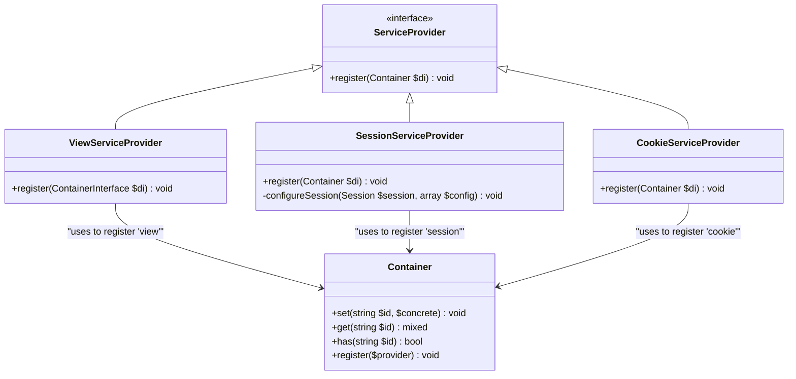
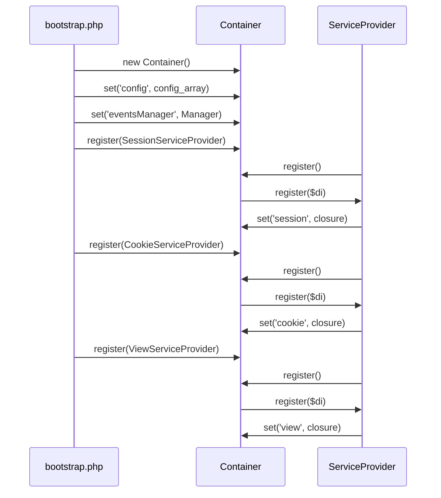

# Service Providers

<cite>
**Referenced Files in This Document**   
- [ServiceProvider.php](file://app/Core/Di/Interface/ServiceProvider.php)
- [Container.php](file://app/Core/Di/Container.php)
- [bootstrap.php](file://app/bootstrap.php)
- [config.php](file://app/config.php)
- [ViewServiceProvider.php](file://app/Module/Provider/ViewServiceProvider.php)
- [SessionServiceProvider.php](file://app/Module/Provider/SessionServiceProvider.php)
- [CookieServiceProvider.php](file://app/Module/Provider/CookieServiceProvider.php)
</cite>

## Table of Contents
1. [Introduction](#introduction)
2. [ServiceProvider Interface and register() Method](#serviceprovider-interface-and-register-method)
3. [Built-in Service Providers](#built-in-service-providers)
4. [Service Registration in bootstrap.php](#service-registration-in-bootstrapphp)
5. [Service Lifecycle Management](#service-lifecycle-management)
6. [Dependency Ordering and Provider Loading](#dependency-ordering-and-provider-loading)
7. [Common Issues and Troubleshooting](#common-issues-and-troubleshooting)
8. [Creating Custom Service Providers](#creating-custom-service-providers)
9. [Registering Third-Party Libraries](#registering-third-party-libraries)
10. [Conclusion](#conclusion)

## Introduction
Service providers are a fundamental extension mechanism in the dependency injection (DI) container system. They encapsulate the configuration and registration logic for services, promoting modularity, reusability, and clean bootstrapping. This document explains the `ServiceProvider` interface, demonstrates its use through built-in providers, and provides guidance on creating custom providers for application-specific or third-party services.

**Section sources**
- [ServiceProvider.php](file://app/Core/Di/Interface/ServiceProvider.php)
- [bootstrap.php](file://app/bootstrap.php)

## ServiceProvider Interface and register() Method
The `ServiceProvider` interface defines a contract for service registration components. It contains a single method, `register()`, which receives the DI container instance as a parameter. This method is responsible for defining how services should be created and configured within the container.

When a provider is registered via `$di->register()`, the container checks if the object has a `register` method and invokes it, passing itself as the argument. This allows the provider to use the container's `set()` method to define services, often using closures for lazy instantiation.

```mermaid
flowchart TD
A["$di->register($provider)"] --> B{is_string($provider)?}
B --> |Yes| C["$provider = $this->build($provider)"]
B --> |No| D{method_exists($provider, 'register')?}
C --> D
D --> |No| E[No action]
D --> |Yes| F["$provider->register($this)"]
F --> G[Provider configures services in container]
```

**Diagram sources**
- [Container.php](file://app/Core/Di/Container.php#L135-L143)
- [ServiceProvider.php](file://app/Core/Di/Interface/ServiceProvider.php#L7-L10)

**Section sources**
- [Container.php](file://app/Core/Di/Container.php#L135-L143)
- [ServiceProvider.php](file://app/Core/Di/Interface/ServiceProvider.php#L7-L10)

## Built-in Service Providers
The application includes several service providers that encapsulate the configuration of core services. These providers follow a consistent pattern: they define a closure for a service that retrieves configuration, instantiates the service, injects the DI container, and optionally attaches an events manager.

### ViewServiceProvider
Registers the `view` service by reading view configuration (template path and layout), creating a `View` instance, and setting up DI and event integration.

### SessionServiceProvider
Registers the `session` service. It retrieves session configuration, creates a `Session` object, and injects DI and events. A protected `configureSession` method is defined for future use in applying configuration settings.

### CookieServiceProvider
Registers the `cookie` service. It reads cookie configuration, instantiates the `Cookie` class with defaults, and injects DI and events capabilities.



**Diagram sources**
- [ViewServiceProvider.php](file://app/Module/Provider/ViewServiceProvider.php#L8-L26)
- [SessionServiceProvider.php](file://app/Module/Provider/SessionServiceProvider.php#L8-L54)
- [CookieServiceProvider.php](file://app/Module/Provider/CookieServiceProvider.php#L8-L25)
- [Container.php](file://app/Core/Di/Container.php#L14-L144)

**Section sources**
- [ViewServiceProvider.php](file://app/Module/Provider/ViewServiceProvider.php#L8-L26)
- [SessionServiceProvider.php](file://app/Module/Provider/SessionServiceProvider.php#L8-L54)
- [CookieServiceProvider.php](file://app/Module/Provider/CookieServiceProvider.php#L8-L25)

## Service Registration in bootstrap.php
The `bootstrap.php` file is the entry point for service registration. It creates the DI container, sets basic services like `config`, and then registers service providers using `$di->register()`. The order of registration is significant, as later services may depend on earlier ones.

For example, the `ViewServiceProvider` can access the `config` and `eventsManager` services because they are registered before the provider is invoked. This file serves as the central configuration point for the application's service ecosystem.



**Diagram sources**
- [bootstrap.php](file://app/bootstrap.php#L0-L56)
- [Container.php](file://app/Core/Di/Container.php#L135-L143)

**Section sources**
- [bootstrap.php](file://app/bootstrap.php#L0-L56)

## Service Lifecycle Management
Services in the container can be managed as shared (singleton) or transient instances. When a service is defined with a closure via `set()`, it is typically instantiated only once upon first retrieval and then cached in `$instances`. Subsequent calls to `get()` return the same instance, making it shared by default.

To create a transient service (a new instance each time), the provider would need to define a factory method or use a different registration pattern. The lifecycle is managed internally by the container through its `$instances`, `$factories`, and `$definitions` arrays.

**Section sources**
- [Container.php](file://app/Core/Di/Container.php#L14-L144)

## Dependency Ordering and Provider Loading
The order in which providers are registered in `bootstrap.php` determines the availability of services to subsequent providers. Services like `config` and `eventsManager` are registered directly before any providers, ensuring they are available for injection.

Circular dependencies should be avoided. For example, a service should not depend on another service that, directly or indirectly, depends back on it. The container resolves dependencies via constructor injection using reflection, and circular references will result in resolution failures.

**Section sources**
- [bootstrap.php](file://app/bootstrap.php#L0-L56)
- [Container.php](file://app/Core/Di/Container.php#L88-L128)

## Common Issues and Troubleshooting
- **Service Resolution Failures**: Occur when a requested service is not registered or cannot be instantiated (e.g., missing class). Ensure the service is registered and the class exists.
- **Circular Dependencies**: Arise when two services depend on each other. Refactor to use setter injection or event-driven communication.
- **Provider Loading Order**: If a provider depends on a service not yet registered, move its registration later or register the dependency first.
- **Configuration Errors**: Verify that required configuration values exist in `config.php` and are correctly accessed within provider closures.

**Section sources**
- [Container.php](file://app/Core/Di/Container.php#L135-L143)
- [config.php](file://app/config.php#L0-L99)

## Creating Custom Service Providers
To create a custom provider, implement the `ServiceProvider` interface and define the `register()` method. For example, a `LoggingServiceProvider` could register a logger service:

```php
class LoggingServiceProvider implements ServiceProvider
{
    public function register(Container $di): void
    {
        $di->set('logger', function() use ($di) {
            $config = $di->get('config')['logging'] ?? [];
            $logger = new FileLogger($config['path'] ?? '/logs/app.log');
            $logger->setDI($di);
            if ($di->has('eventsManager')) {
                $logger->setEventsManager($di->get('eventsManager'));
            }
            return $logger;
        });
    }
}
```

Register it in `bootstrap.php` alongside other providers.

**Section sources**
- [ServiceProvider.php](file://app/Core/Di/Interface/ServiceProvider.php#L7-L10)
- [bootstrap.php](file://app/bootstrap.php#L0-L56)

## Registering Third-Party Libraries
Third-party libraries can be integrated by creating service providers that instantiate and configure them. For example, a `RedisServiceProvider` could register a Redis client using configuration values. The provider pattern abstracts the complexity of library setup, making it easy to swap implementations or configure based on environment.

**Section sources**
- [examples/using-di.php](file://examples/using-di.php#L145-L200)

## Conclusion
Service providers are a powerful mechanism for organizing and registering services in the DI container. By encapsulating configuration logic, they promote clean, modular, and maintainable application architecture. Understanding how to use and create providers is essential for extending the framework with custom or third-party services.