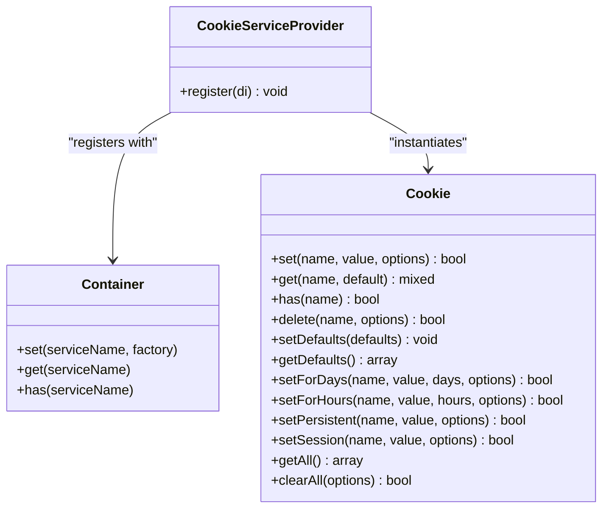
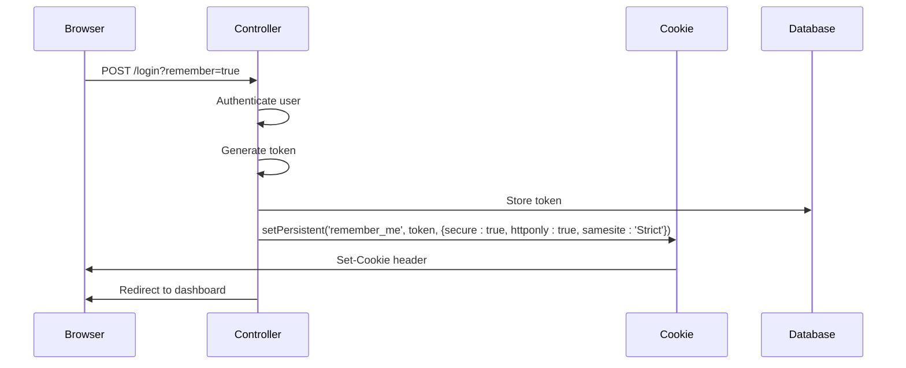

# Cookie Handling

<cite>
**Referenced Files in This Document**   
- [Cookie.php](file://app/Core/Cookie/Cookie.php)
- [CookieInterface.php](file://app/Core/Cookie/CookieInterface.php)
- [CookieServiceProvider.php](file://app/Module/Provider/CookieServiceProvider.php)
- [config.php](file://app/config.php)
- [using-cookie-controller.php](file://examples/using-cookie-controller.php)
</cite>

## Table of Contents
1. [Introduction](#introduction)
2. [Core Components](#core-components)
3. [Configuration and Defaults](#configuration-and-defaults)
4. [Service Registration and Dependency Injection](#service-registration-and-dependency-injection)
5. [Public API Methods](#public-api-methods)
6. [Usage Examples in Controllers](#usage-examples-in-controllers)
7. [Integration with Session and Authentication](#integration-with-session-and-authentication)
8. [Security Considerations](#security-considerations)
9. [Troubleshooting Common Issues](#troubleshooting-common-issues)

## Introduction
The Cookie handling system provides a secure and flexible way to manage HTTP cookies within the application. It abstracts PHP's native `setcookie()` function with enhanced defaults, event support, and integration with the dependency injection container. The system is designed to prevent common security vulnerabilities such as XSS-based cookie theft and CSRF attacks through secure default settings. This document details the implementation, configuration, usage patterns, and best practices for working with cookies in this framework.

## Core Components

The cookie system is built around a central `Cookie` class that implements the `CookieInterface`. It leverages dependency injection and event-driven architecture to provide extensibility and integration with other components. The class handles setting, retrieving, and deleting cookies while ensuring secure defaults are applied.

**Section sources**
- [Cookie.php](file://app/Core/Cookie/Cookie.php#L7-L208)
- [CookieInterface.php](file://app/Core/Cookie/CookieInterface.php#L4-L12)

## Configuration and Defaults

Cookie behavior is configured through `config.php`, where default options such as expiration, path, domain, and security flags are defined. These defaults ensure secure cookie handling across the application.

```php
'cookie' => [
    'expires' => 30, // 30 days
    'path' => '/',
    'domain' => '',
    'secure' => false,
    'httponly' => true,
    'samesite' => 'Lax'
],
```

These configuration values are injected into the `Cookie` instance during service registration, overriding the class's internal defaults. The `SameSite=Lax` policy helps prevent CSRF attacks while allowing necessary cross-site requests for navigation, while `HttpOnly=true` prevents client-side JavaScript access to protect against XSS.

**Section sources**
- [config.php](file://app/config.php#L38-L44)

## Service Registration and Dependency Injection

The `CookieServiceProvider` registers the cookie service in the DI container, making it available for injection into controllers and other components. During registration, it retrieves configuration values and injects both the DI container and events manager if available.



**Diagram sources**
- [CookieServiceProvider.php](file://app/Module/Provider/CookieServiceProvider.php#L10-L25)
- [Cookie.php](file://app/Core/Cookie/Cookie.php#L7-L208)

**Section sources**
- [CookieServiceProvider.php](file://app/Module/Provider/CookieServiceProvider.php#L7-L25)

## Public API Methods

The `Cookie` class provides a comprehensive API for cookie management:

- `set(string $name, string $value, array $options = [])`: Sets a cookie with merged default and custom options
- `get(string $name, $default = null)`: Retrieves a cookie value with optional fallback
- `has(string $name)`: Checks if a cookie exists
- `delete(string $name, array $options = [])`: Removes a cookie by setting its expiration to the past
- `setForDays()`, `setForHours()`: Convenience methods for time-based expiration
- `setPersistent()`: Creates a long-lived cookie (1 year)
- `setSession()`: Creates a session cookie (expires when browser closes)
- `getAll()`: Returns all available cookies
- `clearAll()`: Deletes all cookies

All operations trigger corresponding events (`beforeSet`, `afterSet`, etc.) that can be intercepted by event listeners for logging, validation, or modification.

**Section sources**
- [Cookie.php](file://app/Core/Cookie/Cookie.php#L25-L208)

## Usage Examples in Controllers

The `using-cookie-controller.php` example demonstrates practical cookie usage in authentication and user preference scenarios. In the "remember me" flow, a persistent cookie is set with strict security settings when HTTPS is available:



**Diagram sources**
- [using-cookie-controller.php](file://examples/using-cookie-controller.php#L34-L68)

For user preferences, cookies store UI settings like theme and language, providing a personalized experience across sessions.

**Section sources**
- [using-cookie-controller.php](file://examples/using-cookie-controller.php#L66-L99)

## Integration with Session and Authentication

Cookies work in tandem with the session system for authentication. During login, user data is stored in the session while a "remember me" token is stored in a persistent cookie. The session cookie itself is configured through `config.php` with matching security settings:

```php
'session' => [
    'cookie_secure' => false,
    'cookie_httponly' => true
],
```

This integration ensures that even if sessions expire, users can be automatically re-authenticated via the remember-me cookie, while maintaining security through token validation and database storage.

**Section sources**
- [config.php](file://app/config.php#L30-L36)
- [using-cookie-controller.php](file://examples/using-cookie-controller.php#L34-L68)
- [Session.php](file://app/Core/Session/Session.php#L0-L158)

## Security Considerations

The cookie system addresses several key security concerns:

- **XSS Protection**: `HttpOnly` flag prevents JavaScript access to cookie values
- **CSRF Protection**: `SameSite=Lax` (default) or `Strict` policies mitigate cross-site request forgery
- **Secure Transmission**: `Secure` flag ensures cookies are only sent over HTTPS
- **Domain Isolation**: Proper domain and path settings prevent unauthorized access
- **Event Hooks**: Before/after events allow for monitoring and validation

When deploying to production, the `secure` flag should be enabled to ensure cookies are only transmitted over encrypted connections. For applications requiring stricter security, `SameSite=Strict` can be used, though this may affect usability when navigating from external sites.

**Section sources**
- [Cookie.php](file://app/Core/Cookie/Cookie.php#L15-L20)
- [config.php](file://app/config.php#L42-L44)

## Troubleshooting Common Issues

Common issues and their solutions:

- **Cookies not being set**: Ensure no output has been sent before calling `set()` as headers must be sent first. Check for whitespace or echo statements before PHP tags.
- **Domain mismatches**: Verify the `domain` option matches the current host exactly, including subdomains if applicable.
- **HTTPS requirements**: When `secure=true`, cookies will not be sent over HTTP connections.
- **Path restrictions**: Cookies set on `/admin` won't be available on `/public`; use `/` for site-wide access.
- **Browser limitations**: Some browsers block `SameSite=None` cookies without `Secure` flag.

The event system can be used to debug cookie operations by listening to `cookie:beforeSet` and `cookie:afterSet` events to inspect parameters and results.

**Section sources**
- [Cookie.php](file://app/Core/Cookie/Cookie.php#L25-L123)
- [using-cookie-controller.php](file://examples/using-cookie-controller.php#L34-L68)