# Session & Cookies

<cite>
**Referenced Files in This Document**   
- [config.php](file://app/config.php)
- [Session.php](file://app/Core/Session/Session.php)
- [SessionInterface.php](file://app/Core/Session/SessionInterface.php)
- [Cookie.php](file://app/Core/Cookie/Cookie.php)
- [CookieInterface.php](file://app/Core/Cookie/CookieInterface.php)
- [SessionServiceProvider.php](file://app/Module/Provider/SessionServiceProvider.php)
- [CookieServiceProvider.php](file://app/Module/Provider/CookieServiceProvider.php)
- [bootstrap.php](file://app/bootstrap.php)
- [using-cookie-controller.php](file://examples/using-cookie-controller.php)
</cite>

## Table of Contents
1. [Introduction](#introduction)
2. [Session Management](#session-management)
3. [Flash Messages Pattern](#flash-messages-pattern)
4. [Cookie Handling](#cookie-handling)
5. [Service Providers Registration](#service-providers-registration)
6. [Usage Examples](#usage-examples)
7. [Security Best Practices](#security-best-practices)
8. [Common Issues and Solutions](#common-issues-and-solutions)

## Introduction
This document provides a comprehensive overview of session and cookie management within the application framework. It details the implementation of the Session and Cookie classes, their configuration through `config.php`, integration via service providers, and practical usage patterns. Special attention is given to security considerations and common implementation challenges.

## Session Management

The Session class (`Session.php`) implements the `SessionInterface` and provides a robust interface for managing user sessions. Sessions are automatically started upon instantiation if not already active, ensuring consistent availability across requests.

Configuration options for sessions are defined in `config.php` under the `session` key:
- **name**: Cookie name for the session (default: `MYAPP_SESSID`)
- **lifetime**: Session garbage collection lifetime in seconds (default: 3600)
- **cookie_lifetime**: Lifetime of the session cookie (default: 3600)
- **cookie_path**: Path on the server in which the cookie will be available (default: `/`)
- **cookie_domain**: Domain that the cookie is available to (default: empty)
- **cookie_secure**: Whether the cookie should only be sent over secure connections (default: `false`)
- **cookie_httponly**: Whether the cookie should be accessible only through HTTP (default: `true`)

Although the configuration is defined, the `configureSession` method in `SessionServiceProvider.php` is currently commented out, meaning these settings are not actively applied at runtime.


**Diagram sources**
- [Session.php](file://app/Core/Session/Session.php#L1-L159)
- [SessionInterface.php](file://app/Core/Session/SessionInterface.php#L1-L24)

**Section sources**
- [Session.php](file://app/Core/Session/Session.php#L1-L159)
- [config.php](file://app/config.php#L25-L33)

## Flash Messages Pattern

The framework implements a flash messaging system for temporary session data that persists for exactly one subsequent request. This pattern is ideal for displaying success, error, or informational messages after form submissions or redirects.

Flash messages are stored in the session under the `_flash` key with two sub-keys:
- `new`: Messages set in the current request
- `old`: Messages promoted from the previous request's `new` bucket

During object destruction (`__destruct`), new flash messages are moved to the old bucket, making them available for the next request. When `getFlash()` is called, the value is retrieved and immediately removed to prevent reuse.

This implementation ensures messages are displayed only once, following the standard flash message pattern used in many web frameworks.

```mermaid
flowchart TD
A["Controller sets flash message"] --> B["Message stored in _flash.new"]
B --> C["Request completes"]
C --> D["__destruct() moves new → old"]
D --> E["Next request: getFlash() retrieves from _flash.old"]
E --> F["Message automatically removed after retrieval"]
```



**Diagram sources**
- [Session.php](file://app/Core/Session/Session.php#L89-L113)
- [Session.php](file://app/Core/Session/Session.php#L154-L158)

**Section sources**
- [Session.php](file://app/Core/Session/Session.php#L89-L113)

## Cookie Handling

The Cookie class provides a secure and configurable interface for cookie operations. It implements `CookieInterface` and supports modern security features including SameSite, HttpOnly, and Secure flags.

Default cookie settings are configured in `config.php`:
- **expires**: Default expiration in days (30)
- **path**: Cookie path (default: `/`)
- **domain**: Cookie domain (default: empty)
- **secure**: Whether cookies require HTTPS (default: `false`)
- **httponly**: Whether cookies are accessible only via HTTP (default: `true`)
- **samesite**: SameSite policy (default: `Lax`)

The Cookie class provides convenience methods for common scenarios:
- `setPersistent()`: Sets a cookie that expires in 1 year
- `setForDays()`/`setForHours()`: Sets cookies with time-based expiration
- `setSession()`: Creates a session cookie that expires when the browser closes

All cookie operations support event dispatching (`cookie:beforeSet`, `cookie:afterSet`, etc.) and can be intercepted or modified by event listeners.


**Diagram sources**
- [Cookie.php](file://app/Core/Cookie/Cookie.php#L1-L209)
- [CookieInterface.php](file://app/Core/Cookie/CookieInterface.php#L1-L13)

**Section sources**
- [Cookie.php](file://app/Core/Cookie/Cookie.php#L1-L209)
- [config.php](file://app/config.php#L35-L42)

## Service Providers Registration

Session and Cookie services are registered through dedicated service providers that integrate with the Dependency Injection (DI) container.

The `SessionServiceProvider` registers the `session` service as a closure that:
1. Retrieves configuration from the DI container
2. Instantiates the Session object
3. Injects the DI container and events manager (if available)
4. Returns the configured session instance

Similarly, the `CookieServiceProvider` registers the `cookie` service by:
1. Retrieving cookie configuration
2. Passing configuration to the Cookie constructor as defaults
3. Injecting DI and events dependencies
4. Returning the configured cookie instance

Both services are registered in `bootstrap.php` during application initialization, making them available throughout the application lifecycle.


**Diagram sources**
- [SessionServiceProvider.php](file://app/Module/Provider/SessionServiceProvider.php#L1-L55)
- [CookieServiceProvider.php](file://app/Module/Provider/CookieServiceProvider.php#L1-L26)
- [bootstrap.php](file://app/bootstrap.php#L40-L42)

**Section sources**
- [SessionServiceProvider.php](file://app/Module/Provider/SessionServiceProvider.php#L1-L55)
- [CookieServiceProvider.php](file://app/Module/Provider/CookieServiceProvider.php#L1-L26)

## Usage Examples

### Setting and Retrieving Session Data
```php
// Set user data in session
$this->session->set('user', ['id' => 123, 'username' => 'john_doe']);

// Retrieve session data with default fallback
$username = $this->session->get('user.username', 'Guest');

// Check if session key exists
if ($this->session->has('user')) {
    // User is authenticated
}
```

### Flash Messages in Authentication Flow
```php
// After successful login
$this->session->flash('success', 'Login successful!');

// After failed login
$this->session->flash('error', 'Invalid credentials');

// Redirect - message will be available in next request
return $this->redirect('/dashboard');
```

### Cookie Operations
```php
// Set user preferences
$this->cookie->set('theme', 'dark');
$this->cookie->set('language', 'en');

// Set secure persistent cookie
$this->cookie->setPersistent('remember_me', $token, [
    'httponly' => true,
    'secure' => true,
    'samesite' => 'Strict'
]);

// Retrieve cookie with default
$theme = $this->cookie->get('theme', 'light');

// Delete cookie
$this->cookie->delete('remember_me');
```

**Section sources**
- [using-cookie-controller.php](file://examples/using-cookie-controller.php#L34-L99)
- [Session.php](file://app/Core/Session/Session.php#L70-L88)
- [Cookie.php](file://app/Core/Cookie/Cookie.php#L45-L163)

## Security Best Practices

### Secure Cookie Configuration
- Always set `secure` flag to `true` in production to ensure cookies are only transmitted over HTTPS
- Use `httponly` to prevent client-side script access to sensitive cookies
- Implement appropriate SameSite policies:
  - `Strict`: Most secure, prevents CSRF but may affect usability
  - `Lax`: Good balance, allows safe cross-site GET requests
  - `None`: Required for cross-site embedding, must be used with `secure`

### Session Security
- Regenerate session ID after authentication to prevent session fixation
- Implement session timeout mechanisms
- Store sensitive data server-side rather than in session cookies
- Use secure session cookie names and paths

### Protection Against Session Fixation
```php
// After successful authentication
$oldId = $this->session->getId();
$this->session->destroy(); // Destroy old session
$this->session->start();   // Start new session with new ID
$this->session->set('user', $userData);
```

**Section sources**
- [config.php](file://app/config.php#L30-L33)
- [config.php](file://app/config.php#L39-L42)
- [using-cookie-controller.php](file://examples/using-cookie-controller.php#L45-L48)

## Common Issues and Solutions

### Session Persistence Across Requests
Ensure PHP session configuration aligns with application settings. Verify that session storage path is writable and that session cookies are being set with appropriate domain and path values.

### Cookie Domain Settings
When deploying to subdomains, explicitly set the `domain` configuration to `.example.com` (with leading dot) to make cookies available across all subdomains.

### Browser Compatibility with SameSite Policies
- Older browsers ignore SameSite attributes
- Safari has strict default policies
- Test thoroughly across target browsers
- Consider progressive enhancement strategies for legacy browser support

### Development vs Production Configuration
Maintain different cookie settings between environments:
```php
// Development
'secure' => false,  // Allow HTTP
'samesite' => 'Lax'

// Production  
'secure' => true,   // Require HTTPS
'samesite' => 'Strict'
```

**Section sources**
- [config.php](file://app/config.php#L25-L42)
- [using-cookie-controller.php](file://examples/using-cookie-controller.php#L45-L48)
- [Cookie.php](file://app/Core/Cookie/Cookie.php#L15-L25)