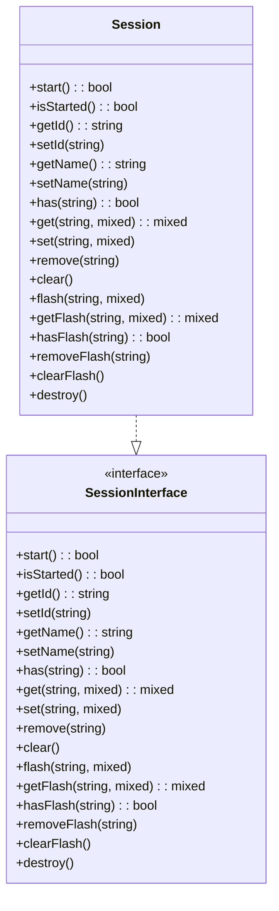
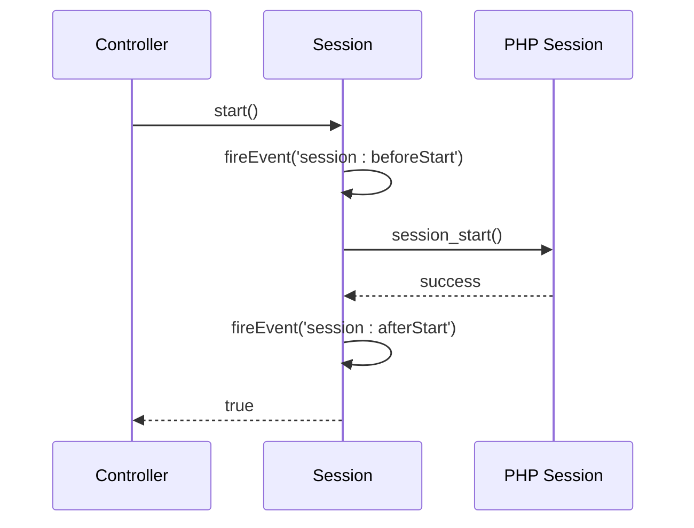
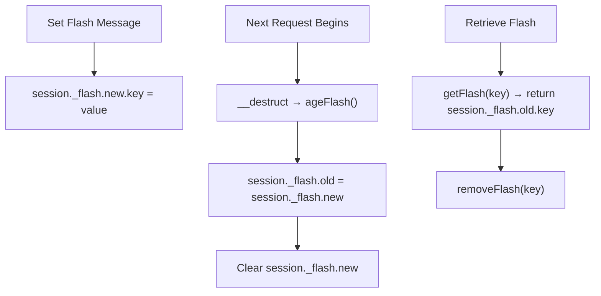
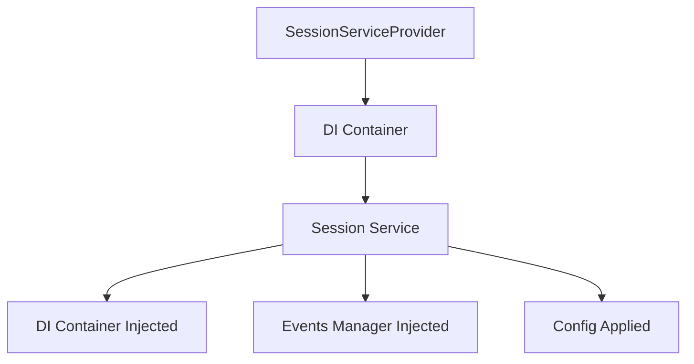

# Session Management

<cite>
**Referenced Files in This Document**   
- [Session.php](file://app/Core/Session/Session.php)
- [SessionInterface.php](file://app/Core/Session/SessionInterface.php)
- [SessionServiceProvider.php](file://app/Module/Provider/SessionServiceProvider.php)
- [config.php](file://app/config.php)
- [bootstrap.php](file://app/bootstrap.php)
- [Controller.php](file://app/Core/Mvc/Controller.php)
- [using-cookie-controller.php](file://examples/using-cookie-controller.php)
</cite>

## Table of Contents
1. [Introduction](#introduction)
2. [Session Initialization and Service Provider](#session-initialization-and-service-provider)
3. [Configuration Options](#configuration-options)
4. [Session Lifecycle Management](#session-lifecycle-management)
5. [Flash Message Mechanism](#flash-message-mechanism)
6. [Controller Integration and Usage Examples](#controller-integration-and-usage-examples)
7. [Dependency Injection and Service Integration](#dependency-injection-and-service-integration)
8. [Common Issues and Security Considerations](#common-issues-and-security-considerations)
9. [Best Practices](#best-practices)
10. [Conclusion](#conclusion)

## Introduction
The session management system in this framework provides a secure and flexible way to maintain user state across HTTP requests. Built on PHP's native session handling, it enhances functionality with dependency injection integration, event support, and a flash messaging system for transient user feedback. This document details the implementation, configuration, usage, and best practices for the session system.

## Session Initialization and Service Provider

The `Session` class is automatically initialized and managed through the `SessionServiceProvider`, which registers the session service within the dependency injection (DI) container. Upon registration, the service is defined as a closure that instantiates the `Session` object, configures it based on application settings, and injects required dependencies such as the DI container and events manager.

The `Session` class implements the `SessionInterface` and uses two traits: `Injectable` for DI integration and `EventAware` to support event dispatching during session lifecycle events such as start and destroy.



**Diagram sources**
- [Session.php](file://app/Core/Session/Session.php#L15-L158)
- [SessionInterface.php](file://app/Core/Session/SessionInterface.php#L5-L23)

**Section sources**
- [Session.php](file://app/Core/Session/Session.php#L15-L158)
- [SessionServiceProvider.php](file://app/Module/Provider/SessionServiceProvider.php#L10-L54)

## Configuration Options

Session behavior is configured via the `session` array in `config.php`. The framework supports several configuration options, including session name, lifetime, and cookie parameters. These settings are read during service registration and applied to the PHP runtime using `ini_set()`.

Key configuration options include:
- **name**: Custom session cookie name (e.g., `MYAPP_SESSID`)
- **lifetime**: Session garbage collection lifetime in seconds (e.g., 3600 for 1 hour)
- **cookie_lifetime**: Duration the session cookie persists in the browser
- **cookie_path** and **cookie_domain**: Scope of the cookie
- **cookie_secure**: Restricts cookie to HTTPS connections
- **cookie_httponly**: Prevents client-side script access to the cookie

Although the `configureSession` method in `SessionServiceProvider` is defined, it is currently commented out in the registration logic, meaning session configuration is not actively applied at runtime.

**Section sources**
- [config.php](file://app/config.php#L35-L43)
- [SessionServiceProvider.php](file://app/Module/Provider/SessionServiceProvider.php#L40-L54)

## Session Lifecycle Management

The session lifecycle is managed through explicit methods on the `Session` class:
- **start()**: Initializes the session if not already started, triggering `session:beforeStart` and `session:afterStart` events.
- **isStarted()**: Checks whether the session has been successfully started.
- **destroy()**: Ends the session, clears session data, and triggers `session:beforeDestroy` and `session:afterDestroy` events.

The constructor automatically starts the session if none is active, ensuring availability throughout the request lifecycle. Session data is stored in `$_SESSION`, with methods like `set()`, `get()`, `has()`, and `remove()` providing a clean interface for data manipulation.



**Diagram sources**
- [Session.php](file://app/Core/Session/Session.php#L25-L38)
- [Session.php](file://app/Core/Session/Session.php#L135-L145)

**Section sources**
- [Session.php](file://app/Core/Session/Session.php#L25-L38)
- [Session.php](file://app/Core/Session/Session.php#L135-L145)

## Flash Message Mechanism

The flash message system allows temporary data to persist for exactly one subsequent request, ideal for user feedback such as success or error messages. Flash messages are stored under a special key `_flash`, with two sub-stores: `new` (current request) and `old` (previous request).

During object destruction (`__destruct`), the `ageFlash()` method promotes `new` messages to `old` and clears the `new` store. When `getFlash()` is called, it retrieves from `old` and immediately removes the key to ensure one-time display.

This mechanism ensures messages are shown only once, preventing repeated display on page refresh.



**Diagram sources**
- [Session.php](file://app/Core/Session/Session.php#L95-L107)
- [Session.php](file://app/Core/Session/Session.php#L110-L125)

**Section sources**
- [Session.php](file://app/Core/Session/Session.php#L75-L94)
- [Session.php](file://app/Core/Session/Session.php#L110-L125)

## Controller Integration and Usage Examples

Controllers access the session via the DI container. The base `Controller` class provides helper methods like `flash()` and `flashError()` that internally use the session service.

Example usage in a login action:
```php
$this->session->set('user', $userData);
$this->session->flash('success', 'Login successful!');
return $this->redirect('/dashboard');
```

In the target view, the message can be retrieved and displayed:
```php
$message = $this->session->getFlash('success');
```

The `using-cookie-controller.php` example demonstrates setting flash messages after authentication attempts.

**Section sources**
- [using-cookie-controller.php](file://examples/using-cookie-controller.php#L50-L55)
- [Controller.php](file://app/Core/Mvc/Controller.php#L105-L110)

## Dependency Injection and Service Integration

The session service is registered in the DI container during bootstrap via `SessionServiceProvider`. The container injects itself into the session instance using `setDI()`, enabling access to other services. If an events manager is available, it is also injected to support event-driven behavior.

This integration allows the session to participate in the broader application lifecycle, responding to and triggering events, and accessing configuration and other services as needed.



**Diagram sources**
- [bootstrap.php](file://app/bootstrap.php#L25-L27)
- [SessionServiceProvider.php](file://app/Module/Provider/SessionServiceProvider.php#L15-L35)

**Section sources**
- [bootstrap.php](file://app/bootstrap.php#L25-L27)
- [SessionServiceProvider.php](file://app/Module/Provider/SessionServiceProvider.php#L10-L54)

## Common Issues and Security Considerations

### Session Persistence
Sessions persist across requests via PHP's built-in session storage. The framework does not override the default save handler, relying on server configuration (e.g., files, database).

### Session Regeneration
The current implementation does not include automatic session ID regeneration, which is recommended after login to prevent session fixation. This could be added via `session_regenerate_id()` in a `regenerateId()` method.

### Session Timeouts
Timeouts are controlled by `session.gc_maxlifetime` and `session.cookie_lifetime`, both configurable in `config.php`. However, the commented `configureSession` method means these are not currently enforced by the framework.

### Security Flags
While `cookie_httponly` is enabled by default, `cookie_secure` is set to `false` in config, which should be set to `true` in production to ensure cookies are only sent over HTTPS.

**Section sources**
- [config.php](file://app/config.php#L35-L43)
- [Session.php](file://app/Core/Session/Session.php#L25-L38)

## Best Practices

To secure session management:
- Always set `cookie_secure = true` in production
- Use `HttpOnly` and `SameSite` flags (via PHP or server config)
- Regenerate session ID after login/logout
- Validate session data integrity
- Implement idle timeout and absolute expiration
- Store sensitive data server-side, not in session
- Avoid storing large objects in session to prevent performance issues

The framework provides a solid foundation but requires proper deployment configuration and usage discipline to ensure security.

**Section sources**
- [config.php](file://app/config.php#L35-L43)
- [Session.php](file://app/Core/Session/Session.php#L15-L158)

## Conclusion
The session management system offers a clean, event-driven API for handling user state with support for flash messaging and DI integration. While configuration support is defined, it is not currently active. Enhancing session security through active configuration and adding session regeneration would improve robustness. Proper usage in controllers and adherence to security best practices will ensure reliable and secure user sessions.