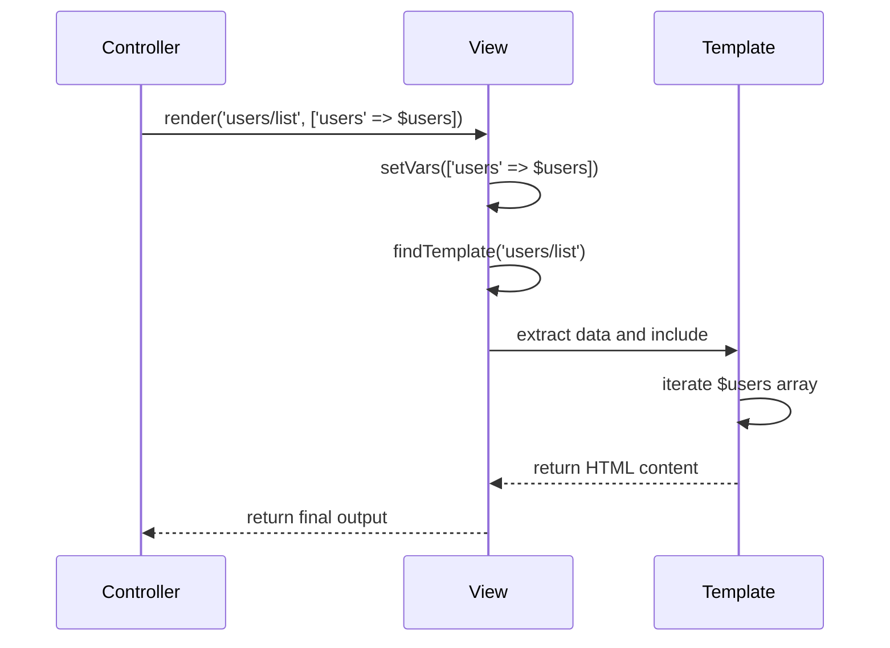
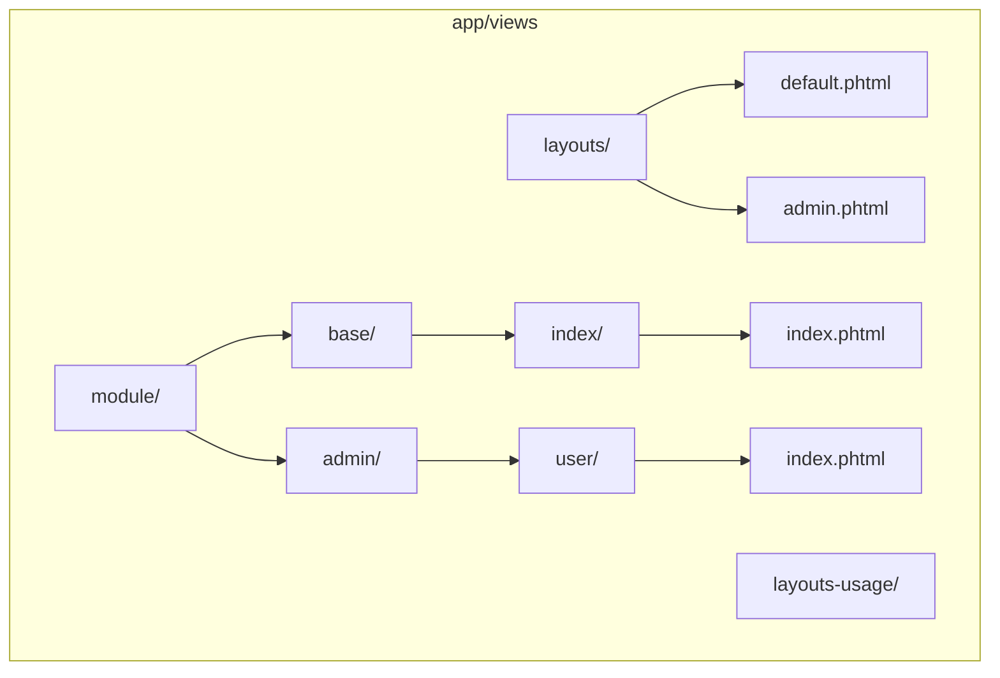
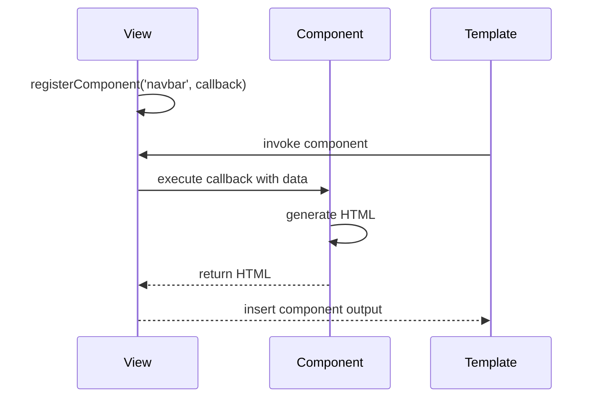
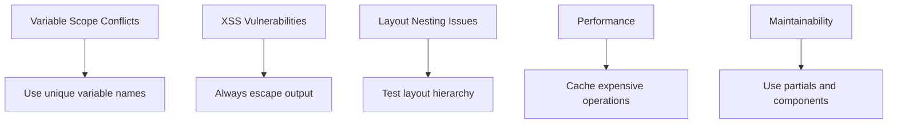

# Views & Templates

<cite>
**Referenced Files in This Document**   
- [View.php](file://app/Core/Mvc/View.php)
- [ViewInterface.php](file://app/Core/Mvc/ViewInterface.php)
- [ViewServiceProvider.php](file://app/Module/Provider/ViewServiceProvider.php)
- [default.phtml](file://app/views/layouts/default.phtml)
- [admin.phtml](file://app/views/layouts-usage/admin.phtml)
- [app.phtml](file://app/views/layouts-usage/app.phtml)
- [partials_alert.phtml](file://app/views/layouts-usage/partials_alert.phtml)
- [component-inview.phtml](file://app/views/layouts-usage/component-inview.phtml)
- [index.phtml](file://app/views/module/base/index/index.phtml)
- [user_index.phtml](file://app/views/layouts-usage/user_index.phtml)
- [in-controller.phtml](file://app/views/layouts-usage/in-controller.phtml)
</cite>

## Table of Contents
1. [Introduction](#introduction)
2. [View Rendering Process](#view-rendering-process)
3. [Layout System](#layout-system)
4. [Data Passing from Controllers](#data-passing-from-controllers)
5. [Partials and Reusable Components](#partials-and-reusable-components)
6. [Directory Structure and Template Resolution](#directory-structure-and-template-resolution)
7. [Template Inheritance and Sections](#template-inheritance-and-sections)
8. [View Components and Registration](#view-components-and-registration)
9. [Accessing DI Services in Templates](#accessing-di-services-in-templates)
10. [Common Issues and Best Practices](#common-issues-and-best-practices)

## Introduction
The view rendering system in this framework provides a flexible and secure way to generate HTML output using PHTML templates. It supports layout nesting, partials, data binding, and dependency injection integration. This document explains the core mechanisms of the View component, including template processing, layout management, and data flow from controllers to views.

**Section sources**
- [View.php](file://app/Core/Mvc/View.php#L1-L20)
- [ViewInterface.php](file://app/Core/Mvc/ViewInterface.php#L1-L10)

## View Rendering Process
The View component processes PHTML templates through a rendering pipeline that includes template location, variable extraction, and output buffering. When a controller calls `render()`, the system locates the specified template file, extracts the provided data variables, and captures the output using PHP's output buffering mechanism.

The rendering process is event-driven, firing `view:beforeRender` before rendering begins and `view:afterRender` after completion. This allows for interception and modification of the rendering flow. The core rendering logic ensures that templates are securely processed with proper error handling.

```mermaid
flowchart TD
Start([render(template, data)]) --> FindTemplate["Locate template file"]
FindTemplate --> TemplateExists{"Template exists?"}
TemplateExists --> |No| ThrowError["Throw Exception"]
TemplateExists --> |Yes| ExtractData["Extract data variables"]
ExtractData --> StartBuffer["Start output buffer"]
StartBuffer --> IncludeTemplate["Include PHTML template"]
IncludeTemplate --> CaptureOutput["Capture output buffer"]
CaptureOutput --> CheckLayout["Layout enabled?"]
CheckLayout --> |Yes| RenderLayout["Render layout with content"]
CheckLayout --> |No| ReturnOutput["Return template output"]
RenderLayout --> ReturnOutput
ReturnOutput --> End([Return HTML string])
```

**Diagram sources**
- [View.php](file://app/Core/Mvc/View.php#L30-L50)

**Section sources**
- [View.php](file://app/Core/Mvc/View.php#L25-L60)

## Layout System
The framework supports a flexible layout system that allows templates to be wrapped in common structural templates. The default layout is `default.phtml`, which provides a complete HTML structure with header, sidebar, and content areas. Layouts are resolved by prefixing the layout name with `layouts/` in the template path.

Layouts use the `$this->yield('content')` method to inject the main template content. Multiple layouts can be nested, and layouts can be disabled for AJAX requests using `disableLayout()`. The layout system supports conditional rendering based on request type and can be dynamically changed in controllers.

```mermaid
graph TB
subgraph "Layout Resolution"
Controller --> |Calls render()| View
View --> |Finds layout| LayoutFile["layouts/default.phtml"]
LayoutFile --> |Contains| Yield["echo \$this->yield('content')"]
View --> |Injects| TemplateContent["Template output"]
Yield --> TemplateContent
View --> |Returns| FinalHTML["Complete HTML page"]
end
```

**Diagram sources**
- [View.php](file://app/Core/Mvc/View.php#L45-L55)
- [default.phtml](file://app/views/layouts/default.phtml#L1-L60)

**Section sources**
- [View.php](file://app/Core/Mvc/View.php#L50-L70)
- [default.phtml](file://app/views/layouts/default.phtml#L1-L60)

## Data Passing from Controllers
Controllers pass data to views using the `render()` method's second parameter, which accepts an associative array of variables. These variables are extracted into the template scope using `extract()`, making them available as local variables. The system also supports setting individual variables via `setVar()` and multiple variables via `setVars()`.

Data passed from controllers is automatically available in both templates and layouts. The framework handles variable scope safely by using `EXTR_SKIP` to prevent overwriting existing variables. Complex data structures like arrays and objects can be passed and iterated over in templates.



**Diagram sources**
- [View.php](file://app/Core/Mvc/View.php#L80-L100)
- [user_index.phtml](file://app/views/layouts-usage/user_index.phtml#L1-L20)
- [in-controller.phtml](file://app/views/layouts-usage/in-controller.phtml#L1-L22)

**Section sources**
- [View.php](file://app/Core/Mvc/View.php#L80-L100)
- [in-controller.phtml](file://app/views/layouts-usage/in-controller.phtml#L1-L22)

## Partials and Reusable Components
Partials are reusable template fragments that can be included in multiple views. They are rendered using the `partial()` method, which accepts a template name and data array. Partials inherit the parent view's variables but can also receive their own data context.

The `partials_alert.phtml` example demonstrates a reusable alert component that accepts type and message parameters. Partials promote code reuse and maintainability by encapsulating common UI elements. They can be nested and used to build complex interfaces from simple components.

```mermaid
flowchart TD
MainTemplate["Main Template"] --> |echo partial()| Partial["Render partial template"]
Partial --> |Extract data| DataScope["Create isolated scope"]
DataScope --> |Set defaults| Defaults["$type ?? 'info'", "$message ?? 'Default'"]
Defaults --> |Apply classes| Classes["Map type to CSS class"]
Classes --> Output["Generate HTML output"]
Output --> MainTemplate
```

**Diagram sources**
- [View.php](file://app/Core/Mvc/View.php#L60-L70)
- [partials_alert.phtml](file://app/views/layouts-usage/partials_alert.phtml#L1-L15)
- [component-inview.phtml](file://app/views/layouts-usage/component-inview.phtml#L1-L12)

**Section sources**
- [View.php](file://app/Core/Mvc/View.php#L60-L70)
- [partials_alert.phtml](file://app/views/layouts-usage/partials_alert.phtml#L1-L15)

## Directory Structure and Template Resolution
The view system follows a structured directory organization under `app/views/`. The directory structure includes `layouts/` for layout templates, `module/` for module-specific views, and additional directories for usage examples. Templates are organized by module and controller, following the pattern `module/{module}/{controller}/{action}.phtml`.

Template resolution converts dot notation or path strings into physical file paths by replacing separators with directory separators and appending the `.phtml` extension. The system validates template existence before rendering and throws exceptions for missing templates. Layouts are resolved from the `layouts/` subdirectory.



**Diagram sources**
- [View.php](file://app/Core/Mvc/View.php#L70-L80)
- Project structure

**Section sources**
- [View.php](file://app/Core/Mvc/View.php#L70-L80)
- Project structure

## Template Inheritance and Sections
The framework supports template inheritance through sections, allowing child templates to define content blocks that are injected into parent layouts. Sections are defined using `startSection()` and `endSection()`, and rendered using `yield()`.

The `admin.phtml` layout demonstrates nested layout usage, where it sets its own layout to `app.phtml` and defines a `main-content` section. This enables multi-level layout inheritance. Sections provide a clean way to manage content placement without duplicating layout code.

```mermaid
graph TB
A["app.phtml"] --> |yield('content')| B["admin.phtml"]
B --> |startSection('content')| C["Admin Panel Content"]
C --> |yield('main-content')| D["Actual Page Content"]
D --> E["user/index.phtml"]
```

**Diagram sources**
- [admin.phtml](file://app/views/layouts-usage/admin.phtml#L1-L13)
- [app.phtml](file://app/views/layouts-usage/app.phtml#L1-L15)
- [user_index.phtml](file://app/views/layouts-usage/user_index.phtml#L1-L20)

**Section sources**
- [admin.phtml](file://app/views/layouts-usage/admin.phtml#L1-L13)
- [app.phtml](file://app/views/layouts-usage/app.phtml#L1-L15)

## View Components and Registration
View components are reusable UI elements that can be registered and invoked within templates. They are registered using `View::registerComponent()` with a name and callback function. The callback receives data and the view instance, returning HTML output.

The framework supports component registration for elements like navigation bars and alerts. Components promote consistency and reduce duplication by encapsulating complex HTML generation logic. They can access DI services and template data, making them powerful tools for building dynamic interfaces.



**Diagram sources**
- [View.php](file://app/Core/Mvc/View.php#L126-L141)
- [View.php](file://app/Core/Mvc/View.php#L141-L144)

**Section sources**
- [View.php](file://app/Core/Mvc/View.php#L126-L144)

## Accessing DI Services in Templates
Templates can access Dependency Injection (DI) services through the `getDI()` method. This allows templates to retrieve services like session, database, or configuration. The `default.phtml` layout demonstrates accessing the session service to display flash messages.

Service access in templates should be limited to presentation-related services. Business logic should remain in controllers or services. The DI integration provides flexibility while maintaining separation of concerns. Services are retrieved by name and can be used to enhance template functionality.

```mermaid
flowchart TD
Template["Template"] --> |getDI()| View["View Component"]
View --> |get('session')| DI["DI Container"]
DI --> |Return service| Session["Session Service"]
Session --> |getFlash()| Messages["Flash messages"]
Messages --> Template
```

**Diagram sources**
- [default.phtml](file://app/views/layouts/default.phtml#L1-L60)
- [View.php](file://app/Core/Mvc/View.php#L10-L20)

**Section sources**
- [default.phtml](file://app/views/layouts/default.phtml#L1-L60)

## Common Issues and Best Practices
Common issues in view rendering include variable scope conflicts, improper output escaping, and layout nesting problems. Always use `htmlspecialchars()` when outputting user data to prevent XSS attacks. Be cautious with `extract()` as it can overwrite existing variables.

Best practices include using partials for reusable components, keeping logic minimal in templates, and leveraging sections for content organization. Avoid complex business logic in views and use view composers for preparing view data. Test layout rendering with and without layouts to ensure proper behavior in AJAX contexts.



**Diagram sources**
- [View.php](file://app/Core/Mvc/View.php#L100-L120)
- [partials_alert.phtml](file://app/views/layouts-usage/partials_alert.phtml#L1-L15)

**Section sources**
- [View.php](file://app/Core/Mvc/View.php#L100-L120)
- [partials_alert.phtml](file://app/views/layouts-usage/partials_alert.phtml#L1-L15)